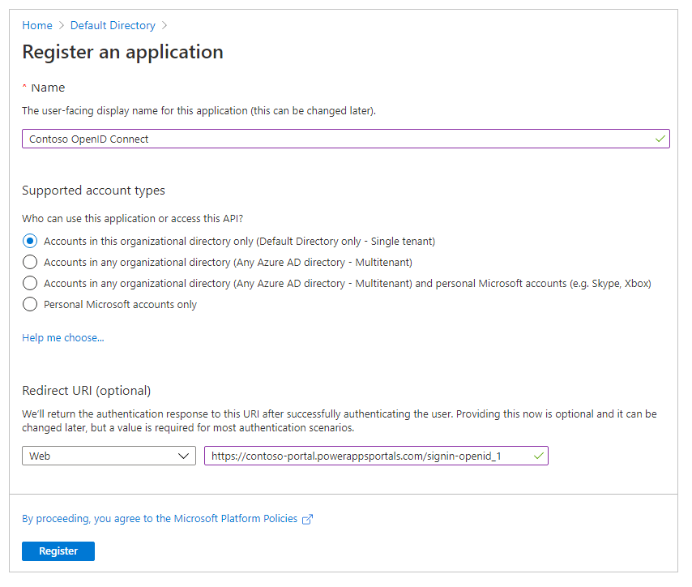
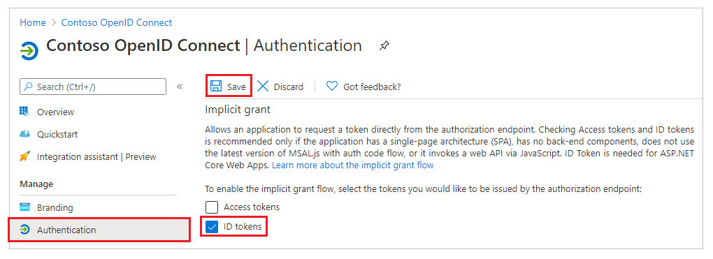
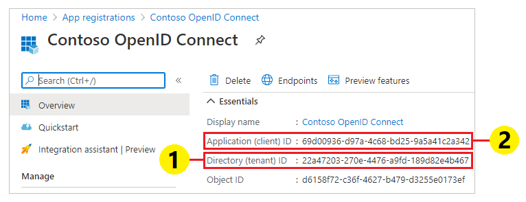
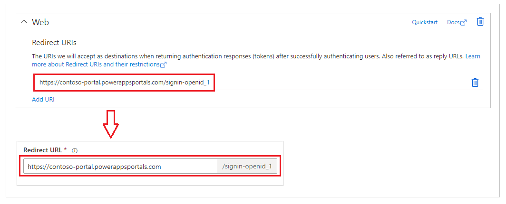
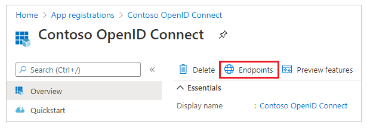
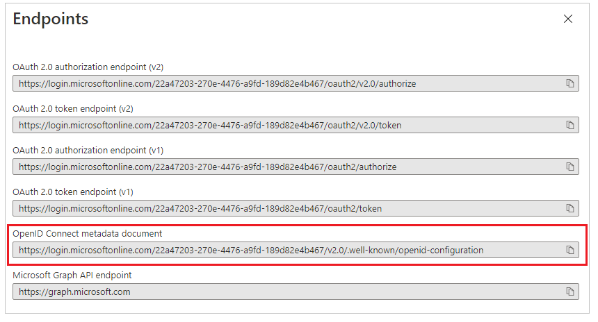
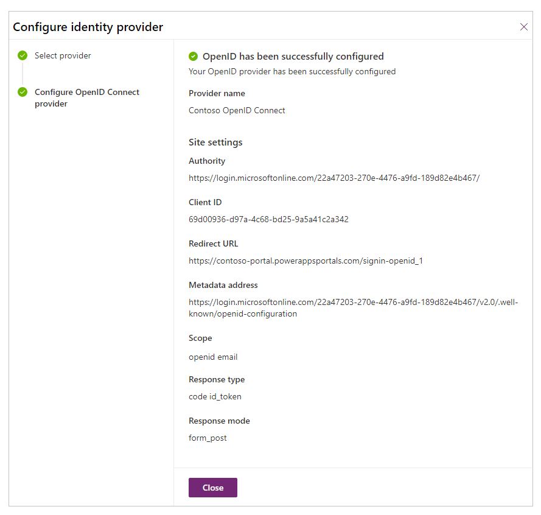
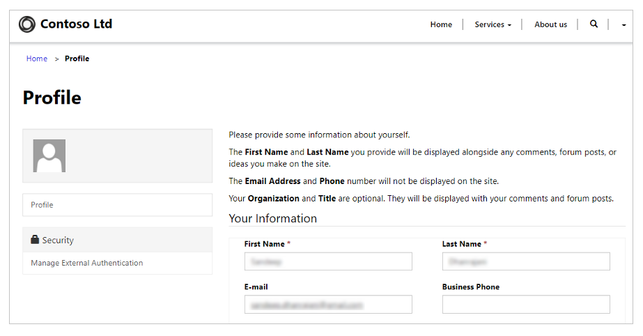
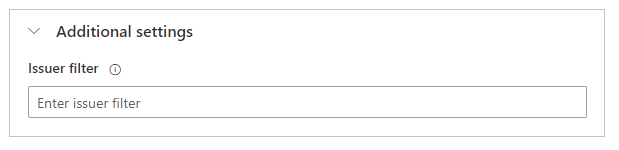

# Configure an OpenID Connect provider for portals with Azure AD

In this article, you'll learn about configuring an OpenID Connect provider for portals with Azure Active Directory (Azure AD) and multitenant Azure AD.

> [!NOTE]
> - Portals isn't limited to only Azure AD, multitenant Azure AD, or Azure AD B2C as the OpenID Connect providers. You can use any other provider that conforms to the OpenID Connect specification.
> Changes to the authentication settings [might take a few minutes](../admin/clear-server-side-cache.md#caching-changes-for-portals-with-version-926x-or-later) to be reflected on the portal. Restart the portal by using [portal actions](../admin/admin-overview.md) if you want the changes to be reflected immediately.

**To configure Azure AD as the OpenID Connect provider by using the Implicit Grant flow**

1. Select [Add provider](use-simplified-authentication-configuration.md#add-configure-or-delete-an-identity-provider) for your portal.

1. For **Login provider**, select **Other**.

1. For **Protocol**, select **OpenID Connect**.

1. Enter a provider name.

    

1. Select **Next**.

1. In this step, you create the application and configure the settings with your identity provider.

    

    > [!NOTE]
    > - The Reply URL is used by the app to redirect users to the portal after the authentication succeeds. If your portal uses a custom domain name, you might have a different URL than the one provided here.
    > - More details about creating the app registration on the Azure portal are available in [Quickstart: Register an application with the Microsoft identity platform](/azure/active-directory/develop/quickstart-register-app).

    1. Sign in to the [Azure portal](https://portal.azure.com).

    1. Search for and select **Azure Active Directory**.

    1. Under **Manage**, select **App registrations**.

    1. Select **New registration**.

        

    1. Enter a name.

    1. If necessary, select a different **Supported account type**. More information: [Supported account types](/azure/active-directory/develop/quickstart-register-app)

    1. Under **Redirect URI**, select **Web** (if it isn't already selected).

    1. Enter the **Reply URL** for your portal in the **Redirect URI** text box.   Example: `https://contoso-portal.powerappsportals.com/signin-openid_1`

        > [!NOTE]
        > If you're using the default portal URL, copy and paste the **Reply URL** as shown in the **Create and configure OpenID Connect provider settings** section on the **Configure identity provider** screen (step 6 above). If you're using a custom domain name for the portal, enter the custom URL. Be sure to use this value when you configure the **Redirect URL** in your portal settings while configuring the OpenID Connect provider.   For example, if you enter the **Reply URL** in Azure portal as `https://contoso-portal.powerappsportals.com/signin-openid_1`, you must use it as-is for the OpenID Connect configuration in portals.

        

    1. Select **Register**.

    1. On the left pane, under **Manage**, select **Authentication**.

        

    1. Under **Implicit grant**, select the **ID tokens** check box.

    1. Select **Save**.

1. In this step, you enter the site settings for the portal configuration.

    

    > [!TIP]
    > If you closed the browser window after configuring the app registration in the earlier step, sign in to the Azure portal again and go to the app that you registered.

    1. **Authority**: To configure the authority URL, use the following format:

        `https://login.microsoftonline.com/<Directory (tenant) ID>/`

        For example, if the *Directory (tenant) ID* in the Azure portal is `7e6ea6c7-a751-4b0d-bbb0-8cf17fe85dbb`, the authority URL is `https://login.microsoftonline.com/7e6ea6c7-a751-4b0d-bbb0-8cf17fe85dbb/`

    1. **Client ID**: Copy the **Application (client) ID** from the Azure portal as the client ID.

        

    1. **Redirect URL**: Confirm that the **Redirect URL** site setting value is the same as the **Redirect URI** that you set in the Azure portal earlier.

        

        > [!NOTE]
        > If you're using the default portal URL, you can copy and paste the **Reply URL** as shown in the **Create and configure OpenID Connect provider settings** step. If you're using a custom domain name, enter the URL manually. Be sure that the value you enter here is exactly the same as the value you entered as the **Redirect URI** in the Azure portal earlier.

    1. **Metadata address**: To configure the metadata address, do the following:

        1. Select **Overview** in the Azure portal.

        1. Select **Endpoints**.

           

        1. Copy the URL in **OpenID Connect metadata document**.

            

        1. Paste the copied document URL as the **Metadata address** for portals.

    1. **Scope**: Set the **Scope** site setting value as:

        `openid email`

        > [!NOTE]
        > The `openid` value in **Scope** is mandatory. The `email` value is optional; specifying the `email` value in the scope ensures that the email address of the portal user (contact record) is automatically filled in and shown on the **Profile** page after the user signs in. For information about additional claims, see [Configure additional claims](#configure-additional-claims) later in this article.

    1. For **Response type**, select **code id_token**.

    1. For **Response mode**, select **form_post**.

1. Select **Confirm**.

    

1. Select **Close**.

## Configure additional claims

1. Enable [optional claims in Azure AD](/azure/active-directory/develop/active-directory-optional-claims#configuring-directory-extension-optional-claims).

1. Set **Scope** to include the additional claims.
      Example: `openid email profile`

1. Set the **Registration claims mapping** additional site setting.
      Example: `firstname=given_name,lastname=family_name`

1. Set the **Login claims mapping** additional site setting.
      Example: `firstname=given_name,lastname=family_name`

For example, the first name, last name, and email addresses supplied with the additional claims become the default values in the profile page in the portal.

## Enable authentication by using a multitenant Azure AD application

You can configure your portal to accept Azure AD users from any tenant in Azure, and not just from a specific tenant, by using the multitenant application registered in Azure AD. To enable multitenancy, [update the application registration](/azure/active-directory/develop/howto-convert-app-to-be-multi-tenant#update-registration-to-be-multi-tenant) in the Azure AD application.

To support authentication against Azure AD by using a multitenant application, you have to create or configure the additional **Issuer Filter** site setting.

This site setting is a wildcard-based filter that matches on all issuers across all tenants. Example: `https://sts.windows.net/*/`

### See also

[FAQ for using OpenID Connect in portals](configure-openid-faqs.md)

[!INCLUDE[footer-include](../../../includes/footer-banner.md)]