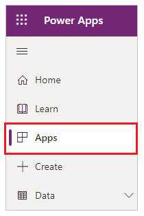
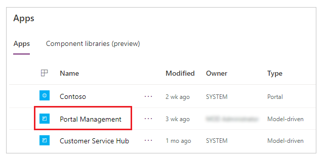
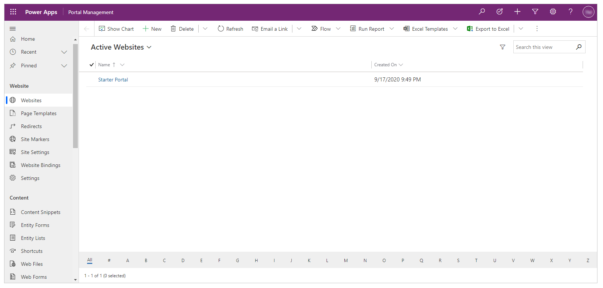
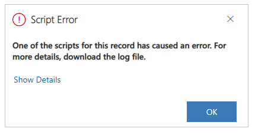

# Portal Management app overview

> [!NOTE]
> Based on the [terminology changes in Dataverse](https://go.microsoft.com/fwlink/?linkid=2147247), customer feedback, and data from user research, effective March 2021, we're updating some terminology in Power Apps portals to be more intuitive and make its usage more productive. More information: [Terminology changes in Power Apps portals](../terminology-changes.md)    
> We're in the process of rolling them out across Microsoft Power Platform. Power Apps portals articles will be updated soon to reflect the latest terminology.

The Portal Management app lets you do advanced configuration actions on your portal. The app is available after the database on Microsoft Dataverse is created successfully.

To open Portal Management app:

1. Go to [Power Apps](https://make.powerapps.com).

1. Select **Apps** from the left pane.

     

1. Select **Portal Management** app to open.

    

1. **Portal Management** app opens in a new browser tab.

    

To get started with configuring your portal, select the relevant option from the left pane.

### Browser considerations

If your web browser has any extensions such as ad-blockers, you may see a script error when using the Portal Management app: `One of the scripts for this record has caused an error. For more details, download the log file.` In addition, the downloaded log file may reference this error: `ReferenceError: Web resource method does not exist.` 

 

This error occurs for forms such as [Web pages](web-page.md), [Entity Forms](entity-forms.md), [Entity Lists](entity-lists.md), or [Web Form Steps](web-form-steps.md). To resolve this error, disable extensions such as ad-blockers in your browser. You may also use a different browser instead that doesn't have such extensions enabled.

[!INCLUDE[footer-include](../../../includes/footer-banner.md)]