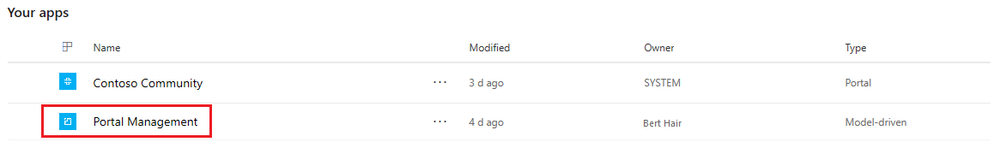
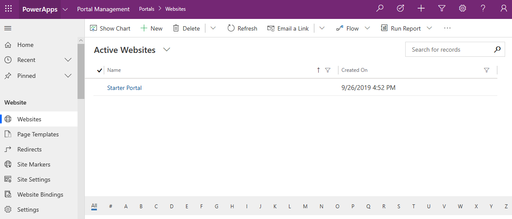

# Portal Management app

The Portal Management app allows you perform advanced configuration actions on your portal. The app is available after the database on Common Data Service is created successfully.

To open the Portal Management app, go to the **Your apps** section on the PowerApps home page, locate the Portal Management app, and select it.

> [!div class=mx-imgBorder]
> 

The Portal Management app is opened in the Unified Interface. You can configure your portal as per your requirement.

> [!div class=mx-imgBorder]
> 
  