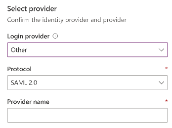
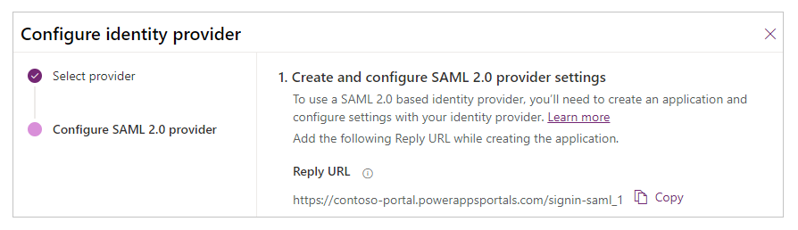
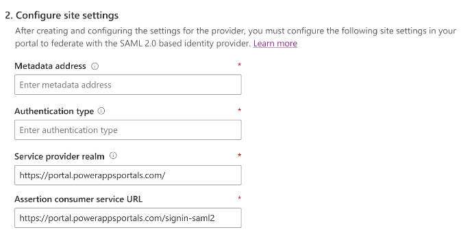
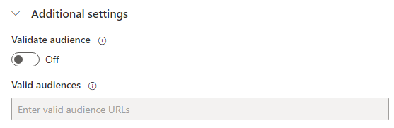

# Configure a SAML 2.0 provider for portals

To provide external authentication, you can add one or more [SAML 2.0](https://docs.oasis-open.org/security/saml/Post2.0/sstc-saml-tech-overview-2.0-cd-02.html)&ndash;compliant identity providers. This article describes how to set up various identity providers to integrate with a portal that acts as a service provider.  

> [!NOTE]
> Changes to the authentication settings [might take a few minutes](../admin/clear-server-side-cache.md#caching-changes-for-portals-with-version-926x-or-later) to be reflected on the portal. Restart the portal by using [portal actions](../admin/admin-overview.md) if you want the changes to be reflected immediately.

**To configure a SAML 2.0 provider**

1. Select [Add provider](use-simplified-authentication-configuration.md#add-configure-or-delete-an-identity-provider) for your portal.

1. For **Login provider**, select **Other**.

1. For **Protocol**, select **SAML 2.0**.

1. Enter a provider name.

    

1. Select **Next**.

1. Create the application and configure the settings with your identity provider.

    

1. Enter the following site settings for portal configuration.

    

    > [!NOTE]
    > Ensure that you review&mdash;and if required, change&mdash;the default values.

    | Name | Description |
    | - | - |
    | Metadata address | The SAML 2.0 identity provider metadata file location.   Example (Azure AD): `https://login.microsoftonline.com/7e6ea6c7-a751-4b0d-bbb0-8cf17fe85dbb/federationmetadata/2007-06/federationmetadata.xml` |
    | Authentication type | The Entity Id value that specifies a globally unique name for the SAML 2.0 identity provider.   Example (Azure AD): `https://login.microsoftonline.com/7e6ea6c7-a751-4b0d-bbb0-8cf17fe85dbb/` |
    | Service provider realm | The portal URL that specifies the service provider realm for the SAML 2.0 identity provider.   Example: `https://contoso-portal.powerappsportals.com/` |
    | Assertion consumer service URL | The portal URL that corresponds to the service provider's endpoint (URL). This URL is responsible for receiving and parsing a SAML assertion.   Example: `https://contoso-portal.powerappsportals.com/signin-saml_1`    **Note**: If you're using the default portal URL, you can copy and paste the **Reply URL** as shown in the **Create and configure SAML 2.0 provider settings** step. If you're using a custom domain name, enter the URL manually. Be sure that the value you enter here is exactly the same as the **Redirect URI** value for the application in the identity provider configuration (such as Azure portal). |

1. Select **Next**.

1. (Optional) Configure additional settings.

    

    | Name | Description
    | - | - |
    | Validate audience | If this is enabled, the audience will be validated during token validation. |
    | Valid audiences | A comma-separated list of audience URLs. |
    | Contact mapping with email | Specify whether the contacts are mapped to a corresponding email. When this is set to **On**, a unique contact record is associated with a matching email address, assigning the external identity provider to the contact after a successful user sign-in. |

1. Select **Confirm**.

**To edit a SAML 2.0 provider**

See [Edit a provider](use-simplified-authentication-configuration.md#edit-a-provider).

### See also

[Configure a SAML 2.0 provider for portals with Azure AD](configure-saml2-settings-azure-ad.md)  
[Configure a SAML 2.0 provider for portals with AD FS](configure-saml2-settings.md)  
[FAQ for using SAML 2.0 in portals](configure-saml2-faqs.md)  

[!INCLUDE[footer-include](../../../includes/footer-banner.md)]