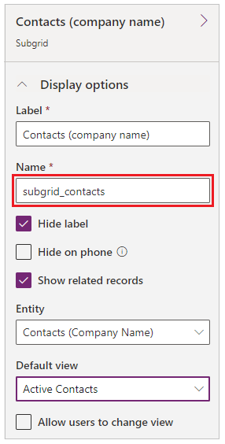

# Configure Web form subgrids for portals

Web form subgrids are configured in an identical fashion to entity form subgrids: first, create a metadata record for the Web form step that has a subgrid, and then add configuration metadata.

Adding subgrids to your managed forms on the portal is easy—just add the subgrid to the form that you are managing by using the out-of-the-box form designer, and you’re done. The grid will use the view that is specified in Common Data Service form designer, show only related records if that option was chosen, optionally show a search bar, and even respect [entity permissions for portals](assign-entity-permissions.md). It doesn't get any simpler to display a read-only list of records. To enable actions for the grid— Create, Update, Delete, and so on—you must configure those actions by using metadata configuration.

## Add subgrid metadata to your form

To add subgrid metadata to an entity form, go to **Entity Form Metadata** by using either the top drop-down list or the subgrid on the main form of the record that you are working with. More information: [Define entity forms](entity-forms.md).

To add a new record, select **Add New Entity Form Metadata**.

To edit an existing record, select the record in the grid. Selecting **Subgrid** as the **Type** value displays another attribute, **Subgrid Name**.

|     Name     |                                                       Description                                                        |
|--------------|--------------------------------------------------------------------------------------------------------------------------|
| Subgrid Name | The unique name of the subgrid on the entity's related form. |
|              |                                                                                                                          |

Selecting the subgrid in the form editor will display a properties window. This contains a **Name** field that should be used to assign to the **Subgrid Name** field on the Entity Form Metadata record.

  

Specifying a valid subgrid name will display the subgrid configuration settings. By default, only **Basic Settings** are shown. Select **Advanced Settings** to show additional settings.

By default, most settings are shown collapsed to save space. Select **** to expand a section and see additional options. Select **** to collapse the section.

## Attributes

| Name                       | Description                                                                                                                                                                                                                                                                                                                                                               |
|----------------------------|---------------------------------------------------------------------------------------------------------------------------------------------------------------------------------------------------------------------------------------------------------------------------------------------------------------------------------------------------------------------------|
| **Basic Settings**         |                                                                                                                                                                                                                                                                                                                                                                           |
| View Actions               | Use to add action buttons for actions that are applicable for the entity set and will appear above the subgrid. The available actions are: <ul><li>Create</li><li>Download</li><li>Associate</li></ul> Selecting one of these options displays a configuration area for that action. See below for details about each action.                                                                                                                                                                                                                                                   |
| Item Actions               | Use to add action buttons for actions that are applicable for an individual record and will appear in each row in the subgrid, provided the associated privilege has been granted by [Entity Permissions](assign-entity-permissions.md). The available actions are: <ul><li>Details</li><li>Edit</li><li>Delete</li><li>Workflow</li><li>Disassociate</li></ul> Selecting on one of these options displays a configuration area for that action. See below for details about each action.                                                                                                                                                                                                                                                   |
| Override Column Attributes | Use to override display settings for individual columns in the grid. <ul><li>Attribute: Logical name of the column you want to override.</li><li>Display Name: New column title to override the default</li><li>Width: Width (in either percent or pixels) of the column to override the default. See also Grid Column Width Style. To override settings on a column, select **Column** and fill in the details.                                                                                                                                                                                                                                                                                             |
| **Advanced Settings**      |                                                                                                                                                                                                                                                                                                                                                                           |
| Loading Message            | Overrides the default HTML message that appears while the subgrid is loading.                                                                                                                                                                                                                                                                                             |
| Error Message              | Overrides the default HTML message that appears when an error occurs while the subgrid is loading.                                                                                                                                                                                                                                                                           |
| Access Denied Message      | Overrides the default HTML message that appears when a user does not have sufficient [permissions](assign-entity-permissions.md) to read the entity type associated with the subgrid.                       |
| Empty Message              | Overrides the HTML message that appears when the associated subgrid contains no data.                                                                                                                                                                                                                                                                                     |
| Lookup Dialog              | Controls the settings for the dialog box that appears when a user activates the Associate action.                                                                                                                                                                                                                                                                             |
| Details Form Dialog        | Controls the settings for the dialog box that appears when a user activates the Details action.                                                                                                                                                                                                                                                                                |
| Edit Form Dialog           | Controls the settings for the dialog box that appears when a user activates the Edit action.                                                                                                                                                                                                                                                                                   |
| Create Form Dialog         | Controls the settings for the dialog box that appears when a user activates the Create action.                                                                                                                                                                                                                                                                                 |
| Delete Dialog              | Controls the settings for the dialog box that appears when a user activates the Delete action.                                                                                                                                                                                                                                                                                 |
| Error Dialog               | Controls the settings for the dialog box that appears when an error occurs during any action.                                                                                                                                                                                                                                                                                 |
| CSS Class                  | Specify a CSS class or classes that will be applied to the HTML element that contains the entire subgrid area, including the grid and action buttons.                                                                                                                                                                                                                     |
| Grid CSS Class             | Specify a CSS class or classes that will be applied to the subgrid's HTML &lt;table&gt; element.                                                                                                                                                                                                                                                                          |
| Grid Column Width Style    | Configures whether the **Width** values in the Override Column Attributes are specified in **Pixels** or **Percent**.                                                                                                                                                                                                                                                             |
||

## Create action

Enabling a **Create action** renders a button above the subgrid that, when selected, opens a dialog box with an [entity form](entity-forms.md) that allows a user to create a new record.  

### Create action settings

| Name                  | Description                                                                                                                                                                                                                                                 |
|-----------------------|-------------------------------------------------------------------------------------------------------------------------------------------------------------------------------------------------------------------------------------------------------------|
| **Basic Settings**    |                                                                                                                                                                                                                                                             |
| Entity Form           | Specifies the [entity forms and custom logic](entity-forms.md) that will be used to create the new record. The drop-down list includes all entity forms that are configured for the subgrid's entity type. **Note**: If the subgrid's entity type has no entity forms, the drop-down list will appear empty. If no entity form is supplied for the Create action, it will be ignored and the button will not be rendered on the subgrid's entity form.                                |
| **Advanced Settings** |                                                                                                                                                                                                                                                             |
| Button Label          | Overrides the HTML label displayed in the Create action button above the subgrid.                                                                                                                                                                           |
| Button Tooltip        | Overrides the tooltip text that appears when the user points to the Create action button.                                                                                                                                                            |

### Create Form dialog box advanced settings

| Name                   | Description                                                                                                                                     |
|------------------------|-------------------------------------------------------------------------------------------------------------------------------------------------|
| Loading Message        | Overrides the message that appears while the dialog is loading.                                                                                  |
| Title                  | Overrides the HTML that appears in the title bar of the dialog box.                                                                                 |
| Dismiss Button Sr Text | Overrides the screen reader text associated with the dialog box's Dismiss button.                                                                   |
| Size                   | Specifies the size of the Create Form dialog box. The Options are Default, Large, and Small. The default size is Large. |
| CSS Class              | Specify a CSS class or classes that will be applied to the resulting dialog box.                                                                    |
| Title CSS Class        | Specify a CSS class or classes that will be applied to the resulting dialog box's title bar.                                                        |
||

## Download action

Enabling a **Download action** renders a button above the subgrid that, when selected, downloads the data from the subgrid to an [!INCLUDE[pn-excel-short](../../../includes/pn-excel-short.md)] (.xlsx) file.

### Download action settings

| Name                  | Description                                                                                        |
|-----------------------|----------------------------------------------------------------------------------------------------|
| **Basic Settings**    |                                                                                                    |
| None                  |                                                                                                    |
| **Advanced Settings** |                                                                                                    |
| Button Label          | Overrides the HTML label displayed on the Download action button above the subgrid.                |
| Button Tooltip        | Overrides the tooltip text that appears when the user points to the Download action button. |
||

## Associate action

Enabling an **Associate action** displays a button above the subgrid that, when selected, opens a table of entities that the user can choose to associate to the entity record currently being displayed by the [entity form](entity-forms.md), provided the Append and AppendTo privileges have been granted by [Entity Permissions](assign-entity-permissions.md) for the applicable entity types.  

### Associate action settings

| Name                  | Description                                                                                                                                                                                                                |
|-----------------------|----------------------------------------------------------------------------------------------------------------------------------------------------------------------------------------------------------------------------|
| **Basic Settings**    |                                                                                                                                                                                                                            |
| View                  | Specifies the view (Saved Query) that will be used to find and display the list of eligible entities. **Note**: If the subgrid's entity type has no saved queries, the drop-down list will appear empty. If no view is supplied for the Associate action, it will be ignored and the button will not be rendered on the subgrid's entity form.  |
| **Advanced Settings** |                                                                                                                                                                                                                            |
| Button Label          | Overrides the HTML label displayed in the Associate action button above the subgrid.                                                                                                                                       |
| Button Tooltip        | Overrides the tooltip text that appears when the user points to the Associate action button.                                                                                                                        |
||

### Lookup dialog box advanced settings

| Name                     | Description                                                                                                                                 |
|--------------------------|---------------------------------------------------------------------------------------------------------------------------------------------|
| Title                    | Overrides the HTML that appears in the title bar of the dialog box.                                                                             |
| Primary Button Text      | Overrides the HTML that appears in the Primary (Add) button on the dialog box.                                                                |
| Close Button Text        | Overrides the HTML that appears in the Close (Cancel) button on the dialog box.                                                               |
| Dismiss Button Sr Text   | Overrides the screen reader text associated with the dialog box's Dismiss button.                                                               |
| Size                     | Specifies the size of the Associate dialog box. The Options are Default, Large, and Small. The default size is Large. |
| CSS Class                | Specify a CSS class or classes that will be applied to the resulting dialog box.                                                                |
| Title CSS Class          | Specify a CSS class or classes that will be applied to the resulting dialog box's title bar.                                                    |
| Primary Button CSS Class | Specify a CSS class or classes that will be applied to the dialog box's Primary (Add) button.                                                 |
| Close Button CSS Class   | Specify a CSS class or classes that will be applied to the dialog box's Close (Cancel) button.                                                |
| Select Records Title     | Overrides the HTML that appears in the title of the Record Selection area.                                                                  |
| Default Error Message    | Overrides the message that appears when an error occurs while associating the selected entity or entities.                                  |
| Grid Options             | Specify settings for the appearance of the entity grid. See below for options.                                                              |
||

### Lookup dialog box advanced grid options settings

| Name                  | Description                                                                                                              |
|-----------------------|--------------------------------------------------------------------------------------------------------------------------|
| Loading Message       | Overrides the message that appears while the grid of entities is loading.                                                |
| Error Message         | Overrides the message that appears when an error occurs while loading the grid of entities.                               |
| Access Denied Message | Overrides the message that appears when a user does not have sufficient entity permissions to view the grid of entities. |
| Empty Message         | Overrides the message that appears when there are no entities that can be associated with the current entity form.       |
| CSS Class             | Specify a CSS class or classes that will be applied to the associate grid area.                                          |
| Grid CSS Class        | Specify a CSS class or classes that will be applied to the associate grid's &lt;table&gt; element.                       |
||

## Details action

Enabling a **Details action** allows a user to view a read-only [entity form](entity-forms.md) that is data-bound to the record of the subgrid's selected row.  

### Details Action settings

|                 Name                  |                                                                                                                                                                                                                        Description                                                                                                                                                                                                                        |
|---------------------------------------|-----------------------------------------------------------------------------------------------------------------------------------------------------------------------------------------------------------------------------------------------------------------------------------------------------------------------------------------------------------------------------------------------------------------------------------------------------------|
|          **Basic Settings**           |                                                                                                                                                                                                                                                                                                                                                                                                                                                           |
|              Entity Form              | Specifies the [entity form](entity-forms.md) that will be used to view the details of the selected record. The drop-down list will include all entity forms that are configured for the subgrid's entity type.  **Note**: If the subgrid's entity type has no entity forms, the drop-down will appear empty. If no entity form is supplied for the Details action, it will be ignored and the button will not be rendered in the subgrid. |
|         **Advanced Settings**         |                                                                                                                                                                                                                                                                                                                                                                                                                                                           |
| Record ID Query String Parameter Name |                                                                      Specifies the name of the query string parameter that will be used to select the entity to view in the selected entity form. This should match the value in that entity form's Record ID Query String Parameter Name. The default value for this field, both here and in Entity Form configuration, is **id**.                                                                       |
|             Button Label              |                                                                                                                                                                                          Overrides the HTML label for this action displayed in the subgrid row.                                                                                                                                                                                           |
|            Button Tooltip             |                                                                                                                                                                 Overrides the tooltip text that appears when the user points to the button for this action displayed in the subgrid row.                                                                                                                                                                  |
|                                       |                                                                                                                                                                                                                                                                                                                                                                                                                                                           |

### Details form dialog box advanced settings

| Name                   | Description                                                                                                                             |
|------------------------|-----------------------------------------------------------------------------------------------------------------------------------------|
| Loading Message        | Overrides the HTML that appears when the dialog box is loading.                                                                             |
| Title                  | Overrides the HTML that appears in the title bar of the dialog box.                                                                         |
| Dismiss Button Sr Text | Overrides the screen reader text associated with the dialog box's Dismiss button.                                                           |
| Size                   | Specifies the size of the Details dialog box. The Options are Default, Large, and Small. The default size is Large. |
| CSS Class              | Specify a CSS class or classes that will be applied to the resulting dialog box.                                                            |
| Title CSS Class        | Specify a CSS class or classes that will be applied to the resulting dialog box's title bar.                                                |
||

## Edit action

Enabling an **Edit action** allows a user to view an editable [entity form](entity-forms.md) that is data-bound to the record of the subgrid's selected row, if the Write privilege has been granted by [Entity Permissions](assign-entity-permissions.md).  

### Edit action settings

| Name                                  | Description                                                                                                                                                                                                                                                                                                  |
|---------------------------------------|--------------------------------------------------------------------------------------------------------------------------------------------------------------------------------------------------------------------------------------------------------------------------------------------------------------|
| **Basic Settings**                    |                                                                                                                                                                                                                                                                                                              |
| Entity Form                           | Specifies the [entity form](entity-forms.md) that will be used to edit the selected record. The drop-down list will include all entity forms that are configured for the subgrid's entity type. **Note**: If the subgrid's entity type has no entity forms, the drop-down list will appear empty. If no entity form is supplied for the Edit action, it will be ignored and the button will not be rendered in the subgrid.                                                                                                 |
| **Advanced Settings**                 |                                                                                                                                                                                                                                                                                                              |
| Record ID Query String Parameter Name | Specifies the name of the query string parameter that will be used to select the entity to edit in the selected entity form. This should match the value in that entity form's Record ID Query String Parameter Name. The default value for this field, both here and in entity form configuration, is **id**. |
| Button Label                          | Overrides the HTML label for this action displayed in the subgrid row.                                                                                                                                                                                                                                       |
| Button Tooltip                        | Overrides the tooltip text that appears when the user points to the button for this action displayed in the subgrid row.                                                                                                                                                                              |
||

### Edit form dialog box advanced settings

| Name                   | Description                                                                                                                       |
|------------------------|-----------------------------------------------------------------------------------------------------------------------------------|
| Loading Message        | Overrides the HTML that appears when the dialog box is loading.                                                                       |
| Title                  | Overrides the HTML that appears in the title bar of the dialog box.                                                                   |
| Dismiss Button Sr Text | Overrides the screen reader text associated with the dialog's Dismiss button.                                                     |
| Size                   | Specifies the size of the Edit dialog box. The Options are Default, Large, and Small. The default size is Large. |
| CSS Class              | Specify a CSS class or classes that will be applied to the resulting dialog box.                                                      |
| Title CSS Class        | Specify a CSS class or classes that will be applied to the resulting dialog box's title bar.                                          |
||

## Delete action

Enabling a **Delete action** allows a user to permanently delete the entity represented by a row in the subgrid, if the Delete privilege has been granted by [Entity Permissions](assign-entity-permissions.md).  

### Delete action settings

| Name                  | Description                                                                                                                     |
|-----------------------|---------------------------------------------------------------------------------------------------------------------------------|
| **Basic Settings**    |                                                                                                                                 |
| None                  |                                                                                                                                 |
| **Advanced Settings** |                                                                                                                                 |
| Confirmation          | Overrides the confirmation HTML message displayed when the user activates the Delete action.                                    |
| Button Label          | Overrides the HTML label for this action displayed in the subgrid row.                                                          |
| Button Tooltip        | Overrides the tooltip text that appears when the user points to the button for this action displayed in the subgrid row. |
||

### Delete dialog box advanced settings

| Name                     | Description                                                                                                                             |
|--------------------------|-----------------------------------------------------------------------------------------------------------------------------------------|
| Title                    | Overrides the HTML that appears in the title bar of the dialog box.                                                                         |
| Primary Button Text      | Overrides the HTML that appears in the Primary (Delete) button on the dialog box.                                                         |
| Close Button Text        | Overrides the HTML that appears in the Close (Cancel) button on the dialog box.                                                           |
| Dismiss Button Sr Text   | Overrides the screen reader text associated with the dialog box's Dismiss button.                                                           |
| Size                     | Specifies the size of the Delete dialog box. The Options are Default, Large, and Small. The default size is Default. |
| CSS Class                | Specify a CSS class or classes that will be applied to the resulting dialog.                                                            |
| Title CSS Class          | Specify a CSS class or classes that will be applied to the resulting dialog box's title bar.                                                |
| Primary Button CSS Class | Specify a CSS class or classes that will be applied to the dialog box's Primary (Delete) button.                                          |
| Close Button CSS Class   | Specify a CSS class or classes that will be applied to the dialog box's Close (Cancel) button.                                            |
||

## Workflow action

Enabling a **Workflow action** allows a user to run an on-demand workflow against the selected record in the subgrid. You can add any number of Workflow actions to the subgrid metadata.

### Workflow action settings

| Name                  | Description                                                                                                                                                                                                     |
|-----------------------|-----------------------------------------------------------------------------------------------------------------------------------------------------------------------------------------------------------------|
| **Basic Settings**    |                                                                                                                                                                                                                 |
| Workflow              | Specifies the on-demand workflow that will run when the user activates this action. **Note**: If the subgrid's entity type has no workflows, the drop-down list will appear empty. If no workflow is supplied for the Workflow action, it will be ignored and the button will not be rendered in the subgrid.  |
| Button Label          | Sets the HTML label for this action displayed in the subgrid row. This setting is required.                                                                                                                     |
| **Advanced Settings** |                                                                                                                                                                                                                 |
| Button Tooltip        | Overrides the tooltip text that appears when the user points to the button for this action displayed in the subgrid row.                                                                                 |
||

## Disassociate action

Enabling a **Disassociate action** allows a user to remove the link between the record represented by the currently viewed [entity form](entity-forms.md) and the record represented by the selected row in the subgrid, as long as the Append and AppendTo privileges have been granted by [Entity Permissions](assign-entity-permissions.md) for the applicable entity types.

### Disassociate action settings

| Name                  | Description                                                                                                                     |
|-----------------------|---------------------------------------------------------------------------------------------------------------------------------|
| **Basic Settings**    |                                                                                                                                 |
| None                  |                                                                                                                                 |
| **Advanced Settings** |                                                                                                                                 |
| Button Label          | Overrides the HTML label for this action displayed in the subgrid row.                                                          |
| Button Tooltip        | Overrides the tooltip text that appears when the user points to the button for this action displayed in the subgrid row. |
||

### See also

[Configure a portal](configure-portal.md)  
[Define entity forms](entity-forms.md)  
[Web Form properties for portals](web-form-properties.md)  
[Web Form steps for portals](web-form-steps.md)  
[Web Forms metadata for portals](configure-web-form-metadata.md)  
[Notes configuration for Web Forms for portals](../configure-notes.md)  

