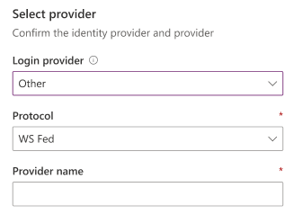
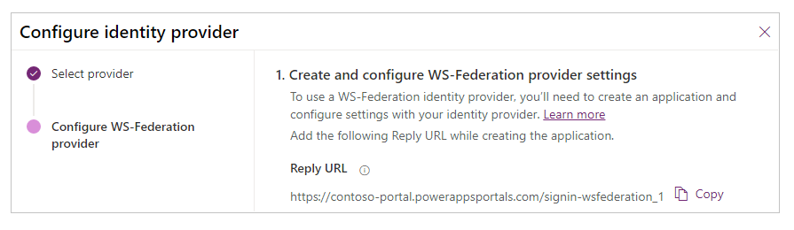
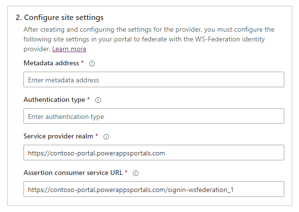
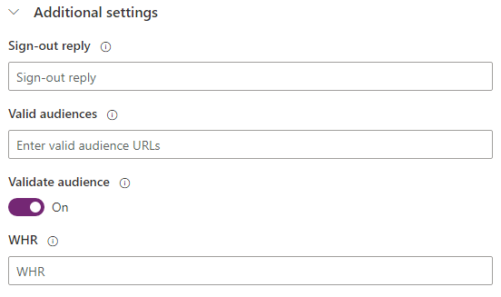

# Configure a WS-Federation provider for portals

You can add a WS-Federation&ndash;compliant security token service provider&mdash;for example, Azure Active Directory (Azure AD) or a single Active Directory Federation Services (AD FS) server&mdash;as an identity provider.

> [!NOTE]
> Changes to the authentication settings [might take a few minutes](../admin/clear-server-side-cache.md#caching-changes-for-portals-with-version-926x-or-later) to be reflected on the portal. Restart the portal by using [portal actions](../admin/admin-overview.md) if you want the changes to be reflected immediately.

To configure a WS-Federation provider

1. Select [Add provider](use-simplified-authentication-configuration.md#add-configure-or-delete-an-identity-provider) for your portal.

1. For **Login provider**, select **Other**.

1. For **Protocol**, select **WS-Federation**.

1. Enter a provider name.

    

1. Select **Next**.

1. Create the application and configure the settings with your identity provider.

    

1. Enter the following site settings for portal configuration.

    

    > [!NOTE]
    > Ensure that you review&mdash;and if required, change&mdash;the default values.

    | Name | Description |
    | - | - |
    | Metadata address | The WS-Federation identity provider metadata file location.   Example (Azure AD): `https://login.microsoftonline.com/7e6ea6c7-a751-4b0d-bbb0-8cf17fe85dbb/federationmetadata/2007-06/federationmetadata.xml` |
    | Authentication type | The Entity Id value that specifies a globally unique name for the WS-Federation identity provider.   Example (Azure AD): `https://login.microsoftonline.com/7e6ea6c7-a751-4b0d-bbb0-8cf17fe85dbb/` |
    | Service provider realm | The portal URL that specifies the service provider realm for the WS-Federation identity provider.   Example: `https://contoso-portal.powerappsportals.com/` |
    | Assertion consumer service URL | The portal URL that corresponds to the service provider's endpoint (URL).   Example: `https://contoso-portal.powerappsportals.com/signin-wsfederation_1`   **Note**: If you're using the default portal URL, you can copy and paste the **Reply URL** as shown in the **Create and configure WS-Federation provider settings** step. If you're using a custom domain name, enter the URL manually. Be sure that the value you enter here is exactly the same as the **Redirect URI** value for the application in the identity provider configuration (such as Azure portal). |

1. Select **Next**.

1. (Optional) Configure additional settings.

    

    | Name | Description
    | - | - |
    | Sign-out reply | The URL to return to (sign-out reply) after sign-out is complete. |
    | Valid audiences | Comma-separated list of audience URLs. |
    | Validate audiences | If this setting is enabled, the audience will be validated during token validation. |
    | WHR | The home realm of the identity provider to use for authentication. Sets the WS-Federation sign-in request *whr* parameter. If this setting is empty, the *whr* parameter isn't included in the request.   More information: [wsFederation](/dotnet/framework/configure-apps/file-schema/windows-identity-foundation/wsfederation) |
    | Contact mapping with email | Specify whether contacts are mapped to a corresponding email. When this setting is **On**, a unique contact record is associated with a matching email address, assigning the external identity provider to the contact after a successful user sign-in. |

1. Select **Confirm**.

**To edit a WS-Federation provider**

See [Edit a provider](use-simplified-authentication-configuration.md#edit-a-provider).

### See also

[Configure a WS-Federation provider for portals with Azure AD](configure-ws-federation-settings-azure-ad.md)  
[Configure a WS-Federation provider for portals with AD FS](configure-ws-federation-settings.md)

[!INCLUDE[footer-include](../../../includes/footer-banner.md)]