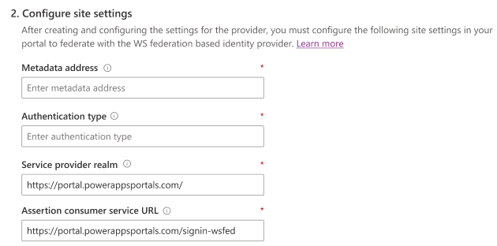

# Configure WS-Federation provider settings for portals

A single [!INCLUDE[pn-active-directory](../../../includes/pn-active-directory.md)] Federation Services server can be added (or another [WS-Federation](https://msdn.microsoft.com/library/bb498017.aspx)–compliant security token service) as an identity provider. In addition, a single [[!INCLUDE[pn-azure-shortest](../../../includes/pn-azure-shortest.md)] ACS](https://azure.microsoft.com/documentation/articles/active-directory-dotnet-how-to-use-access-control/) namespace can be configured as a set of individual identity providers. The settings for both AD FS and ACS are based on the properties of the [WsFederationAuthenticationOptions](https://msdn.microsoft.com/library/microsoft.owin.security.wsfederation.wsfederationauthenticationoptions.aspx) class.

To configure SAML 2.0 provider:

1. Select [Add provider](use-simplified-authentication-configuration.md#add-configure-or-delete-an-identity-provider) for your portal.

1. Select **Login provider** as **Other**.

1. Select **Protocol** as **WS FED**.

1. Enter a provider name.

    

1. Select **Next**.

1. Create the application and configure the settings with your identity provider.

1. Enter the following site settings for portal configuration.

    

    | Name | Description |
    | - | - |
    | Metadata address | The [WS-Federation](https://msdn.microsoft.com/library/bb498017.aspx) metadata URL of the ADFS (STS) server. It commonly ends with the path:/FederationMetadata/2007-06/FederationMetadata.xml.   Example: `https://adfs.contoso.com/FederationMetadata/2007-06/FederationMetadata.xml`   More information: [WsFederationAuthenticationOptions.MetadataAddress](https://msdn.microsoft.com/library/microsoft.owin.security.wsfederation.wsfederationauthenticationoptions.metadataaddress.aspx) |
    | Authentication type | The OWIN authentication middleware type. Enter the value of the [entityID](https://docs.microsoft.com/azure/active-directory/develop/active-directory-federation-metadata) attribute at the root of the federation metadata XML.   Example: `https://adfs.contoso.com/adfs/services/trust`   More information: [AuthenticationOptions.AuthenticationType](https://msdn.microsoft.com/library/microsoft.owin.security.authenticationoptions.authenticationtype.aspx) |
    | Service provider realm | The ADFS relying party identifier.   Example: `https://portal.contoso.com/`   More information: [WsFederationAuthenticationOptions.Wtrealm](https://msdn.microsoft.com/library/microsoft.owin.security.wsfederation.wsfederationauthenticationoptions.wtrealm.aspx) |
    | Assertion consumer service URL | The ADFS SAML Consumer Assertion endpoint.   Example: `https://portal.contoso.com/signin-saml2`   More information: [WsFederationAuthenticationOptions.Wreply](https://msdn.microsoft.com/library/microsoft.owin.security.wsfederation.wsfederationauthenticationoptions.wreply.aspx) |

1. Select **Next**.

1. (Optional) Configure additional settings.

    

    | Name | Description
    | - | - |
    | Sign-out wreply | The AD FS WS-Federation passive endpoint.   Example: https://portal.contoso.com/signin-federation   More information: [WsFederationAuthenticationOptions.Wreply](https://msdn.microsoft.com/library/microsoft.owin.security.wsfederation.wsfederationauthenticationoptions.wreply.aspx) |
    | Valid audiences | Comma separated list of audience URLs.   More information: [TokenValidationParameters.AllowedAudiences](https://msdn.microsoft.com/library/system.identitymodel.tokens.tokenvalidationparameters.allowedaudiences.aspx) |
    | Validate audiences | A Boolean to control if the audience will be validated during token validation. |
    | WHR | Specifies a "whr" parameter in the identity provider redirect URL.   More information: [wsFederation](https://docs.microsoft.com/dotnet/framework/configure-apps/file-schema/windows-identity-foundation/wsfederation) |

1. Select **Confirm**.

### See also

[Configure portal authentication](configure-portal-authentication.md)  
[Set authentication identity for a portal](set-authentication-identity.md)  
[OAuth2 provider settings for portals](configure-oauth2-settings.md)  
[Open ID Connect provider settings for portals](configure-openid-settings.md)  
[SAML 2.0 provider settings for portals](configure-saml2-settings.md)  
