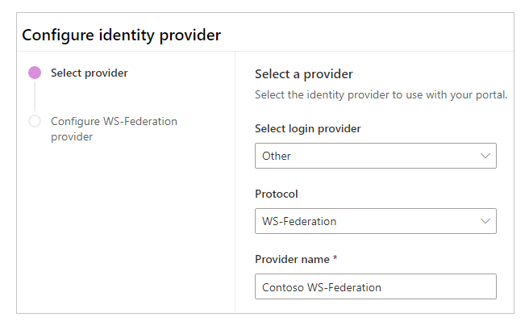
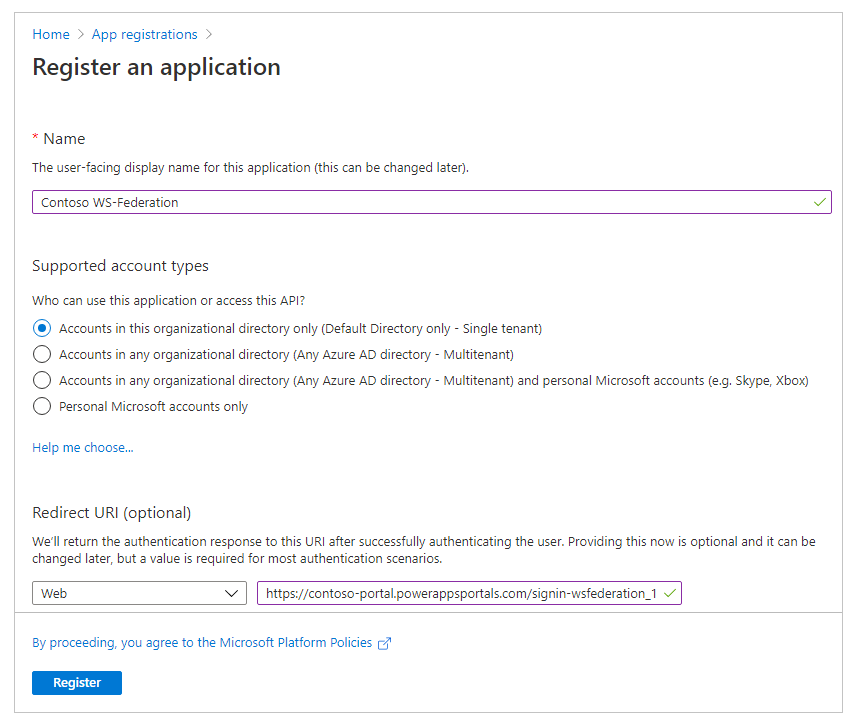
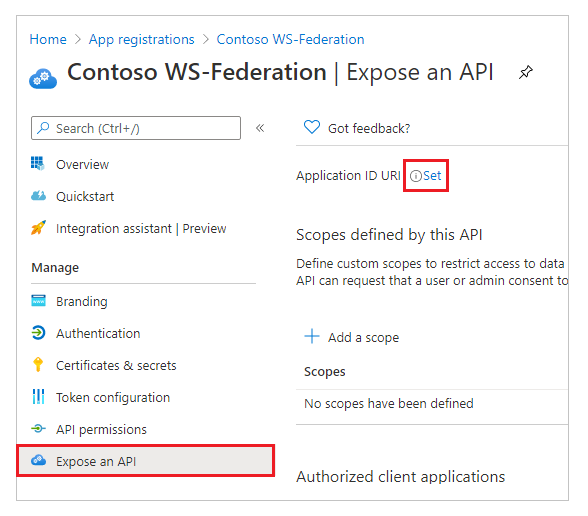
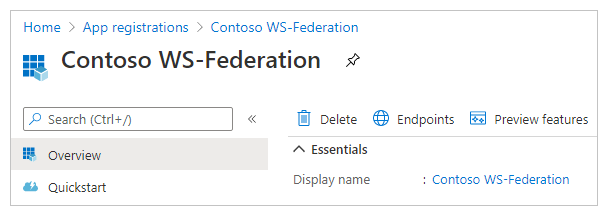
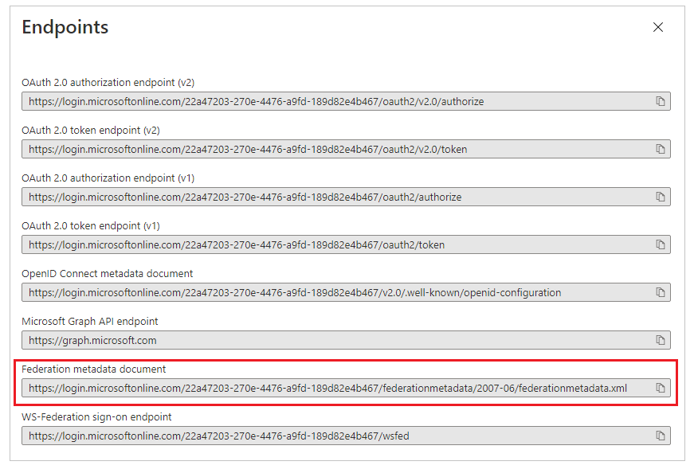
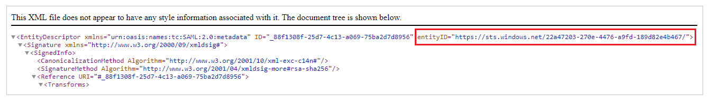
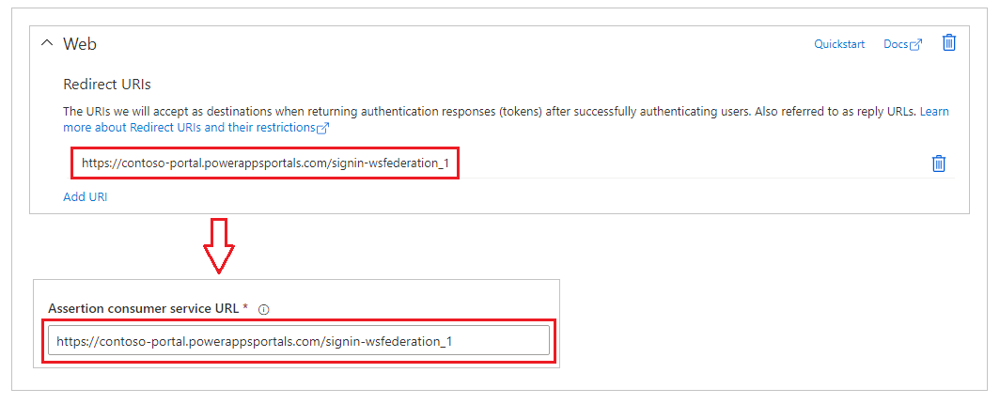
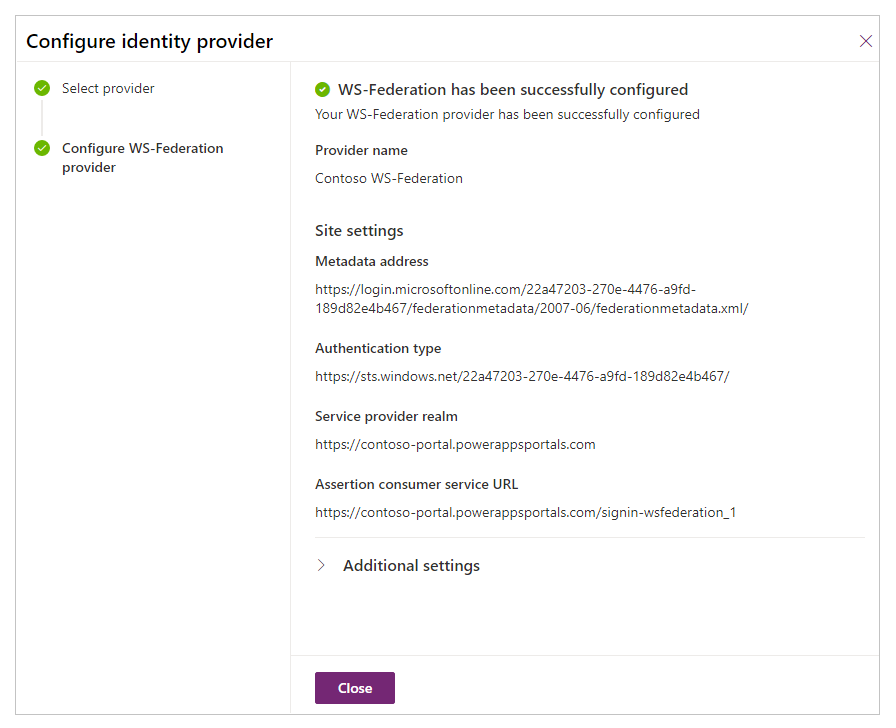

# Configure WS-Federation for portals with Azure Active Directory

In this article, you'll learn about configuring WS-Federation provider for portals with Azure Active Directory, and multi-tenant Azure AD.

> [!NOTE]
> Portals isn't limited to only Azure AD, multi-tenant Azure AD, or Azure AD B2C as the WS-Federation providers. You can use any other provider that confirms to the WS-Federation specifications with portals.

To configure WS-Federation provider with Azure AD:

1. Select [Add provider](use-simplified-authentication-configuration.md#add-configure-or-delete-an-identity-provider) for your portal.

1. Select **Login provider** as **Other**.

1. Select **Protocol** as **WS-Federation**.

1. Enter a provider name.

    

1. Select **Next**.

1. In this step, create the application and configure the settings with your identity provider.

    

    > [!NOTE]
    > - The Reply URL is used by the app to redirect users to the portal after the authentication succeeds. If your portal uses a custom domain name, you might have a different URL than the one provided here.
    > - More details about creating the app registration on the Azure portal are available in the [Quickstart: Register an application with the Microsoft identity platform](https://docs.microsoft.com/azure/active-directory/develop/quickstart-register-app).

    1. Sign in to the [Azure portal](https://portal.azure.com).

    1. Search for and select **Azure Active Directory**.

    1. Under **Manage**, select **App registrations**.

    1. Select **New registration**.

        

    1. Enter a name.

    1. If required, select a different **Supported account type**. More information: [Supported account types](https://docs.microsoft.com/azure/active-directory/develop/quickstart-register-app)

    1. If not already, select **Web** for **Redirect URI**.

    1. Enter the **Reply URL** for your portal in the **Redirect URI** text box.   Example: `https://contoso-portal.powerappsportals.com/signin-wsfederation_1`

        > [!NOTE]
        > If you're using the default portal URL, copy and paste the **Reply URL** as shown in **Create and configure WS-Federation provider settings**. If you're using custom domain name for the portal, enter the custom URL. However, ensure you use this value when you configure the **Assertion consumer service URL** in your portal settings while configuring WS-Federation provider.   For example, if you enter the **Reply URL** in Azure portal as `https://contoso-portal.powerappsportals.com/signin-wsfederation_1`, use it as is for the WS-Federation configuration in portals. In this example, using `https://contoso-portal.powerappsportals.com/signin-wsfederation` or `https://portal.contoso.com/signin-wsfederation_1` in portals site settings will be incorrect.

        

    1. Select **Register**.

    1. Select **Expose an API**.

    1. Select **Set** for **Application ID URI**.

        

    1. Enter the portal URL as the **App ID URI**.

        

        > [!NOTE]
        > The portal URL may be different if you're using a custom domain name.

    1. Select **Save**.

        

    1. Keep the Azure portal open, and switch to the WS-Federation configuration for Power Apps portals for the next steps.

1. In this step, enter the site settings for the portal configuration.

    

    > [!TIP]
    > If you closed the browser window after configuring the app registration in the earlier step, sign in to the Azure portal again and go to the app that you registered for the next steps.

    1. **Metadata address** - To configure the metadata address:

        1. Select **Overview** in the Azure portal.
        
        1. Select **Endpoints**.
        
            

        1. Copy the **Federation metadata document**.

            

        1. Paste the copied document URL as the **Metadata address** for portals.

    1. **Autentication type** - To configure the authentication type:

        1. Copy and paste the **Metadata address** configured earlier in a new browser window.

        1. Copy the value of `entityID` tag from the URL document.

            

        1. Paste the copied value of `entityID` as the **Authentication type**.   Example: `https://sts.windows.net/22a47203-270e-4476-a9fd-189d82e4b467/`

    1. **Service provider realm** - Enter the portal URL as the service provider realm.   Example: `https://contoso-portal.powerappsportals.com`
    
        > [!NOTE]
        > The portal URL may be different if you're using a custom domain name.
        
    1. **Assertion consumer service URL** - Enter the **Reply URL** for your portal in the **Assertion consumer service URL** text box.   Example: `https://contoso-portal.powerappsportals.com/signin-saml_1`

        

        > [!NOTE]
        > If you're using the default portal URL, you can copy and paste the **Reply URL** as shown in **Create and configure WS-Federation provider settings**. If you're using a custom domain name, enter the URL manually. However, ensure that the value entered here is exactly the same as the value you entered as the **Redirect URI** in the Azure portal earlier.

1. Select **Confirm**.

    

1. Select **Close**.
