# Create custom Portal Management app

The [overview](configure-portal.md) introduces **Portal Management** app to help you get started with the advanced portal configuration. In this walk-through, you'll learn how to create a custom **Portal Management** app.

## How to create a custom Portal Management app

> [!IMPORTANT]
> - A custom app created using this article can't be used as a replacement app for the default and supported **Portal Management** app. Use the method described in this article only if you accidentally deleted the default **Portal Management** app.
> - Any updates to the default **Portal Management** app won't be available to this custom app. Manage this custom app as any other custom model-driven app.
> - Updates to the environment or portal solutions may recreate the default **Portal Management** app. If that happens, start using the default app instead of the manually created custom app.

To create a custom **Portal Management** app:

1. Sign-in to [Power Apps](https://make.powerapps.com).

1. Select **Create** from the left navigation.

1. Select **Model-driven app from blank**:

    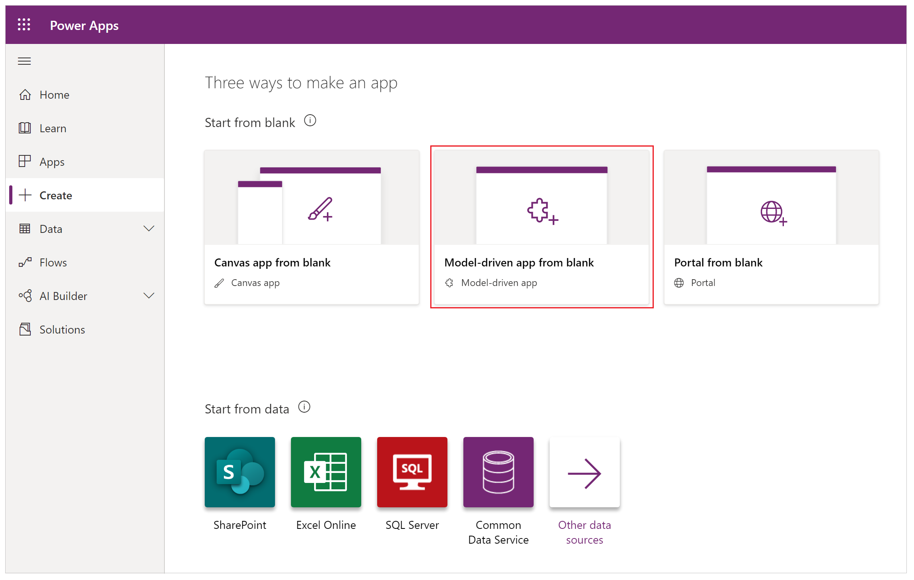

1. Select **Create**:

    

    Selecting **Create** button opens app designer with **Create a New App** form:

    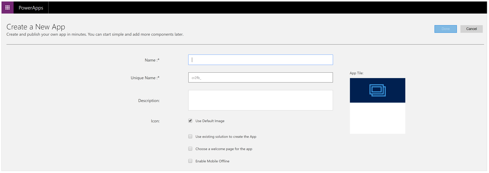

1. Enter a name for the app. For example, *Portal Management (custom)*:

    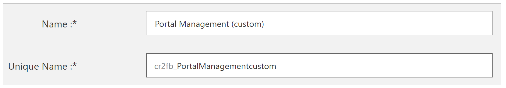

    The *Unique Name* for the app is automatically updated. 

1. If required, enter description.

1. Uncheck *Use Default Image* for *Icon* and select image file as *adx_nav_portals_32.png*:

    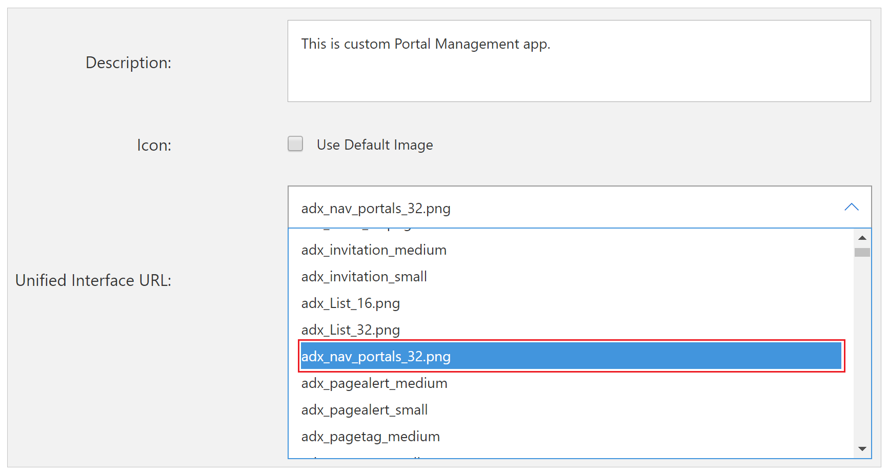

1. Check *Use existing solution to create the App*:

    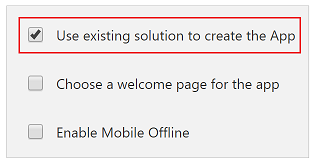

1. Verify all the settings and then select **Next**:

    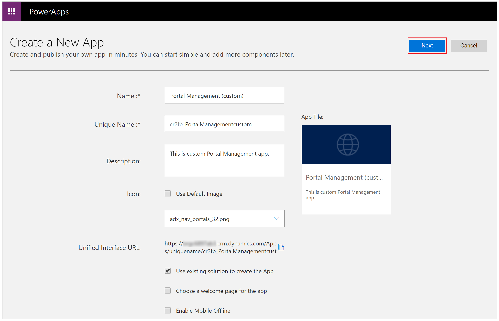

1. Select *Dynamics 365 Portals - Portal base* as the solution for *Select Solution* drop down option:

    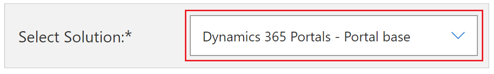

1. Select *Dynamics 365 Portals* as the sitemap for *Select Sitemap* drop down option:

    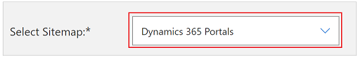

1. Verify selections and then select **Done**:

    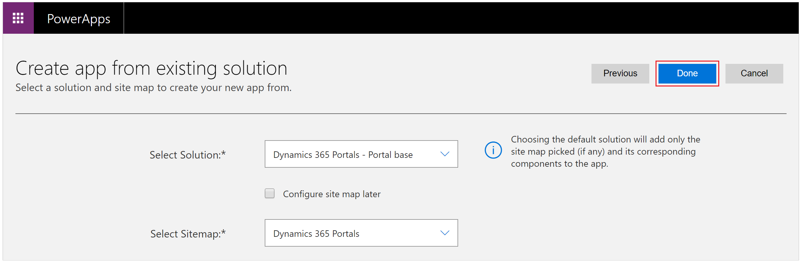

1. After the app opens in **App Designer**, select **Publish**:

    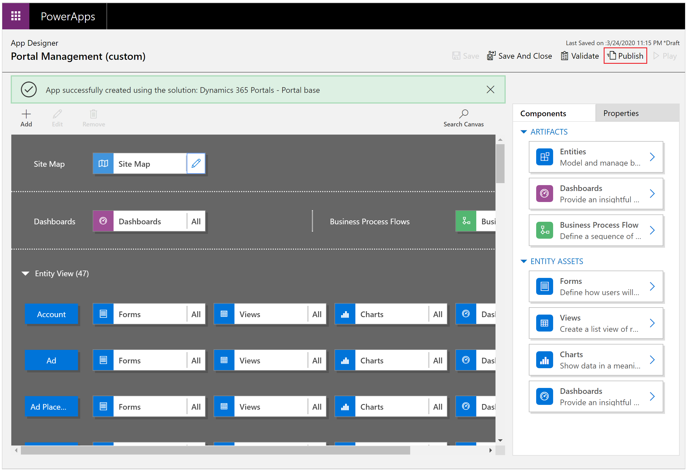

1. Close the **App Designer** browser tab.

1. Open [Power Apps](https://make.powerapps.com).

1. Select **Apps** from left navigation.

1. You can see the new **Portal Management** custom app created:

    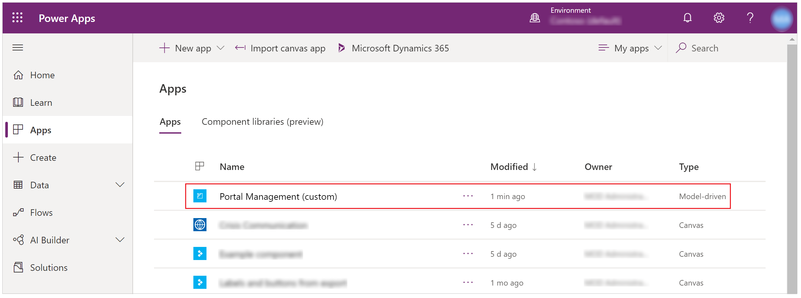

1. Hover over the new app name and select to open the new **Portal Management** custom app:

    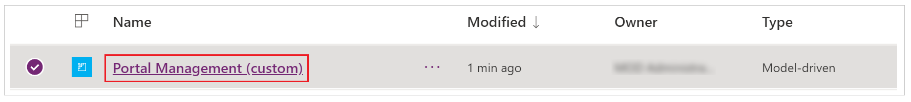

Now you can use the custom Portal Management app and configure portal settings.

## Next steps

[Configure site settings](configure-site-settings.md)

### See also

[Delete a portal](../manage-existing-portals.md#delete)

[!INCLUDE[footer-include](../../../includes/footer-banner.md)]