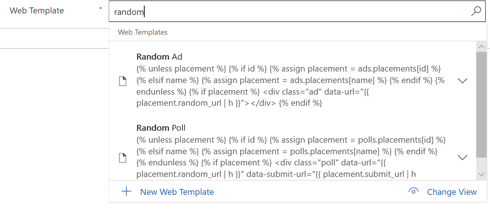
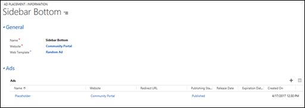
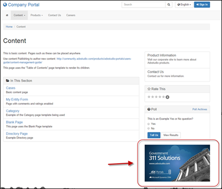

# Create and run advertisements on a portal

Create text or image-based ads and have them run in multiple placements throughout your site. Randomize ads or select specific ads for specific placements. You can choose release and expiration dates for time-sensitive, scheduled content. Ads can be hyperlinked to any destination and open in the current window or a new window. Advertisements are displayed in the portal via two tables: The Ad Placement table and associated Ad table. Ads can be surfaced in many ways: with pre-made Liquid Templates available within portals via Liquid Templating/example Web Templates, or within the.aspx page via MVC actions.

## Create a new advertisement

Ads represent the specific advertisement or image that will appear on the portal at a given time. The Ad table will be displayed in the location specified by the ad placement. The ad must be associated with an ad placement to appear on the portal. For this demonstration, the out-of-the-box example Place Holder ad and Sidebar Bottom ad placement will be surfaced in the Company Portal to exhibit basic functionality and to help you gain familiarity before you create more complex ads. Any of the starter sites can be used in place of the Company Portal. However, note that the Liquid Templates used for this demonstration call on the Sidebar Bottom ad placement name.

1. Open the [Portal Management app](configure-portal.md).

2. Go to **Portals** > **Ads**

3. Open the **Placeholder** ad associated with the **Company Portal** website (this can be done with the starter site of your choosing by selecting **+New** and creating an identical ad below the Website). 

4. Select the **Save** icon in the lower-right corner (or **Save & Close** in the upper-left corner if you have created a new ad).

Within the Ad form, you specify a **Name** to describe the ad, the **Website** where the ad will be displayed, and a **Publishing State**. Optionally you can specify a Web Template and Release/Expiration date. You must provide some sort of data for the ad to be displayed. Use the Ad table attribute table later in this guide to craft the specifics of your ad.


## Create a new advertisement placements

1. Open the [Portal Management app](configure-portal.md).

2. Go to **Portals** > **Ad Placements**.

3. Select the Web Template Field to select a Web Template. For demonstration purposes, the Random Ad Web Template was chosen.

4. On the rightmost corner of the Ads grid, select **+** to select the ad created in the previous step.

5. Select the **Save** icon in the lower-right corner

When creating a new ad placement, specify a **Name** to describe the ad placement and the **Website** where the ad placement will be displayed as required. The example Web Templates that enable the use of ads as an out-of-the-box feature will be displayed within the lookup of the Web Template field in the form. These templates are also intended to be used as a source to create custom templates.

> [!div class=mx-imgBorder]
>   

> [!div class=mx-imgBorder]
>   

> [!div class=mx-imgBorder]
>   

> [!NOTE] 
> The ad created above will not be displayed on the home page of the starter portal.

## Using Liquid templates to place advertisements

Content managers may use Liquid to add an ad to any editable content area, as described in [Work with Liquid templates](../liquid/liquid-overview.md) and, more specifically, [Ads](../liquid/liquid-objects.md#ads).

This template renders an ad by name, or a random ad from an ad placement. Currently, the code below will not render multiple ads in the ad placement (that is, a rotating ad). To render multiple ads in the ad placement, you would need to build a Liquid ads API. For more information about built-in web templates, see [Store source content by using web templates](../liquid/store-content-web-templates.md).

```


1. 
```
OR 

```
1. 
```


## Attributes

The Ad Table has the following attributes:


|        Name        |                                                                                                                                                                                                                                             Description                                                                                                                                                                                                                                              |
|--------------------|------------------------------------------------------------------------------------------------------------------------------------------------------------------------------------------------------------------------------------------------------------------------------------------------------------------------------------------------------------------------------------------------------------------------------------------------------------------------------------------------------|
|        Name        |                                                                                                                                                                                                                                    A descriptive name for the ad                                                                                                                                                                                                                                     |
|      Website       |                                                                                                                                                                                                                                  The associated website. Required.                                                                                                                                                                                                                                   |
|    Web Template    |                                                                                                                                                The associated [web templates](../liquid/store-content-web-templates.md) that will be used by default to render the ad. This field is optional; if it is blank the ad will be rendered using a default template.                                                                                                                                                |
|    Release Date    |                                                                                      Controls the date and/or time after which the ad will be visible on the portal. If the ad placement is rotating through multiple ads, an unreleased ad will not appear. If no released ads are associated with an ad placement, nothing will appear. This is useful for controlling the release of time-sensitive content.                                                                                      |
|  Expiration Date   |                                                                                                                                                                                                             Controls a date or time prior to which the ad will be visible on the portal.                                                                                                                                                                                                             |
|  Publishing State  |                                                                                                                                                                                                                                    The current Publishing State.                                                                                                                                                                                                                                     |
|    Redirect URL    |                                                                                                                                                                                When the ad is clicked, the user will go to this URL. **This field is optional.** If no value is given, the ad will not be clickable.                                                                                                                                                                                 |
| Open In New Window |                                                                                                                                                                                                             Boolean. If set to true, the ad will open a new browser window when clicked.                                                                                                                                                                                                             |
|       Title        |  A single line of text for the ad which can be displayed on the portal. Whether it is displayed is determined by a property on the AdPlacement control. This is primarily useful for text-based ads or simple one-line links that you want to place on the portal by using ad placements. If the title is displayed, by default it will be rendered as a hyperlink that points to the Redirect URL. This behavior may be altered by using a custom [web template](../liquid/store-content-web-templates.md).   |
|        Copy        |                                                                      A multiple-line body of text or other web content that will be displayed in the ad placement. This allows the placement to be used in a similar way to content snippets, but it is best to avoid using them to serve simply as a bucket to hold content (use snippets for that). Instead, they are best used to display rotating image or textual content.                                                                      |
|     Image URL      | The URL of the image that will be displayed by the ad. Optional; Use this field if you want the ad to render a static resource or a web file. The Image will be clickable and link to the redirect URL, if one is given. If an ad has a note attached to it with an image file attachment, the ad will render that as its image. This is possibly the most convenient way to set up images for ads, and ties the image directly to the ad. In this case, using the Image URL field is not necessary. |
|    Image width     |                                                                                                                                                                                    Width of the image. This field is not required but is recommended to ensure that the rendered ad is valid and accessible HTML                                                                                                                                                                                     |
|    Image Height    |                                                                                                                                                                                    Height of the image. This field is not required but is recommended to ensure that the rendered ad is valid and accessible HTML                                                                                                                                                                                    |
|   Image Alt Text   |                                                                                                                                                                                  Alt Text for the image. This field is not required but is recommended to ensure that the rendered ad is valid and accessible HTML.                                                                                                                                                                                  |

### See also

[Configure a portal](configure-portal.md)  
[About lists](entity-lists.md)  
[Create and run advertisements on a portal](create-run-advertisement.md)  
[Gather feedback by using polls on a portal](gather-feedback-poll.md)  
[Rate or vote on a webpage on a portal](rate-webpage.md)  
[Redirect to a new URL on a portal](add-redirect-url.md)  


[!INCLUDE[footer-include](../../../includes/footer-banner.md)]