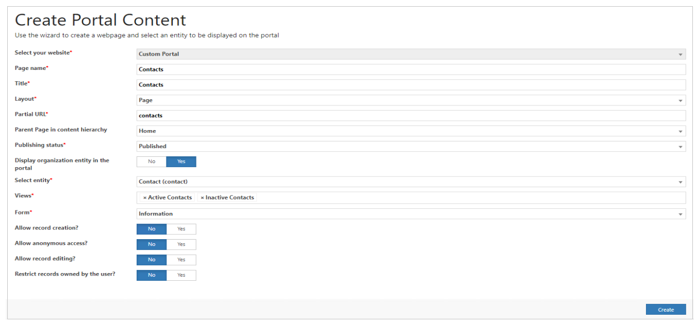

# Create and show portal content using Portal Management app

To create a webpage by using basic forms and lists is a complex task. **Create Portal Content** wizard simplifies this process. You can use this wizard to create and expose portal content easily by filling in the minimum required fields.

1. Open the [Portal Management](configure-portal.md) app.

1. From the left pane, under **Administration**, select **Create Portal Content**. The Create Portal Content window appears.

4. Specify the required details. If you need extra help, point to any field to read the tooltips.

    - The **Select your website** field is prepopulated if only one website is available. The list is sorted alphabetically by the website name.
    - The **Parent page in the content hierarchy** field is prepopulated with the Home page.
    - The **Partial URL** field is populated based on the page name entered. If required, you can change the value.
    - The **Layout** field is prepopulated with the layout that is marked as default.
    - If you choose to expose the table by selecting **Expose organization tables in the portal**, a few additional fields are displayed to gather information required to expose a table by using basic forms and lists. If you need extra help, hover over any field to read the tooltips. You can also select multiple views.

5. Select **Create**.

     

### See also

[Configure portal using Portal Management app](configure-portal.md)

[!INCLUDE[footer-include](../../../includes/footer-banner.md)]