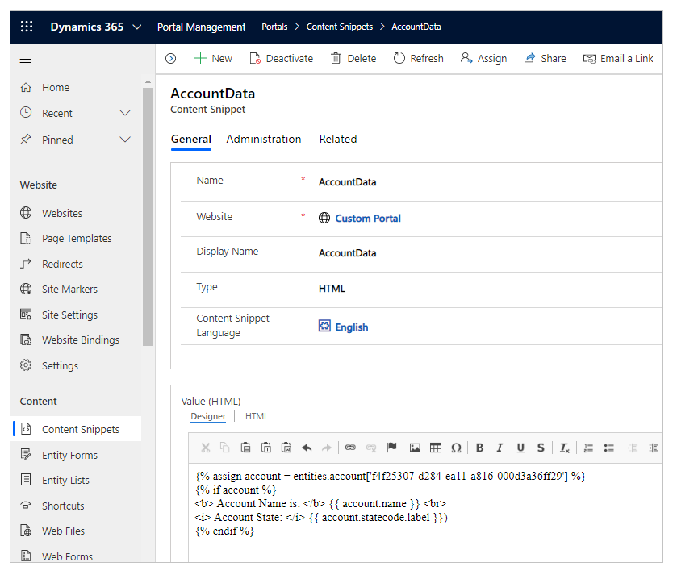
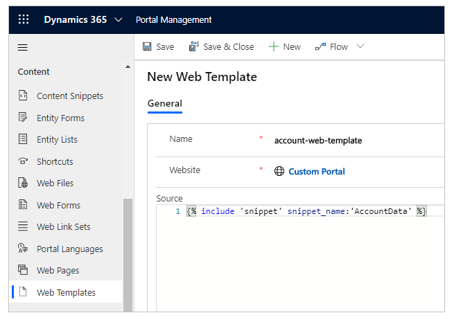
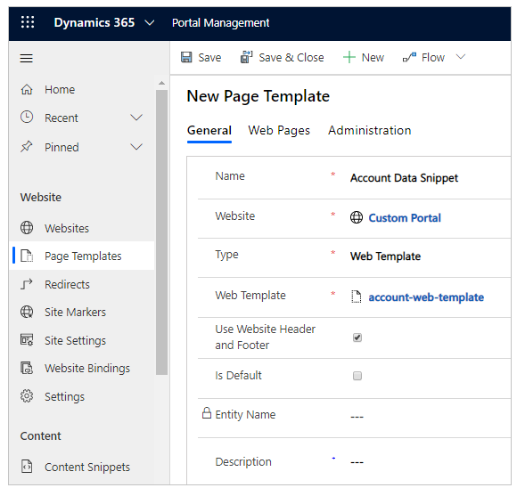
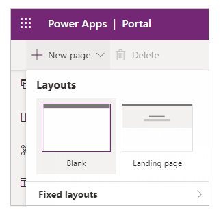
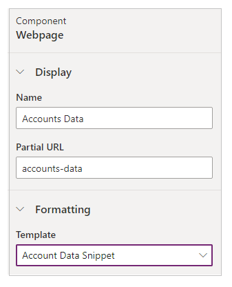

# Customize content by using content snippets

Content snippets are small chunks of editable content that can be placed by a developer on a page template, allowing for customizable content to populate any portion of a page's layout easily. Snippet controls, which are responsible for rendering the content of snippets on the web-facing portal, are placed on a page template by developers.

## Edit snippets

Snippets can be edited either through the Portal Management app. The main power of the snippet is the fact that you can abstract a bit of content (other than the main copy of the page) and edit it separately, allowing essentially any static content on your site to be fully content-managed and editable.

1. Open the [Portal Management app](configure-portal.md).

1. Go to **Portals** > **Content Snippets**.

1. To create a new snippet, select **New**.

1. To edit an existing snippet, select an existing **Content Snippet** in the grid.

Enter values for the following fields:

| Name    | Description                                                                                                   |
|---------|---------------------------------------------------------------------------------------------------------------|
| Name    | The name can be used by a developer to place the snippet value into a page template within the portal's code. |
| Website | The website that is associated with the snippet.                                                              |
| Display Name | Display name for the content snippet. |
| Type | Type of content snippet, Text, or HTML.
| Content Snippet Language | Select a language for the content snippet. To add more languages, go to [enable multiple language support](enable-multiple-language-support.md).
| Value   | The content of the snippet to be displayed in the portal. You can enter plain text or HTML markup. You can also use [liquid objects](../liquid/liquid-objects.md) with both text or HTML markup values.    |

## Use snippet

You can use snippets to show text or HTML. The content snippets can also use [liquid objects](../liquid/liquid-objects.md), and reference other content such as [entities](../liquid/liquid-objects.md#entities).

For example, you can use the steps explained earlier in this article to create/edit a content snippet. While editing the snippet, you can include sample code to [a record](../liquid/liquid-objects.md#entities). Ensure you replace the ID of the Account table record with the correct ID from your environment. You can also use another table instead of Account.

After you create a snippet with text, HTML, or liquid objects shown in the example above, you can use it in a portal page.

To do add snippet on a portal page:

1. Create a [web template](../liquid/store-content-web-templates.md) and use [snippets liquid object](../liquid/liquid-objects.md#snippets) to call the snippet you created.

2. Create a [page template](page-templates.md) using the web template created earlier.

3. Use the portals Studio to create a new page using the page template created earlier.

## Example

The following example uses a Microsoft Dataverse database with [sample data](/power-platform/admin/add-remove-sample-data).

1. Open the [Portal Management app](configure-portal.md).

1. Go to **Portals** > **Content Snippets**.

1. To create a new snippet, select **New**.

1. Enter name. For example, AccountData.

1. Select your website.

1. Enter Display Name. For example, AccountData.

1. Select type as HTML for this example. You can also select text instead.

1. Select a language.

1. Copy and paste sample value:

    ```
    
    
    <b> Account Name is: </b> {{ account.name }} <br>
    <i> Account State: </i> {{ account.statecode.label }})
    
    ```

    Replace the GUID of the record with an account table record from your Dataverse database.

    

1. Save content snippet.

1. Select **Web Templates** from left pane.

1. Select **New**.

1. Enter name. For example, account-web-template.

1. Select your website.

1. Copy and paste the source value:

    ``````

    If different, update the value for *snippet_name* with your snippet name.

    

1. Select Save.

1. Select **Page Template** from left pane.

1. Select **New**.

1. Enter name. For example, Account Data Snippet.

1. Select your website.

1. Select Type as *Web Template*.

1. Select the web template created earlier. In this example, it's account-web-template.

1. Select Save.

    

1. [Edit](../manage-existing-portals.md#edit) your portal.

1. Select **New** > **Blank** page.

    

1. Enter name for the page. For example, Accounts Data.

1. Enter Partial URL. For example, accounts-data.

1. Select the **Page Template** created earlier. In this example, it's Account Data Snippet.

    

1. Select **Browse website** from upper-right corner to view the page in browser.

    

You can follow the same steps with content snippet of **Text** type instead of HTML, for example:

```


Account Name is: {{ account.name }} 
Account State: {{ account.statecode.label }}

```
Replace the GUID of the record with an account table record from your Dataverse database.

When you browse the page with this content snippet, the table information is displayed using liquid object along with text instead of HTML. Likewise, you can also use only HTML to display content without using liquid objects.

## See also

[Work with liquid templates](../liquid/liquid-overview.md)


[!INCLUDE[footer-include](../../../includes/footer-banner.md)]