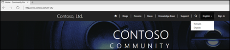
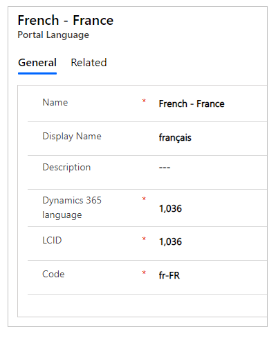
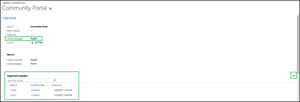
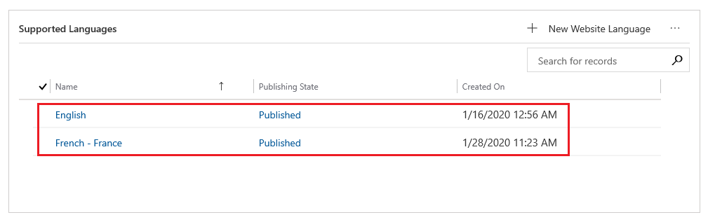
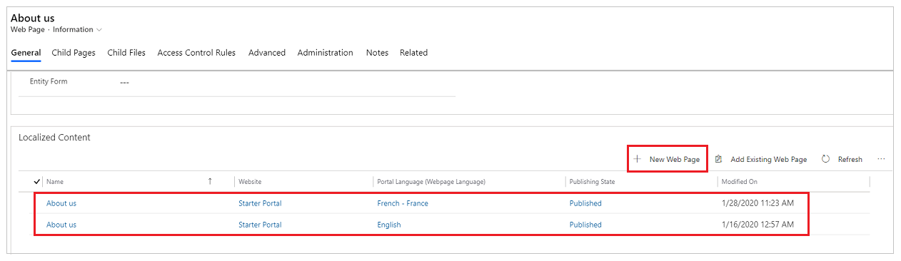
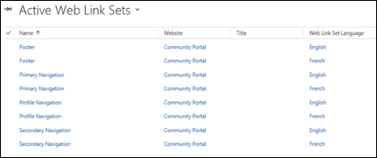

# Enable multiple-language portal support

Business is not confined to a single region or a language. A single portal can display content in multiple languages to reach customers around the world. The content of your portal can be translated into multiple languages while maintaining a single content hierarchy.

  

To enable multiple languages for a portal, follow these steps:

1. [Enable languages in a Microsoft Dataverse environment.](/power-platform/admin/enable-languages)  
2. Go to **Portals** > **Website** > **Websites**.
3. Select the website to add language support to.
4. In the **Supported Languages** section under the **General** tab, select **New Website Language**.
5. Fill in the form, including **Portal Language** (a lookup of languages that are activated in the organization and are supported by portals) and **Publishing State**.

   

   

   

> [!Note]
> If you activate new languages after the portal has been provisioned, you can [import the metadata translations](../admin/import-metadata-translation.md) to get the metadata translated for the newly activated languages.

## Supported languages

The table below shows all the languages currently available out of the box. This list can be found by going to **Portals** &gt; **Content** &gt; **Portal Languages**. The Portal Display Name of a language can be changed after selecting the language to change from this page. Note that the list now includes East Asian languages (Japanese, Chinese, and Korean).

| **Name**                           | **Language Code** | **LCID** | **Portal Display Name** |
|------------------------------------|-------------------|----------|-------------------------|
| Basque - Basque                    | eu-ES             | 1069     | euskara                 |
| Bulgarian - Bulgaria               | bg-BG             | 1026     | български               |
| Catalan - Catalan                  | ca-ES             | 1027     | català                  |
| Chinese - China                    | zh-CN             | 2052     | 中文(中国)              |
| Chinese - Hong Kong SAR            | zh-HK             | 3076     | 中文(香港特別行政區)    |
| Chinese - Traditional              | zh-TW             | 1028     | 中文(台灣)              |
| Croatian - Croatia                 | hr-HR             | 1050     | hrvatski                |
| Czech - Czech Republic             | cs-CZ             | 1029     | čeština                 |
| Danish - Denmark                   | da-DK             | 1030     | dansk                   |
| Dutch - Netherlands                | nl-NL             | 1043     | Nederlands              |
| English                            | en-US             | 1033     | English                 |
| Estonian - Estonia                 | et-EE             | 1061     | eesti                   |
| Finnish - Finland                  | fi-FI             | 1035     | suomi                   |
| French - France                    | fr-FR             | 1036     | français                |
| Galician - Spain                   | gl-ES             | 1110     | galego                  |
| German - Germany                   | de-DE             | 1031     | Deutsch                 |
| Greek - Greece                     | el-GR             | 1032     | Ελληνικά                |
| Hindi - India                      | hi-IN             | 1081     | हिंदी                   |
| Hungarian - Hungary                | hu-HU             | 1038     | magyar                  |
| Indonesian - Indonesia             | id-ID             | 1057     | Bahasa Indonesia        |
| Italian - Italy                    | it-IT             | 1040     | italiano                |
| Japanese - Japan                   | ja-JP             | 1041     | 日本語                  |
| Kazakh - Kazakhstan                | kk-KZ             | 1087     | қазақ тілі              |
| Korean - Korea                     | ko-KR             | 1042     | 한국어                  |
| Latvian - Latvia                   | lv-LV             | 1062     | latviešu                |
| Lithuanian - Lithuania             | lt-LT             | 1063     | lietuvių                |
| Malay - Malaysia                   | ms-MY             | 1086     | Bahasa Melayu           |
| Norwegian (Bokmål) - Norway        | nb-NO             | 1044     | norsk bokmål            |
| Polish - Poland                    | pl-PL             | 1045     | polski                  |
| Portuguese - Brazil                | pt-BR             | 1046     | português (Brasil)      |
| Portuguese - Portugal              | pt-PT             | 2070     | português (Portugal)    |
| Romanian - Romania                 | ro-RO             | 1048     | română                  |
| Russian - Russia                   | ru-RU             | 1049     | русский                 |
| Serbian (Cyrillic) - Serbia        | sr-Cyrl-CS        | 3098     | српски                  |
| Serbian (Latin) - Serbia           | sr-Latn-CS        | 2074     | srpski                  |
| Slovak - Slovakia                  | sk-SK             | 1051     | slovenčina              |
| Slovenian - Slovenia               | sl-SI             | 1060     | slovenščina             |
| Spanish (Traditional Sort) - Spain | es-ES             | 3082     | español                 |
| Swedish - Sweden                   | sv-SE             | 1053     | svenska                 |
| Thai - Thailand                    | th-TH             | 1054     | ไทย                     |
| Turkish - Turkey                   | tr-TR             | 1055     | Türkçe                  |
| Ukrainian - Ukraine                | uk-UA             | 1058     | українська              |
| Vietnamese - Vietnam               | vi-VN             | 1066     | Tiếng Việt              |

## Create content in multiple languages

1. Open the [Portal Management app](../configure/configure-portal.md).
2. Go to **Portals** > **Content** > **Web Pages** to see a list of content. For each webpage, there will be a parent version of the page and a child version of the page for each language activated for the portal.
3. To add a new localization of the page, go to a base page and scroll down to **Localized Content**.
4. Select **+ New Web Page** on to create a lookup for the localized version.

      

> [!Note]
> The configuration fields on the home page of a content page is not inherited to the existing content pages. They are used only in creation of new content pages. You must update the content page configurations individually.

Knowledge articles will only be displayed if they have been translated into the language the user sets the portal to be displayed in. However, forums and blogs allow for more control over how they are presented in other languages. Specifying a language for a forum or blog is optional. If a language is not specified, the forum or blog will be displayed in the primary language of the organization. If you want the forum or blog specific to a language, you must create it and assign the language to it.

Web link sets are the navigation links at the top of the portal. By navigating to **Portals** > **Content** > **Web Link Sets** you can control how this content is translated. When a language is active for the portal, a new set of links are created for the newly activated language.

[!INCLUDE[footer-include](../../../includes/footer-banner.md)]