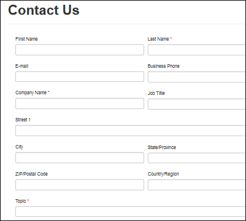

# About basic forms

A data-driven configuration to allow end users to add a form to collect data in the portal without the need for a developer to surface the form in the portal, basic forms are created in Microsoft Dataverse and then placed into webpages in the portal or used in conjunction with subgrids and lists to build out complete web applications. [!INCLUDE[proc-more-information](../../../includes/proc-more-information.md)] [About lists](entity-lists.md) 

  

## Add a form to your portal

The basic form contains relationships to webpages and additional properties to control the initialization of the form within the portal. The relationship to webpages allows dynamic retrieval of the form definition for a given page node within the website. 

To view existing basic forms or to create new basic forms, open the [Portal Management app](configure-portal.md) and go to **Portals** &gt; **Basic Forms**.

When creating a new basic form, the first step is to decide the **Table** and **Form Name** that you will be rendering, in addition to the **mode: Insert, Edit, or Read Only**. The mode selected will determine if you are creating a new record from the portal, editing an existing record, or just displaying information about a record on the portal.

> [!NOTE]
> - A **Basic Form** must be associated with a webpage for a given website for the form to be viewable within the site.
> - The Connection table subgrids aren't supported in basic forms. If you add a Connection table subgrid to the form using Form designer, error messages are displayed when you render the form on the portal and use the Connection table.
> - Duplicate fields, multi-select option set, Party List fields and business rules aren't supported in basic forms.
> - Field level code components are in public preview, and can be added to forms. More information: [Add a code component to a field in a model-driven app](../component-framework.md#add-a-code-component-to-a-field-in-a-model-driven-app) 
> - [Image attributes](../../../developer/data-platform/image-attributes.md), [file attributes](../../../developer/data-platform/file-attributes.md) and [table images](/dynamics365/customerengagement/on-premises/developer/sample-set-retrieve-entity-images) aren't supported in [basic forms](entity-forms.md), [advanced forms](web-form-properties.md) or when using liquid template tags, such as [fetchxl](../liquid/template-tags.md).
> - Business rules and client API can enable locked fields on a read-only form.
> - If you create a basic form in the Insert mode, you can't change a button's alignment or place an action button above the basic form.
> - If you render a lookup control as a dropdown list on the form, the related records filter does not work.

The webpages associated with the basic form can be viewed by selecting the **Web Pages** link listed in the **Related** navigation links in the leftmost menu.

When creating or editing a webpage, an **Basic Form** can be specified in the lookup field provided on the Web Page form.

The various master pages used by the portal contain declarations of the **TableForm** server control. When rendering the webpage containing either the Page (~/Pages/Page.aspx) page template or Full Page (~/Pages/FullPage.aspx) page template, the controls will determine whether the basic form lookup contains a value, in which case the form will be rendered.

## Secure your forms

>[!NOTE]
> This method of securing forms would be deprecated soon. Therefore, it shouldn't be used. Use proper [table permissions](entity-permissions-studio.md), and web role setup to provide access to users for any data instead. More information: [Table permission changes for forms and lists on new portals](../important-changes-deprecations.md#table-permission-changes-for-forms-and-lists-on-new-portals)

To secure your forms, you must create table permissions that determine access and ownership of the records according to web roles. If a user lands on a basic form and does not have permissions, they will receive an error message. To enable permissions for a basic form, set **Enable Table Permissions** to true. [!INCLUDE[proc-more-information](../../../includes/proc-more-information.md)] [Create web roles for portals](create-web-roles.md).  

## Basic form attributes and relationships

|Name|Description|
|-----|----------|
|Name|The descriptive name of the record. This field is required.|
|Table Name|The name of the table from which the form will be loaded from. This field is required.|
|Form Name|    The name of the Form on the target table that is to be rendered. This field is required.|
|Tab Name|    Optional name of a Tab on a Form for a specified table that is to be rendered.|
|Mode|One of the following values:<ul><li>Insert</li><li>Edit</li><li>ReadOnly</li></ul>Selecting _Insert_ indicates the form should insert a new record upon submission. Specifying _Edit_ indicates the form should edit an existing record. Selecting _ReadOnly_ indicates the form should display an existing record's non editable form. _Edit_ and _ReadOnly_ requires that a source record exist and parameters specified in the 'Record Source Type' and 'Record ID Parameter Name' fields to select the appropriate record when the form is loaded in the portal.|
|Record Source Type|One of the following values:<ul><li>Query String</li><li>Current Portal User</li><li>Record Associated to Current Portal User</li></ul>Selecting _Query String_ requires a parameter name that must be provided in the query string of the URL to the form. This can be specified in the 'Record ID Parameter Name' field. Selecting _Current Portal User_ will retrieve the portal user record for the current authenticated user. Selecting _Record Associated to Current Portal User_ will retrieve the portal user record for the current authenticated user and then retrieve the record for the given relationship as specified by the 'Relationship Name' field.|
|Record ID Parameter Name|    A parameter name provided in the query string of the URL to the Web Page containing this Basic Form.|
|Relationship Name|    Required when Record Source Type is Record Associated to Current Portal User. The logical name of the relationship between the current portal user record and the target record. This must return the same table type specified by the Table Name field.|
|Allow Create If Null|    An optional boolean value available when Record Source Type is Record Associated to Current Portal User. Indicates that if the related record does not exist, allow the user to create it the first time, otherwise an exception will be thrown if the record does not already exist as the form needs a record to data bind to.|
|Enable Table Permissions|    Will Cause the form to respect Table Permissions. The default is false for backwards compatibility reasons. If set to true, explicit permissions are REQUIRED for any user wanting to access the form.   **NOTE**: This method of securing forms would be deprecated soon. Therefore, it shouldn't be used. Use proper [table permissions](entity-permissions-studio.md), and web role setup to provide access to users for any data instead. More information: [Table permission changes for forms and lists on new portals](../important-changes-deprecations.md#table-permission-changes-for-forms-and-lists-on-new-portals) |
|||

### Form Options

|Name|Description|
|----|---------|
|Add Captcha|    Displays captcha.   **NOTE:** Captcha control is currently limited to only English language for audio, and Latin characters for image.|
|Show Captcha for Authenticated users|    Displays captcha for authenticated users.|
|Validation Group|    The group name assigned to input controls for evaluating valid input of named groups.|
|Auto Generate Steps From Tabs|    Indicates that multiple tabs on a basic form will be displayed with each tab as a sequential step starting with the first tab and continue until all tabs have been navigated to and upon final submission a record is inserted. By default, it is not selected. The default value indicates that only one tab or form is to be rendered for the current step. If the Tab Name is not specified, then the first tab is displayed.|
|Render Web Resources Inline|    Eliminates the iframe that encompasses a web resource in a basic form.|
|ToolTips Enabled|    The tooltip is set using the description of the attribute on the target table.|
|Show Unsupported Fields|    All fields are currently supported. This is reserved for potential changes Dataverse may make to field types.|
|Set Recommended Fields as Required|     Makes all attributes required that have the field requirement level set to 'Business Recommended'.|
|Make All Fields Required|     Makes all fields required regardless of the field requirement level.|
|Validation Summary CSS Class|    CSS Class name assigned to the validation summary. Default is 'validation-summary alert alert-error alert-block'|
|Enable Validation Summary Links|    A boolean value of true or false that indicates whether anchor links should be rendered in the validation summary to scroll to the field containing an error. Default value is true.|
|Validation Summary Link Text|    The label assigned to the validation summary links. Default value is 'click here'.|
|Validation Summary Header Text|    The label assigned to the validation summary header.|
|Instructions|    Instructions to work with the form.|
|Record Not Found Message|    Message to be displayed when a record is not found.|
|||

### On Success Settings

|Name|Description|
|----|----------|
|On Success|    One of the following values:<ul><li>Display Success Message (Default)</li><li>Redirect</li></ul>|
|Hide Form on Success|    Requires On Success set to Display Success Message. When selected, the form is hidden upon successful submission of the form.|
|Success Message|    Requires On Success set to Display Success Message. The message displayed to the user upon successful submission. If one is not specified a default message (Submission completed successfully") will be displayed. For each language pack installed and enabled for the organization a field will be available to enter the message in the associated language.|
|External URL|Requires On Success set to Redirect. Specify a URL to an external resource on the web.
|or Web Page|Requires On Success set to Redirect. Select a Web Page from the current website.|
|Append Existing Query String|    Requires On Success set to Redirect. When selected, the existing query string parameters will be added to the target URL prior to redirection.|
|Append Record ID To Query String|     Requires On Success set to Redirect. When selected, the ID of the record created is appended to the query string of the URL being redirected to.|
|Record ID Parameter Name|     Requires On Success set to Redirect. The name of the ID parameter in the query string of the URL being redirected to.|
|Append Custom Query String|    Requires On Success set to Redirect. A custom string that can be appended to the existing Query String of the redirect URL.|
|Append Attribute Value to Query String - Parameter Name|    Requires On Success set to Redirect. A name to give to the parameter that correlates to the attribute value on the target table that gets appended to the Query String of the redirect URL.|
|Append Attribute Value to Query String - Attribute Logical Name|Requires On Success set to Redirect. A logical name of an attribute on the target table to get the value to be appended to the Query String of the redirect URL.|
|||

### Additional Settings

|Name|Description|
|----|----------|
|Associate Current Portal User|    Indicates the currently logged in user's record should be associated with the target table record.|
|Portal User Lookup Column|    The logical name of the attribute on the target table that stores the portal user.|
|Is Activity Party|    Boolean value indicating whether or not the Portal User Lookup Column is an Activity Party type.|
|Attach File |  Select to have the form include a file upload control at the bottom of the form to allow a file to be attached to the record.   **Note**: Portals with [version 9.2.2.x and later](https://support.microsoft.com/help/4541765/power-apps-portals-version-9-2-2-x-release) do not require enabling **Enable Table Permissions** on the basic form to attach files. However, if you have it selected, you must ensure that appropriate privileges are provided on the parent table and the annotation table to display the **Attach File** button on the form. Annotation table must have at least **Create** and **Append** privileges and the parent table must have the corresponding **AppendTo** privilege. Depending on whether you have a create or update form, you may also need **Create**, **Read** and **Write** privileges to complete the scenario of the form. |
|Attach File Storage Location|    Options: Note Attachment, Azure Blob Storage. If your organization is configured to use Azure Storage, you can choose to storage uploaded files for this basic Form there. Otherwise, files with be stored as Note Attachments.|
|Allow Multiple Files|Boolean value indicating whether or not the user can upload more than one file.|
|Accept|    The accept attribute specifies the MIME types of files that the server accepts through file upload. To specify more than one value, separate the values with a comma (e.g. audio/*,video/*,image/*).|
|Label|    The text displayed next to the file upload control. For each language pack installed and enabled for the organization a field will be available to enter the message in the associated language.|
|Attach File Required| Makes the attachment of a file required to proceed.|
|Required Error Message|The message displayed during form validation if Is Required is true and the user has not attached a file. For each language pack installed and enabled for the organization a field will be available to enter the message in the associated language.|
|Restrict Files to Accepted Types|    Forces validation on the Accept field. If not selected, the Accept attribute will only be used as a suggestion for the file upload dialog.|
|File Type Error Message|The message displayed during form validation if Restrict Files to Accepted Types is true and the user has attempted to upload an invalid file type. For each language pack installed and enabled for the organization a field will be available to enter the message in the associated language.|
|Maximum File Size (in kilobytes)|    Forces validation on the maximum allowed size of the uploaded file.|
|File Size Error Message|    The message displayed during form validation if Maximum File Size (in kilobytes) is true and the user has attempted to upload a file that is too large. For each language pack installed and enabled for the organization a field will be available to enter the message in the associated language.|
|Custom JavaScript|    A custom block of JavaScript that will added to the bottom of the page just before the closing form tag element. The HTML input id of a table field is set to the logical name of the attribute. This makes selecting a field, setting values, or other client-side manipulation easy with jQuery. `$(document).ready(function() {   $("#address1_stateorprovince").val("Saskatchewan");});`|
|||

### Associated Table Reference

The following parameters pertain to setting an associated table reference when the form is saved.

This provides a way to associate the current record being created or updated by the form with another target record. This is useful if you have multiple steps with multiple table types and wish to relate the resulting records or if the page is passed a query string of a record id that you would like associated. For example we have a careers page that lists job postings, each with a link to an application for the job that contains the id of the job posting to the application form so that when the application is created the job posting is associated with the record. 

|Name|Description|
|-----|---------|
|Set Table Reference On Save|Yes or No. A value of yes indicates that an associated table reference should be assigned when the form is saved, otherwise none will be set.|
|Relationship Name|The Relationship Definition Name for a given relationship between two table types.|
|Table Logical Name|The logical name of the reference table.|
|Target Lookup Attribute Logical Name|Logical name of the lookup attribute on the target table being created or updated.|
|Populate Lookup Field|    If the lookup regarding the reference table is on the form, checking this value will populate the field on the form with the value retrieved using the setting below.|
|Source Type|    One of the following values:<ul><li>Query String   Selecting _Query String_ requires a parameter name that must be provided in the query string of the URL to the form. This can be specified in the **Query String Name** field. If this parameter is the primary key then select Yes for the **Query String Is Primary Key**, otherwise select No and provide the logical name of the attribute on the target table to query by specified in the **Query Attribute Logical Name** field.</li><li>Current Portal User   Selecting Current Portal User will retrieve the contact record for the current authenticated user.</li></ul>|
|Reference Table Step|    The Advanced Form Step record of a previous step to retrieve the Table created or edited in that step to associate it with the record for this current step.|
|Query String Name|    Parameter name provided in the Query String of the URL to the Web Page containing the Advanced Form.|
|Query String Is Primary Key|    Yes indicates the Query String value is the Primary Key value. No indicates the Query String value is an attribute type other than the Primary Key.|
|Query Attribute Logical Name|    Logical name of the attribute to query the record.|
|Show ReadOnly Details|    Indicates that a form should be rendered at the top of the page displaying read-only information pertaining to the reference record. Requires a Form Name.|
|Form Name|    The name of the form on the reference table that should be used to display read-only details.|
|||

## Basic form action configuration

By default a Basic Form will allow for reading or updating of an existing record, or the insertion of a new record.  However, you can easily enable and configure additional actions for records in a Basic Form  as well (Delete, Activate, Deactivate, etc.). It is also possible to override default labels, sizes, and other attributes that will appear if there are actions enabled.

These settings are found in the **Additional Settings** section of the basic form. By default, only **Basic Settings** are shown. You can select **Advanced Settings** to show additional settings.

You can add action buttons for the actions that are applicable for an individual record and will appear for each row in the grid provided the appropriate privilege has been granted by [table permissions](assign-entity-permissions.md). The following actions are available:

- Delete
- Workflow
- Create Related Record
- Activate
- Deactivate

Clicking on one of these options displays a configuration area for that action. Furthermore, certain tables have special actions that are available to them on a per-table basis:

- Calculate Value of Opportunity (opportunity)
- Cancel Case Action (incident)
- Close (resolve) Case Action (incident)
- Convert Quote to Order (quote)
- Convert Order to Invoice (salesorder)
- Generate Quote from Opportunity (opportunity)
- Lose Opportunity Action (opportunity)
- Win Opportunity Action (opportunity)
- Reopen Case Action (incident)
- Set Opportunity on Hold (opportunity)

> [!NOTE]
> It is recommend to create a workflow instead of adding an **Activate** or a **Deactivate** button for out of the box tables having defined specific **state** and **status code** values that they require for their business processes. For example, Incident ([status options](/dynamics365/customerengagement/on-premises/developer/entities/incident#statuscode-options)), Opportunity([status options](/dynamics365/customerengagement/on-premises/developer/entities/opportunity#statuscode-options)), Entitlements ([status options](/dynamics365/customerengagement/on-premises/developer/entities/entitlement#statuscode-options)).

## Geolocation configuration for basic forms

A managed form can be configured to display a map control to either display an existing location as a pin on a map or to provide the ability for the user to specify a location. See [Add Geolocation](add-geolocation.md).

The form's map control requires additional configuration to tell it what the IDs of the various location fields are, to assign values to them or retrieve values from them. The basic form record has a configuration section that defines these field mappings that you must specify. The field names will vary depending on the schema you have created.

 

> [!Note]
> - The address field in a read-only basic form is replaced with the map when geolocation is enabled.
> - The Geolocation section is not visible in the German Sovereign Cloud environment. If a user has enabled geolocation by using a different form, it will not be displayed during rendering on portal.

## Request validation

[Request validation](/aspnet/whitepapers/request-validation), a feature of ASP.NET since version 1.1, prevents the server from accepting content containing un-encoded HTML. This feature is designed to help prevent some script-injection attacks whereby client script code or HTML can be unknowingly submitted to a server, stored, and then presented to other users. We still strongly recommend that you validate all input data and HTML encode it when appropriate.

By default, request validation is enabled on portal resulting in following generic error if you enter script code without HTML encoding inside basic form fields:

`Found field(s) submitted with potentially dangerous value(s) such as HTML, or script. Please review the field value(s) and try again.`

To disable request validation, follow these steps:

1. Go to [portal settings](../manage-existing-portals.md#settings) and select **Site Settings**.

1. Select **New**.

1. Type the name as **DisableValidationWebTemplate**.

1. Select appropriate web site record.

1. Type the value as **true**. By default, setting is **false** that enables request validation.

1. Type appropriate description.

1. Select **Save & Close**.

> [!CAUTION]
> When request validation is disabled, content can be submitted to a page. You must ensure that content is properly encoded or processed.

### See also

- [Configure a portal](configure-portal.md)  
- [Advanced Form properties for portals](web-form-properties.md)  
- [Advanced Form steps for portals](web-form-steps.md)  
- [Advanced Forms metadata for portals](configure-web-form-metadata.md)  
- [Advanced Form subgrid configuration for portals](configure-web-form-subgrid.md)  
- [Notes configuration for basic forms and Advanced Forms for portals](../configure-notes.md)
- [Microsoft Learn: Interact with Dataverse data using basic forms](/learn/modules/portals-access-data-platform/3-entity-forms)

[!INCLUDE[footer-include](../../../includes/footer-banner.md)]