# About lists

A list is a data-driven configuration that you use to add a webpage that will render a list of records without the need for a developer to surface the grid in the portal. By using lists, you can expose records for display on portals.

The grid supports sorting and will be paginated if the number of records is larger than the page size specified. If **Web Page for Details View** has been specified, each record will contain a link to the page, and the ID of the record will be appended to the query string along with the ID Query String Parameter Name. The list also supports multiple views. If more than one view has been specified, a drop-down list will be rendered to allow the user to switch between the various views.

The data can also be filtered by the current portal user, the current portal user's parent Customer account, and the current portal website. If a value exists for both filter conditions **Portal User Attribute** and **Account Attribute**, the portal will render a drop-down list to allow the user to view their own (My) data or their parent Customer account's data.

## Add a list to your portal

The list contains relationships to webpages and various properties to control the initialization of the list of records within the portal. The relationship to the webpage allows dynamic retrieval of the list definition for a given page node within the website. To view existing Table views or to create new Table views, go to **Portals** > **Lists**.

> [!Note]
> - A list must be associated with a webpage in a given website for the list to be viewable within the site.
> - Multi-select option set is not supported in lists.

The webpages associated with the list can be viewed by selecting the **Web Pages** link listed in the **Related** navigation links in the leftmost menu. When creating your list, the first step is to choose the table for which you want to render a list on the portal. You'll then choose one or more model-driven app views to render.

When creating or editing a webpage, you can specify a list in the lookup field provided on the Web Page form. The page template typically will be the Page template, but can be one of several other templates designed for content because the master templates contain the necessary logic to determine whether a list should be rendered.

## List attributes and relationships

|              Name              |                                                                                                                                                                                        Description                                                                                                                                                                                         |
|--------------------------------|--------------------------------------------------------------------------------------------------------------------------------------------------------------------------------------------------------------------------------------------------------------------------------------------------------------------------------------------------------------------------------------------|
|              Name              |                                                                                                                                                                The descriptive name of the record. This field is required.                                                                                                                                                                 |
|          Table Name           |                                                                                                                                               The name of the table from which the Saved Query view will be loaded. This field is required.                                                                                                                                               |
|              View              |                                                                          The Saved Query view(s) of the target table that is to be rendered. This field is required. If more than one view has been specified, the webpage will contain a drop-down list to allow the user to switch between the various views.                                                                           |
|           Page Size            |                                                                                                                                            An integer value that specifies the number of records per page. This field is required. Default: 10                                                                                                                                             |
|   Web Page for Details View    |                                                                                                        An optional webpage that can be linked to for each record. The ID Query String Parameter Name and record ID will be appended to the query string of the URL to this webpage.                                                                                                        |
|      Details Button Label      |                     The text displayed for the details view button if **Web Page for Details View** has been specified. Default: View details <br>**Note**: For each language pack installed and enabled for the Microsoft Dataverse environment, a field will be available to enter the message in the associated language.                      |
|      Web Page for Create       |                                                                                                                                                             An optional webpage that will be the target of the create button.                                                                                                                                                              |
|      Create Button Label       |                              The text displayed for the create button if **Web Page for Create** has been specified. Default: Create <br>**Note**: For each language pack installed and enabled for the Dataverse environment, a field will be available to enter the message in the associated language._                              |
| ID Query String Parameter Name |                                                                                                                                           A parameter name provided in the query string of the URL to the Web Page for Details View. Default: id                                                                                                                                           |
|        Empty List Text         |  **Deprecated**.  The message displayed when there are no records.<br>**Note**: For each language pack installed and enabled for the Dataverse environment, a field will be available to enter the message in the associated language.                                                           |
|     Portal User Attribute      |                                                                                      An optional lookup attribute on the primary table that represents the portal user record, either contact or system user, to which the current user's ID can be applied to filter the data rendered in the list.                                                                                      |
|       Account Attribute        |                                                                                       An optional lookup attribute on the primary table that represents an account record to which the current user contact's parent Customer account value can be applied to filter the data rendered in the list.                                                                                       |
|       Website Attribute        |                                                                                                          An optional lookup attribute on the primary table that represents the website to which the current website's ID can be applied to filter the data rendered in the list.                                                                                                          |
|         Search Enabled         | An optional Boolean value indicating whether search should be enabled. A text box will be rendered to allow users to do a quick search for records. Use the asterisk (\*) wildcard character to search on partial text. The search appends Or condition filters for each column of the primary table in the view to the view's existing predefined filter conditions to query and return the resulting records. <br> **Note**: This option doesn't search within related table columns. |
|    Search Placeholder Text     |                                                                                                                                                      An optional string used as the label displayed in the text box on initial load.                                                                                                                                                       |
|      Search Tooltip Text       |                                                                                                                                             An optional string used as the tooltip displayed when the user points to the **Search** text box.                                                                                                                                              |
|                                |                                                                                                                                                                                                                                                                                                                                                                                            |

## Add custom Javascript

The Options tab on the form contains a text area that you can enter custom [!INCLUDE[pn-javascript](../../../includes/pn-javascript.md)]; if your page includes jQuery library, you can use that here as well. The script block will be added at the bottom of the webpage just before the page’s closing form tag.

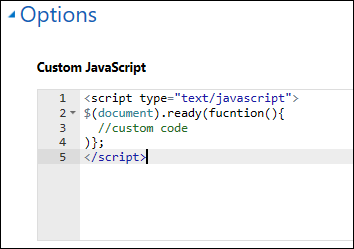  

The list gets its data asynchronously, and when it is complete it will trigger an event `loaded` that your custom [!INCLUDE[pn-javascript](../../../includes/pn-javascript.md)] can listen for and do something with items in the grid. The following code is a trivial example:
```
$(document).ready(function (){
$(".entitylist.entity-grid").on("loaded", function () {
$(this).children(".view-grid").find("tr").each(function (){
// do something with each row
$(this).css("background-color", "yellow");
});
});
}); 
```

Find a particular attribute field and get its value to possibly modify the rendering of the value. The following code gets each table cell that contains the value of the `accountnumber` attribute. Replace `accountnumber` with an attribute appropriate for your table and view.
```
$(document).ready(function (){
   $(".entitylist.entity-grid").on("loaded", function () {
      $(this).children(".view-grid").find("td[data-attribute='accountnumber']").each(function (i, e){
         var value = $(this).data(value);
         // now that you have the value you can do something to the value
      });
   });
});
```
## List configuration

You can easily enable and configure actions (Create, Edit, Delete, and so on) for records in a list. It is also possible to override default labels, sizes, and other attributes so that the list will be displayed exactly the way you want.

These settings are found in the Configuration section of the list form. By default, only **Basic Settings** are shown. Select **Advanced Settings** to see additional settings.

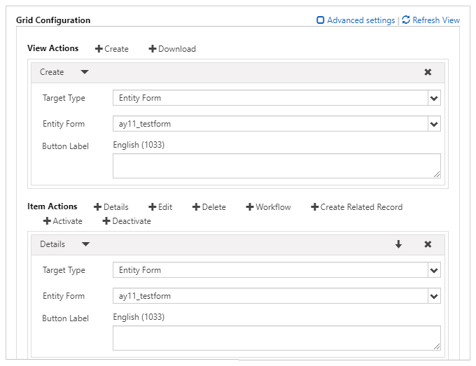  

**Attributes**

|Name                   |Description|
|---------------------------|-----------|
|**Basic Settings**         |   |
| View Actions              |Use to add action buttons for actions that are applicable for the table set and will appear above the grid. The available actions are: <ul><li>Create</li> <li>Download</li></ul> Selecting one of these options displays a configuration area for that action.|
| Items Actions             |Use to add action buttons for actions that are applicable for an individual record and will appear for each row in the grid, provided the appropriate privilege has been granted by Table Permissions. The actions generally available are:<ul><li>Details</li><li>Edit</li><li>Delete</li><li>Workflow</li><li>Activate</li><li>Deactivate</li></ul> Selecting one of these options displays a configuration area for that action. See below for details about each action. Furthermore, certain tables have special actions that are available to them on a per-table basis:<ul><li>Calculate Value of Opportunity (opportunity)</li><li>Cancel Case action (incident)</li><li>Close (resolve) Case action (incident)</li><li>Convert Quote to Order (quote)</li><li>Convert Order to Invoice (salesorder)</li><li>Generate Quote from Opportunity (opportunity)</li><li>Lose Opportunity action (opportunity)</li><li>Win Opportunity action (opportunity)</li><li>Reopen Case action (incident)</li><li>Set Opportunity on Hold (opportunity)</li></ul>|
| Override Column Attributes|Use to override display settings for individual columns in the grid.<ul><li>Attribute: Logical name of the column you want to override</li><li>Display Name: New column title to override the default</li><li>Width: Width (in either percent or pixels) of the column to override the default. See also Grid Column Width Style</li></ul> To override settings on a column, select **+ Column** and fill in the details.|
|**Advanced Settings**      |  |
| Loading Message           |Overrides the default HTML message that appears while the grid is loading.|
| Error Message             |Overrides the default HTML message that appears when an error occurs while loading the grid.|
| Access Denied Message     |Overrides the default HTML message that appears when a user does not have sufficient Table Permissions to view the list.|
| Empty Message             |Overrides the HTML message that appears when the grid contains no data.|
| Details Form Dialog       |Controls the settings for the dialog box that appears when a user activates the Details action.|
| Edit Form Dialog          |Controls the settings for the dialog box that appears when a user activates the Edit action.|
| Create Form Dialog        |Controls the settings for the dialog box that appears when a user activates the Create action.|
| Delete Dialog             |Controls the settings for the dialog box that appears when a user activates the Delete action.|
| Error Dialog              |Controls the settings for the dialog box that appears when an error occurs during any action.|
| CSS Class                 |Specify a CSS class or classes that will be applied to the HTML element that contains the entire grid area, including the grid and action buttons.|
| Grid CSS Class            |Specify a CSS class or classes that will be applied to the list's HTML \<table\> element.|
| Grid Column Width Style   |Configures whether the **Width** values in the Override Column Attributes are specified in **Pixels** or **Percent**.|

**General action settings**

In general, Table actions have settings that can be configured. In all cases, this is to give you more options in terms of customization, and the fields are not required. Simply adding the action will allow the action to be taken on the portal, provided the appropriate privilege has been granted by Table Permissions.

Generally, you can configure the corresponding dialog box for each action, which will appear only if you select **Confirmation Required**.


| Name                   | Description                                                                                                                                                                                                                   |
|------------------------|-------------------------------------------------------------------------------------------------------------------------------------------------------------------------------------------------------------------------------|
| **Basic Settings**         |                                                                                                                                                                                                                               |
| Confirmation Required? | Determines whether a confirmation will prompt the user to confirm when the action is selected.                                                                                                                                 |
| **Advanced Settings**      |                                                                                                                                                                                                                               |
| Confirmation           | Overrides the confirmation HTML message displayed when the user activates the action.                                                                                                                                         |
| Button Label           | Overrides the HTML label for this action displayed in the list row.                                                                                                                                                    |
| Button Tooltip         | Overrides the tooltip text that appears when the user points to the button for this action displayed in the list row.                                                                                           |
| Button CSS Class       | Adds a CSS class to the button.                                                                                                                                                      |
| Redirect to Webpage    | Some actions (not all) allow a redirect upon completion of the action. Highly recommended for the Delete action, optional in most other cases, you can choose a webpage to redirect to when the action is completed. |
| Redirect URL           | An alternative to the **Redirect to Webpage** option&mdash;allows redirecting to a specific URL.                                                                                                                                   |

**General dialog box advanced settings**

|**Name**                 |**Description**                                                                                                                         |
|--------------------------|-----------------------------------------------------------------------------------------------------------------------------------------|
| Title                    | Overrides the HTML that appears in the title bar of the dialog box.|                                                                         
| Primary Button Text      | Overrides the HTML that appears in the Primary (Delete) button on the dialog box.                                                         |
| Close Button Text        | Overrides the HTML that appears in the Close (Cancel) button on the dialog box.                                                           |
| Dismiss Button Sr Text   | Overrides the screen reader text associated with the dialog box's Dismiss button.                                                           |
| Size                     | Specifies the size of the Delete dialog box. The Options are Default, Large, and Small. The default size is Default. |
| CSS Class                | Specify a CSS class or classes that will be applied to the resulting dialog box.                                                            |
| Tile CSS Class           | Specify a CSS class or classes that will be applied to the resulting dialog box's title bar.                                                |
| Primary Button CSS Class | Specify a CSS class or classes that will be applied to the dialog box's Primary (Delete) button.                                          |
| Close Button CSS Class   | Specify a CSS class or classes that will be applied to the dialog box's Close (Cancel) button.                                            |

**Create action settings**

Enabling a **Create Action** renders a button above the list that, when selected, opens a dialog box with a basic form that the user can use to create a new record, provided the Create privilege has been granted by Table Permissions.

| Name               | Description                          |
|--------------------|--------------------------------------|
| **Basic Settings**     |                                                                                                                                                                       |
| Basic Form     | Specifies the basic form that will be used to create the new record. The drop-down list will include all basic forms that are configured for the table type of the list. <br>**Note**: If the table type of the list has no basic forms, the drop-down list will appear empty. If no basic form is supplied for the Create action, it will be ignored and the button will not be rendered on the list. |
| **Advanced Settings**          |                                                                                                                                                                       |
| Button Label                                                                                                                                                                                                                 | Overrides the HTML label displayed in the Create action button above the list.                                                                                        |
| Button Tooltip                                                                                                                                                                                                               | Overrides the tooltip text that appears when the user points to the Create action button.                                                                         |

**Create Form dialog box advanced settings**

|**Name**               |**Description**                                                                                                                                 |
|------------------------|-------------------------------------------------------------------------------------------------------------------------------------------------|
| Loading Message        | Overrides the message that appears while the dialog box is loading.                                                                                  |
| Title                  | Overrides the HTML that appears in the title bar of the dialog box.                                                                                  |
| Dismiss Button Sr Text | Overrides the screen reader text associated with the dialog box's Dismiss button.                                                                   |
| Size                   | Specifies the size of the Create Form dialog box. The Options are Default, Large, and Small. The default size is Large. |
| CSS Class              | Specify a CSS class or classes that will be applied to the resulting dialog box.                                                                    |
| Title CSS Class        | Specify a CSS class or classes that will be applied to the resulting dialog box's title bar.                                                        |

**Download action settings**

Enabling a **Download Action** renders a button above the list that, when selected, downloads the data from the list to an [!INCLUDE[pn-excel-short](../../../includes/pn-excel-short.md)] (.xlsx) file.

| Name              | Description                                                                                        |
|-------------------|----------------------------------------------------------------------------------------------------|
| **Basic Settings**    |                                                                                                    |
| None              |                                                                                                    |
| **Advanced Settings** |                                                                                                    |
| Button Label      | Overrides the HTML label displayed in the Download action button above the list.            |
| Button Tooltip    | Overrides the tooltip text that appears when the user points to the Download action button. |

**Details action settings**

Enabling a **Details Action** allows a user to view a read-only basic form of a selected row in the list.


|                 Name                  |                                                                                                                                                                                                                      Description                                                                                                                                                                                                                      |
|---------------------------------------|-------------------------------------------------------------------------------------------------------------------------------------------------------------------------------------------------------------------------------------------------------------------------------------------------------------------------------------------------------------------------------------------------------------------------------------------------------|
|          **Basic Settings**           |                                                                                                                                                                                                                                                                                                                                                                                                                                                       |
|              Basic Form              | Specifies the basic form that will be used to view the details of the selected table. The drop-down list will include all basic forms that are configured for the table type of the list. <br> **Note**: If the table type of the list has no basic forms, the drop-down list will appear empty. If no basic form is supplied for the Details action, it will be ignored and the button will not be rendered in the list. |
|         **Advanced Settings**         |                                                                                                                                                                                                                                                                                                                                                                                                                                                       |
| Record ID Parameter Name |                                                                    Specifies the name of the Query String parameter that will be used to select the table to view in the selected basic form. This should match the value in that basic form's Record ID Parameter Name. The default value for this field, both here and in basic form configuration, is **id**.                                                                     |
|             Button Label              |                                                                                                                                                                                      Overrides the HTML label for this action displayed in the list row.                                                                                                                                                                                       |
|            Button tooltip             |                                                                                                                                                             Overrides the tooltip text that appears when the user points to the button for this action displayed in the list row.                                                                                                                                                              |

**Details dialog box advanced settings**

|**Name**               |**Description**                                                                                                                         |
|------------------------|-----------------------------------------------------------------------------------------------------------------------------------------|
| Loading Message        | Overrides the HTML that appears when the dialog box is loading.                                                                             |
| Title                  | Overrides the HTML that appears in the title bar of the dialog box.                                                                         |
| Dismiss Button Sr Text | Overrides the screen reader text associated with the dialog box's Dismiss button.                                                           |
| Size                   | Specifies the size of the Details dialog box. The Options are Default, Large, and Small. The default size is Large. |
| CSS Class              | Specify a CSS class or classes that will be applied to the resulting dialog box.                                                            |
| Title CSS Class        | Specify a CSS class or classes that will be applied to the resulting dialog box's title bar.                                                |

**Edit action settings**

Enabling an **Edit Action** allows a user to view an editable basic form that is data-bound to the record of the selected row from the list, provided the Write privilege has been granted by Table Permissions.


|                 Name                  |                                                                                                                                                                                                             Description                                                                                                                                                                                                             |
|---------------------------------------|-------------------------------------------------------------------------------------------------------------------------------------------------------------------------------------------------------------------------------------------------------------------------------------------------------------------------------------------------------------------------------------------------------------------------------------|
|          **Basic Settings**           |                                                                                                                                                                                                                                                                                                                                                                                                                                     |
|              Basic Form              | Specifies the basic form that will be used to edit the selected table. The drop-down list will include all basic forms that are configured for the table type of the list. <br> **Note**: If the table type of the list has no basic forms, the drop-down list will appear empty. If no basic form is supplied for the Edit action, it will be ignored and the button will not be rendered in the list. |
|         **Advanced Settings**         |                                                                                                                                                                                                                                                                                                                                                                                                                                     |
| Record ID Parameter Name |                                                           Specifies the name of the Query String parameter that will be used to select the table to edit in the selected basic form. This should match the value in that basic form's Record ID Parameter Name. The default value for this field, both here and in basic form configuration, is **id**.                                                            |
|             Button Label              |                                                                                                                                                                             Overrides the HTML label for this action displayed in the list row.                                                                                                                                                                              |
|            Button Tooltip             |                                                                                                                                                    Overrides the tooltip text that appears when the user points to the button for this action displayed in the list row.                                                                                                                                                     |

**Edit form dialog box advanced settings**

|**Name**               |**Description**                                                                                                                   |
|------------------------|-----------------------------------------------------------------------------------------------------------------------------------|
| Loading Message        | Overrides the HTML that appears when the dialog box is loading.                                                                       |
| Title                  | Overrides the HTML that appears in the title bar of the dialog box.                                                                   |
| Dismiss Button Sr Text | Overrides the screen reader text associated with the dialog box's Dismiss button.                                                     |
| Size                   | Specifies the size of the Edit dialog box. The Options are Default, Large, and Small. The default size is Large. |
| CSS Class              | Specify a CSS class or classes that will be applied to the resulting dialog box.                                                      |
| Title CSS Class        | Specify a CSS class or classes that will be applied to the resulting dialog box's title bar.                                          |

**Delete action settings**

Enabling a **Delete Action** allows a user to permanently delete the record of the selected row from the list, provided the Delete privilege has been granted by Table Permissions.

| Name              | Description                                                                                                                         |
|-------------------|-------------------------------------------------------------------------------------------------------------------------------------|
| **Basic Settings**    |                                                                                                                                     |
| none              |                                                                                                                                     |
| **Advanced Settings** |                                                                                                                                     |
| Confirmation      | Overrides the confirmation HTML message displayed when the user activates the Delete action.                                        |
| Button Label      | Overrides the HTML label for this action displayed in the list row.                                                          |
| Button Tooltip    | Overrides the tooltip text that appears when the user points to the button for this action displayed in the list row. |

**Delete dialog box (advanced) settings**

|**Name**                 |**Description**                                                                                                                         |
|--------------------------|-----------------------------------------------------------------------------------------------------------------------------------------|
| Title                    | Overrides the HTML that appears in the title bar of the dialog box.                                                                         |
| Primary Button Text      | Overrides the HTML that appears in the Primary (Delete) button on the dialog box.                                                         |
| Close Button Text        | Overrides the HTML that appears in the Close (Cancel) button on the dialog box.                                                           |
| Dismiss Button Sr Text   | Overrides the screen reader text associated with the dialog box's Dismiss button.                                                           |
| Size                     | Specifies the size of the Delete dialog box. The Options are Default, Large, and Small. The default size is Default. |
| CSS Class                | Specify a CSS class or classes that will be applied to the resulting dialog box.                                                            |
| Title CSS Class          | Specify a CSS class or classes that will be applied to the resulting dialog box's title bar.                                                |
| Primary Button CSS Class | Specify a CSS class or classes that will be applied to the dialog box's Primary (Delete) button.                                          |
| Close Button CSS Class   | Specify a CSS class or classes that will be applied to the dialog box's Close (Cancel) button.                                            |

**Workflow action settings**

Enabling a **Workflow action** allows a user to run an on-demand workflow against the record of the selected row from the list. You may add any number of Workflow actions to the list.


|         Name          |                                                                                                                                                           Description                                                                                                                                                           |
|-----------------------|---------------------------------------------------------------------------------------------------------------------------------------------------------------------------------------------------------------------------------------------------------------------------------------------------------------------------------|
|  **Basic Settings**   |                                                                                                                                                                                                                                                                                                                                 |
|       Workflow        | Specifies the on-demand workflow that will run when the user activates this action. <br> **Note**: If the table type of the list has no workflows, the drop-down list will appear empty. If no workflow is supplied for the Workflow action, it will be ignored and the button will not be rendered in the list. |
|     Button Label      |                                                                                                                 Sets the HTML label for this action displayed in the list row. This setting is required.                                                                                                                 |
| **Advanced Settings** |                                                                                                                                                                                                                                                                                                                                 |
|    Button Tooltip     |                                                                                                  Overrides the tooltip text that appears when the user points to the button for this action displayed in the list row.                                                                                                   |

## Securing lists

>[!NOTE]
> This method of securing lists would be deprecated soon. Therefore, it shouldn't be used. Use proper [table permissions](entity-permissions-studio.md), and web role setup to provide access to users for any data instead. More information: [Table permissions changes for forms and lists on new portals](../important-changes-deprecations.md#table-permissions-changes-for-forms-and-lists-on-new-portals)


To secure a list, you must configure Table Permissions for the table for which records are being displayed and also set the **Enable Table Permissions** Boolean value on the list record to true.

The act of securing a list will ensure that for any user who accesses the page, only records that they have been given permission to are shown. This is achieved by an additional filter being added to the model-driven app views that are being surfaced via the list. This filter will filter only for records that are accessible to the user, via **Read** permission.

In addition, any actions that are defined for the list will respect the corresponding permissions for that action on a per-record basis. That is, if you have Edit permission for a record, the Edit action will be enabled for that record. The same applies for Delete, Create, and so on. Note that if no records are available, a message indicating this will be shown when the list is loaded.

However, good website design requires that if a user is not in a role that has any permissions for the table (that is, there will never be a situation where they should see any records), they should not have access to the page at all. Ideally, the page should be protected by using Webpage Access Permissions.

If you have secured a list by selecting **Enable Table Permissions**, and want to display the records level actions that are applicable to the signed in user, you must set the value of **EntityList/ShowRecordLevelActions** site setting to **true**. For example, there are two users: Preston and Teddy. Preston has contact level all access on the Case table, whereas Teddy has global read access. If a list is created to show all the case records, Preston would see all actions (View, Edit, and Delete) on the records that are related his contact. On other records, he would only see the **View** action. On the other hand, Teddy would only see the **View** action on all records.

If the **EntityList/ShowRecordLevelActions** site setting is set to **false** and the table has multiple permissions, all the record level actions are visible. But, when a user tries to perform an action that he is not authorized to, an error is displayed.

## Adding a view details page

By setting the Web Page for Details View lookup to a webpage, the details of a record listed in the grid can be viewed as read-only or edited, depending on the configuration of the associated form or page.

This page can be a completely customized page template, perhaps created by using Liquid. The most common scenario is probably to have the details page be a webpage that either contains a basic form or Advanced form.

The important thing to be aware of is that each record listed in the grid will have a hyperlink to the details page, and the link will contain a named Query String parameter with the ID of the record. The name of the Query String parameter depends on the ID Query String Parameter Name specified on the list. The final thing to note is that the targeted details webpage must also be aware of the name of this Query String parameter to get the ID of the record that it needs to query and load its data.

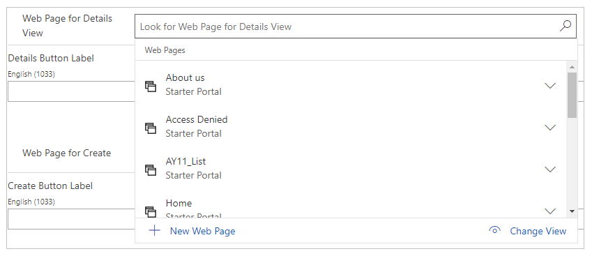  

**Using a basic form to display details**

To create a basic form please refer the instructions found on the [basic form](entity-forms.md) page.

The following are the important settings to be aware of for ensuring that the record from the list is loaded in the basic form.

The Record ID Parameter Name on Basic Form must match the ID Query String Parameter Name on List.

The Mode can be either Edit or ReadOnly, depending on your needs.

**Using advanced form to display details**

The following are the important settings to be aware of for ensuring that the record from the list is loaded in the Advanced form.

The Primary Key Query String Parameter Name on Advanced Form Step must match the ID Query String Parameter Name on List.

The Mode can be either Edit or ReadOnly, depending on your needs.

**Using a details page for the Create function**

You can use a custom page, basic form, or Advanced form in the same fashion for the Create function. This is an alternative to defining a Create action on the form. You cannot define both a Create action *and* a custom page for Create: defining a custom action takes precedence.

If you assign a webpage to the Create Lookup on the list and do not specify a Create action by using Configuration, a Create button will be rendered on the list; this button will link the user to the custom page you have designated for Create.

## List filter configuration

Adding the ability to filter records on a list is easy: simply enable the filtering option and then choose one or more filter types to display to users. It is possible to filter by an attribute that matches text provided by the user, or to select from a series of options. You can even design virtually any type of filter you can imagine by using Advanced Find.

**Enable the list filter**

In the **Metadata Filter** section, select the **Enabled** check box. This will add the Filter area to the list when it is displayed. Until you have defined at least one filter type, the box will appear empty.

You can define how the Filter area on the list will be rendered by using the Orientation setting. The default, Horizontal, renders the Filter area above the list. Vertical orientation renders the Filter area as a box to the left of the list.

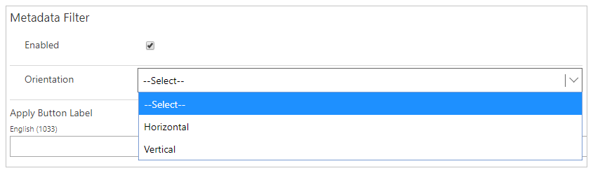  

**Filter types**

|**Filter Type**      |**Description**                                                                                                                                                                                                                               |
|----------------------|-----------------------------------------------------------------------------------------------------------------------------------------------------------------------------------------------------------------------------------------------|
| Text Filter          | Filter the list by using a text box to search for matching text in a selected attribute of the given table.                                                                                                                               |
| Attribute Filter Set | Filter the list by using a series of check boxes, each of which tries to match its condition against a particular attribute of the given table.                                                                                           |
| Lookup Set           | Filter the list by using a series of check boxes, each of which represents a relationship between a record for the given table and a record for a related table.                                                                         |
| Range Filter Set     | Similar to the Attribute Filter Set, except that each check box can represent two conditions rather than one (for example, greater than or equal to 0 AND less than 100).                                                                    |
| Dynamic Picklist Set | Similar to choosing a picklist value on an Attribute Filter Set. The Dynamic Picklist Set does not require that you specify the picklist options to filter by; instead, it generates the full list of options when the list is loaded. |
| Dynamic Lookup Set   | Similar to the Lookup Set. The Dynamic Lookup Set does not require that you specify the lookup options to filter by; instead, it generates the full list of options when the list is loaded.                                           |
| FetchXML Filter      | Filter the list by using a FetchXML filter condition.                                                                                                                                                                                     |

**Text filter**

The Text filter adds a text box to the list Filter area that is tied to an attribute of the table type of the list. When a user applies the filter, the list only displays those records whose selected attribute contains the value.

To add a Text filter, select **+Text Filter**.

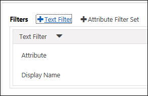  

The Text filter uses the following attributes:

|**Name**     |**Description**                                                                                                                                        |
|--------------|--------------------------------------------------------------------------------------------------------------------------------------------------------|
| Attribute    | The name of the attribute on the list's selected table type to filter by. *Only attributes with the type String are valid for a Text filter.*                                                                                   |
| Display Name | Override the label for the filter when the list is displayed. By default, this will be automatically set to the name of the selected attribute. |

**Attribute Filter Set**

The Attribute Filter Set adds a series of options to filter the list by, tied to a single attribute of the list's selected table type. When a user applies the filter, the list only displays those records that exactly match at least one of the selected options.

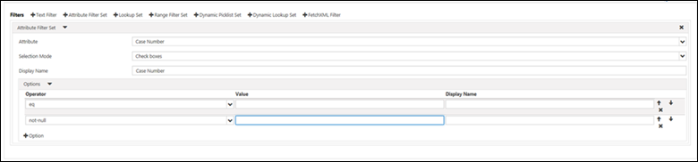

The Attribute Filter Set uses the following attributes:

|**Name**     |**Description**                                                                                                                                        |
|--------------|--------------------------------------------------------------------------------------------------------------------------------------------------------|
| Attribute    | The name of the attribute on the list's selected table type to filter by. Only attributes with the following types are valid for a Text filter: String, BigInt, Decimal, Double, Integer, Money, Picklist, DateTime, and Boolean.
|Display Name | Override the label for the filter when the list is displayed. By default, this will be automatically set to the name of the selected attribute.
| Options |      A collection of possible values to filter by. See below for more details.                                                                              |

**Attribute Filter Set options**

An Attribute Filter Set can usually have any number of options, with the exceptions of picklist and Boolean attributes. A Boolean Attribute Filter Set can have only one or two options&mdash;one true option and one false option. A Picklist Attribute Filter Set can have at most one option for each possible value in the picklist.

Options have the following attributes:

|**Name**     |**Description**                                                                                                                                                                                  |
|--------------|--------------------------------------------------------------------------------------------------------------------------------------------------------------------------------------------------|
| Operator     | The comparison operator used to filter results, for example Equals, Less Than, and so on. The list of operators for the option will depend on the type of the attribute selected for the filter. For example, numeric (Decimal) types will have operators such as Less Than or Greater Than, whereas String attributes will use operators such as Begins With or Contains. Picklist and Boolean operators are always Equals.                                                                                                                                               |
| Value        | The actual value used for this filter condition.                                                                                                                                                 |
| Display Name | Overrides the display name for this option in the Filter box. By default, this will be set to the same value as the Value attribute.                                                             |

**Lookup Set**

The Lookup Set adds a series of options to filter the list by, tied to a related table to the list's selected table type. When a user applies the filter, the list only displays those records that exactly match at least one of the selected related records.

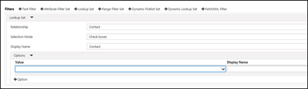  

The Lookup Set uses the following attributes:

|**Name**     |**Description**                                                                                                                                           |
|--------------|-----------------------------------------------------------------------------------------------------------------------------------------------------------|
| Relationship | The name of the related table to the list's selected table type to filter by. Only tables with a one-to-many or many-to-many relationship with the list's selected table type appear as options for this filter type.          |
| Display Name | Override the label for the filter when the list is displayed. By default, this will be automatically set to the name of the selected relationship. |
| Options      | A collection of possible values to filter by. See below for more details.                                                                                 |

**Lookup Set options**

A Lookup Set can typically have any number of options, with the only limit being the number of related records of the selected related type.

Options have the following attributes:

|**Name**     |**Description**                                                                                                                      |
|--------------|--------------------------------------------------------------------------------------------------------------------------------------|
| Value        | The record of the selected related type to filter by.                                                                                |
| Display Name | Overrides the display name for this option in the Filter box. By default, this will be set to the same value as the Value attribute. |

**Range Filter Set**

The Range Filter Set adds a series of options, each with one or two conditions, to the Filter area. When a user applies the filter, the list only displays those records that exactly match all conditions on at least one of the selected options.

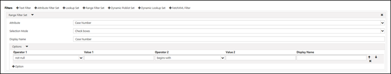  

The Range Filter Set uses the following attributes:

|**Name**     |**Description**                                                                                                                                        |
|--------------|--------------------------------------------------------------------------------------------------------------------------------------------------------|
| Attribute    | The name of the attribute on the list's selected table type to filter by. Only attributes with the following types are valid for a Text filter: String, BigInt, Decimal, Double, Integer, Money, DateTime.                       |
| Display Name | Override the label for the filter when the list is displayed. By default, this will be automatically set to the name of the selected attribute. |
| Options      | A collection of possible values to filter by. See below for more details.                                                                              |

**Range Filter Set options**

A Range Filter Set can have any number of options. Each option will produce a filter condition with either one or two subconditions, both of which must be met for the condition to be true.

Options have the following attributes:

|**Name**              |**Description**                                                                                                                                                                                |
|---------------------------|------------------------------------------------------------------------------------------------------------------------------------------------------------------------------------------------|
| Operator 1            | The first comparison operator used to filter results, for example Equals and Less Than. The list of operators for the option will depend on the type of the attribute selected for the filter. For example, numeric (Decimal) types will have operators such as Less Than or Greater Than, whereas String attributes will use operators such as Begins With or Contains. Picklist and Boolean operators are always Equals.                                                                                                                                             |
| Value 1               | The first value used for this filter condition.                                                                                                                                                |
| Operator 2 (optional) | The second comparison operator used to filter results, for example Equals and Less Than. The list of operators for the option will depend on the type of the attribute selected for the filter. For example, numeric (Decimal) types will have operators such as Less Than or Greater Than, whereas String attributes will use operators such as Begins With or Contains. Picklist and Boolean operators are always Equals.                                                                                                                                             |
| Value 2 (optional)    | The second value used for this filter condition.                                                                                                                                               |
| Display Name          | Overrides the display name for this option in the Filter box. By default this will be set dynamically, based on the operators and values selected.                                         |

**Dynamic Picklist Set**

The Dynamic Picklist Set adds a series of options to filter by that represent all the values of a specified Picklist field. This is different from selecting a Picklist in the Attribute Filter Set. In the Attribute Filter Set, you must specify a set of options that will be made available to the user to filter by; in the Dynamic Picklist Set, you need only specify the Picklist field and the entire set of options will be provided automatically. If you need greater control, we recommend that you use the Attribute Filter Set.

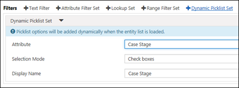  

The Dynamic Picklist Set uses the following options:

|**Name**     |**Description**                                                                                                                                        |
|--------------|--------------------------------------------------------------------------------------------------------------------------------------------------------|
| Attribute    | The name of the Picklist attribute on the list's selected table type to filter by.                                                             |
| Display Name | Override the label for the filter when the list is displayed. By default, this will be automatically set to the name of the selected attribute. |

**Dynamic Lookup Set**

The Dynamic Lookup Set adds a dynamic series of options to filter the list by, tied to a related table to the list's selected table type. When a user applies the filter, the list only displays those records that exactly match at least one of the selected related records.

This is different from a Lookup Set. In the Lookup Set, you must manually specify the related tables to filter by. In the Dynamic Lookup Set, you need only specify the relationship on which to filter, and a list of options will be generated based on the specified view of related tables.

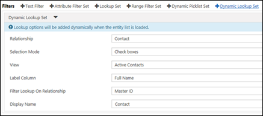  

The Dynamic Lookup Set uses the following options:

|**Name**                      |**Description**                                                                                                                                                                      |
|-------------------------------|--------------------------------------------------------------------------------------------------------------------------------------------------------------------------------------|
| Relationship                  | The name of the related table to the list's selected table type to filter by. Only tables with a one-to-many or many-to-many relationship with the list's selected table type appear as options for this filter type.                                     |
| View                          | The view (Saved Query) to use as a source for the dynamic list of tables to filter by.                                                                                              |
| Label Column                  | The field from the view that provides each table's Name value.                                                                                                                    |
| Filter Lookup On Relationship | Specifies a relationship between the table specified by the Relationship field and the signed-in user. If the table specified by the Relationship field also has a relationship to a contact, you can narrow the list of filter options to those related to the signed-in user.  |
| Display Name                  | Override the label for the filter when the list is displayed. By default, this will be automatically set to the name of the selected relationship.                            |

**FetchXML filter**

The range filter can create either a simple text box filter like the Text filter or a set of options like the other filter types. It allows you to manually create virtually any type of filter for the list by using FetchXML.

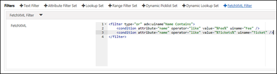

The FetchXML filter uses only one attribute:

|**Name** |**Description**                            |
|----------|--------------------------------------------|
| FetchXML | The XML statement representing the filter. |

## List Map view

With lists, it is possible to enable and configure a Map view of the data, powered by [!INCLUDE[pn-bing](../../../includes/pn-bing.md)] maps with search functionality to find locations near an address. By populating your records with latitude and longitude coordinate values and specifying the necessary configuration options listed in this section, your records can be rendered as pushpins on a map. Any record that does not have a latitude or longitude value will be excluded from the search. The initial load of the page will display all records within the initial value of the Distance Values field (in miles or km, depending on the Distance Units specified) from the Default Center Latitude and Default Center Longitude coordinates. The view specified is ignored when Map view is used, and a distance query is applied to the dataset to return the mappable results.

> [!NOTE] 
> - This option is not supported in the German Sovereign Cloud environment. The Map view section will not be visible in this environment.
> - Only Bing maps are supported as the **Map type**.

## List Calendar view

Use the List Calendar view to render a list as a calendar, with each individual record configured to act as a single event.

To display records by using a calendar, those records need to include at a minimum a date field. For events to have exact start and end times, the appropriate fields need to be in place, and so on. Assuming these fields are configured, a List Calendar view will appear on the portal.

## List OData feeds

If enabled, a table can be published to an OData feed. The OData protocol is an application-level protocol for interacting with data via RESTful web services. Data from this feed can be viewed in a web browser, consumed by a client-side web application, or imported into [!INCLUDE[pn-excel-short](../../../includes/pn-excel-short.md)].

> [!CAUTION]
> Use caution when enabling OData feeds without table permissions for sensitive information. OData feed is accessible anonymously and without authorization checks if **Enable Table Permissions** is disabled.

## Enhanced view filter for lists

You can use Table Permissions if you want to secure records, but if you want to simply provide a filter as part of the set of filter options that is relevant to the current portal user, you can use the List feature. This feature supports filtering of the current user, user's parent account, or website at any depth. Simply build the view filter to match any single contact record and the code will replace its value with the actual value at runtime&mdash;no need to assign values to fields in the Filter Conditions section.

- The control will find all condition elements where uitype="contact" and set the value to the actual value of the current portal user's contact ID.
- The control will find all condition elements where uitype="account" and set the value to the actual value of the current portal user's parent account ID.
- The control will find all condition elements where uitype="adx_website" and set the value to the actual value of the current website ID.

### Example View Filter Criteria

The following image shows an arbitrary contact assigned to a filter condition, this contact happens to be a stub 'dummy' contact but this could be any contact record. The ID of this record will be replaced by the actual value of the ID of the user viewing the page. If the user is not logged in then no records will be returned. This provides greater flexibility in filtering the data based on the user and website contextually.

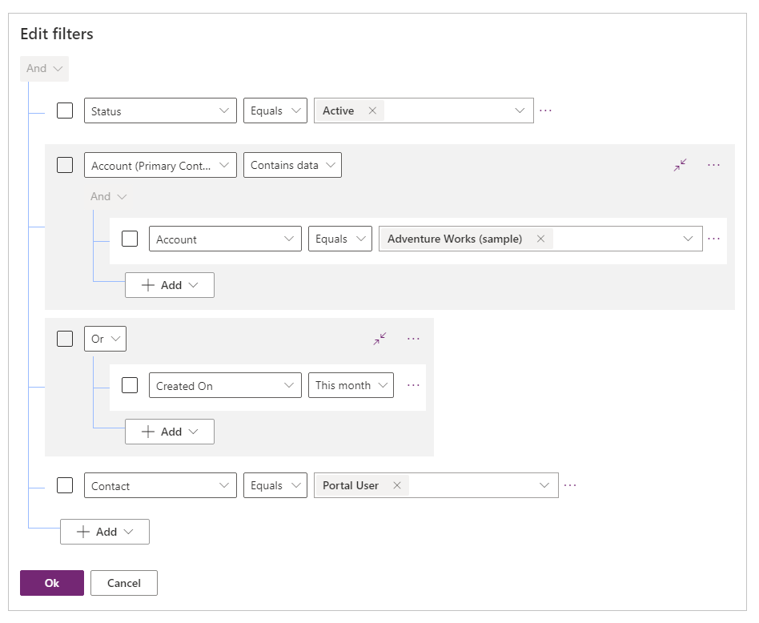

> [!NOTE]
> If you are filtering by current portal user's contact or parent account then it is recommended that you associate a [Web Page Access Control Rule](webpage-access-control.md) to the Web Page to force the user to sign in. You would create a [Web Role](create-web-roles.md) with "Authenticated Users Role" checked. Create a Web Page Access Control Rule with "Restrict Read" right and associate the Web Role. This will force users to be signed in to view the page and therefore allow the data to be filled accordingly.

### See also

- [Microsoft Learn: Display multiple Dataverse records using lists](/learn/modules/portals-access-data-platform/2-entity-lists)
- [Configure a portal](configure-portal.md)  
- [Redirect to a new URL on a portal](add-redirect-url.md)


[!INCLUDE[footer-include](../../../includes/footer-banner.md)]