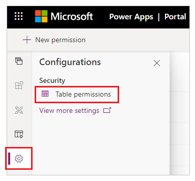
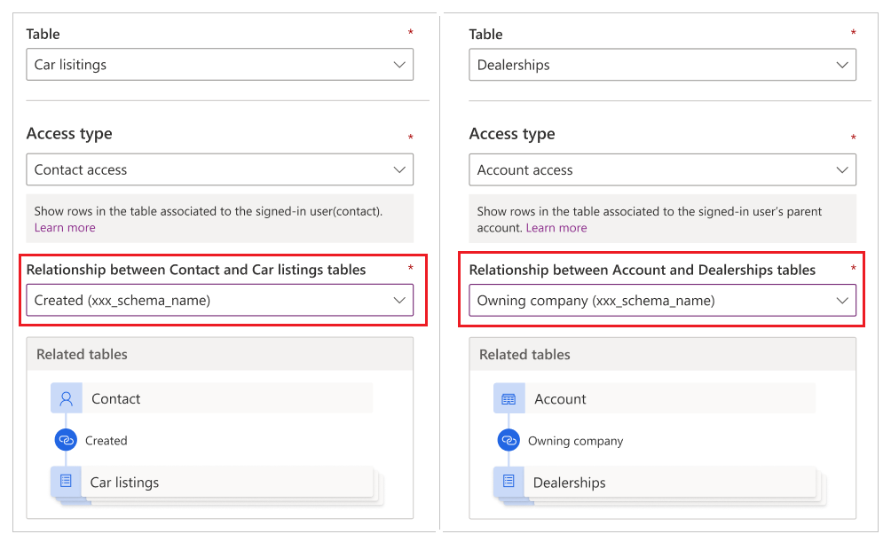
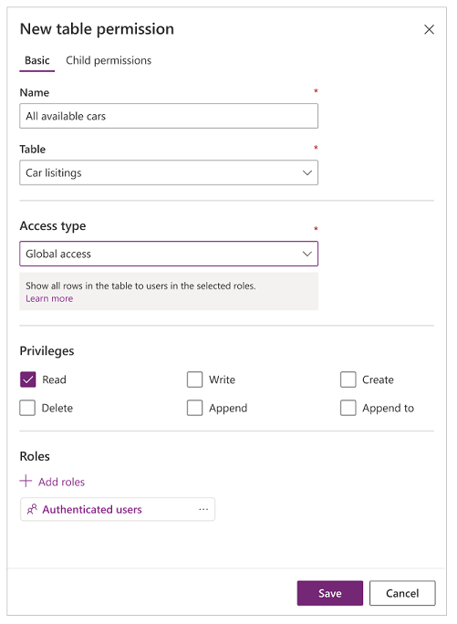
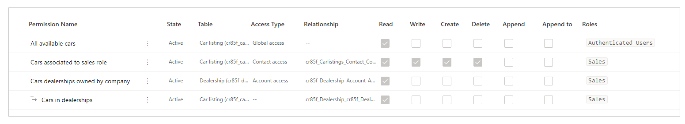
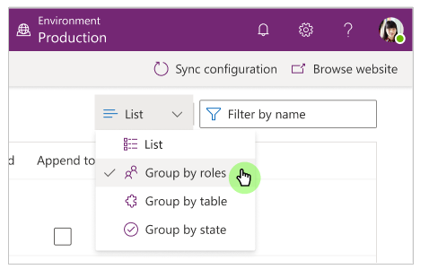
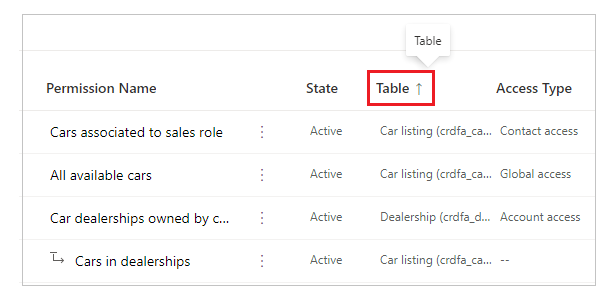
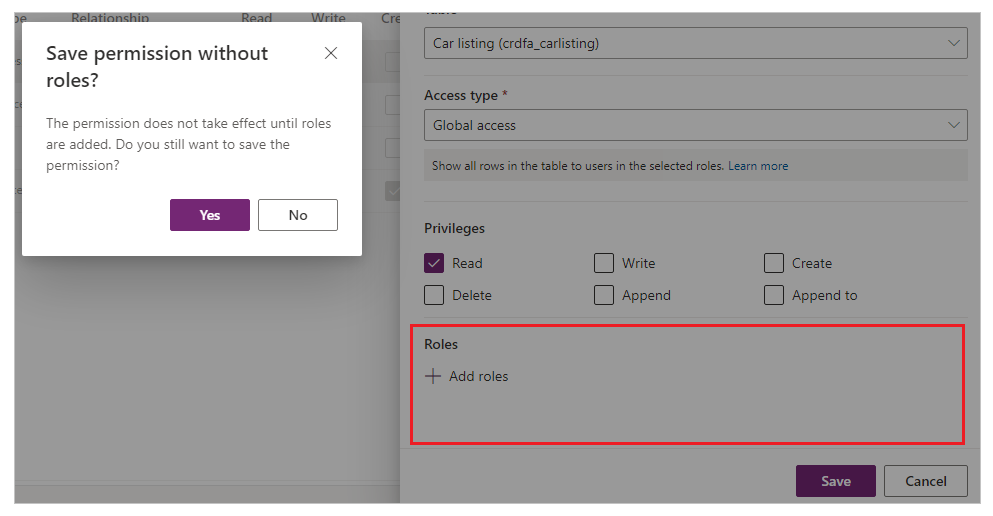

# Table permissions using portals Studio

In the previous article, you learned how to configure security in portals by setting up table permissions from the Portal Management app. In this article, you'll learn how to configure table permissions using Power Apps portals Studio.

## Available access types in Studio

Portals Studio shows four different **Access types**. Depending on the access type you choose, the selected table permission and privileges apply to the users from the selected roles for the following records.

1. **Global access** - Applies the selected table permission and privileges to the users from the selected roles for *all records*.
1. **Contact access** - Applies the selected table permission and privileges to the users from the selected role *associated to the signed-in user*.
1. **Account access** - Applies the selected table permission and privileges to the users from the selected role *associated to the signed-in user's account*.
1. **Self access** - Applies the selected table permission and privileges to the users from the selected role *for only their own Contact record*.

> [!NOTE]
> **Parent access type** is only available in the Portal Management app. Instead of creating a table permission with the access type of **Parent**, directly add child permission to existing table permissions when using portals Studio.

## Configure table permissions using portals Studio

In this section, you'll learn how to create, view, edit, and deactivate/activate or delete table permissions using portals Studio.

### Create table permissions using portals Studio

To create a table permission using portals Studio:

1. Sign in to [Power Apps](https://make.powerapps.com).

1. Select **Apps** on the left pane.

1. Select your portal.

1. Select **Edit** to open portals Studio.

1. Select **Settings** (:::image type="icon" source="media/entity-permissions-studio/settings.png":::) on the left pane inside portals Studio.

1. Select **Table permissions**.

    

1. Select **New permission**.

1. Enter table permission name.

1. Select a table.

1. Select an access type. More information: [Available access types in Studio](#available-access-types-in-studio)

1. If you select the **Contact** or **Account** access type, select the relationship between the Contact/Account and the table you selected for the permission.

    

    > [!NOTE]
    > If you don't have any relationships available for the selected table, you can select **New relationship** to create a new relationship.

1. Select the privileges that you want to grant.

1. Select **Add roles** to add the roles that this table permission will apply to.

    > [!TIP]
    > If you have not created a web role yet, select **Manage roles** from the roles flyout to open the Portal Management app and create roles.

1. Select **Save**.

    

### View table permissions in portals Studio

To view table permissions using portals Studio:

1. Sign in to [Power Apps](https://make.powerapps.com).

1. Select **Apps** on the left pane.

1. Select your portal.

1. Select **Edit** to open portals Studio.

1. Select **Settings** (:::image type="icon" source="media/entity-permissions-studio/settings.png":::) on the left pane inside portals Studio.

1. Select **Table permissions** to view table permissions.

    

1. To group or filter table permissions, select a view (List/Group by roles/Group by table/Group by state), or enter a table permission name in the filter text box.

    

    > [!NOTE]
    > - When you group table permissions by role, table, or state, the permissions are listed as a flat structure without the parent-child relationships for configured permissions.
    > - You can only filter for parent table permissions, not child permissions.

1. To sort the table permissions, select a column at the top in the list of table permissions.

    

### Edit table permissions using portals Studio

To edit a table permission using portals Studio:

1. Sign in to [Power Apps](https://make.powerapps.com).

1. Select **Apps** on the left pane.

1. Select your portal.

1. Select **Edit** to open portals Studio.

1. Select **Settings** (:::image type="icon" source="media/entity-permissions-studio/settings.png":::) on the left pane inside portals Studio.

1. Select **Table permissions**.

1. Select the table permission that you want to edit.

1. Select **Edit** from the menu at the top. Alternatively, you can also select :::image type="icon" source="media/entity-permissions-studio/more-commands.png"::: (More Commands), and then choose **Edit**.

1. Change table permission details, such as the name, table, access type, privileges, and applicable roles. More information: [Create table permissions using portals Studio](#create-table-permissions-using-portals-studio)

1. Select **Save**.

### Deactivate/activate or delete table permissions using portals Studio

A deactivated table permission becomes ineffective. You can activate a deactivated table permission later. When a table permission is deactivated, its child table permissions remain active but are not in effect due to the ineffective parent table permission. You can deactivate child permissions separately.

When a table permission is deleted, it also deletes all associated child permissions.

To deactivate/activate or delete a table permission using portals Studio:

1. Sign in to [Power Apps](https://make.powerapps.com).

1. Select **Apps** on the left pane.

1. Select your portal.

1. Select **Edit** to open portals Studio.

1. Select **Settings** (:::image type="icon" source="media/entity-permissions-studio/settings.png":::) on the left pane inside portals Studio.

1. Select **Table permissions**.

1. Select the table permission that you want to deactivate/activate or delete.

1. Select **Deactivate**, **Activate**, or **Delete** from the menu at the top. Alternatively, you can also select :::image type="icon" source="media/entity-permissions-studio/more-commands.png"::: (More Commands), and then choose your option.

1. Confirm when prompted.

## Configure child permissions using portals Studio

To add a child permission to an existing table permission using portals Studio:

1. Sign in to [Power Apps](https://make.powerapps.com).

1. Select **Apps** on the left pane.

1. Select your portal.

1. Select **Edit** to open portals Studio.

1. Select **Settings** (:::image type="icon" source="media/entity-permissions-studio/settings.png":::) on the left pane inside portals Studio.

1. Select **Table permissions**.

1. Select the table permission that you want to add the child permission to.

1. Select **Add child permission** from the menu at the top. Alternatively, you can also select :::image type="icon" source="media/entity-permissions-studio/more-commands.png"::: (More Commands), and then choose **Add child permission**.

1. Create the child permission with the following details:

    1. Name for the child permission
    
    1. Table that the child permission is for
    
    1. Relationship between the table for primary table permission, and the selected table for the child permission
    
    1. Privileges for the child permissions
    
    1. Roles (These are inherited from the parent table permission. To add/remove roles, edit the parent table permission instead.)

1. Select **Save**.

To view, edit, deactivate/activate, or delete child permissions using portals Studio, follow the steps explained in the earlier section to [configure table permissions using portals Studio](#configure-table-permissions-using-portals-studio).

## Additional considerations

The configuration of table permissions is subject to the following additional considerations and rules:

### Parent table permission missing a web role associated to its child

When you have a child permission associated with one or more web roles missing from the parent permissions, you'll see the following error while editing the child permissions:

> One or more roles applied to this permission aren't available to its parent table permission. Modify roles in either permissions.

For example, a child table permission shows the below message when the parent table permission doesn't have the *Marketing* web role associated, even though the child permission is still associated.

To fix this problem, add the *Marketing* web role to the parent table permission, or remove the *Marketing* web role from the child table permission.

### Table permissions without any web roles associated

For a table permission to take effect, it has to be associated to one or more web roles. Users that belong to web roles are granted the privileges you select for the associated table permission.

The following message shows when you try to save a table permission without any web role associated.

## Next steps

[Tutorial: Configure table permissions using portals Studio](entity-permissions-studio-walkthrough.md)

### See also

[Assign table permissions](assign-entity-permissions.md)

