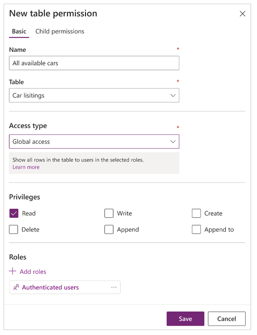
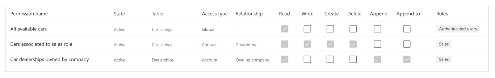

# Table permissions using portals Studio

In the previous article, you learned about how to configure the record-based security in portals by using table permissions configuration from the Portal Management app. In this article, you'll learn about configuring the table permissions using Power Apps portals Studio.

## Portals Studio changes

Before you begin, understand the differences between the interface and terminology used for configuring table permissions between Portal Management app, and Power Apps portals Studio.

### Scope is Access type

When using Portal Management app to configure a table permission, you select **Scope** that the permissions apply to. Scope for a table permission defines the impact range for the given table permission and it's privileges. Power Apps portals Studio refers to scope as **Access type** instead. This change is to ensure a better alignment of the terminology for the feature area.

### Available access types in Studio

Portals Studio shows four different **Access types**. Depending on the access type you select, the selected table permission and privileges apply to the users from the selected roles for the following tables.

1. **Global access** - Applies the selected table permission and privileges to the users from the selected roles for *all records*.
1. **Contact access** - Applies the selected table permission and privileges to the users from the selected role *associated to the signed-in user*.
1. **Account access** - Applies the selected table permission and privileges to the users from the selected role *associated to the signed-in user's parent account*.
1. **Self access** - Applies the selected table permission and privileges to the users from the selected role *for only their own contact record*.

> [!NOTE]
> **Parent scope** is only available in the Portal Management app. Instead of creating a table permission with the access type as **Parent**, directly add or associate child permission to existing table permissions when using portals Studio.

## Configure table permissions using portals Studio

In this section, you'll learn about how to create, view, edit, and deactivate/activate or delete table permissions using portals Studio.

### Create table permissions using portals Studio

To create a table permission using portals Studio:

1. Sign in to [Power Apps](https://make.powerapps.com).

1. Select **Apps** on the left-pane.

1. Select your portal.

1. Select **Edit** to open portals Studio.

1. Select  on the left pane inside portals Studio.

1. Select **Table permissions**.

    

1. Select **New permission**.

1. Enter table permission name.

1. Select a table.

1. Select an access type. More information: [Available access types in Studio](#available-access-types-in-studio)

1. If you select **Contact**, or **Account** access type, select the relationship between the selected Contact/Account, and the table that you selected for the table permission.

    

1. Select privileges that you want to grant.

1. Select **Add roles** to add the roles that this table permission will apply to.

    > [!TIP]
    > If you have not created a web role yet, you can also create it using portals Studio. To create a role, select **New role** from the roles flyout. Enter role **Name**, **Description** (optional), and add **Contacts** (optional). If you don't add any contacts while creating a new role, ensure to add them later for the table permission to take effect.

1. Select **Save**.

    

### View table permissions in portals Studio

To view table permissions using portals Studio:

1. Sign in to [Power Apps](https://make.powerapps.com).

1. Select **Apps** on the left-pane.

1. Select your portal.

1. Select **Edit** to open portals Studio.

1. Select  on the left pane inside portals Studio.

1. Select **Table permissions** to view table permissions.

    

1. To group, or filter table permissions, select a view (List/Group by roles/Group by table/Group by state), or enter a table permission name in the filter text box.

    

### Edit table permissions using portals Studio

To edit a table permission using portals Studio:

1. Sign in to [Power Apps](https://make.powerapps.com).

1. Select **Apps** on the left-pane.

1. Select your portal.

1. Select **Edit** to open portals Studio.

1. Select  on the left pane inside portals Studio.

1. Select **Table permissions**.

1. Select the table permission that you want to edit.

1. Change table permission details, such as the name, table, access type, privileges, and applicable roles. More information: [Create table permissions using portals Studio](#create-table-permissions-using-portals-studio)

1. Select **Save**.

### Deactivate/activate or delete table permissions using portals Studio

To deactivate/activate or delete a table permission using portals Studio:

1. Sign in to [Power Apps](https://make.powerapps.com).

1. Select **Apps** on the left-pane.

1. Select your portal.

1. Select **Edit** to open portals Studio.

1. Select  on the left pane inside portals Studio.

1. Select **Table permissions**.

1. Select the table permission that you want to deactivate/activate or delete.

1. Select **Deactivate**, **Activate**, or **Delete**.

1. Confirm when prompted.

## Configure child permissions using portals Studio

To add a child permission to an existing table permission using portals Studio:

1. Sign in to [Power Apps](https://make.powerapps.com).

1. Select **Apps** on the left-pane.

1. Select your portal.

1. Select **Edit** to open portals Studio.

1. Select  on the left pane inside portals Studio.

1. Select **Table permissions**.

1. Select the table permission that you want to add the child permission to.

1. Select **Add child permission**.

1. Create the child permission with the following details:

    1. Name - child permission name.
    
    1. Table - table that the child permission is for.
    
    1. Access type - relationship between the table for primary table permission, and the selected table for the child permission.
    
    1. Privileges - grant privileges for the child permissions.
    
    1. Roles - roles for a child permission are inherited from the parent table permission. To add/remove roles, edit the parent table permission instead.
    
    More information: [Create table permissions using portals Studio](#create-table-permissions-using-portals-studio)

1. Select **Save**.

To view, edit, deactivate/activate or delete child permissions using portals Studio, follow the steps explained in the earlier section to [configure table permissions using portals Studio](#configure-table-permissions-using-portals-studio).

## Next steps

[Walkthrough: Configure table permissions using portals Studio](entity-permissions-studio-walkthrough.md)

### See also

[Assign table permissions](assign-entity-permissions.md)
