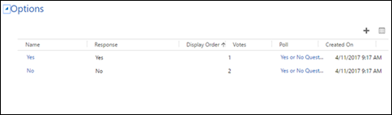
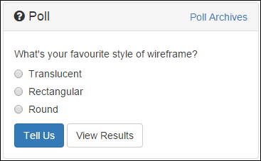
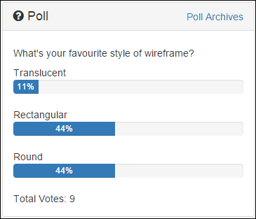

# Gather feedback by using polls on a portal

Polls give your web audiences a quick and easy way to voice their opinion on specific topics, and then immediately and automatically see feedback from their vote.

Use the polls capability of portals to ask your audience about topics of interest and let them give single answers or multiple-choice responses. Either way, their responses are instantly stored and associated with the applicable Contact record for immediate review or aggregate reporting. You can use polls as simple market research tools and, if you refresh or rotate the polls dynamically, you'll keep your website looking current and topical.

Polls can be placed on the portal by using the PollPlacement control. This control works similarly to the AdPlacement control. If there are any polls associated with the Poll Placement table that is being rendered by the PollPlacement control, those polls will be rendered. If there is more than one poll for a given placement, the placement will randomly present one of the specified polls.

> [!Note]
> Users can vote anonymously. Duplicate votes are not permitted. Basic information about submissions can be tracked, and users who sign in to the website will have their submissions linked to the Contact table that tracks that user in Microsoft Dataverse.

## Add a poll to the page

Content managers can use [Template tags](../liquid/liquid-overview.md) to add a poll to any editable content area:  

``

or

``

> [!Note]
> Example web templates are configured in the starter websites. You can use the Random Poll template to display a random poll from a particular Poll Placement table, or you can use the Poll Template template to display a specific poll. You can edit these templates or follow their example and create your own by using [Polls](../liquid/liquid-objects.md#polls). 

## Create a poll placement

To create a new poll placement region:

1. Open the [Portal Management app](configure-portal.md).

2. Go to **Portals** > **Poll Placements**.

3. Select **New**.

4. Select the associated **Website**, give the placement a name, and&mdash;optionally&mdash;select the [web templates](../liquid/store-content-web-templates.md) that will control how it is rendered.

5. After the placement has been created, you must associate one or more polls with this placement. On the **Polls** tab of the Poll Placement table, select **Add Existing Poll**. 

6. In the resulting lookup box, select an existing poll record or create a new poll by selecting **New Poll**.
  

## Polls

A poll is a simple yes/no or multiple-choice question that you can display on your portal via poll placements. There are many customizable options for the display of polls available for developers, but for content managers, adding polls to your website is as easy as choosing a question and series of possible answers (poll options). A poll must have related options to function, and must be associated with a poll placement to be rendered on the portal.

A new poll can be created in two ways: 
- By going to the **Polls** section in the **Portals** area.
- By selecting the **New** button on the **Look Up Records** window while adding a poll to a poll placement.

## Poll attributes

| Name                | Description                                                                                                                                                                                                                                                                                                                                  |
|---------------------|----------------------------------------------------------------------------------------------------------------------------------------------------------------------------------------------------------------------------------------------------------------------------------------------------------------------------------------------|
| Name                | The descriptive name of the poll.                                                                                                                                                                                                                                                                                                            |
| Website             | The associated [web templates](../liquid/store-content-web-templates.md).                                                                                                                                                                                                                                                                |  
| Web Template        | The associated [web templates](../liquid/store-content-web-templates.md) that will be used by default to render the poll. This field is optional; if it is blank, the poll will be rendered by using a default template.                                                                                                                     |  
| Question            | This is the actual question that is being asked in the poll. The associated poll options are the possible answers that can be selected for this poll.                                                                                                                                                                                             |
| Submit Button Label | The text that is to be used for the submission button.                                                                                                                                                                                                                                                                                       |
| Release Date        | Controls the date and time after which the poll will be visible on the portal. If the poll placement is rotating through multiple polls, an unreleased poll will not be shown. If no released polls are associated with a poll placement, nothing will appear. This is useful for controlling the release of time-sensitive content.         |
| Expiration Date     | Controls the date/time prior to which the poll will be visible on the portal.                                                                                                                                                                                                                                                                  |
| Close Voting Date   | Until this date, users who have not yet voted on a poll can vote on the poll.|

> [!Note] 
> - When a user has voted on a poll, they will see a summary of current results for the poll. These results will also be displayed for a poll that is past its closed date, but for which the user has not yet voted. This allows you to continue to reveal the results of polls after you no longer want people to be able to vote on them. 
> - The difference between the Close Voting Date and Expiration Date is that after the expiration date has passed, the poll will no longer show up on the poll placement (it will not be cycled to). The Close Voting Date only determines the date past which users cannot vote on the poll.

Now that the poll has been created, you must associate one or more poll options with this poll. On the **Options** tab of the poll, select **New Poll Option**.

> [!div class=mx-imgBorder]
>   

## Poll options

A poll is a question that is being presented to the user. A poll has two or more possible answers as determined by the content author. These answers are represented by Poll Options, which must be associated with the poll in question. A new poll option is created via the **Look Up Records** window when adding poll options to a poll, as described above.

## Poll option attributes

| Name          | Description                                                                |
|---------------|----------------------------------------------------------------------------|
| Name          | The descriptive name for the poll option.                                  |
| Poll          | The poll that the option is associated with.                               |
| Answer        | The text to display as an available poll voting option.                    |
| Votes         | The number of votes the poll option has received (read-only).              |
| Display Order | A numeric value that will determine the display order of the poll options. |

## Poll submissions

When a user visits the website, they will be given the opportunity to vote on the poll displayed on the page.

> [!div class=mx-imgBorder]
>   

Users can vote only one time; after this, if the poll is displayed, they will see the results for that poll.

> [!div class=mx-imgBorder]
>   

The details of the poll voting results are stored in Dataverse as Poll Submission records. The Poll Submission table contains the following information:

| Name        | Description                                                                                   |
|-------------|-----------------------------------------------------------------------------------------------|
| Name        | Displays the name of the voter if the user is signed in; otherwise, records the anonymous ID. |
| Poll        | The associated poll.                                                                          |
| Poll Option | The poll option that the user selected.                                                       |
| Contact     | The associated Contact record of the voter if the user is signed in.                           |
| Visitor ID  | The anonymous ID of the voter if the user is anonymous.                                       |

### See also

[Configure a portal](configure-portal.md)  
[About lists](entity-lists.md)  
[Create and run advertisements on a portal](create-run-advertisement.md)  
[Rate or vote on a webpage on a portal](rate-webpage.md)  
[Redirect to a new URL on a portal](add-redirect-url.md)  

[!INCLUDE[footer-include](../../../includes/footer-banner.md)]