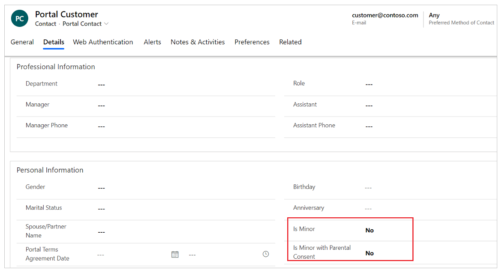
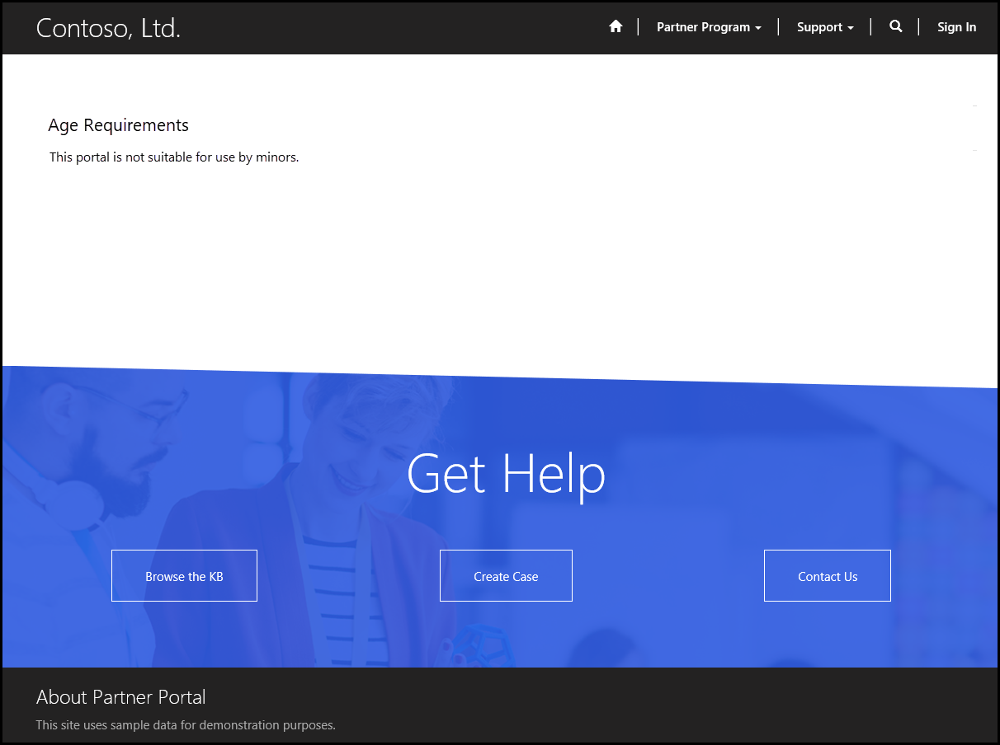
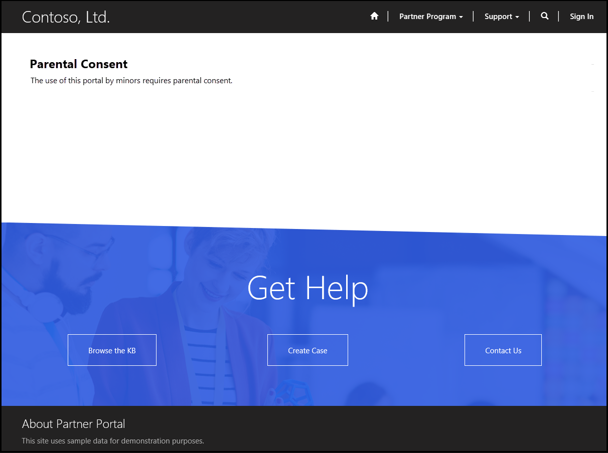
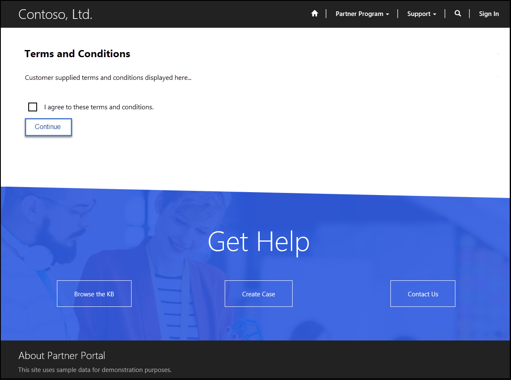
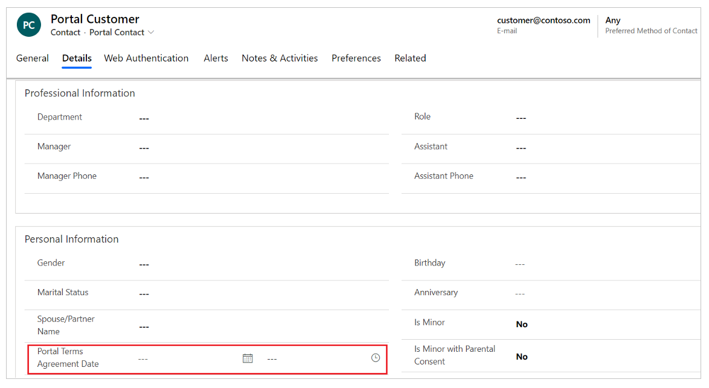

# Implementing General Data Protection Regulations in your Power Apps portals

The General Data Protection Regulation (GDPR) is a legal act of the European Union (EU), which protects data for all individuals within the EU. With GDPR, people can control the use of their personal data in the Microsoft Dataverse.

As an administrator, you can configure your portal to meet GDPR standards. For example, minors must have parental consent to use the portal. You can also establish terms and conditions that users must agree to in order to who use your portal.

GDPR allows you to obtain consent from portal users about the use of their personal data, identify minor users, and get parental consent for minors.

## Audit logging

The **Last Successful Sign-in** field in the portal contact record shows when a portal user has last signed in. This date is picked up by an audit of the contact record and makes that information available in the standard audit stream. This allows the administrator to see inactive community members and delete their records.

> [!NOTE]
> The login tracking feature has been deprecated. It's recommended to use an analytics technology like Azure Application Insights to capture this kind of information. To see the list of deprecated features, click [here](https://blogs.msdn.microsoft.com/crm/2018/03/20/portal-capabilities-for-dynamics-365-deprecated-features/).

## Identifying minor portal users and obtaining parental consent

Regulations for identifying minor users vary by country/region. Because a minor can only access the portal with parental consent, you can configure the portal to identify minors using these fields in the portal contact record:
- **Is Minor**: Indicates that the contact is considered a minor in their jurisdiction. By default, **No** is selected.
- **Is Minor with Parental Consent**: Indicates that the contact is considered a minor in their jurisdiction and has parental consent. By default, **No** is selected.

    

The following site settings control the use of portals by minors and minors without parental consent:

| Name  | Description   |
|-----------------------|------------------------------------------|
| Authentication/Registration/DenyMinors  | Denies use of the portal by minors. By default, this is set to false.                          |
| Authentication/Registration/DenyMinorsWithoutParentalConsent | Denies use of the portal by minors without parental consent. By default, this is set to false. |
|||

If a portal user is determined to be a minor and the portal is configured to block minors, an appropriate message appears and content is not shown.

If a portal user is determined to be a minor without parental consent, and the portal is configured to block minors without parental consent, an appropriate message appears and content is not shown.

The following content snippets control messages that appear when the portal is used by minors and minors without parental consent. You can change the message according to your requirements.

| Name                                                        | Type | Value                                                                    |
|-------------------------------------------------------------|------|--------------------------------------------------------------------------|
| Account/Signin/MinorNotAllowedHeading                       | Text | Age Requirements                                                         |
| Account/Signin/MinorNotAllowedCopy                          | HTML | The use of this portal is not suitable for use by minors and is not allowed. |
| Account/Signin/MinorWithoutParentalConsentNotAllowedHeading | Text | Parental Consent                                                         |
| Account/Signin/MinorWithoutParentalConsentNotAllowedCopy    | HTML | The use of this portal by minors requires parental consent.              |
|||

When someone registers using an external provider and the portal is configured to block minors or minors without parental consent, the contact record is not created and the user is not authenticated.

## Agreeing to terms and conditions

According to the GDPR, portal users must agree to the terms and conditions to allow marketing, profiling, or access to private information. As an administrator, you can publish your own terms and conditions to get consent of the portal user before they're authenticated to the site.

The following content snippets control the display of terms and conditions on the screen. You can change the text according to your requirements.

| Name                                           | Type | Value                                 |
|------------------------------------------------|------|---------------------------------------|
| Account/Signin/TermsAndConditionsHeading       | Text | Terms and Conditions                  |
| Account/Signin/TermsAndConditionsCopy          | HTML |                                       |
| Account/Signin/TermsAndConditionsAgreementText | Text | I agree to these terms and conditions. |
| Account/Signin/TermsAndConditionsButtonText    | Text | Continue                              |
|||

The `Account/Signin/TermsAndConditionsCopy` content snippet is empty by default. A portal administrator must enter the terms and conditions to be displayed in this content snippet.

The following site settings control the terms publication date and whether the terms should be displayed on the portal:

| Name  | Description |
|------------|---------------|
| Authentication/Registration/TermsPublicationDate  | A date/time value (GMT) to represent the effective date of the current published terms and conditions. If the terms agreement is enabled, portal users that have not accepted the terms after this date will be asked to accept them the next time they sign in. If the date is not provided, and the terms agreement is enabled, the terms will be presented every time portal users sign in.   **Note**: If you want a portal user to agree to the terms and conditions every time they sign in, do not provide a value for this site setting.|
| Authentication/Registration/TermsAgreementEnabled | A true or false value. If set to true, the portal will display the terms and conditions of the site. Users must agree to the terms and conditions before they are considered authenticated and can use the site. By default, this is set to false.        |
|||

The following field is added in the portal contact record to store the date and time a portal user agreed to the terms and conditions:
- **Portal Terms Agreement Date**: Indicates the date and time the user agreed to the portal terms and conditions.

    

### See also

[Migrate identity providers to Azure AD B2C](migrate-identity-providers.md)

[!INCLUDE[footer-include](../../../includes/footer-banner.md)]
