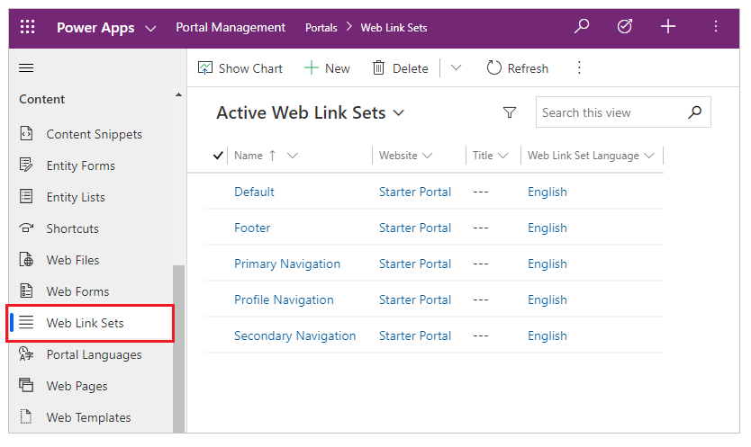
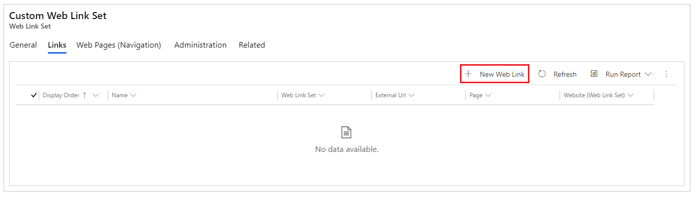
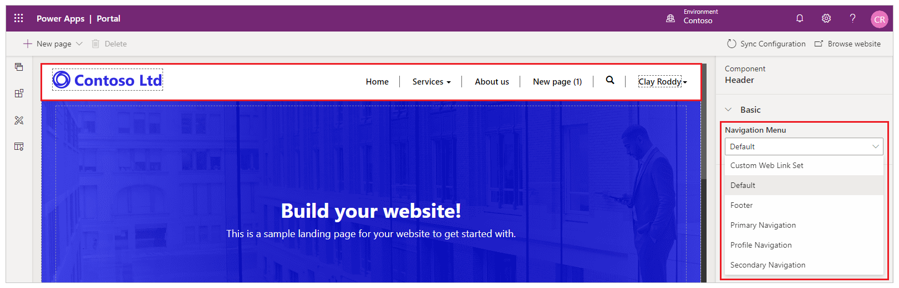

# Manage web links

A web link can link to any URL or it can link to another webpage within the same website. When a web link is to a webpage, the security and publishing state of the webpage will apply to the web link as well. Web links are always part of a web link set. A web link set is a group of links such as a primary navigation or a group of footer links. Web link sets allow internal, regardless of placement in the site map, and external links to be grouped together and ordered.

## Manage web links in Power Apps portals

Once the portal customizations have been imported into the Microsoft Dataverse environment, web links can be managed from a web link set.

1. Open the [Portal Management app](configure-portal.md).

1. Go to **Portals** > **Web Link Sets**.

    

    More information: [Web link set attributes and relationships](#web-link-set-attributes-and-relationships)

1. To create a new web link set, select **New**. To edit an existing web link set instead, select the web link set name.

1. Enter appropriate values in the fields.

1. If you create a new web link set, select **Save** to save the record so you can add web links.

1. Go to the **Links** tab.

1. To create a new web link, select **New Web Link**. To edit an existing web link instead, select the web link name.

    

    More information: [Web link attributes and relationships](#web-link-attributes-and-relationships)

1. Enter appropriate values in the fields.

1. Save the changes.

## Default web link set and navigation menu in Studio

The primary menu on the website is created automatically based on the hierarchy of the webpages. It's called the **Default** menu. You can also create a custom menu to display on the website.

If you change the web link set using the [Portal Management app](configure-portal.md), and then try to edit the portal using the [portals Studio](../portal-designer-anatomy.md), you may see the following message:

`Default navigation menu and page display order has been updated. To see the changes, select Sync Configuration.`

When this happens, you can select **Sync Configuration** to see the changes to the navigation menu.

> [!IMPORTANT]
> Direct changes to the **Default** web link set using the Portal Management app is not supported. To customize your portal's navigation menu using the Portal Management app, create a new web link set or customize a different web link set. You can add new web pages using the portals Studio with **Default** navigation menu selected that creates new pages inside the **Default** web link set instead.

More information: [Add a custom navigation menu](../add-custom-menu.md). For more information about creating and managing web pages, go to [Create and manage web pages](../create-manage-webpages.md).

## Web link set attributes and relationships

The table below explains many of the standard Web Link Set properties used by portals. It's important to note that the way in which many of the content/display-oriented properties are rendered is controlled by the page template used.

| Name    | Description                                                                                                                                                                                  |
|---------|----------------------------------------------------------------------------------------------------------------------------------------------------------------------------------------------|
| Name    | The descriptive name of the web link set. This value usually describes the placement of the set in the page template such as Primary Navigation. This field is required.                   |
| Website | The website to which the table belongs. This field is required.                                                                                                                             |
| Title   | An optional title for the web link set. This value can be used on the portal if it's part of the page template. It could be something like Our Partners and be displayed in a side bar.    |
| Copy    | An optional description for the web link set. This value can be used on the portal if it's part of the page template. It could further describe something like Our Partners in a side bar. |
||

## Web link attributes and relationships

The table below explains many of the standard Web Link properties used by portals. It's important to note that the way in which many of the content/display-oriented properties are rendered is controlled by the page template used.

|           Name           |                                                                                                               Description                                                                                                               |
|--------------------------|-----------------------------------------------------------------------------------------------------------------------------------------------------------------------------------------------------------------------------------------|
|           Name           |                                                          The title for the web link. This value will be used as the web link title in most templates. This field is required.                                                           |
|       Web Link Set       |                                                                                  The web link set to which the table belongs. This field is required.                                                                                  |
|     Parent Web Link      |                                      The parent web link of the table, in a multilevel web link set. If no parent web link is specified, the table is at the top/root level of the web link set.                                      |
|           Page           |                                                                                          An optional webpage from the same website to link to.                                                                                          |
|        External URL      |                                                                                An optional URL to link to. This value can be any properly formatted URL.                                                                                |
|       Description        |                                                              An optional summary for the web link. This value can be used on the portal if it's part of the page template.                                                              |
|     Publishing State     | The current publishing workflow state of the web link, which may dictate whether the web link is visible on the site. The most common use of this feature is to provide published/draft control over content. This field is required. |
|    Robots Follow Link    |                                                           Indicates whether search indexers should follow and index the contents of the link or not. This field is required.                                                            |
|      Display Order       |                                                  An integer value indicating the order in which the web link will be placed, relative to other web links within the same web link set.                                                  |
| Display Page Child Links |  In a template that supports multilevel web link sets, generate child links for this table using the portal site map provider. This option is only valid for web links that refer to internal pages, and not external URLs.  |
|    Open in New Window    |                                                                            Indicates whether selecting the link will load the link in a new browser window.                                                                             |
| Disable Page Validation  |                                                                       Indicates whether the security of a linked webpage will be applied to the web link as well.                                                                       |
|        Image URL         |                                                   An optional URL to an image. The linked image can be used on the portal if it's part of the page template; for example, as an icon.                                                   |
|       Image Height       |                                                                                      An optional height for the image from the Image URL property.                                                                                      |
|       Image Width        |                                                                                      An optional width for the image from the Image URL property.                                                                                       |
|      Image Alt Text      |                                                                                   An optional description for the image from the Image URL property.                                                                                    |
|    Display Image Only    |                                                   Indicates that the template should render only an image link for this web link, rather than both the image and link name together.                                                    |
|                          |                                                                                                                                                                                                                                         |

> [!NOTE]
> - When a web link is to a webpage, the security and publishing state of the webpage will apply to the web link as well. This validation can be disabled with the Disable Page Validation option. 
>   - Users with content management permissions may be granted the ability to use Preview Mode, which allows these users to see (preview) unpublished content.

### See also

- [Manage a web page and navigation menu](../create-manage-webpages.md#manage-webpage)
- [Add a custom menu to a page](../add-custom-menu.md)
- [Customize content by using content snippets](customize-content-snippets.md)

[!INCLUDE[footer-include](../../../includes/footer-banner.md)]