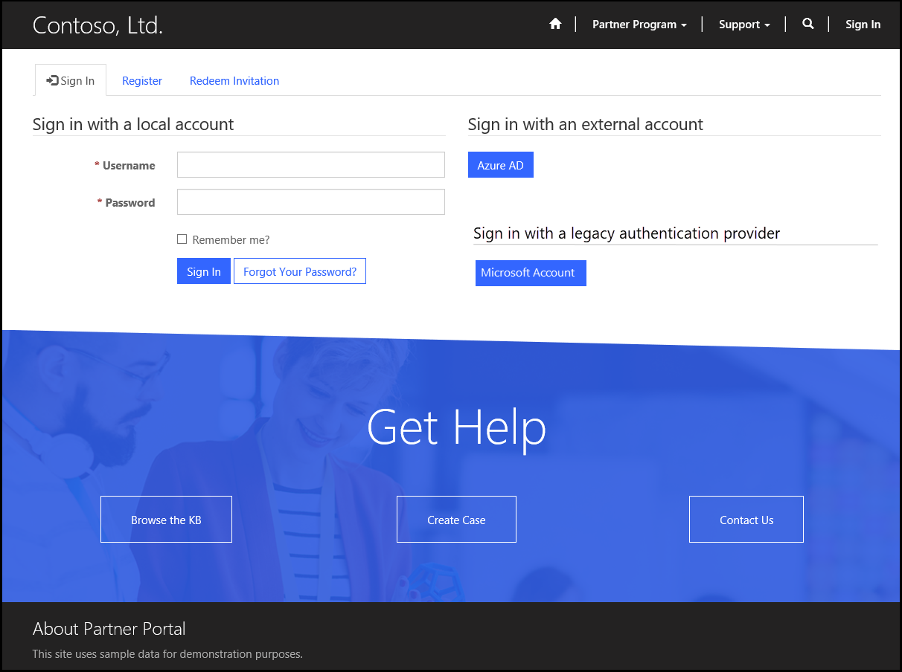
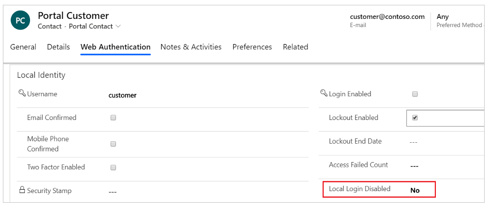

# Migrate identity providers to Azure AD B2C

The portals feature supports a configurable security system that lets you support multiple authentication systems. The portal includes its own local credentials in addition to federating with external identity providers by using standard protocols such as OIDC, SAML, and WS-Federation. Going forward, we recommend that you use only the Azure AD B2C identity provider for authentication and that you deprecate other identity providers.

> [!IMPORTANT]
> - We recommend that you use this path to migrate from [local authentication](set-authentication-identity.md) and deprecate local authentication for your portal.
> - Configuring local authentication requires that you use the [Portal Management app](configure-portal.md) to configure the required site settings manually.

## Marking an identity provider as deprecated

You can configure your portal to mark other identity providers as deprecated and allow users to migrate to an Azure AD B2C identity provider.

The following site settings are used to control the deprecation of identity providers.

| Name  | Description  |
|--------|--------|
| Authentication/Registration/LocalLoginDeprecated | A true or false value. If set to true, the local account will be marked as deprecated and the portal user will be required to migrate to a non-deprecated account. By default, this is set to false. |
| Authentication/[protocol]/[provider]/Deprecated  | A true or false value. If set to true, the specific account will be marked as deprecated and the portal user will be required to migrate to a non-deprecated account. By default, this is set to false. |
|||

When a portal user tries to sign in and you've marked at least one identity provider as deprecated, the deprecated account is shown on the page. In the following image, a Microsoft account is marked as deprecated.

You can change the text that appears on-screen for a legacy authentication provider by using the following content snippet:

| Name                                               | Type | Value                         |
|----------------------------------------------------|------|-------------------------------|
| Account/Signin/SignInExternalDeprecatedFormHeading | Text | Sign in with a legacy account |
|||

> [!NOTE]
> The deprecated identity providers aren't shown when a user registers or redeems an invitation for a portal.

## Migrating a deprecated identity provider to a new identity provider

If a portal user signs in by using a deprecated identity provider, the account migration screen displays a message to sign in by using a non-deprecated identity provider. When the user signs in by using the non-deprecated identity provider, the user account is associated with the new provider.

You can change the message that appears on-screen for account migration by using the following content snippets:

| Name                                         | Type | Value    |
|----------------------------------------------|------|----------|
| Account/Conversion/PageTitle                 | Text | Account Migration   |
| Account/Conversion/PageCopy                  | HTML | You've signed in with an account that is no longer supported. To continue using this portal, you must migrate to a different account. Select the button to sign in with a new or existing supported account. |
| Account/Conversion/SignInExternalFormHeading | Text | Sign in with a supported account.     |

The portal allows multiple identities to be associated with a single contact record. When multiple providers are deprecated, a portal user must consent to the terms and conditions multiple times. Whenever a user signs in with a deprecated identity provider, the account migration process is started for each deprecated provider and the contact record is associated with the non-deprecated provider after account migration.

For example, the portal supports Microsoft, Google, and Facebook as identity providers for authentication. If you mark Google and Facebook as deprecated providers, and a portal user only has Google and Facebook as identity providers for authentication, the user receives the account migration message when they try to sign in by using either of these two providers. When the user signs in by using a Microsoft account, the Microsoft account is added to the user's contact record. The user now has only Microsoft as the supported authentication identity provider.

When a portal user selects a new identity provider, and the identity is already associated with another contact record, an error message appears. You can configure the error message by using the following content snippets:

| Name                                                     | Type | Value          |
|----------------------------------------------------------|------|-------------------|
| Account/Signin/AccountConversionIdentityUsedErrorHeading | Text | Account Conversion Error    |
| Account/Signin/AccountConversionIdentityUsedErrorText    | HTML | This account already exists. Close your browser, restart the process, and select a different account on the Account Migration page. |

## Disabling local login

You can configure a portal to disable local login by using the `Authentication/Registration/LocalLoginDeprecated` site setting. If someone tries to sign in by using local credentials, the account migration screen appears along with the instruction to sign in by using a non-deprecated identity provider. When the account is migrated, local credentials for the user are disabled.

> [!NOTE]
> If you mark local login as deprecated, the user won't be able to register for a new account.

The following field is added in the portal contact record to indicate whether local login is disabled for a user:

- **Local Login Disabled** indicates that the contact can no longer sign in to the portal by using the local account. By default, this is set to **No**. This field is set to **Yes** if a user's account is migrated to a non-deprecated identity provider and local login is disabled.

### See also

[Configure the Azure AD B2C provider for portals](configure-azure-ad-b2c-provider.md)

[!INCLUDE[footer-include](../../../includes/footer-banner.md)]