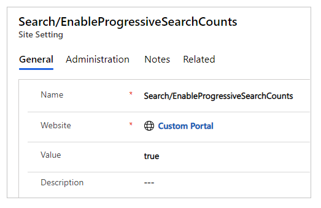
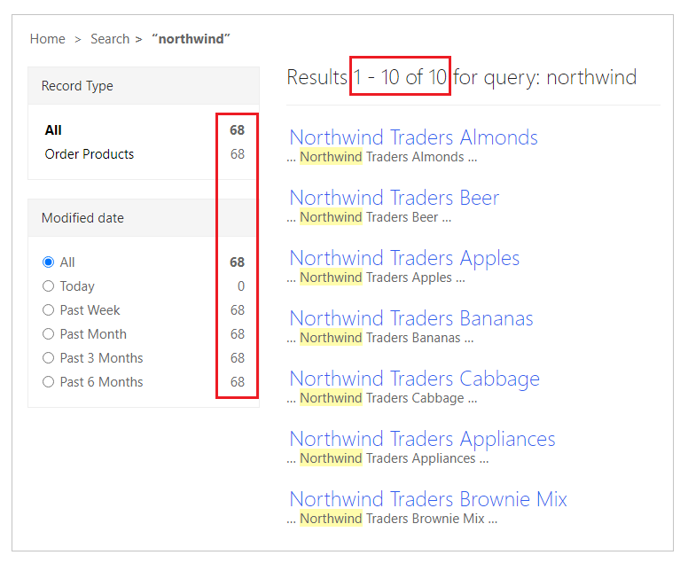
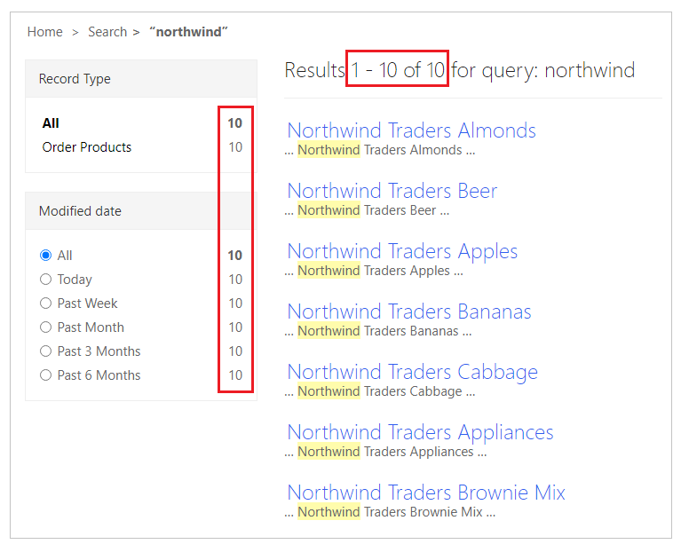
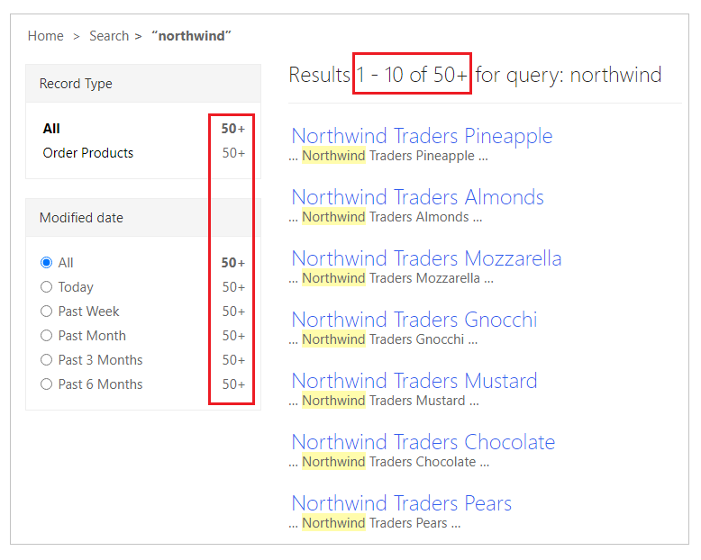
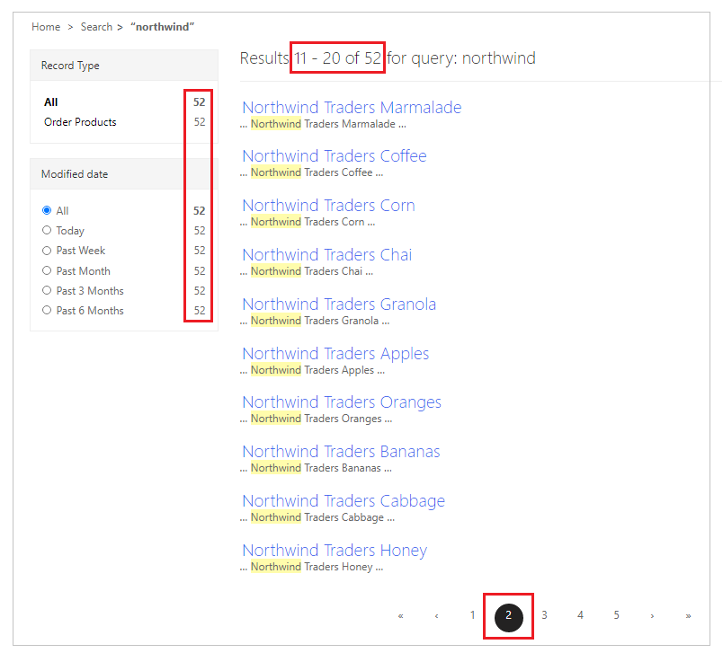
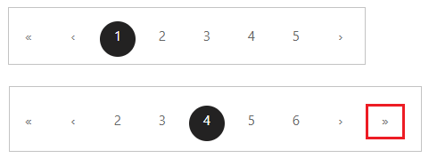

# Progressive search

Getting accurate search results when a portal has several [additional tables](search-additional-entities.md) enabled for search can become difficult. A complex permissions structure for individual tables and records adds to this difficulty. Searching for content on such portals may end up with a records count that doesn't match the number shown on the search results page.

## Overview

By default, the portals search processes only one page for permissions and keyword matches. When results span across more than one page, causing some results to be discarded because of permissions or keywords, the pagination gets distorted.

Progressive search eliminates the possibility of having a mismatch between the results count and the number of records returned in the search results.

A portal configured with progressive search processes five pages for a permissions and keyword match, with 50 records for a single search attempt. The search count now shows **50+** on the first page instead of the mismatch count between facet and results.

## Configure progressive search

To configure progressive search for your portal:

1. Open the [Portal Management app](configure-portal.md) app.
1. On the left pane, select **Site Settings** under **Website**.
1. Select **New**.
1. Enter **Name** as "Search/EnableProgressiveSearchCounts".
1. Select your website record.
1. Enter **Value** as "true".
1. Select Save.

    

1. [Rebuild your search index](search-additional-entities.md#step-6-rebuild-the-search-index).

To disable progressive search, set the value of **Search/EnableProgressiveSearchCounts** site setting to **false**.

## Progressive search with sample data

As an example, consider a portal in an environment with [Northwind Traders sample data](../../canvas-apps/northwind-install.md), with search enabled for [Order Products](search-additional-entities.md).

When the user searches for products, only 10 results show up, even though the search facet shows the total number of products as 68, including the configured filters.

This behavior is more prevalent when search results span across multiple pages. But with progressive search, you can get more accurate results by changing the behavior of the search for enabled facets and filters.

After a user enables progressive search on this portal, the search results for the same user, permissions, and keyword show the total number of results as 10 instead.

If a user enables progressive search for a keyword that returns more than 50 results, the count shows as **50+** instead, with 10 results listed on the first page.

Selecting an additional page, such as page 2, shows the count updated to the total number of search results. (In this example, a total of 52.)

## Considerations

- Enabling progressive search changes the behavior of the search for all enabled facets and filters.
- Progressive search processes a maximum of 50 records at a time, with more than 50 results shown as **50+** on the first result page.
- For a better search experience, use specific keywords that narrow the search results to a smaller number.
- Selecting a particular facet in filters only shows results for the selected facet, such as tables.
- Since the records are progressively evaluated, the "jump to last page" button () is only available if the remaining number of pages in the search result are five or less.

    

### See also

[Use faceted search](improve-portal-search-faceted-search.md)  
[Configure search for additional tables](search-additional-entities.md)

[!INCLUDE[footer-include](../../../includes/footer-banner.md)]

