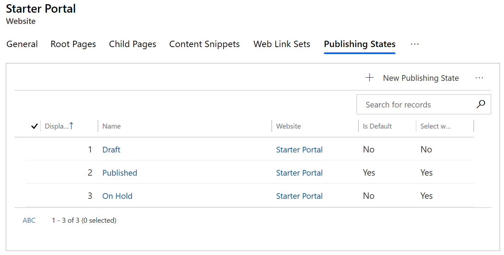
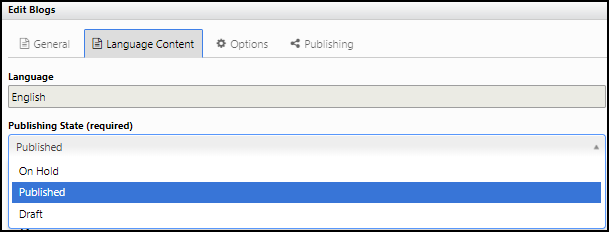
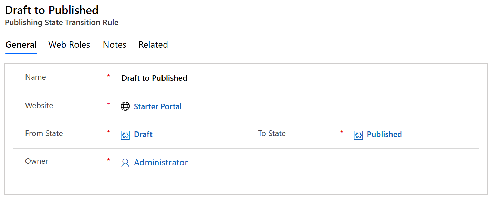
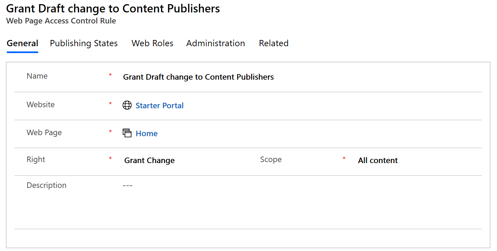

# Create and manage publishing states

Publishing states allow for the definition of a content lifecycle in portals website. At a basic level, a publishing state can determine whether an associated entity should be considered visible/published on a portal. In more complex configurations, they can define a multi-stage process for content review and publishing, with security restrictions on each stage.

Publishing states can be used with [web pages](web-page.md), [web files](web-files.md), [web links](manage-web-links.md), [forums](setup-manage-forums.md), and advertisements.

By default, two publishing states are available: Draft and Published. Draft specifies content that should not be visible to non-content-author users, while Published specifies content that should be visible to all portal users (barring other security restrictions). You can modify the default configuration to meet your specific requirements, if desired – by adding new states or renaming states.

## Manage publishing states

Publishing states can be created, edited, and deleted within portals.

1. Open the [Portal Management app](configure-portal.md).

2. Go to **Portals** > **Websites**.

3. Select the website to manage publishing states.

4. Click the down arrow next to the website name and select **Publishing States**. The list of available publishing states is displayed.

5. To add a new publishing state, select **Add new publishing state**.

6. To edit an existing publishing state, select the publishing state name.

7. In the Publishing State window, enter appropriate values in the fields.

8. Select **Save & Close**.

You can also manage publish states under the **Publishing States** section on the website record.

 

## Manage publishing states from the portal content editor

While publishing states and their attributes must be managed within portals, portal users with content management permissions can control the state of certain entities (such as web pages and web files) through the portal content editing interface.

### Publishing state attributes

|Name|Description|
|-----|--------|
|Name|The descriptive name of the state. This field is required.|
|Website|The website to which the state belongs. This field is required.|
|Is Default|If checked, designates this state as the default state for the website. This will determine the default state selected when creating new entities through the portal front-side editing interface. **Note**:Only one Publishing State in a given Website should be marked as the default state.|
|Is Visible|If checked, designates that entities associated with this state will be considered visible (or published) on the portal. While an entity associated with a non-visible state will not be visible on the portal, an entity associated with a visible state may also not be visible, due to security permissions, expiration dates, or other visibility rules. Users with content management permissions may be granted the ability to use Preview Mode, which allows these users to see (preview) unpublished content.|
|Display Order|An integer value indicating the order in which the state will be placed, in menus and drop-down lists for selecting a Publishing State – mostly found in the portal front-side editing interfaces.|
|||

## Publishing state transition rules

Publishing state transition rules allow you granular control over which web roles have the right to make what content changes on the portal in terms of publishing state.

To be precise, publishing state transition rules govern the transitions between publishing states (Draft or Published). When a user attempts to switch the publishing state of an item from one to another, if a rule exists for this transition, then the security provider will assert that the web role for the logged-in user has permission to perform this transition.

If the logged-in user who is attempting the change is in any of the roles you assign to the rule, the transition will be successful. If a user does not have permissions to make a change from one rule to another, then the front-side editing will not allow them to make that change. Alternatively, you can create the rule; then as you create web roles add the rule to the web roles. One rule can be associated with any number of web roles and vice versa.

1. Open the [Portal Management app](configure-portal.md).

2. Go to **Portals** > **Publishing State Transition Rules**.

3. To create a new rule, select **New**.

4. To edit an existing rule, select the rule name.

5. In the Publishing State Transition Rule window, enter appropriate values in the fields.

6. Select **Save** so you can continue adding web roles to it.

7. Under **Web Roles**, browse and add the appropriate web roles.

    

8. Select **Save**.

## State-based control rules

[Web page access control rules](webpage-access-control.md) can be linked with publishing states to allow or deny the right to view or modify content based on the branch of the website and the publishing state of content within that branch. To accomplish this, associate a web page access control rule with a publishing state. Once it is associated with a publishing state, the rule will only be applied to web pages when that publishing state is active.

For example, say you wanted someone in the content publishing role to be able to modify a page's content, but only when that page is in Draft mode.  This would ensure that changes to the page are not done while the page is 'live' and would allow for an approval process to be undertaken on pending changes.

To do this, you would create a rule with the grant change permission and apply it to the branch in question (or the home page if the rule is to apply to the entire site). You would then associate this rule with the draft state.

You would then associate this rule with the appropriate web role, for example, Content publishing. Assuming this web role is not associated with a more permissive rule (i.e. a rule that grants change regardless of publishing state) then users in the content publishing web role will be able to modify pages in the draft state but will not be able to modify pages in the published state.
