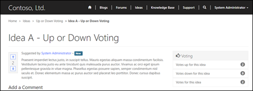

# Rate or vote on a webpage on a portal

Ratings provide users with the ability to rate or vote on a webpage. Ratings can also be enabled for comments on pages. By default, this feature is disabled, but it can be enabled on a page-by-page basis.

Ratings are custom activities and thus can be used in the same way as any other activity such as emails, phone calls, and so on. Because ratings are activities, by using customization you can have ratings appear for any entity you choose that appears and is rendered on the portal, including custom entities.

## Enable ratings for pages

1. Open the [Portal Management app](configure-portal.md).

2. Go to **Portals** > **Web Pages**.

3. Select the **Web Page** in which you want to enable ratings.

4. On the **General** tab, under **Page Options**, set **Enable Ratings** to **Yes**.

5. Select **Save & Close**.

## Use ratings

For webpages that have page ratings enabled and the developer has applied the control to the template, users can rate the page either by using the rating scale or voting, depending on the type chosen when the control was added to the page template.

### Rating Type

  

### Vote Type

  

## Manage ratings

The ratings for webpages can be viewed, modified, or deleted within PowerApps portals.

1. Open the [Portal Management app](configure-portal.md).

2. Navigate to the **Web page** that you are interested in seeing the ratings for.

3. On the **Related** tab, select **Activities**. The associated view lists the ratings for the selected webpage. Within this view, users can modify or delete existing ratings.
