# Walkthrough: Configuring additional entities for global search  

## Overview

You can enable additional entities for search functionality. Configuring search for additional entities requires additional actions.

Following considerations apply when configuring additional entities for global search:

- Ensure [site setting](#-site-setting-for-additional-entities) for search and additional entities are enabled.
- Configure [search results page](#results-page-for-additional-entities).
- Ensure an **Entity Permission** is created that provides Read privilege, and appropriate scope for the records to show search results.
- Associate the entity permission with required **Web Roles**.
- Entity permissions must be associated with the **Anonymous Web Role** if you want to allow anonymous search for an entity.
- Create a named view **Portal Search** for additional entity you want to enable search for. For more information, read [searchable fields in global search](search.md#fields-searchable-in-global-search).

Explicit configuration explained above ensures that no records are accidentally made available via global search.

### Site Setting for additional entities

Site setting **Search/EnableAdditionalEntities** is required when configuring additional entities for search.

> [!IMPORTANT]
> **Search/EnableAdditionalEntities** is explicitly for enabling additional entities search. The main search site setting **Search/Enabled** must be set to **true** when using search functionality.

You can also configure other related site settings similar to the search configuration for default entities. 

For example, **Search/Filters** allow configuring the additional entities and add a drop-down filter option to the global search.

For more information about site settings, read [site setting](search.md#related-site-settings).

### Results page for additional entities

The search result page is configured via a **Site Marker** named ```<entitylogicalname>_SearchResultPage```.

For example, if your entity logical name is *nwind_products* then the Site Marker will be ```nwind_products_SearchResultPage```. The value of the site marker is the page that you want to open on click of that search result. By default, record ID is passed in the *id* querystring parameter to the search result page.

Ensure that your search results page has an entity form. Or has logic written to show the search result details.

## Walkthrough with sample database

The following walk-through explains enabling search for **Order Products** entity in sample database **Northwind** available with Common Data Service.

For more information about sample database, read [Install Northwind Traders database and apps](https://docs.microsoft.com/powerapps/maker/canvas-apps/northwind-install).

> [!TIP]
> You can follow the walk-through with your entity instead by replacing *nwind_products* entity name with your entity's logical name.

## Step 1: Add or update search Site Settings


1. Sign in to [Power Apps](https://make.powerapps.com).

1. Ensure you are on the appropriate environment where your portal exists.

1. Select **Apps** in the left pane and locate the **Portal Management** model-driven app:  

    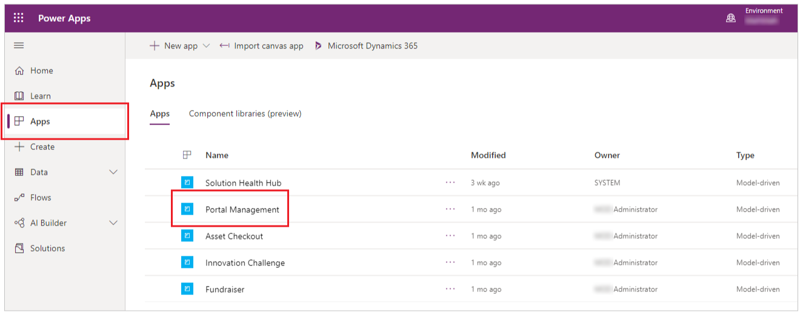

    >[!NOTE]
    > **Portal Management** app may be named as **Dynamics 365 Portals** if you are on an environment with Dynamics 365 applications installed.

1. Select to open the **Portal Management** app and then go to **Site Settings** in left pane:

1. Create a new setting **Search/EnableAdditionalEntities** and set its value
    to **true**:

    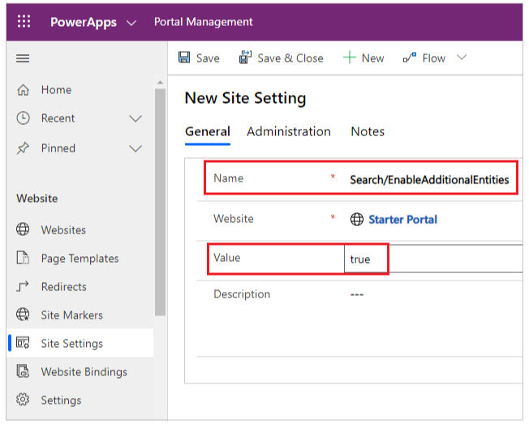

1. Create or update setting **search/filters** and add the value *Products:nwind_products*:

    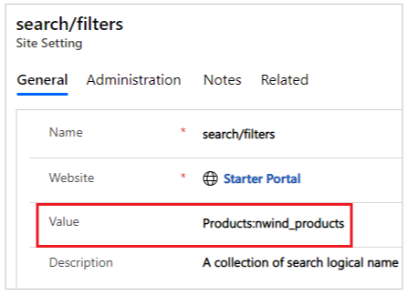

## Step 2: Create or verify the Portal Search view

> [!NOTE]
> Following steps require the [Northwind Traders(https://docs.microsoft.com/powerapps/maker/canvas-apps/northwind-install) solution installed. If
you want to use another entity, use the appropriate solution or use the Default
solution.

1. Go to [Power Apps](https://make.powerapps.com) and select **Solutions** from left pane.

1. Select **Northwind Traders** solution:

    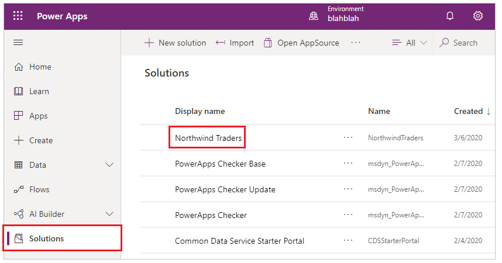

1. Search for the **Order Product** entity:

    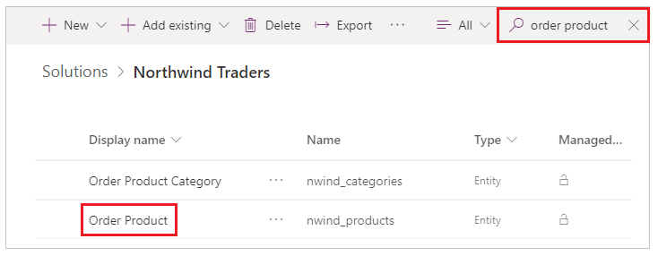

1. Select the **Order Product** entity and then select **Views**:

    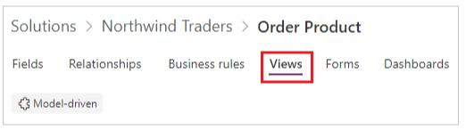

1. Ensure you see the view **Portal Search** in the views list:

    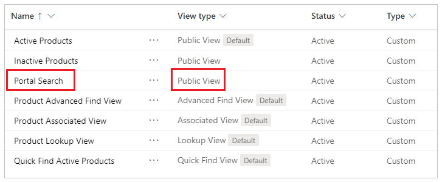

    If the Portal Search view doesn't already exist, select **Add view**, type the view name as *Portal Search*, and then select **Create**:

    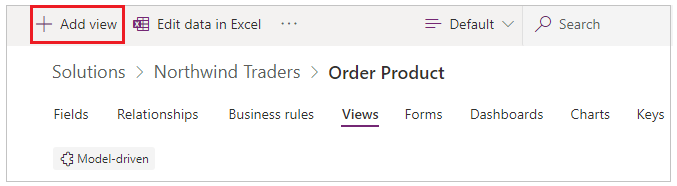

    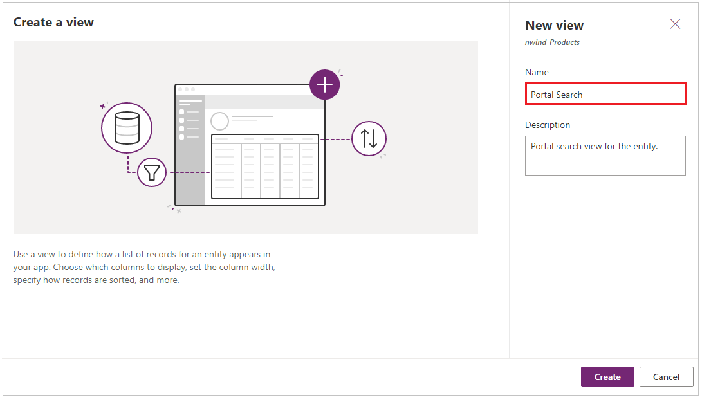

1. Ensure appropriate columns are added to the view for search:

    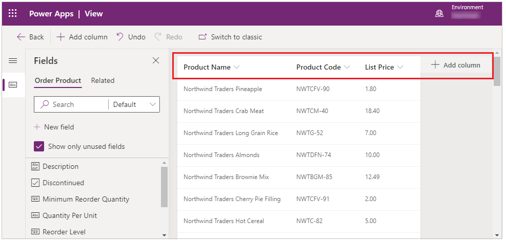

1. If you edited the view, ensure to **Save** and **Publish** the changes
    before you continue:

    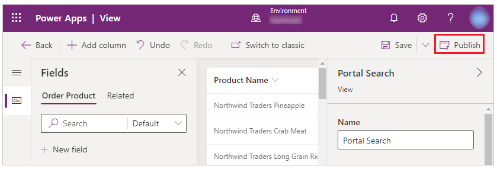

## Step 3: Create Entity Permissions

1. Sign in to [Power Apps](https://make.powerapps.com).

1. Select **Apps** in the left pane and locate the **Portal Management** model-driven app.  

1. Select **Entity Permissions** in the left pane.

1. Select **New** to create a new **Entity Permission** record:

    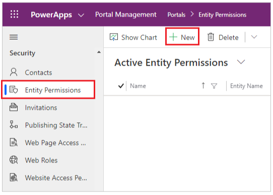

1. Enter the name as *Northwind Products Read All* and select appropriate **Scope** and **Read** privileges.

    For this example, **Global Scope** is provided to the *nwind_products*
    entity:

    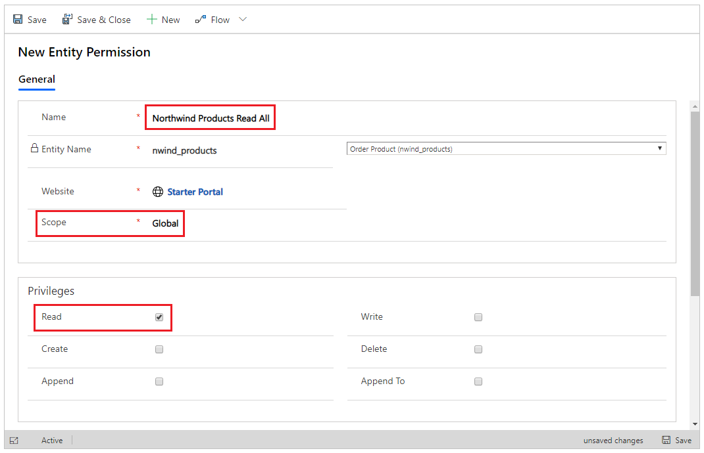

1. Select **Save & Close**.

1. Select and open the **Northwind Products Read All**.

1. Scroll down to the **Web** Roles section and then select **Add Existing Web Role**:

    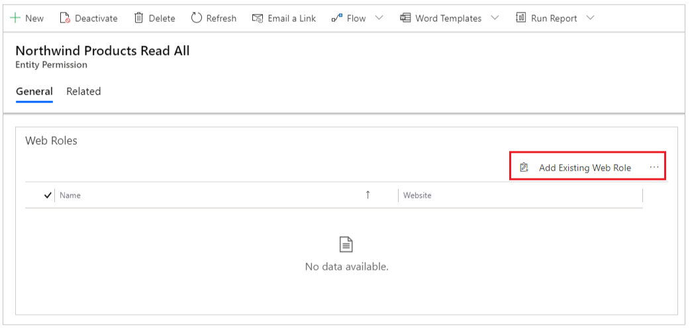

1. Search for **Authenticated Users** and then select **Add**:

    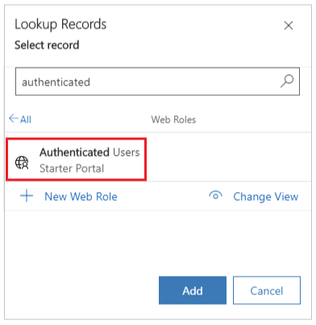

## Step 4: Add a Web Page

1. Go to [Power Apps](https://make.powerapps.com) and select **Apps** in left pane.

1. Select **More Commands** (…) for the portal and then select **Edit** to open the portal in portals Studio.

1. Select **New Page** from the top-left menu and then select the **Blank** layout for the page:

    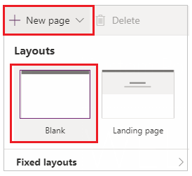

1. Type the **Web Page** name as *Order Products*. This page will be configured as the **Search Results Page**.

1. Select **Components** in left pane as highlighted and add **Form** component to this web page:

    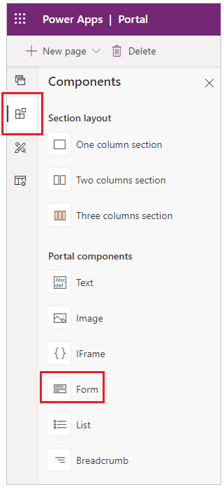

1. Select **Use existing** form option in the right-hand side and choose **View Products** form for the *nwind_products* entity and set **Mode** to *ReadOnly*:

    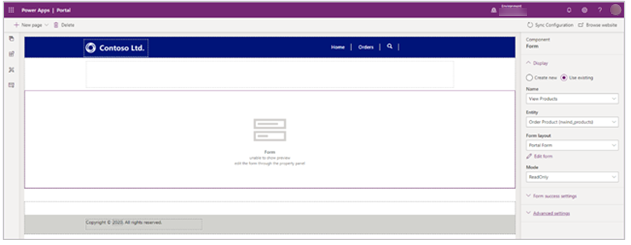

## Step 5: Add Site Marker for the search result details page

1. Sign in to [Power Apps](https://make.powerapps.com).

1. Select **Apps** in the left pane and locate the **Portal Management** model-driven app.  

1. Select **Site Marker** from left pane.

1. Select **New** and create a new site marker with the following details:

    - **Name:** *nwind_products_SearchResultPage*
    - **Page:** *Order Products*
    
    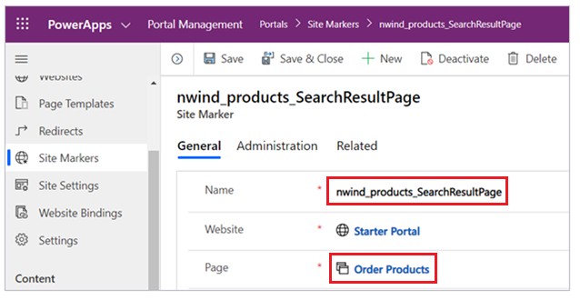

## Step 6: Rebuild search index

1. Browse your portal with a user account that has *Administrator* **Web Role** assigned.

1. Append the URL in address bar with */_services/about* and press enter:

   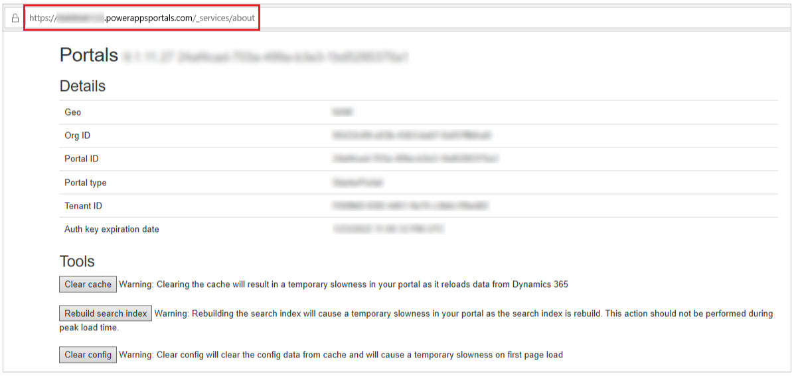

1. Select [Clear cache](https://docs.microsoft.com/powerapps/maker/portals/admin/clear-server-side-cache).

1. After clearing cache, select [Rebuild Search Index](search.md#rebuild-full-search-index) to rebuild the search index.

## Step 7: Verify Global Search with custom entity

1. Browse to the portal with a user that has *Authenticated* **Web Role** assigned.

1. Go to search in toolbar or the search page and search for a known record.

    For example, use the search keyword *Northwind Clam Chowder* to display
    results associated to *nwind_products* entity:

    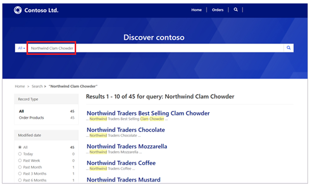

## Next steps

[Remove an entity from global search](search.md#remove-an-entity-from-global-search)

### See also

[Search related site settings](search.md#related-site-settings)