# Search

In Power Apps portals, you can search for records across multiple tables by using portal's global search functionality. You can also search within records of lists using list search functionality. 

List search functionality in the portal uses FetchXML in the backend to search the columns defined in the list and then display the results. 

Global search uses an external search index that is based on Lucene.Net and is used to search within multiple tables and fields at once.

## Global search

Global search of portals allows you to search for records across multiple tables. It also allows you to search across multiple columns and configure what columns of a table would be searchable.

Among the benefits of global search are its ability to:
- Find matches to any word in the search term in any field in the table. Matches can include inflectional words like stream, streaming, or streamed.
- Return results from all searchable tables in a single list sorted by relevance, based on factors such as:
    - Number of words matched.
    - Proximity to each other in the text.
- Highlight matches in the search results.
- Provide facet options that can be used to further filter search results.

In global search, the better the match, the higher it appears in the results. A match has a higher relevancy if more words from the search term are found in close proximity to each other. The smaller the amount of text where the search words are found, the higher the relevancy. For example, if you find the search words in a company name and address, it might be a better match than the same words found in a large article, far apart from each other. Because the results are returned in a single list, you can see a mix of records displayed one after another, with matched works highlighted. 

The following sections detail how global search works in Power Apps portals and describe the various configuration options available.

## Tables searchable in portal global search

By default, the following tables can be searched within a portal website provided the appropriate solution packages have been installed and search has been added to a portal. The columns that are indexed will consist of the columns found in the Search view, which can be customized.  Each table in the list has its default set of attributes indexed as listed here:
- Knowledge Article
    - Notes and attachment of a knowledge article are searchable as well. More information: [Search within file attachment content](search-file-attachment.md)
    - Articles are searchable only if they are published and their Internal Only field is set to false.
- Blog 
- Blog Post 
- Blog Post Comment 
- Forum 
- Forum Post 
- Forum Thread 
- Idea 
- Idea Comment 
- Idea Forum 
- Web File 
    - Attachment content of web files is searchable as well. More information: [Search within file attachment content](search-file-attachment.md)
- Web Page 
- Incident 

> [!NOTE]
> You can configure additional tables for search. For more information, read [configuring additional tables for search](search-additional-entities.md).

## Fields searchable in global search

All the fields available in the view defined by the Search/IndexQueryName site setting for any table are indexed in global search and are searchable. 

Default value for Search/IndexQueryName is "Portal Search".

If the view is not available for any table, it's not indexed and the results are not displayed in global search.

> [!NOTE]
> If you change the value of the Search/IndexQueryName site setting, you need to trigger a manual re-index of the build using steps defined in the [Rebuild full search index](#rebuild-full-search-index) section.

## Related site settings

The following site settings are related to global search:

| Name    | Default value     | Description       |
|-----------------------|--------------------|-------------|
| Search/Enabled | True  | A Boolean value that indicates whether search is enabled. If you set its value to false, global search in the portal is turned off. If you're using out-of-the-box web templates and you turn off this setting, the search box will not be displayed in the header as well as on the search page. Also, no results are returned even if the direct URL for the search page is hit.  |
| Search/EnableAdditionalEntities  | False  | Setting this value to true enables searching on additional tables on your portal.   Requires *Search/Enabled* set to *True* when used.  |
| Search/Filters  | Content:adx_webpage;Events:adx_event,adx_eventschedule; Blogs:adx_blog,adx_blogpost,adx_blogpostcomment;Forums:adx_communityforum, adx_communityforumthread,adx_communityforumpost;Ideas:adx_ideaforum,adx_idea,adx_ideacomment; Issues:adx_issueforum,adx_issue,adx_issuecomment;Help Desk:incident | A collection of search logical name filter options. Defining a value here will add drop-down filter options to global search. This value should be in the form of name/value pairs, with name and value separated by a colon, and pairs separated by a semicolon. For example: "Forums:adx_communityforum,adx_communityforumthread,adx_communityforumpost;Blogs:adx_blog,adx_blogpost,adx_blogpostcomment".   **Note**: <ul> <li> Values in the filter dropdown will have the table's plural name instead of the key value defined here. </li> <li> When using multiple tables, the filter dropdown will have the name of the first table in the comma separated list. </li> </ul>  |
| Search/IndexQueryName   | Portal search  | The name of the system view used by the portal search query to define the fields of a table enabled that are indexed and searched.   |
| Search/Query  | +(@Query) _title:(@Query) _logicalname:adx_webpage\~0.9^0.2  -_logicalname:adx_webfile\~0.9 adx_partialurl: (@Query) _logicalname:adx_blogpost\~0.9^0.1 -_logicalname: adx_communityforumthread\~0.9   | This setting adds additional weights and filters to the query that a user enters in the default search box that is displayed on the portal. In the default value, @Query is the query text entered by a user. For information on how to modify this value, follow [Lucene query syntax](https://lucene.apache.org/core/old_versioned_docs/versions/2_9_1/queryparsersyntax.html). **Important**: This weighting and filtering only apply to the search box that comes in the default search page of the portal. If you're using a liquid search tag to create your own search page, then this setting doesn't apply. |
| Search/Stemmer  | English    | The language used by the portal search's stemming algorithm.   |
| Search/FacetedView  | True   | This enables facets in the search results. When set to True, facets will be shown along with results on the search page.  |
| Search/IndexNotesAttachments   | False    | Indicates whether the content of notes attachments in knowledge base articles and web files should be indexed. By default, it's set to False. More information: [Search within file attachment content](search-file-attachment.md)    |
| Search/RecordTypeFacetsEntities  | Blogs:adx_blog,adx_blogpost;Forums:adx_communityforum, adx_communityforumthread,adx_communityforumpost; Ideas:adx_ideaforum,adx_idea;Downloads:annotation,adx_webfile    | This determines how the tables are grouped in Record Type facet on the Search page. This setting is in the format  "DisplayNameinRecordTypeFacet1:logicalnameoftable1,logicalnameoftable2; DisplayNameinRecordTypeFacet2:logicalnameoftable3,logicalnameoftable4"  Display Name in Record Type facet will appear on the UI. This facet group will combine the result of the tables defined in the configuration.   |
| KnowledgeManagement/DisplayNotes | True   | Indicates whether to index attachments of knowledge base articles. By default, it's set to False. |
|||

## Related content snippets

The following content snippets are related to global search:

| Name   | Default value  | Description   |
|------------------|-----------------|--------------------|
| Header/Search/Label| Search| This content snippet determines the watermark text shown in the search box in the portal header.     |
| Header/Search/ToolTip| Search  | This content snippet determines the tooltip text shown when you hover over the search icon in the portal header. 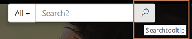  |
| Search/Default/FilterText| All   | This content snippet determines the default text shown in the filter drop-down list next to the search box.   |
| Search/Facet/All| All| This content snippet determines the default text shown for "all records facet" in the "Record Type" facet of the search result page. 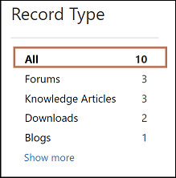 |
| Search/Facet/ClearConstraints   | Clear All  | This content snippet determines the label of the button that resets all the facets applied in the search results page. 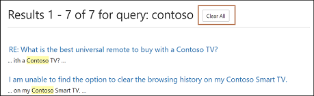 |
| Search/Facet/Downloads   | Downloads   | This content snippet determines the label displayed in the search results of annotation attachments and web file records in the "Record Type" facet. 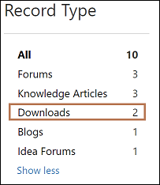|
| Search/Facet/Less    | Show less  | This content snippet determines the label of the button that collapses facet results. 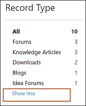 |
| Search/Facet/ModifiedDate  | Modified date  | This content snippet determines the label of the header shown for the Modified date facet. 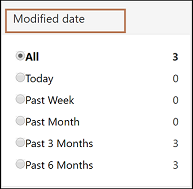   |
| Search/Facet/More   | Show more  | This content snippet determines the label of the button that expands facet results. 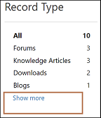  |
| Search/Facet/Product  | Products | This content snippet determines the label of the Products facet. 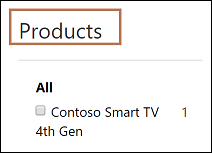  |
| Search/Facet/Rating   | Rating   | This content snippet determines the label of the Rating facet. 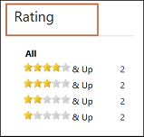  |
| Search/Facet/RecordType   | Record Type | This content snippet determines the label of the Record Type facet. 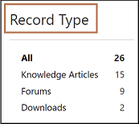     |
| Search/Facet/SortOrder/AverageUserRating | Average User Ratings | This content snippet determines the label shown for the "Sort by Average User Ratings" option in the sorting drop-down list on the Search Results page. 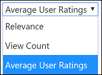  |
| Search/Facet/SortOrder/Relevance| Relevance| This content snippet determines the label shown for the "Sort by Relevance" option in the sorting drop-down list on the Search Results page. 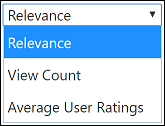|
| Search/Facet/SortOrder/Views| View Count| This content snippet determines the label shown for the "Sort by View Count" option in the sorting drop-down list on the Search Results page. 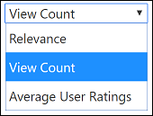|
|||

## Table-specific handling

- **Case**: By default, the only cases that are searchable are in the **Resolved** state with the **Publish to Web** field set to **True**. This behavior can be modified by updating the Portal Search view of the Case table and removing the filters available in the Portal Search view. However, when this check is removed, it's important to ensure that the Customer Service – Case web template is modified appropriately, as this web template restricts all users from viewing cases that are active and are not published to the web. If the web template is not modified, cases will be visible in search results. However, when you select them, the case detail web page is displayed with the Permission denied error.

- **Knowledge Base**: Knowledge articles are searchable only if they are in the **Published** state with the **Internal** field set to **No**. This behavior cannot be modified. Knowledge articles also have special functionality available in search results as follows:

    - **Facets**: Two special facets are available only for knowledge articles and are displayed if knowledge article records are available in search results.

        - **Ratings facet**: This facet allows you to filter search results based on the average rating of knowledge articles.

        - **Product facet**: This facet allows you to filter search results based on the product associated to the knowledge articles.

    - **Attachment search**: This functionality allows you to search within the attachments or notes associated to a knowledge article. This allows you to search within note description, title, attachment file name, and attachment content of notes or attachments that are exposed on the portal. More information: [Search within file attachment content](search-file-attachment.md)

## Special characters and syntax supported by search

As part of portal global search, a variety of special characters and syntaxes are supported to filter search results better. These special characters and syntaxes are broadly divided into the following groups:

- **Term**: Every query entered by a user for search is parsed into terms and operators. Following are the types of terms: 

    - **Single term**: Single term is a single word. For example, a query {hello world} would be parsed into two single terms, "hello" and "world". Each single term is searched separately. Therefore, in the query {hello world}, all the records having the term "hello" or "world" would be displayed in search results.

    - **Phrases**: A phrase is a group of terms surrounded by double quotes (""). For example, a query {"hello world"} would be parsed as a phrase "hello world". Each phrase is searched completely. Therefore, in the query {"hello world"}, all the records having the complete phrase "hello world" would be displayed in search results and any record that only has "hello" or "world" would not be displayed.

    Each search query can consist of one or many of these terms of any type that are combined using Boolean operators to create complex queries.

- **Term modifiers**

    - **Wildcard search**: There are two types of wildcards available to be used within single terms of search queries (not within phrase queries): Single character wildcard search and multiple character wildcard search.

        - **Single character wildcard search**: To perform a single character wildcard search, use the question mark (?) symbol. The single character wildcard search looks for terms that match that with the single character replaced. For example, to search for "text" or "test" you can use the search query as "te?t".

        - **Multiple character wildcard search**: To perform a multiple character wildcard search, use the asterisk (\*) symbol. Multiple character wildcard searches look for zero or more characters. For example, to search for test, tests or tester, you can use the search query as "test*". You can also use multiple character wildcard search in the middle of the query. For example, "te*t".

        > [!NOTE]
        > - You cannot use a * or ? symbol as the first character of a search.
        > - Wildcard search cannot be used in a phrase query. For example, if you use query as "hell* world", it will not display results with the "hello world" text.

    - **Proximity search**: Proximity search allows you to search words that are within a specific distance from each other. For example, if you want results for the words "Picture" and "blurry" appearing within 10 words of each other, you can use proximity search.
    
        To do proximity searches, use the tilde (~) symbol at the end of the query. For example, if you want results for the words "Picture" and "blurry" appearing within 10 words of each other, then the query would be "Picture blurry"~10.

    - **Boosting a term**: Global search provides the relevance level of matching documents based on the terms found. To boost a term, use the caret (^) symbol with a boost factor (a number) at the end of the term you're searching. The higher the boost factor, the more relevant the term will be.

        Boosting allows you to control the relevance of a document by boosting its term. For example, if you're searching for Smart TV and you want the term Smart to be more relevant, boost it using the ^ symbol along with the boost factor next to the term. You would type: Smart^4 TV. This will make documents with the term Smart appear more relevant.

        You can also boost phrase terms as in the example: Smart TV^4 New TV. In this case, the "Smart TV" phrase would be boosted in comparison to "New TV".

        By default, the boost factor is 1. Although the boost factor must be positive, it can be less than 1 (for example, 0.2).

- **Boolean operators**: Boolean operators allow terms to be combined through logic operators. Global search supports OR, AND, NOT, "+", and "-" as Boolean operators.

    > [!NOTE]
    > Boolean operators must be written in uppercase.

    - **OR**: The OR operator is the default conjunction operator. This means that if there is no Boolean operator between two terms, the OR operator is used. The OR operator links two terms and finds a matching record if either of the terms exists in a record. This is equivalent to a union using sets. The symbol || can be used in place of the word OR. For example, the search query "Smart TV" (excluding quotation marks) will search for all records with the word Smart or TV in them. This query can also be written as "Smart OR TV", "Smart || TV".

    - **AND:** The AND operator matches records where both terms exist anywhere in the text of a single document. This is equivalent to an intersection using sets. The symbol && can be used in place of the word AND. For example, the search query "Smart AND TV" (excluding quotation marks) will search for all records with the words Smart and TV in them. This query can also be written as "Smart && TV".

    - **NOT**: The NOT operator excludes records that contain the term after NOT. This is equivalent to a difference using sets. The symbol ! can be used in place of the word NOT. For example, the search query "Smart NOT TV" (excluding quotation marks) will search for all records that have the word Smart but don't have the word TV in them. This query can also be written as "Smart ! TV".

    - **Plus (+) symbol**: The plus (+) symbol, also known as the required operator, requires that the term after the "+" symbol exists somewhere in a record. For example, the search query "Smart + TV" will search for all records where the word TV must be present, and the word Smart may be present as well. 

    - **Minus (–) symbol**: The minus (-) symbol, also known as the prohibit operator, excludes documents that contain the term after the "-" symbol. For example, the search query "Smart - TV" will search for all records where the word Smart is present, and the word TV must not be present.

- **Grouping**: Portal global search supports using parentheses to group clauses to form sub queries. This can be useful if you want to control the Boolean logic for a query. For example, if you want to search for all records where either one of the terms "HD" or "Smart" is present but the word TV is always present, then the query can be written as "(HD or Smart) AND TV" (excluding quotation marks).

## Liquid search tag

You can invoke portal global search from liquid templates by using the *searchindex* tag. More information: [searchindex](../liquid/portals-entity-tags.md#searchindex)

> [!IMPORTANT]
> When you use the searchindex tag, facets are not returned as part of results, nor can they be applied as a filter.

## Update search index

Search index updates in Power Apps portals happen automatically like the cache invalidation. Keep these important things in mind, though:

- All search-enabled tables must have the Change Notification metadata flag enabled, otherwise the portal will not be notified of the changes and the search index will not be updated.

- Any change can take up to 30 minutes to be reflected in a portal search. However, 95 percent of the changes will be updated within 15 minutes. If attachments are involved, it can take longer depending on the size of the attachment.

- it's advisable to rebuild the full index manually after performing a bulk data migration or bulk updates to records within a short span of time. For details, see [Rebuild full search index](#rebuild-full-search-index).

## Rebuild full search index

Rebuild of full search index is required whenever:

- You make a metadata change to search properties like changing certain query-specific site settings or changing the search view of a table, and so on.
- Bulk data migration or updates are performed.
- A website record, associated to your portal, is changed in a Microsoft Dataverse environment.

You can also rebuild a full search index from a portal.
1.    Sign in to the portal as an administrator.
2.    Navigate to the URL as follows: `<portal_path>/_services/about`
3.    Select **Rebuild search index**.

> [!IMPORTANT]
> - A full index rebuild is a very expensive operation and should not be done during peak hours of usage, as this can bring your portal down.
> - Time taken to rebuild index is proportional to the size of the data eligible for indexing as per your search query configuration, and can range from a few minutes to an hour.

## Remove a table from global search

At times, you might be required to completely remove certain tables from portal global search to ensure that your customers get the right results quickly.

In the following example, we will remove the Case table from portal global search.

### Step 1: Block case table from getting indexed

To block the Case table from getting indexed, you must rename the view of the Case table that defines the record set to be indexed by the portal (defined by the Search/IndexQueryName site setting). By default, the name of that view is Portal Search.

1. Go to [Power Apps](https://make.powerapps.com).

1. Select Solutions.

    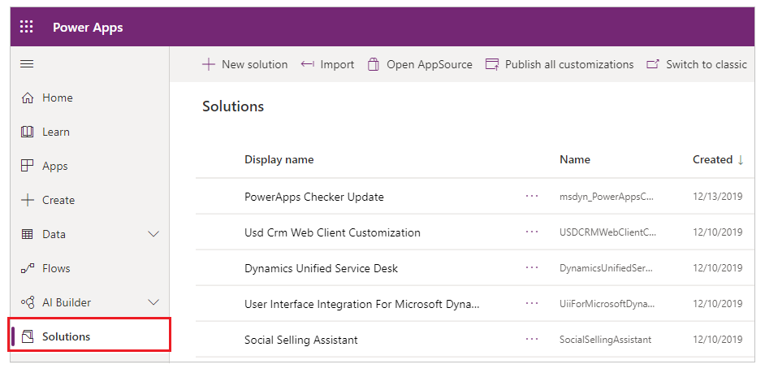

1. Search for **Default Solution** and select Edit to open.

    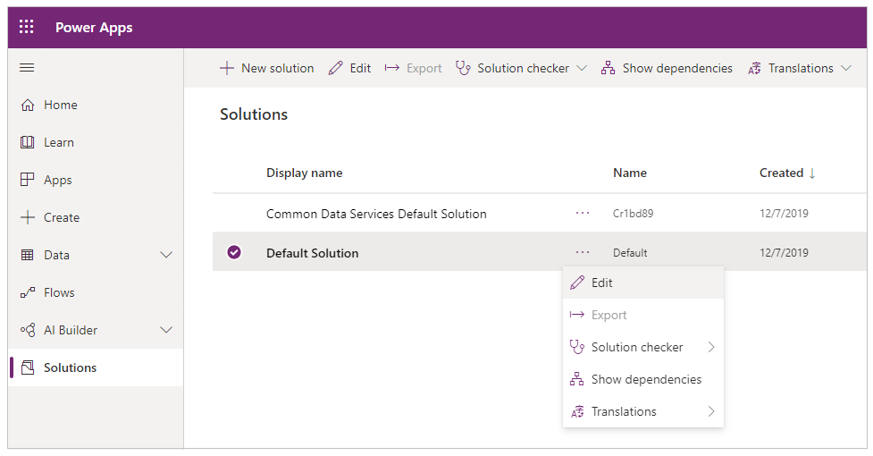

1. Search and edit **Case** table to see its components.

1. Select **Views** tab and then select **Portal Search** to open it in a view editor.

1. In the view editor, rename the view according to your requirement. Ensure the new name doesn't have the *Portal Search* term. 

1. Save and publish the changes and close the view editor.

1. Rebuild the full index as described in the [Rebuild full search index](#rebuild-full-search-index) section.

> [!NOTE]
> In this example, we are making changes in an unmanaged layer by directly editing the view. You can also do this via a managed solution.

### Step 2: Remove case table from the UI

After performing the actions described in Step 1, the Case table would be stopped from getting indexed. To remove the case table from UI surface areas, you must modify the site setting associated with portal global search. The following site setting must be modified:

search/filters: This will remove case table from filters on the Search page as well as the search box in the header of the site. By default, the value is: `Content:adx_webpage,adx_webfile;Blogs:adx_blog,adx_blogpost;Forums:adx_communityforum,adx_communityforumthread,adx_communityforumpost;Ideas:adx_ideaforum,adx_idea;Help Desk:incident;Knowledge:knowledgearticle`

You must delete `Help Desk:incident;` from the value of this site setting so that the Incident table is removed from filters that come next to the search box in the UI.

The modified value will be:

`Content:adx_webpage,adx_webfile;Blogs:adx_blog,adx_blogpost;Forums:adx_communityforum,adx_communityforumthread,adx_communityforumpost;Ideas:adx_ideaforum,adx_idea;Knowledge:knowledgearticle`

Once this site setting is changed, the Case table will be removed from filters on the search page as well as in the header.

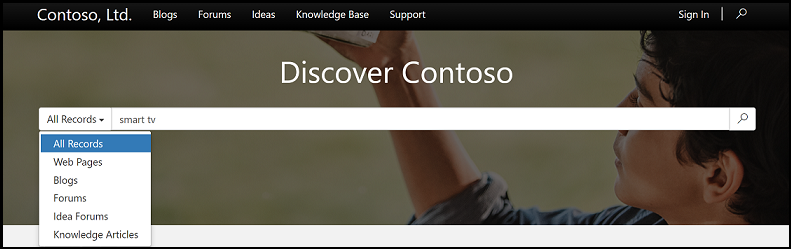

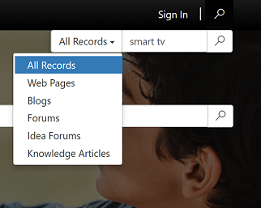

## Next steps

[Configure global search for additional tables](search-additional-entities.md)

### See also

- [Use faceted search](improve-portal-search-faceted-search.md)
- [File attachment search](search-file-attachment.md)

[!INCLUDE[footer-include](../../../includes/footer-banner.md)]