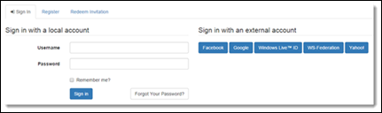
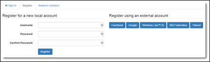
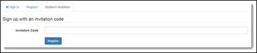
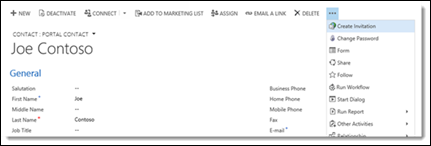
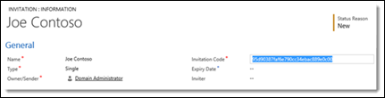
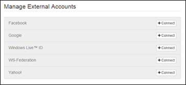

# Local authentication, registration, and other settings

> [!IMPORTANT]
> - We recommend that you use the [Azure Active Directory B2C (Azure AD B2C)](configure-azure-ad-b2c-provider.md) identity provider for authentication and deprecate the local identity provider for your portal. More information: [Migrate identity providers to Azure AD B2C](migrate-identity-providers.md)
> - Configuring local authentication requires that you use the [Portal Management app](configure-portal.md) to configure the required site settings manually.

The portals feature provides authentication functionality built on the [ASP.NET Identity](https://www.asp.net/identity) API. ASP.NET Identity is in turn built on the [OWIN](https://www.asp.net/aspnet/overview/owin-and-katana) framework, which is also an important component of the authentication system. The services provided include:

- Local (username/password) user sign-in
- External (social provider) user sign-in through third-party identity providers
- Two-factor authentication with email
- Email address confirmation
- Password recovery
- Invitation code sign-up for registering prepopulated contact records

> [!NOTE]
> The **Mobile Phone Confirmed** field on the Portal Contact form of the Contact table currently serves no purpose. This field must be used only when upgrading from Adxstudio Portals.

## Requirements

Portals requires:

- Portals Base
- [!INCLUDE[cc-microsoft](../../../includes/cc-microsoft.md)] Identity
- [!INCLUDE[cc-microsoft](../../../includes/cc-microsoft.md)] Identity Workflows solution packages

## Authentication overview

Returning portal visitors can authenticate by using local user credentials or external identity provider accounts. A new visitor can register for a new user account either by providing a username and password or by signing in through an external provider. Visitors who receive an invitation code from the portal administrator can redeem the code while signing up for a new user account.

**Related site settings:**

- `Authentication/Registration/Enabled`
- `Authentication/Registration/LocalLoginEnabled`
- `Authentication/Registration/ExternalLoginEnabled`
- `Authentication/Registration/OpenRegistrationEnabled`
- `Authentication/Registration/InvitationEnabled`
- `Authentication/Registration/RememberMeEnabled`
- `Authentication/Registration/ResetPasswordEnabled`

### Sign in by using a local identity or external identity

The following image shows a sign in option with using a local account, or by selecting an external identity provider.

  

### Sign up by using a local identity or external identity

The following image shows a sign-up screen to register with using a local account, or by selecting an external identity provider.

  

### Redeem an invitation code manually

The following image shows the option to redeem an invitation using the invitation code.

  

## Forgot password or password reset 

Returning visitors who require a password reset (and have previously specified an email address on their user profile) can request a password reset token to be sent to their email account. A reset token allows its owner to choose a new password. The token can also be abandoned, leaving the user's original password unmodified.

**Related site settings:**

- `Authentication/Registration/ResetPasswordEnabled`
- `Authentication/Registration/ResetPasswordRequiresConfirmedEmail`

**Related process:** Send a password reset to a contact

1.  Customize the email in the workflow as necessary.
2.  Submit the email to invoke the process.
3.  The visitor is prompted to check email.
4.  The visitor receives the password reset email with instructions.
5.  The visitor returns to the reset form.
6.  The password reset is complete.

## Redeem an invitation

Redeeming an invitation code allows a registering visitor to be associated with an existing contact record that was prepared in advance specifically for that visitor. Typically, the invitation codes are sent out by email, but you can use a general code submission form to send codes though other channels. After a valid invitation code is submitted, the normal user registration (sign-up) process takes place to set up the new user account.

**Related site setting:**

`Authentication/Registration/InvitationEnabled`

**Related process:** Send invitation

The email sent by this workflow must be customized by using the URL to the redeem invitation page on the portal: https://portal.contoso.com/register/?returnurl=%2f&invitation={Invitation Code(Invitation)}

1. Create an invitation for a new contact.

      

2. Customize and save the new invitation.

      

3. Customize the invitation email.
4. Process the [Send invitation](invite-contacts.md) workflow.
1. The invitation email opens the redemption page.
1. The user signs up by using the submitted invitation code.

      

### Disabled registration

If registration is disabled for a user after the user has redeemed an invitation, display a message by using the following content snippet:

**Name**: Account/Register/RegistrationDisabledMessage

**Value**: Registration has been disabled.

## Manage user accounts through profile pages

Authenticated users manage their user accounts through the **Security** navigation bar of the profile page. Users aren't limited to the single local account or single external account they chose at user registration time. Users who have an external account can choose to create a local account by applying a username and password. Users who started with a local account can choose to associate multiple external identities to their account. The profile page is also where the user is reminded to confirm their email address by requesting a confirmation email to be sent to their email account.

**Related site settings:**

- `Authentication/Registration/LocalLoginEnabled`
- `Authentication/Registration/ExternalLoginEnabled`
- `Authentication/Registration/TwoFactorEnabled`

## Set or change a password

A user who has an existing local account can apply a new password by providing the original password. A user who doesn't have a local account can choose a username and password to set up a new local account. The username can't be changed after it's set.

**Related site setting:**

`Authentication/Registration/LocalLoginEnabled`

**Related processes:**
- Create a username and password.
- Change an existing password.

## Confirm an email address

Changing an email address (or setting it for the first time) puts it into an unconfirmed state. The user can request a confirmation email to be sent to their new email address, and the email will include instructions to the user for completing the email confirmation process.

**Related process:** Send an email confirmation to a contact

1. Customize the email in the workflow as necessary. 
2. The user submits a new email, which is in an unconfirmed state.
3. The user checks email for confirmation.
4. Customize the confirmation email.
5. Process the **Send email confirmation to contact** workflow.
6. The user selects the confirmation link to complete the confirmation process.

> [!NOTE]
> Ensure that the primary email is specified for the contact, because the confirmation email is sent only to the primary email (emailaddress1) of the contact. The confirmation email isn't sent to the secondary email (emailaddress2) or alternate email (emailaddress3) of the contact record.

## Enable two-factor authentication

The two-factor authentication feature increases user account security by requiring proof of ownership of a confirmed email in addition to the standard local or external account sign-in. A user trying to sign in to an account that has two-factor authentication enabled is sent a security code to the confirmed email associated with their account. The security code must be submitted to complete the sign-in process. A user can choose to remember the browser that successfully passed the verification, so that the security code won't be required the next time the user signs in from the same browser. Each user account enables this feature individually and requires a confirmed email.

> [!WARNING]
> If you create and enable the **Authentication/Registration/MobilePhoneEnabled** site setting to enable the legacy functionality, an error will occur. This site setting isn't provided out of the box and isn't supported by portals.

**Related site settings:**

- `Authentication/Registration/TwoFactorEnabled`
- `Authentication/Registration/RememberBrowserEnabled`

**Related process:** Send email two-factor code to a contact

1. Enable two-factor authentication.
2. Choose to receive the security code by email.
3. Wait for the email that contains the security code.
4. Process the **Send email two-factor code to contact.** workflow.
5. Two-factor authentication can be disabled.

## Manage external accounts

An authenticated user can connect (register) multiple external identities to their user account, one from each configured identity provider. After the identities are connected, the user can choose to sign in by using any of the connected identities. Existing identities can also be disconnected, as long as a single external or local identity remains.

**Related site setting:**

- `Authentication/Registration/ExternalLoginEnabled`

**External identity provider site settings**

1.  Select a provider to connect to your user account.

      

2.  Sign in by using the provider you want to connect.

The provider is now connected. The provider can also be disconnected.

## Enable ASP.NET identity authentication

The following table describes the settings for enabling and disabling various authentication features and behaviors:

|  Site setting name   | Description |
|----------------------|-------------|
|  Authentication/Registration/LocalLoginEnabled      |      Enables or disables local account sign-in based on a username (or email) and password. Default: true     |
|   Authentication/Registration/LocalLoginByEmail     |   Enables or disables local account sign-in using an email address field instead of a username field. Default: false    |
|  Authentication/Registration/ExternalLoginEnabled    |    Enables or disables external account sign-in and registration. Default: true   |
|  Authentication/Registration/RememberMeEnabled       |    Selects or clears a **Remember me?** check box on local sign-in to allow authenticated sessions to persist even when the web browser is closed. Default: true   |
|  Authentication/Registration/TwoFactorEnabled   |   Enables or disables the option for users to enable two-factor authentication. Users with a confirmed email address can opt in to the added security of two-factor authentication. Default: false    |
|  Authentication/Registration/RememberBrowserEnabled   |  Selects or clears a **Remember browser?** check box on second-factor validation (email code) to persist the second-factor validation for the current browser. The user won't be required to pass the second-factor validation for their next sign-ins, as long as they use the same browser. Default: true    |
|  Authentication/Registration/ResetPasswordEnabled     |    Enables or disables the password reset feature. Default: true   |
| Authentication/Registration/ResetPasswordRequiresConfirmedEmail |   Enables or disables password reset for confirmed email addresses only. If enabled, unconfirmed email addresses can't be used to send password reset instructions. Default: false   |
|   Authentication/Registration/TriggerLockoutOnFailedPassword    |    Enables or disables recording of failed password attempts. If disabled, user accounts won't be locked out. Default: true    |
|   Authentication/Registration/IsDemoMode              |     Enables or disables a demo mode flag to be used in development or demonstration environments only. Don't enable this setting on production environments. Demo mode also requires the web browser to be running locally to the web application server. When demo mode is enabled, the password reset code and second-factor code are displayed to the user for quick access. Default: false   |
|    Authentication/Registration/LoginButtonAuthenticationType    | If a portal only requires a single external identity provider (to handle all authentication), this allows the **Sign-In** button of the header nav bar to link directly to the sign-in page of that external identity provider (instead linking to the intermediate local sign-in form and identity provider selection page). Only a single identity provider can be selected for this action. Specify the *AuthenticationType* value of the provider. For a single sign-on configuration that uses OpenID Connect, such as Azure AD B2C, the user needs to provide the Authority.  For OAuth 2.0&ndash;based providers, the accepted values are: `Facebook`, `Google`, `Yahoo`, `Microsoft`, `LinkedIn`, or `Twitter`  For WS-Federation&ndash;based providers, use the value specified for the `Authentication/WsFederation/ADFS/AuthenticationType` and `Authentication/WsFederation/Azure/[provider]/AuthenticationType` site settings.   Examples: `https://adfs.contoso.com/adfs/services/trust`, `Facebook-0123456789`, `Google`, `Yahoo!`, `uri:WindowsLiveID`. |

## Enable or disable user registration

The following describes the settings for enabling and disabling user registration (sign-up) options.

| Site setting name        | Description       |
|--------------------------|--------------------|
| Authentication/Registration/Enabled                 | Enables or disables all forms of user registration. Registration must be enabled for the other settings in this section to take effect. Default: true                                   |
| Authentication/Registration/OpenRegistrationEnabled | Enables or disables the sign-up registration form for creating new local users. The sign-up form allows any anonymous visitor to the portal to create a new user account. Default: true |
| Authentication/Registration/InvitationEnabled       | Enables or disables the invitation code redemption form for registering users who have invitation codes. Default: true                                                               |
|Authentication/Registration/CaptchaEnabled|Enables or disables captcha on the user registration page. Default: false **Note**: This site setting might not be available by default. To enable captcha, you must create the site setting and set its value to true. |

> [!NOTE]
> Ensure that the primary email is specified for the user, because registration is done by using the primary email (emailaddress1) of the user. The user can't be registered by using the secondary email (emailaddress2) or alternate email (emailaddress3) of the contact record.

## User credential validation

The following describes the settings for adjusting username and password validation parameters. Validation occurs when users sign up for a new local account or change a password.

| Site setting name      | Description                             |
|------------------------|-----------------------------------------|
| Authentication/UserManager/PasswordValidator/EnforcePasswordPolicy      | Determines whether the password contains characters from three of the following categories: <ul><li>Uppercase letters of European languages (A through Z, with diacritic marks, Greek and Cyrillic characters)</li><li>Lowercase letters of European languages (a through z, sharp-s, with diacritic marks, Greek and Cyrillic characters)</li><li>Base 10 digits (0 through 9)</li><li>Nonalphanumeric characters (special characters) (for example, !, $, \#, %)</li></ul>Default: true. More information: [Password policy](/previous-versions/windows/it-pro/windows-server-2008-R2-and-2008/hh994562(v=ws.10)).   |  
| Authentication/UserManager/UserValidator/AllowOnlyAlphanumericUserNames | Determines whether to allow only alphanumeric characters for the username.   Default: false |  
| Authentication/UserManager/UserValidator/RequireUniqueEmail             | Determines whether a unique email address is needed for validating the user.   Default: true |  
| Authentication/UserManager/PasswordValidator/RequiredLength             | The minimum required password length.   Default: `8` |  
| Authentication/UserManager/PasswordValidator/RequireNonLetterOrDigit    | Determines whether the password requires a non-letter or digit character.   Default: false |  
| Authentication/UserManager/PasswordValidator/RequireDigit               | Determines whether the password requires a numeric digit (from 0 through 9).   Default: false |  
| Authentication/UserManager/PasswordValidator/RequireLowercase           | Determines whether the password requires a lowercase letter (from a through z).   Default: false |  
| Authentication/UserManager/PasswordValidator/RequireUppercase           | Determines whether the password requires an uppercase letter (from A through Z).    Default: false | 

## User account lockout settings

The following describes the settings that define how and when an account becomes locked from authentication. When a certain number of failed password attempts are detected in a short timespan, the user account is locked for a period of time. The user can try again after the lockout period elapses.

| Site setting name         | Description            |
|----------------------------|--------------------------------------|
| Authentication/UserManager/UserLockoutEnabledByDefault          | Indicates whether the user lockout is enabled when users are created.   Default: `true` |  
| Authentication/UserManager/DefaultAccountLockoutTimeSpan        | The default amount of time that a user is locked out for after Authentication/UserManager/MaxFailedAccessAttemptsBeforeLockout is reached.   Default: `24:00:00` (1 day) |  
| Authentication/UserManager/MaxFailedAccessAttemptsBeforeLockout | The maximum number of access attempts allowed before a user is locked out (if lockout is enabled).   Default: `5` |  

## Cookie authentication site settings

The following describes settings for modifying default authentication cookie behavior, defined by the CookieAuthenticationOptions class.

| Site setting name   | Description       |
|----------------------|------------------------------------------------|
| Authentication/ApplicationCookie/AuthenticationType                      | The type of the application authentication cookie.   Default: `ApplicationCookie` |
| Authentication/ApplicationCookie/CookieName                              | Determines the cookie name used to persist the identity.   Default: `.AspNet.Cookies` |
| Authentication/ApplicationCookie/CookieDomain                            | Determines the domain used to create the cookie. |
| Authentication/ApplicationCookie/CookiePath                              | Determines the path used to create the cookie.   Default: `/` |
| Authentication/ApplicationCookie/CookieHttpOnly                          | Determines whether the browser should allow the cookie to be accessed by client-side JavaScript.   Default: true |
| Authentication/ApplicationCookie/CookieSecure                            | Determines whether the cookie should only be transmitted on HTTPS request.   Default: `SameAsRequest` |
| Authentication/ApplicationCookie/ExpireTimeSpan                          | Controls how much time the application cookie will remain valid from the moment it was created.   Default: `24:00:00` (1 day) |
| Authentication/ApplicationCookie/SlidingExpiration                       | The SlidingExpiration is set to true to instruct the middleware to reissue a new cookie with a new expiration time whenever it processes a request that's more than halfway through the expiration window.   Default: true |
| Authentication/ApplicationCookie/LoginPath                               | The LoginPath property informs the middleware that it should change an outgoing 401 Unauthorized status code into a 302 redirection onto the given sign-in path.   Default: `/signin` |
| Authentication/ApplicationCookie/LogoutPath                              | If the sign-out path is provided by the middleware, a request to that path will be redirected based on the ReturnUrlParameter. |
| Authentication/ApplicationCookie/ReturnUrlParameter                      | The ReturnUrlParameter determines the name of the query string parameter that's appended by the middleware when a 401 Unauthorized status code is changed to a 302 redirect onto the sign-in path. |
| Authentication/ApplicationCookie/SecurityStampValidator/ValidateInterval | The period of time between security stamp validations.   Default: `30` minutes |
| Authentication/TwoFactorCookie/AuthenticationType                        | The type of two-factor authentication cookie.   Default: `TwoFactorCookie` |
| Authentication/TwoFactorCookie/ExpireTimeSpan                            | Controls how much time a two-factor cookie will remain valid from the moment it was created.   Default: `5` minutes |

## Next steps

[Migrate identity providers to Azure AD B2C](migrate-identity-providers.md)

### See also

[Overview of authentication in Power Apps portals](configure-portal-authentication.md)  
[Configure an OAuth 2.0 provider for portals](configure-oauth2-provider.md)  
[Configure an OpenID Connect provider for portals](configure-openid-provider.md)  
[Configure a SAML 2.0 provider for portals](configure-saml2-provider.md)  
[Configure a WS-Federation provider for portals](configure-ws-federation-provider.md)  
[Microsoft Learn: Power Apps portals authentication settings](/learn/modules/authentication-user-management/2-authentication-settings)  

[!INCLUDE[footer-include](../../../includes/footer-banner.md)]