# Get started with configuring your portal authentication

Setting up authentication is a core customization in any portal. Simplified identity provider configuration in Power Apps portals provides in-app guidance for identity provider setup and abstracts setup complexities. Makers and administrators can easily configure the portal for supported identity providers.

## Overview

You can enable, disable, and configure portal identity providers from [Power Apps](https://make.powerapps.com) by using simplified portal authentication configuration. After you select an identity provider, you can then follow prompts to easily enter the provider settings.

> [!NOTE]
> Changes to the authentication settings [might take a few minutes](../admin/clear-server-side-cache.md#caching-changes-for-portals-with-version-926x-or-later) to be reflected on the portal. Restart the portal by using [portal actions](../admin/admin-overview.md) if you want the changes to be reflected immediately.

**To begin configuring an identity provider for your portal**

1. Go to [Power Apps](https://make.powerapps.com).

1. On the left pane, select **Apps**.

    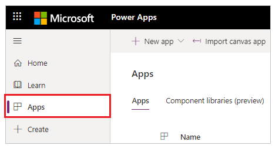

1. Select your portal from the list of available apps.

1. Select **Settings** from the top menu. You can also select **More Commands** (**...**), and then select **Settings**.

    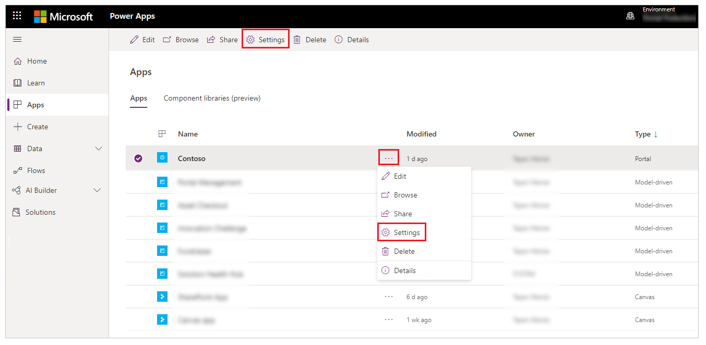

1. From the settings on the right side of your workspace, select **Authentication Settings**.

    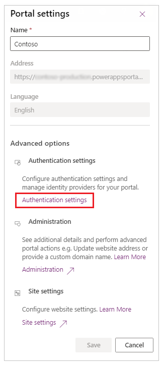

You'll see a list of identity providers that you can configure.

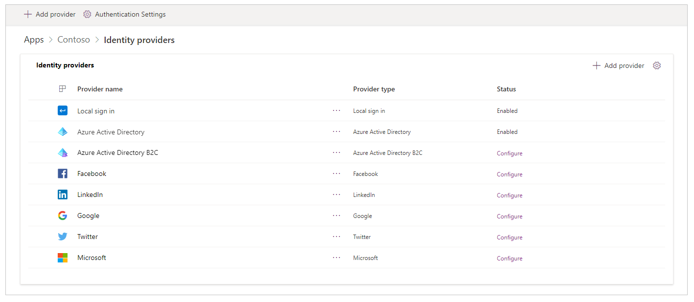

**To view identity providers from the portal details page**

1. Select your portal from the list of available apps.

1. Select **Details** from top menu. You can also select **More Commands** (**...**), and then select **Details**.

    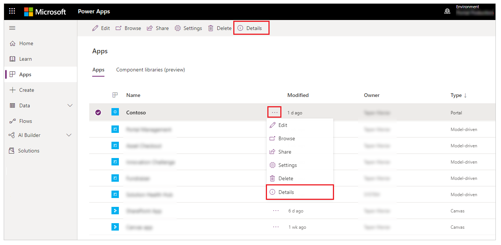

The details page displays the **Identity providers** section.

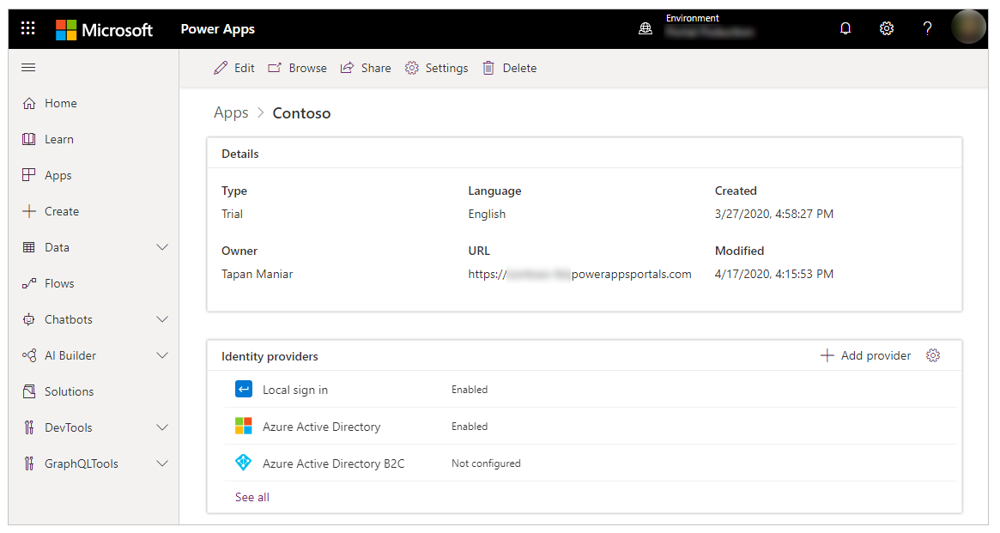

> [!NOTE]
> Selecting **See all** from the portal details page takes you to the complete list of identity providers.

## Configure general authentication settings

You can configure the following general authentication settings by selecting **Authentication Settings** on the **Identity providers** page.

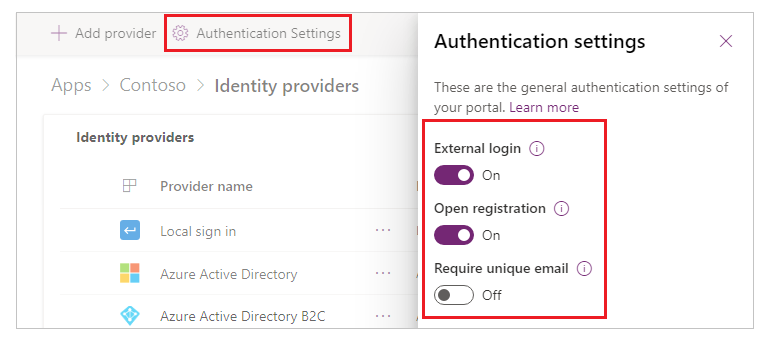

- **External login**: External authentication is provided by the ASP.NET Identity API. Account credentials and password management are handled by third-party identity providers, for example Facebook, LinkedIn, Google, Twitter, and Microsoft. 
  - When set to **On**, users sign up for access to the portal by selecting an external identity to register with the portal. After it's registered, an external identity has access to the same features as a local account. See [Manage external accounts](set-authentication-identity.md#manage-external-accounts) for related site settings. 
  -  When set to **Off**, external account registration and sign-in are disabled and hidden.

- **[Open registration](configure-portal-authentication.md#open-registration)**: Enables or disables the sign-up registration form for creating new local users.
  - When set to **On**, the sign-up form allows any anonymous user to visit the portal and create a new user account.
  - When set to **Off**, new user account registration is disabled and hidden.

- **Require unique email**: Specifies whether a unique email address is needed for validating a new user during sign-up.
  -  When set to **On**, a sign-up attempt might fail if a user provides an email address that's already present in a contact record.
  -  When set to **Off**, a contact that uses a duplicate email address can be created.

You can also go to general authentication settings from the portal details page by selecting **Settings** in the upper-right corner of the **Identity providers** section.

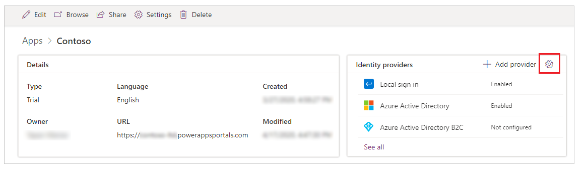

## Configure a default identity provider

You can set any identity provider as the default. When an identity provider is set as the default, users signing in to the portal aren't redirected to the portal sign-in page. Instead, the sign-in experience always defaults to signing in by using the selected provider.

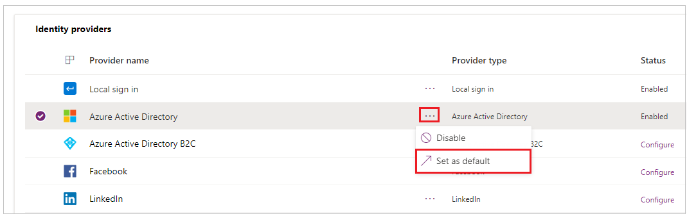

> [!IMPORTANT]
> If you set an identity provider as the default, users won't have the option to choose any other identity provider.

After you set an identity provider as the default, you can select **Remove as default** to remove it. After you remove an identity provider from being the default, users will be redirected to the portal sign-in page and can choose from the identity providers you've enabled.

> [!NOTE]
> You can only set a configured identity provider as the default. The **Set as default** option becomes available after you configure an identity provider.

## Add, configure, or delete an identity provider

Several identity providers that you can configure are added by default. You can add additional Azure Active Directory (Azure AD) B2C providers, or configure the available OAuth 2.0 providers such as LinkedIn or Microsoft.

> [!NOTE]
> - You can't change the configuration of the **Local sign in** and **Azure Active Directory** providers when using this interface.
> - You can have only one instance of each identity provider type for OAuth 2.0, such as **Facebook**, **LinkedIn**, **Google**, **Twitter**, and **Microsoft**.
> - Updates to identity provider configuration might take a few minutes to be reflected on the portal. To apply your changes immediately, you can [restart the portal](../admin/admin-overview.md#open-power-apps-portals-admin-center).
> - If you [add a custom domain name](../admin/add-custom-domain.md) or [change the base URL of your portal](../admin/change-base-url.md), you must re-create the provider configuration by using the correct URL.

### Add or configure a provider

To add an identity provider, select **Add provider** from **Authentication Settings**.

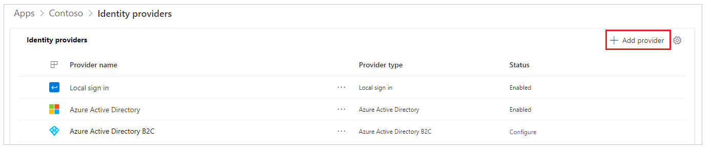

> [!TIP]
> You can also select **Add provider** from the [portal details page](#authentication-settings-from-the-portal-details-page).

Select from the available list of providers, enter a name, and then select **Next** to configure the provider settings.

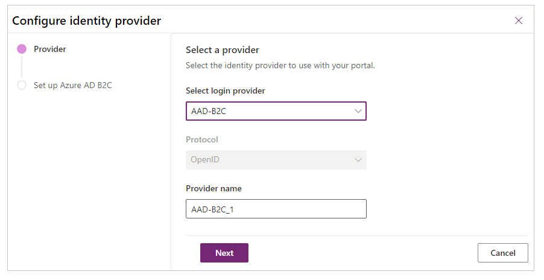

> [!NOTE]
> The **Provider name** you enter here is displayed on the sign-in page for users as the text on the button they use when selecting this provider.

To configure a provider, select **Configure** (or select **More Commands** (**...**), and then select **Configure**).

> [!NOTE]
> You can use **Add provider** or **Configure** to add or configure a provider for the first time. After you configure a provider, you can edit it. You can also select the provider name hyperlink to open the configuration options quickly.

The configuration steps after you select **Next** depend on the type of identity provider you select. For example, how you set up Azure AD B2C is different from how you set up LinkedIn. The following table lists the providers and protocols that you can select from.

| Available providers | Available protocols | Description |
| - | - | - |
| Azure AD B2C | OpenID Connect | Allows configuration of Azure AD B2C for authentication in portals using OpenID Connect protocol.   More information: [Configure the Azure AD B2C provider](configure-azure-ad-b2c-provider.md), [Configure the Azure AD B2C provider manually](configure-azure-ad-b2c-provider-manual.md) |
| Facebook | OAuth 2.0 | Allows configuration of Facebook as the authentication provider in portals using OAuth 2.0 protocol.   More information: [Configure Facebook provider](configure-oauth2-facebook.md) |
| LinkedIn | OAuth 2.0 | Allows configuration of LinkedIn as the authentication provider in portals using OAuth 2.0 protocol.   More information: [Configure LinkedIn provider](configure-oauth2-linkedin.md) |
| Google | OAuth 2.0 | Allows configuration of Google as the authentication provider in portals using OAuth 2.0 protocol.   More information: [Configure Google provider](configure-oauth2-google.md) |
| Twitter | OAuth 2.0 | Allows configuration of Twitter as the authentication provider in portals using OAuth 2.0 protocol.   More information: [Configure Twitter provider](configure-oauth2-twitter.md) |
| Microsoft | OAuth 2.0 | Allows configuration of Microsoft as the authentication provider in portals using OAuth 2.0 protocol.   More information: [Configure Microsoft provider](configure-oauth2-microsoft.md) |
| Other | OpenID Connect | Allows configuration of any provider that conforms to the [OpenID Connect](https://openid.net/specs/openid-connect-core-1_0.html) protocol specification.   Examples:   - [Configure Azure AD as the OpenID Connect provider](configure-openid-settings.md)   - [Configure Azure AD B2C as the OpenID Connect provider](configure-azure-ad-b2c-provider.md) |
| Other | SAML 2.0 | Allows configuration of any provider that conforms to the SAML 2.0 protocol specifications.   Examples:   - [Configure Azure AD as the SAML 2.0 provider](configure-saml2-settings-azure-ad.md)   -  [Configure AD FS as the SAML 2.0 provider](configure-saml2-settings.md) |
| Other | WS-Federation | Allows configuration of any provider that conforms to the WS-Federation protocol specifications.   Examples:   - [Configure Azure AD as the WS-Federation provider](configure-ws-federation-settings-azure-ad.md)   -  [Configure AD FS as the WS-Federation provider](configure-ws-federation-settings.md) |

### Edit a provider

After you add and configure a provider, you can see the provider in the **Enabled** state on portal settings or details pages.

To edit a provider you've configured, select it, select **More Commands** (**...**), and then select **Edit configuration**.

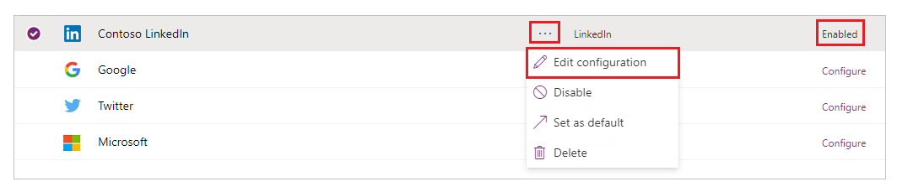

Refer to the provider-specific articles to edit settings for the provider type you selected.

### Delete a provider

To delete an identity provider, select **More Commands** (**...**), and then select **Delete**.

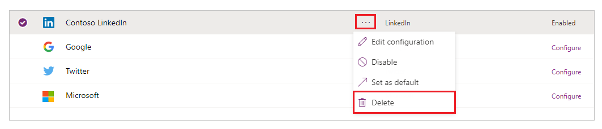

Deleting a provider deletes your provider configuration for the selected provider type, and the provider becomes available again for configuration.

> [!NOTE]
> When you delete a provider, only the portal configuration for the provider is deleted. For example, if you delete the LinkedIn provider, your LinkedIn app and app configuration remain intact. Similarly, if you delete an Azure AD B2C provider, only the portal configuration is deleted; the Azure tenant configuration for this provider won't change.

### Error caused by deleting and re-creating a portal

If you delete and re-create your portal, users might receive the following error when signing in. When this issue happens, update the portal's identity provider configuration correctly.

`Sorry, but we're having trouble signing you in.`

`AADSTS700016: Application with identifier 'https://contoso.powerappsportals.com/' was not found in the directory 'xxxxxxxx-xxxx-xxxx-xxxx-xxxxxxxxxxxx'. This can happen if the application has not been installed by the administrator of the tenant or consented to by any user in the tenant. You may have sent your authentication request to the wrong tenant.`

### See also

[Configure the Azure AD B2C provider for portals](configure-azure-ad-b2c-provider.md)  
[Configure an OAuth 2.0 provider for portals](configure-oauth2-provider.md)  
[Configure an OpenID Connect provider for portals](configure-openid-provider.md)  
[Configure a SAML 2.0 provider for portals](configure-saml2-provider.md)  
[Configure a WS-Federation provider for portals](configure-ws-federation-provider.md)  
[Microsoft Learn: Authentication and user management in Power Apps portals](/learn/modules/authentication-user-management/)

[!INCLUDE[footer-include](../../../includes/footer-banner.md)]