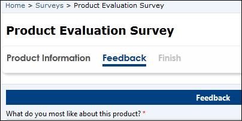
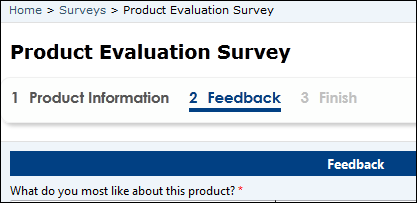
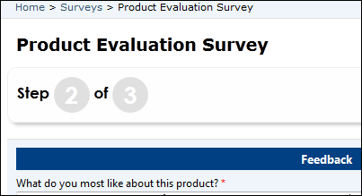
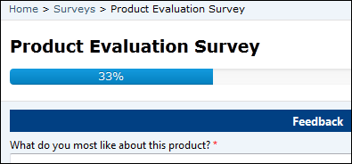

# Define advanced form properties for portals

The advanced form contains relationships to webpages and a start step to control the initialization of the form within the portal. The relationship to the webpage allows dynamic retrieval of the form definition for a given page node within the website.  

The other options on the advanced form record itself control top-level preferences for the multiple-step process as a whole, for example whether you'd like to display a progress bar.

To view existing Advanced forms or to create new advanced forms, open the [Portal Management app](configure-portal.md) and go to **Portals** > **Advanced Forms**.

> [!NOTE]
> Before you continue, ensure you review [considerations](#considerations) for advanced forms.

<!---
> [!Note]
> - A **Advanced Form** must be associated with a webpage for a given website for the form to be viewable within the site.
> - Field level code components are in public preview, and can be added to forms. More information: [Add a code component to a field in a model-driven app](../component-framework.md#add-a-code-component-to-a-field-in-a-model-driven-app)
-->

When creating or editing a webpage from the the [Portal Management app](configure-portal.md), a **Advanced Form** can be specified in the lookup field provided on the **New Web Page** form.

## Advanced form attributes

The following attributes and relationships determine the functionality of the Advanced form.

|                Name                 |                                                                                                                                                                                        Description                                                                                                                                                                                         |
|-------------------------------------|--------------------------------------------------------------------------------------------------------------------------------------------------------------------------------------------------------------------------------------------------------------------------------------------------------------------------------------------------------------------------------------------|
|                Name                 |                                                                                                                                                                          A title of the form used for reference.                                                                                                                                                                           |
|             Start Step              |                                                                                The first step of the form. An Advanced Form will consist of one or more steps. For more information about these steps please refer to the section titled Advanced Form Step found below. The first step cannot be of type Condition.                                                                                |
|       Authentication Required       |                                                                              If checked, when a user who is not signed in visits the page that contains the form, they will be redirected to the sign-in page. Upon successful sign-in, the user will be redirected back to the page that contains the form.                                                                               |
|      Start New Session On Load      |              Selecting **Yes** indicates that if the user opens the form in a new browser or new tab, or closes the browser or page and returns, the form will start a completely new session and begin at the first step. Otherwise the session will be persisted and the user can close the browser or page and resume later exactly where they left off. Default: **No**.               |
| Multiple Records Per User Permitted |                                                                                                  Selecting **Yes** indicates that a user is permitted to create more than one submission. This assists the form in determining what to do when a user revisits a form. Default: **Yes**.                                                                                                   |
|       Edit Expired State Code       |                                                                                                                    The target entity's state code integer value that, when combined with the status reason, indicates when an existing record can no longer be edited.                                                                                                                     |
|     Edit Expired Status Reason      |                                                                       The target entity's status code integer value that, when combined with the state code, indicates that when an existing record has these values the record is not to be edited anymore&mdash;for example, when a record is updated as complete.                                                                       |
|        Edit Expired Message         | The message displayed when the existing record's state code and status reason match the values specified. For each language pack installed and enabled for the organization, a field will be available to enter the message in the associated language. Default message; You have already completed a submission. Thank you! |
|                                     |                                                                                                                                                                                                                                                                                                                                                                                            |

## Progress indicator settings

| Name                              | Description                                                                                          |
|-----------------------------------|------------------------------------------------------------------------------------------------------|
| Enabled                           | Check to display the progress indicator. Default: **Disabled**.                                      |
| Type                              | One of the following: Title, Numeric (Step x of n), and Progress Bar. Default: **Title**                                                                                    |
| Position                          | One of the following: Top, Bottom, Left, Right. Position is relative to the form. Default: **Top**.                                                   |
| Prepend Step Number to Step Title | Check to add the number of the step to the beginning of the title of the step. Default is unchecked. |
||

Example of the various progress indicator types:

**Title**

  

**Title with Step Number prepended**

  

**Numeric**

  

**Progress Bar**

  

## “Save changes” warning 

|                 Name                  |                                                                                                                                Description                                                                                                                                |
|---------------------------------------|---------------------------------------------------------------------------------------------------------------------------------------------------------------------------------------------------------------------------------------------------------------------------|
| Display Save Changes Warning On Close |                         Select to display a warning message if the user has made changes to field(s) and they try to reload the page, close the browser, select the browser's back button, or select the previous button in a multiple step form.                         |
|     Save Changes Warning Message      | For each language pack installed and enabled for the organization, a field will be available to enter the message in the associated language. If no message is specified, the browser's default will be used. |
|                                       |                                                                                                                                                                                                                                                                           |

Example:

  

>[!NOTE]
> Because of the recent changes related to browsers support for custom text in *beforeunload* event, the ability to specify a custom message using "Save changes" warning is limited to only Internet Explorer 11. More information: [onbeforeunload event in Internet Explorer](/previous-versions/windows/internet-explorer/ie-developer/platform-apis/aa741880(v=vs.85)), [Browser compatibility](https://developer.mozilla.org/docs/Web/API/Window/beforeunload_event#browser_compatibility)

## Geolocation configuration for advanced form

A managed form can be configured to display a map control to either display an existing location as a pin on a map or to provide the ability for the user to specify a location. See [Add Geolocation](add-geolocation.md).

The form's map control requires additional configuration to tell it what the IDs of the various location fields are, to assign values to them or retrieve values from them. The Advanced Form Step record has a section that defines these field mappings that you must assign values for. The field names will vary depending on the schema you have created.

> [!Note]
> The Geolocation section is not visible in the German Sovereign Cloud environment. If a user has enabled geolocation by using a different form, it will not be displayed during rendering on portal.

## Considerations

- A **Advanced Form** must be associated with a webpage for a given website for the form to be viewable within the site.
- Field level code components are in public preview, and can be added to forms. More information: [Add a code component to a field in a model-driven app](../component-framework.md#add-a-code-component-to-a-field-in-a-model-driven-app)
- Rollup columns on portal forms may sometimes show up as editable although they're intended to be read-only. To ensure that these columns remain read-only, mark the column as **Read-only**  on the model-driven app form.

### See also

[Configure a portal](configure-portal.md)  
[Define basic forms](entity-forms.md)  
[Advanced Form steps for portals](web-form-steps.md)  
[Advanced Forms metadata for portals](configure-web-form-metadata.md)  
[Advanced Form subgrid configuration for portals](configure-web-form-subgrid.md)  
[Notes configuration for Advanced Forms for portals](../configure-notes.md)  

[!INCLUDE[footer-include](../../../includes/footer-banner.md)]