# Manage page permissions

You use page permissions to control user access to portal webpages. For example, you can allow pages to be available anonymously for public access, or restrict access to users who have specific roles. Depending on business requirements, you can manage the inheritance of page permissions from a parent page to a child page. A page can have child [web files](web-files.md)&mdash;such as downloadable documents, CSS files, or JS files&mdash;and you can also manage the inheritance of page permissions from the page to such child web files.

You can manage page permissions in two ways:

- [Power Apps portals Studio](#manage-page-permissions-using-portals-studio)
- [Portal Management app](#manage-page-permissions-using-portal-management-app)

Power Apps portals Studio simplifies the configuration of webpage access permissions compared to using the Portal Management app, and is the recommended method. Managing page permissions with the Portal Management app is accomplished by setting *webpage access control rules*. You can also set these webpage access control rules by using portals Studio, but you must use the Portal Management app to manage page permissions for other areas that can't be managed using portals Studio.

> [!NOTE]
> Managing page permissions with portals Studio applies only to [Restrict Read](#restrict-read) permissions, which control access to pages by users. To manage [Grant Change](#grant-change) permissions for managing and publishing content pages with the legacy portal content editor, use the [Portal Management app](#manage-page-permissions-using-portal-management-app).

## Manage page permissions with Power Apps portals Studio

Not only can you use portals Studio to customize your portal, you can manage page permissions quickly and efficiently.

<!--markdownlint-disable MD036-->
**To get started with managing page permissions using portals Studio**

1. Go to [Power Apps](https://make.powerapps.com).

1. On the left pane, select **Apps**.

    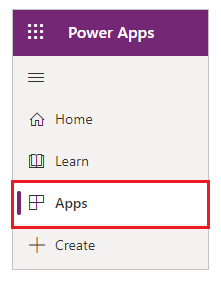

1. Select your portal.

1. Select **Edit** to open the portal in portals Studio.

    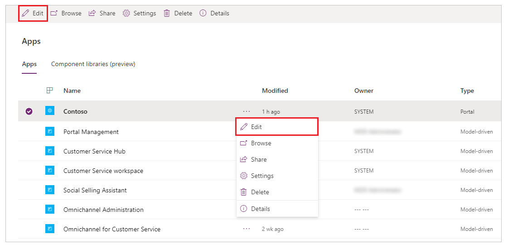

    More information: [Edit the portal](../manage-existing-portals.md#edit) and [Studio anatomy](../portal-designer-anatomy.md)

1. Select the page that you want to manage permissions for.

    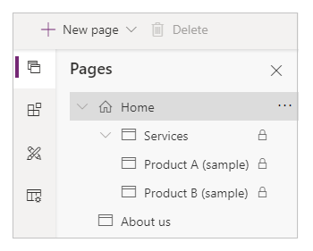

1. On the **Component** pane, expand **Permissions**.

    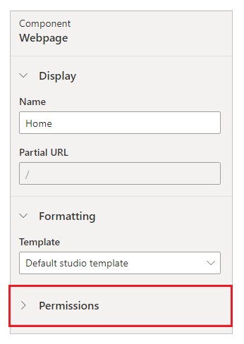

The options under **Permissions** vary depending on the page you've selected. For example, the options for a parent page will be different from the options for the child page that inherited permissions from the parent page.

Let's look at different options for managing permissions for a page.

### Allow anonymous access to a page

A page with **Page available to everyone** set to **On** is available anonymously. This option is available on the root page of a website, or a child page that has the parent page with this option set to **On**.

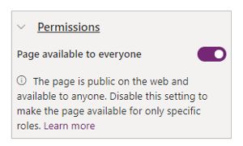

### Restrict access to a page

When **Page available to everyone** is set to **Off**, the page isn't available to anyone by default. You can select specific roles that you want to allow access to this page.

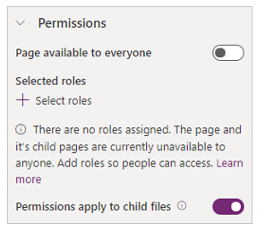

Use **Select roles** to choose which roles will be allowed to access the page. Only users from the roles you select here will have access.

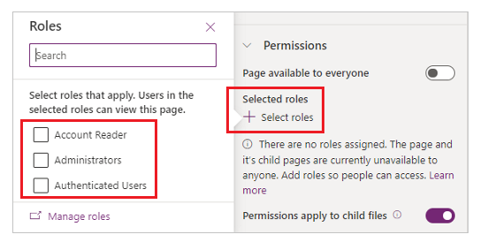

#### Anonymous Users role

Any role with the [**Anonymous Users** role](create-web-roles.md#attributes-and-relationships) set to **Yes** is excluded from the list of roles that you can select for restricting access to a page.

If the Portal Management app was used to configure this role for the selected page, an alert is shown for the applicable role when you manage the page permissions.

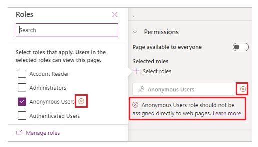

If this alert appears, change the permissions, because roles with **Anonymous Users Role** set to **Yes** can't be assigned directly to users.

#### Permissions apply to child files

When **Permissions apply to child files** is set to **On**, the child [web files](web-files.md) of that page are only available to the users who can access this webpage. When set to **Off**, everyone can access the child web files of the selected page.

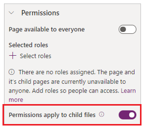

> [!CAUTION]
> **Permissions apply to child files** must be set to **Off** for the home page for the portal. Web files such as Bootstrap.min.css and Theme.css used by themes are under the home page. If you restrict these files to only authenticated users, styles won't be applied to any pages, including the sign-in pages that are available anonymously.

#### Restriction in page hierarchy

When a page is set to **Off** for **Page available to everyone**, a lock icon appears next to it in the list of pages to signify that the page has restrictions.

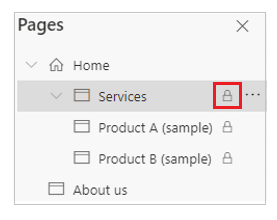

### Child page permissions

A child page can inherit permissions from the parent page, or it can be configured with unique permissions.

#### Inherit permissions from a parent page

**Permissions** section shows **Inherit parent page permissions** when a child page is selected that has the parent page with **Page available to everyone** set to **Off**.

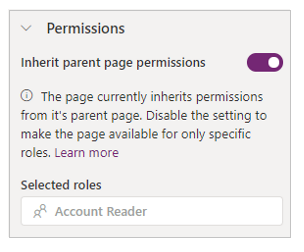

By default, every child page has **Inherit parent page permissions** set to **On**. This setting makes the child page available to all the users who can access its parent page.

#### Configure child page with unique permissions

When a child page has **Inherit parent page permissions** set to **Off**, the child page&mdash;and the pages that this child page is a parent of&mdash;aren't available to the users from the selected roles for the parent page access.

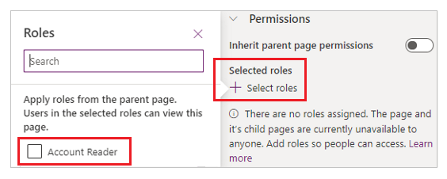

Select specific roles that you want to allow to access this child page and the pages that this child page is a parent of.

#### Child page permissions apply to child files

When **Permissions apply to child files** is set to **On**, the child [web files](web-files.md) of that page are only available to the users who can access this webpage. When set to **Off**, everyone can access the child web files of the selected page.

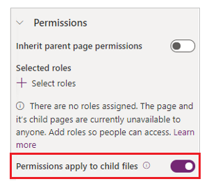

### The effect of subpage changes on permissions

A page can be promoted to a higher level in the page hierarchy, or made a subpage to a lower level in page hierarchy. The effects these actions have on permissions are as follows:

- If a page is made a subpage, the page inherits permissions from its new parent.

  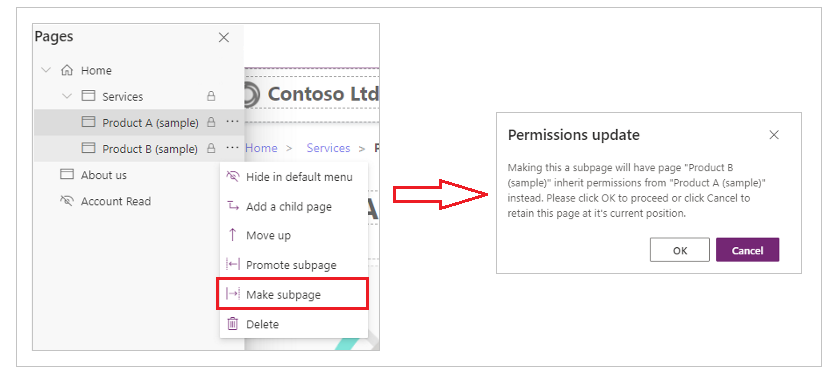

- If a page is promoted, the original permissions of the page are retained.

## Manage page permissions with the Portal Management app

Using the Portal Management app, you can manage page permissions through webpage access control rules. These rules allow you to control the publishing actions that a web role can perform across the pages of your website. Also, you can control which pages are visible to which web roles.

### Webpage access control rules

**To manage webpage access control rules with the Portal Management app**

1. Go to [Power Apps](https://make.powerapps.com).

1. On the left pane, select **Apps**.

    

1. Select **Portal Management**.

    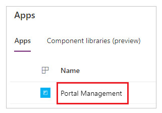

1. On the left pane, under **Security**, select **Web Page Access Control Rules**.

    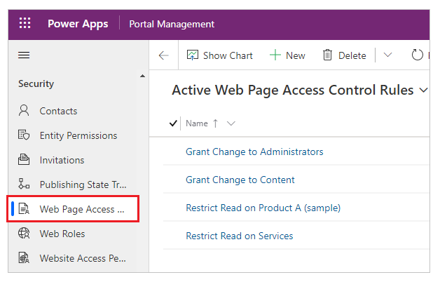

1. Select a webpage access control rule to edit, or select **New** to create a new rule.

    Set the following attributes for the webpage access control rule.

    |    Name     |                                                                                                                                                                  Description                                                                                                                                                                   |
    |-------------|------------------------------------------------------------------------------------------------------------------------------------------------------------------------------------------------------------------------------------------------------------------------------------------------------------------------------------------------|
    |    Name     |                                                                                                                                                        A descriptive name for the rule.                                                                                                                                                        |
    |   Website   |                                                                                                           The website that this rule applies to; this must match the website of the page to which this rule is applied.                                                                                                        |
    |  Web Page   |                            The webpage that this rule applies to. The rule will affect not only this page but all of its child pages, making this attribute select the branch of the website to which the rule will apply. If the rule is applied to the home page, it will apply to the entire portal.                            |
    |    Right    |                                                                                                                                    [Grant change](#grant-change) or [Restrict read](#restrict-read)                                                                                                                                      |
    |    Scope    | <ul><li><strong>All content</strong>: All descendant content is included in security validation.</li><li><strong>Exclude direct child web files</strong>: All child web files directly related to this webpage are excluded from security validation. This option doesn't exclude the descendants of the child web file.</li></ul>By default, **All content** is selected. |
    | Description |                                                                                                                                                     (Optional) A description of the rule.                                                                                                                                                      |

1. Select **Save & Close**.

### View access control rules for a page

After you create a new access control rule, it gets associated with the selected page. This association causes it to affect both the page you assign the rule to and all child pages&mdash;in other words, the entire branch of the website.
<!--markdownlint-disable MD036-->
**To view the associated webpage access control rules for a page**

1. In the Portal Management app, on the left pane under **Content**, select **Web Pages**.

1. Select the webpage that you want to associate the access control rule with.

1. Select **Access Control Rules**.

    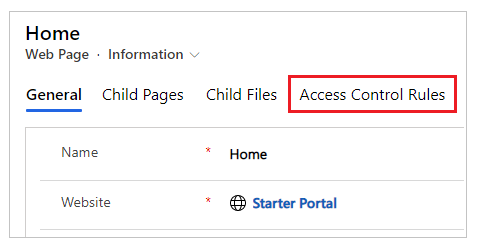

1. View all the webpage access control rules for the page.

    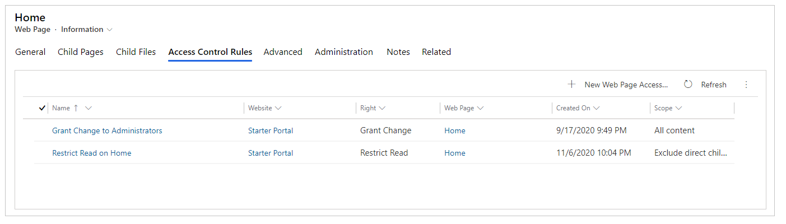

There are two types of access control rules: **Grant Change** and **Restrict Read**.

#### Grant Change

Use a **Grant Change** rule to allow a user who has the web role associated with the rule to publish content changes for this page, and all child pages of this page. **Grant Change** rules take precedence over **Restrict Read** rules.

For example, you have a news branch in your site, which you want to be editable by users who have the news editor web role. These users might not have access to the entire site, and certainly can't edit the entire site, but within this branch you want them to have full content publishing authority. You'd create a webpage access control rule called "grant news publishing to news editors."

Next, you set **Right** to **Grant Change** and **Web Page** to the parent page of the entire news branch of your site. You then assign this web role to any users you want to designate as news editors. (One user can have many web roles.)

A **Grant Change** rule should always be present in any portal that you want to enable front-side editing for. This rule will apply to the home page of the site, making it the default rule for the entire site. This rule will be associated with a web role that is to represent the administrative role for the site. Users who are to be given front-side content publishing rights will be assigned to this role.

#### Restrict Read

Use a **Restrict Read** rule to limit the viewing of the contents of a page (and its child pages) to specific users. In comparison, **Grant Change** is a *permissive* rule (it grants users the ability to do something), whereas **Restrict Read** is a *restrictive* rule in that it restricts an action to a limited set of users. For example, you might have a branch of the site meant to be used by employees only. You want to restrict the ability to read this section to people who have the employee web role. In this scenario, you create a new rule called "restrict read to employees only."

You then set **Right** to **Restrict Read** and **Web Page** to the page at the top of the branch that you want to be read only by employees. You then associate this rule with the employee web role, and then assign users to this role.

> [!NOTE]
> If you apply the **Restrict Read** right to the root (home) page of a website and select **Exclude direct child web files** as the **Scope**, the home page's direct child web files will be accessible to all users.

### See also

[Create web roles for portals](create-web-roles.md)  
[Add record-based security using table permissions for portals](assign-entity-permissions.md)

[!INCLUDE[footer-include](../../../includes/footer-banner.md)]