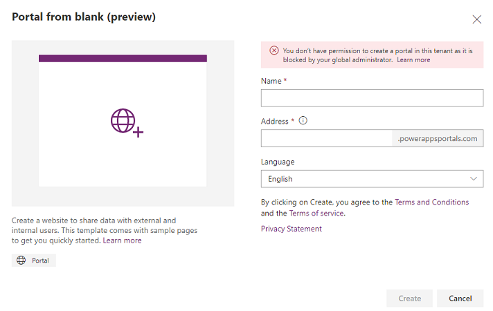

# Control portal creation in a tenant

As a global administrator, if you want to disable portal creation in a tenant by non-administrators, you can do it by enabling the `disablePortalsCreationByNonAdminUsers` tenant level setting through PowerShell. To run PowerShell cmdlets, you must first install the required modules. For information on installing the required PowerShell modules, see [Installation](/power-platform/admin/powerapps-powershell#installation).

After installing the modules, run the following command in a PowerShell window (run PowerShell as an administrator).

```
Set-TenantSettings -RequestBody @{ "disablePortalsCreationByNonAdminUsers" = $true }
```

Administrators are the users having one of the following Azure roles:

- [Global Administrator](admin/portal-admin-roles.md#global-administrator)
- [Dynamics 365 administrator](admin/portal-admin-roles.md#dynamics-365-administrator)
- [Power Platform admin](admin/portal-admin-roles.md#power-platform-administrator)

Users not having any of the above mentioned Azure roles are considered as non-administrators.

When the portal creation is disabled in a tenant, non-administrators will see an error&mdash;`You don't have permission to create a portal in this tenant as it is blocked by your global administrator.`

> [!div class=mx-imgBorder]
> 

To enable portal creation in a tenant, change the settings value from `$true` to `$false`.

```
Set-TenantSettings -RequestBody @{ "disablePortalsCreationByNonAdminUsers" = $false }
```

For more details about the required roles, and permissions to create a portal, go to [Required roles and permissions](admin/portal-admin-roles.md#required-roles-and-permissions).

## Next steps

[Manage a portal](manage-existing-portals.md)

### See also

[Create additional portals in an environment](create-additional-portals.md) <br>
[Microsoft Learn: Administer Power Apps portals](/learn/paths/administer-portals/) <br>
[Microsoft Learn: Access Dataverse in Power Apps portals](/learn/modules/portals-access-data-platform/)


[!INCLUDE[footer-include](../../includes/footer-banner.md)]