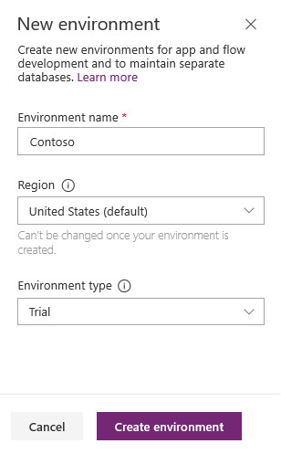
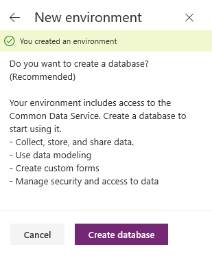
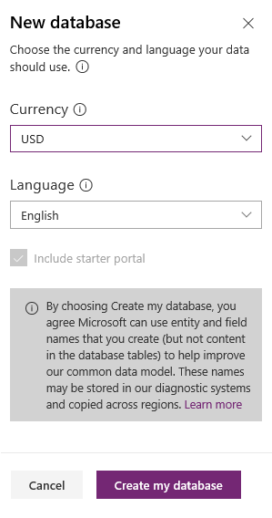
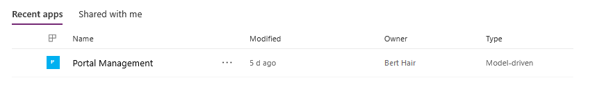

# Create additional portals in an environment

The ability to create additional environments is determined by the template chosen for the new portal. The following table explains the limits for creating additional portals in an environment.

| Environment type | Template | Limit | Additional information |
| - | - | - | - |
| [Environment with Dataverse](portal-templates.md#environment-with-dataverse) | Dataverse starter portal | 50 portals\* | No limits for language. For example, more than one or all portals can use same language. |
| [Environment with customer engagement apps](portal-templates.md#environment-with-customer-engagement-apps) | Portal from blank | 50 portals\* | No limits for language. For example, more than one or all portals can use same language. |
| [Environment with customer engagement apps](portal-templates.md#environment-with-customer-engagement-apps) | All templates except "Portal from blank" | 1 portal for each language | For example, 1 English language portal for "Community portal" template allowed. |

\* Requires Starter portal package version [9.3.2109.x or later](release-updates.md#starter-portal-package-updates)

When an [environment with customer engagement apps](portal-templates.md#environment-with-customer-engagement-apps) already has a portal of the available template type (all templates except "Portal from blank") created, and if the environment doesn't have any additional languages enabled, you'll see this error message:

"You have reached the maximum limit of 1 portal(s) on this environment. Please choose another environment or create new environment."

When an [environment with Dataverse](portal-templates.md#environment-with-dataverse) exceeds the maximum limit, you'll see this error message:

"You have exceeded the maximum number of portals possible for this environment. Choose another environment or create a new environment."

For more information about enabling languages in an environment, go to [Enable language for an environment](/power-platform/admin/enable-languages#enable-the-language).

## Create new environment

Follow these steps when you create an environment using the option provided in the **Portal from blank** window.

1.  In the **New environment** pane, enter a name for the environment, and then select a region and environment type from the drop-down lists. You can't change the region once the environment is created. When you're done, select **Create environment**.

    > [!div class=mx-imgBorder]
    >   

2.  Once the environment is created, you'll receive a confirmation message in the dialog box, and you'll be prompted to create a database. Select **Create database** to enable access to Dataverse.

    > [!NOTE]
    > The prompt to create a database might not be displayed automatically. In this case, you must go to the new environment and select the **Portal from blank** tile again.

    > [!div class=mx-imgBorder]
    >   

3.  Select the currency and language for the data stored in the database. You can't change the currency or language once the database is created. When you're done, select **Create my database**. The database is created with the starter portal that enables you to quickly get started with sample content once the portal is provisioned.

    > [!NOTE]
    > The **Include starter portal** option is available only when you create an environment using the option provided in the **Portal from blank** window. This option is not available when you create an environment from Power Platform admin center.

    > [!div class=mx-imgBorder]
    >  

    It might take several minutes to create the database on Dataverse. Once the database is created, the new environment is selected in the list of environments on the Power Apps home page and the Portal Management app is created. This app isn't the actual portal but a model-driven companion app that allows you to perform advance configuration activities. You can now continue with creating the portal for designing the external-facing website.

    > [!div class=mx-imgBorder]
    > 

4. After creating the environment and database, under **Make your own app**, select **Portal from blank**. 

    > [!NOTE]
    > If the database is created and you are still getting the create database prompt, you must refresh the Power Apps home page before selecting the **Portal from blank** tile.

After you enter the portal name, address, and choose the language, the portal creation begins. For portal creation notification information, see [Portal provisioning notifications](create-portal.md#portal-provisioning-notifications).

### See also

[Available portal templates](portal-templates.md)  
[Microsoft Learn: Administer Power Apps portals](/learn/paths/administer-portals/)  
[Microsoft Learn: Access Dataverse in Power Apps portals](/learn/modules/portals-access-data-platform/)

[!INCLUDE[footer-include](../../includes/footer-banner.md)]