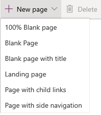
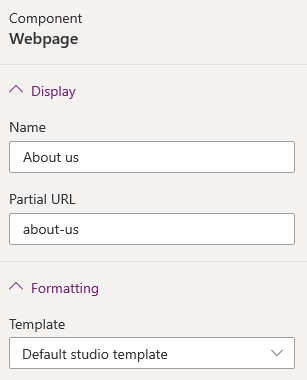
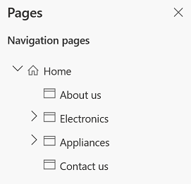
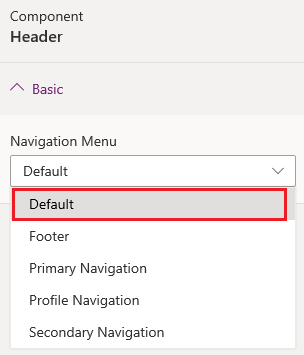
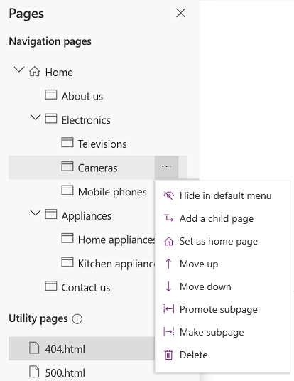

# Create and manage webpages

A webpage is a document that is identified by a unique URL in a website. It is one of the core objects of the website and builds a hierarchy of the website through parent and child relationships to other webpages.

> [!NOTE]
> If you customize your portal using Power Apps portals Studio, the website users would notice a performance impact. We recommended you to do the changes during non-peak hours on a live portal.

## Create webpage

1.  [Edit the portal](manage-existing-portals.md#edit) to open it in Power Apps portals Studio.  

2.  From the command bar, select **New page** and either choose a page from **Layouts** or **Fixed layouts**.

    > [!div class=mx-imgBorder]
    > 

    > [!NOTE]
    > - Creating a page using **Layouts** gives you the flexibility to edit the complete page. **Fixed layouts** contains the page templates that are installed as part of portal provisioning and the custom page templates created using the [Portal Management app](configure/configure-portal.md).
    > - For the pages to be created using the **Layouts** option, a new **Default studio template** page template is installed.

3.  In the properties pane on the right side of the screen, enter the following information:

    - **Name**: Name of the page. This value is also used as the title of the page.

    - **Partial URL**: The URL path segment used to build the portal URL of this page.

    - **Template**: Page template used to render this page on the portal. If required, you can choose another template from the list.

        > [!div class=mx-imgBorder]
        > 

The webpages you create are added and their hierarchy are displayed in the **Pages and navigation** pane. To view the this pane, select **Pages and navigation**  from the toolbelt on the left side of the screen.  

Let's say you have created a few webpages for your portal. The page hierarchy looks as follows:

  

The primary menu on the website is created automatically based on the hierarchy of the webpages. It is called the **Default** menu. You can also create a custom menu to display on the website. More information: [Add a custom menu](add-custom-menu.md)

> [!div class=mx-imgBorder]
> 

If you are working with a portal created in an environment containing customer engagement apps (such as Dynamics 365 Sales and Dynamics 365 Customer Service), and you want the menu to be the same as page hierarchy, you must select **Default** from the **Navigation Menu** list.

> [!IMPORTANT]
> When **Default** navigation menu is selected, the new pages are added to the **Default** web link set. However, direct changes to the **Default** navigation menu using [Manage web links](configure/manage-web-links.md#default-web-link-set-and-navigation-menu-in-studio) is not supported.

> [!div class=mx-imgBorder]
> 

## Manage webpage

1.  [Edit the portal](manage-existing-portals.md#edit) to open it in Power Apps portals Studio.  

2.  Select **Pages and navigation**  from the toolbelt on the left side of the screen.  

3.  Hover over the page you want to manage and select the **Ellipsis** button (…) for the webpage you want to manage. Alternately. you can right-click the page you want to manage.

4.  Select the required action from the context menu:

    - **Hide in default menu**: Hide the page from being displayed in the sitemap through default menu.

    - **Show in default menu**: Show the page in the sitemap through default menu.

    - **Add a child page**: Add a child page to the selected page. The child page inherits the page template of its parent page.

    - **Move up**: Move the page up in hierarchy.

    - **Move down**: Move the page down in hierarchy.

        > [!NOTE]
        > Moving a page up or down is supported among the pages at the same level.

    - **Promote subpage**: Decrease the indent and make the child page at the level of the previous page in the hierarchy.

    - **Make subpage**: Increase the indent and make the page a child page of the previous page in the hierarchy.

    - **Delete**: Delete the page.

        > [!div class=mx-imgBorder]
        >   

## Next steps

[Customize webpages](compose-page.md)

### See also

[Work with templates](work-with-templates.md)  
[Work with themes](theme-overview.md)

[!INCLUDE[footer-include](../../includes/footer-banner.md)]