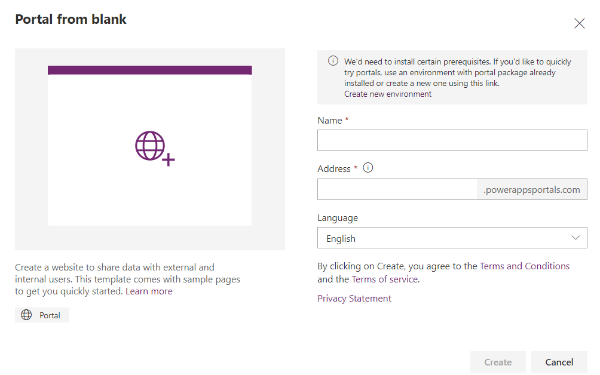
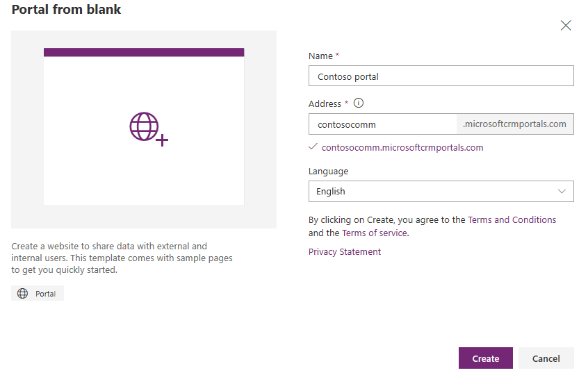
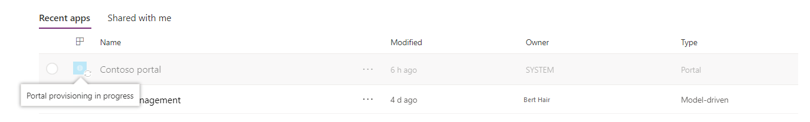
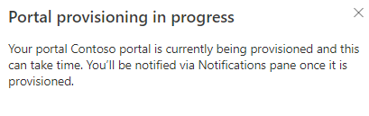
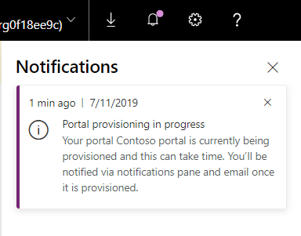
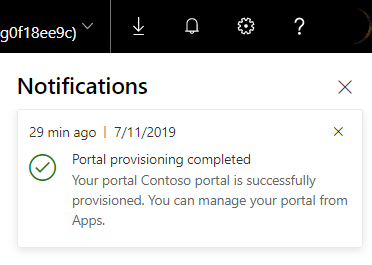

# Create a Dataverse starter portal

With the capability to build a portal in Power Apps, you can create a website for external and internal users enabling them to interact with data stored in Microsoft Dataverse.

Some of the benefits of creating a Power Apps portal:

- Because the data is stored in Dataverse, you don't need to create a connection from Power Apps as you do with data sources such as SharePoint, customer engagement apps (such as Dynamics 365 Sales and Dynamics 365 Customer Service), or Salesforce. You need only to specify the tables that you want to show or manage in the portal.

- You can design the portal through the WYSIWYG Power Apps portals Studio by adding and configuring components on the webpages.

You can create a portal either in a new environment or in your existing environment.

If you choose to create your portal in a new environment using the **Create new environment** link, the required portal pre-requisites such as tables, data, and a starter portal template are installed when the environment is created. In this method, the portal is provisioned in a few minutes.

If you choose to create your portal in an existing environment without portal pre-requisites, the pre-requisites are installed first and then the portal is created. In this method, the portal provisioning can take some time and you’ll be notified when the portal is provisioned.

Based on the selected environment in Power Apps, you can create a Dataverse starter portal or a portal in an environment containing customer engagement apps (such as Dynamics 365 Sales and Dynamics 365 Customer Service).

> [!NOTE]
> - There can be only one portal of each type and for a language created in an environment. For more information, go to [creating additional portals](create-additional-portals.md).
> - When you create a portal, a few solutions are installed and sample data is imported.

More information on working with environments: [Working with environments and Microsoft Power Apps](/power-platform/admin/working-with-environments)

More information on available portal templates: [Portal templates](portal-templates.md)

To create a portal:

> [!TIP]
> To learn about the roles required to create a portal, read [Admin roles required for portal administrative tasks](admin/portal-admin-roles.md).

1.  Sign in to [Power Apps](https://make.powerapps.com).  

2.  Under **Make your own app**, select **Portal from blank**.

3.	If the selected environment doesn't contain portal pre-requisites, a message is displayed in the **Portal from blank** window suggesting you select another environment or create a new one.

    

4.	If you choose to continue with the current environment, enter the required information in the window as mentioned in the following steps. If you choose to create a new environment, see [Create new environment](create-additional-portals.md#create-new-environment).

5.  In the **Portal from blank** window, enter a name for the portal and address for the website, and select a language from the drop-down list. When you're done, select **Create**.

    > [!TIP]
    > To create a portal using a different language, you must first [enable the language in the environment](/power-platform/admin/enable-languages#enable-the-language) so that it becomes available in the language drop-down list.

    > [!div class=mx-imgBorder]
    >   

After you select **Create**, the portal will begin provisioning and the provisioning status is displayed through [notifications](#portal-provisioning-notifications).

If you've created your portal in the environment that doesn't have portal pre-requisites installed, the provisioning status is also displayed in the grid:

> [!div class=mx-imgBorder]
> 

After the portal is provisioned successfully, the status is updated and the portal is displayed in the grid:

> [!div class=mx-imgBorder]
> 

To edit the portal in Power Apps portals Studio, see [Edit a portal](manage-existing-portals.md#edit).

> [!NOTE]
> - If you don't have sufficient privileges to provision a portal, an error is displayed. You must have the System Administrator role in Dataverse to create a portal. You must also have the **Access Mode** set to **Read-Write** under **Client Access License (CAL) Information** in the user record.
> - If you have purchased an older portal add-on, and want to provision a portal using the add-on, you must go to the **Dynamics 365 Administration Center** page. More information: [Provision a portal using the older portal add-on](provision-portal-add-on.md)
> - If you have provisioned a portal using the older portal add-on, you can still customize and manage it from [make.powerapps.com](https://make.powerapps.com).
> - Provisioning portals from [make.powerapps.com](https://make.powerapps.com) does not consume the older portal add-ons. Also, these portals are not listed under the **Applications** tab on the **Dynamics 365 Administration Center** page.
> - A Dataverse starter portal cannot be created from the **Dynamics 365 Administration Center** page.

## Portal provisioning notifications

After you select **Create**, the portal will begin provisioning and the provisioning status is displayed through notifications.

**Notification as a toast**

The following notification is displayed when you select **Create** to provision the portal.

> [!div class=mx-imgBorder]
>  

**Notifications in the Notifications pane**

Once the provisioning request is successfully placed, the following notifications are displayed in the **Notification** pane.

Notification shown for provisioning in progress.

> [!div class=mx-imgBorder]
> 

Notification shown for provisioning successfully completed.

> [!div class=mx-imgBorder]
>  

If the portal provisioning fails, the notifications are displayed similarly.
  
**Notifications via emails**

Once the provisioning request is successfully placed, a confirmation email notification is sent to the user creating the portal. Also, an email is sent to the user after the portal provisioning is completed.

## Next steps

[Manage a portal](manage-existing-portals.md)

### See also

[Common problems and resolutions while creating a portal](create-common-problems.md)  
[Control portal creation in a tenant](control-portal-creation.md)  
[Create additional portals in an environment](create-additional-portals.md)  
[Microsoft Learn: Administer Power Apps portals](/learn/paths/administer-portals/)  
[Microsoft Learn: Access Dataverse in Power Apps portals](/learn/modules/portals-access-data-platform/)

[!INCLUDE[footer-include](../../includes/footer-banner.md)]