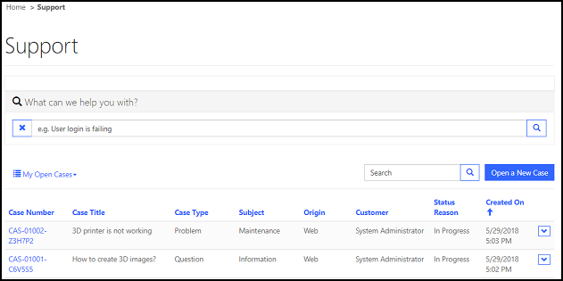
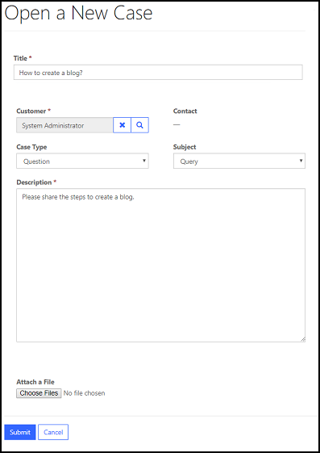
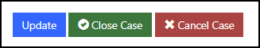
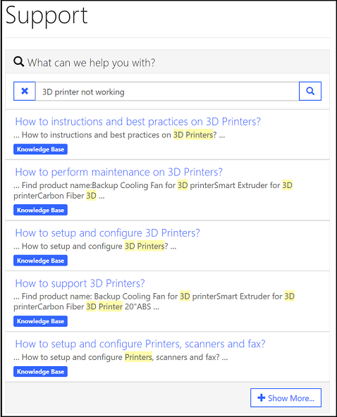

# Manage cases in portals

The use of cases will vary depending on your type of organization. Typically, cases are used to track and resolve different types of customer issues. When cases are surfaced via a portal, users can create or even comment on cases themselves, bypassing the need to speak directly with people in your organization. Users can also review and update any of the information originally provided in the case record, whether the case is open or closed. 

The forms that are displayed on the portal for creating and updating cases can be customized allowing you to control what fields are visible to the user.

## Create cases

1. Sign in to the portal and select **Support**.

2. A list of cases logged by you is displayed.

     

3. To create new case, select **Open a New Case**.

4. Enter required details in the form.

     

5. Select **Submit**.

By default, following error appears if you choose a contact that doesn't belong to the selected account while creating a case:
 
*The specified contact doesn't belong to the account selected as the customer. Specify a contact that belongs to the selected account, and then try again.*
 
You can customize this default error by adding a [Content Snippet](../configure/customize-content-snippets.md#edit-snippets) with the *Name* as **cases/unrelatedcontact** and *Value* as your custom error message text.

## Add case notes

Case notes are brief items of information added to a case record. A case note can be viewed by all users who have access to the case record. Web portal customers can use notes to submit comments or ideas, or to share information with the support team that is working on their case. 

Web portal customers can easily add case notes, and then select **Update** to include that information in the case record. These notes can optionally include attachments - useful info for resolving the case at hand.

> [!NOTE]
> Any case notes that are entered by a Microsoft Dynamics CRM user directly through the Microsoft Dynamics CRM record will only be displayed to a web portal customer if the \*WEB\* keyword is somewhere in the case note body.

## Close or cancel a case 

A web portal customer can close a case directly from the portal. When editing a case, the customer can select the **Close Case** or **Cancel Case** buttons. The system will ask the customer for confirming the action for the selected operation. The customer can then select **Yes** to confirm the case closure or cancellation. This action will automatically close any open activities that are linked to the case record.

 

A web portal customer also has the ability to re-open a closed case if they feel that his or her issue has not been dealt with properly.

## Case deflection

Case deflection consists of a mandatory search that users must go through before they can create a new case. The user first types a description of their problem into the search box and clicks the search button. A list of results is then displayed. The list of results is also displayed when a user enters the case title while creating a new case.

This list includes (can be configured): blog posts, web content (web pages), forum threads, issues, and resolved cases.  Note that only publicly viewable fields of a resolved case are viewable by the public. The user can of course skip reading the search results if they wish, but this search encourages them to make use of existing knowledge resources before resorting to direct support.

### Turn off case deflection

To turn off case deflection, you must [create a site setting](../configure/configure-site-settings.md) named HelpDesk/CaseDeflection/Enabled and set its value to false.