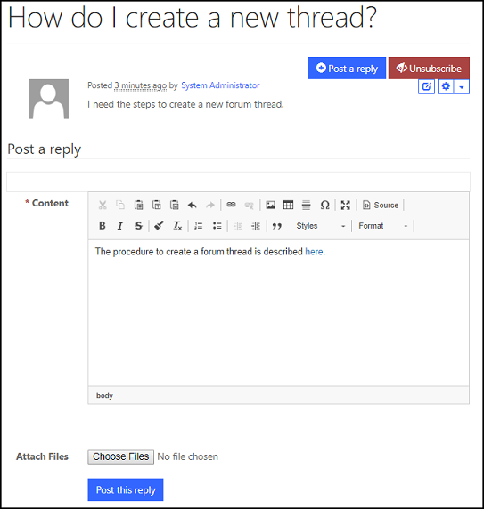

# Create forum posts on the portal

A forum post is a user-submitted message enclosed into a block containing the user's details and the date and time it was submitted. Members are usually allowed to edit or delete their own posts. Posts are contained in [forum threads](manage-forum-threads.md), where they appear as boxes one after another. The first post starts the thread; this may be called the OP (original post). Posts that follow in the thread are meant to continue discussion about that post, or respond to other replies; it is not uncommon for discussions to be derailed.  

## Create forum posts

The forum post editor will appear automatically when a user has successfully signed in to the portal and navigated to a forum thread page, provided the developer has implemented the functionality in the forum thread's page template.

1. Sign in to the portal.

2. Navigate to a [forum thread](manage-forum-threads.md).  

3. Compose your reply in the rich text editor.

4. Select **Post this reply**.

     

### Attribute relationships

The table below explains many of the Forum Post attributes used by portals. It is important to note that the rendering of the content/display-oriented attributes is controlled by the page template used.

| Name         | Description                                                                                                 |
|--------------|-------------------------------------------------------------------------------------------------------------|
| Name         | The descriptive name of the record. This value will be used as a title to the post. This field is required. |
| Forum Thread | The [forum thread](manage-forum-threads.md) the post is regarding.                                            |  
| Author       | The Contact record associated with the user who wrote the post.                                             |
| Date         | The date and time the post was created.                                                                     |
| Content      | The body or message of the post.                                                                            |
| Answer?      | Checked indicates that the post is identified as being the answer to the thread's question.                 |

### See also

[Setup and manage forums](setup-manage-forums.md)  
[Manage forum threads](manage-forum-threads.md)  
[Moderate forums](moderate-forums.md)  
[Subscribe to alerts](subscribe-alerts.md)  

