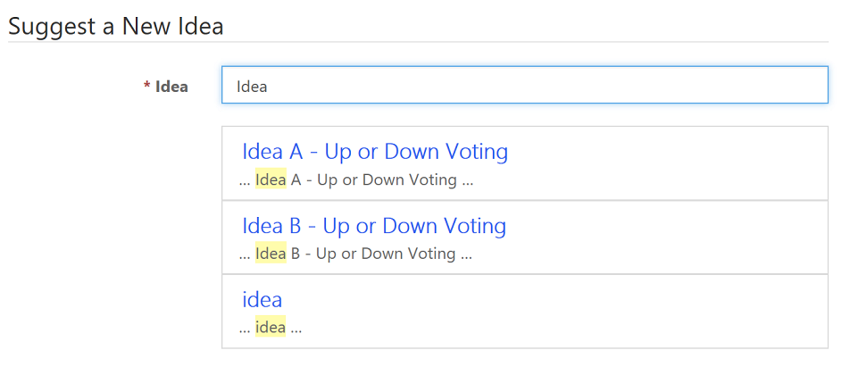

# Crowdsource ideas

Learn how to manage Forum Ideas, Idea Comments, and Idea Votes.

## Manage idea forums

Users can manage Idea Forum records under the Community tab, provided the portal customizations have been imported into your Microsoft Dataverse environment.

> [!NOTE]
> - The way in which many of the content/display-oriented attributes are rendered is controlled by the views created by the portal developer.
> - Restricting access to Idea forums by using web roles is not supported.

## Idea Forum attributes and relationships

The table below explains the standard attributes and relationships of the Idea Forum table.

| Name                   | Description         |
|------------------------|----------------------|
| Title                  | The name of the idea forum.            |
| Website                | The website to which the idea forum belongs.                                                               |
| Partial URL            | The URL path segment used to build the portal URL of the idea forum.| 
|Summary                | HTML content providing a description of the idea forum.                                                   |
| Ideas                  | Relationship specifying all idea records associated with the idea forum.                                          |
| New Idea Policy        | An option that specifies how new idea records should be handled in the idea forum.  |
| Comment Policy         | An option that specifies how comments on ideas should be handled in the idea forum.      |
|Idea content moderation policy|Content moderation policy that will be applied to ideas in the forum. More information: [Enable content moderation on ideas](enable-idea-content-moderation.md)|
| Voting Policy          | An option that specifies how votes on ideas should be handled in the idea forum.                                |
| Type of Voting         | The type of voting the idea forum will allow.                                                                  |
| Votes Per Idea         | The number of votes a user is allowed for a single idea belonging to an idea forum. When Voting Type is Up or Down this value is set to 1.  |
| Votes Per User         | The number of votes a user is allowed to use in an idea forum. If no value is set, users have unlimited votes within the idea forum.|
| Roles with Read Access | Relationship specifying the web roles that have permission to see and participate in the idea forum. Any portal users associated with any of these roles will be granted access to the idea forum.  |
| Moderators             | Relationship specifying the web roles that have permission to moderate the idea forum. There is currently no front-side moderation functionality built into the idea portal application.|
| | |

## Manage ideas in a portal

For users, provided the portal customizations have been imported into your organization, Idea records can be managed under the Community tab.

> [!NOTE]
> If you create an idea, the idea will get one vote automatically on your behalf.

## Idea attributes and relationships

The table below explains the standard attributes and relationships of the Idea table.

| Name                  | Description                                                                                                                                                                                                                                                                                   |
|-----------------------|-----------------------------------------------------------------------------------------------------------------------------------------------------------------------------------------------------------------------------------------------------------------------------------------------|
| Title                 | A descriptive title for the idea.                                                                                                                                                                                                                                                             |
| Idea Forum            | The idea forum to which the idea belongs.                                                                                                                                                                                                                                                     |
| Partial URL           | The URL path segment used to build the portal URL of the idea forum.  Partial URL values are used as URL path segments. As such, they should not contain illegal URL path characters, such as ?, #, !, %. Since portals URLs are generated by joining together Partial URL values with slashes (/), they should also not generally contain slashes. Recommended practice would be to restrict Partial URL values to letters, numbers, and hyphens or underscores. For example: press-releases, Users_Guide, product1.|
| Published to Web      | Whether the idea is visible on the website.               |
| Copy                  | HTML content providing a description of the idea.                                                                                                                                                                                                                                             |
| Summary               | A shortened summary of the idea.                                                                                                                                                                                                                                                              |
| Author Name           | Text specifying the name of the user that submitted the idea.                                                                                                                                                                                                                                 |
| Author E-mail         | Text specifying the e-mail of the user that submitted the idea.                                                                                                                                                                                                                               |
| Author                | Relationship specifying which portal user is associated with the idea.                                                                                                                                                                                                                        |
| Submitted On          | The date and time that the idea was created.                                                                                                                                                                                                                                                  |
| Status Reason         | An option that specifies the current status of the idea. <ul><li>**New**:The idea is active and can be voted on.</li><li>**Accepted**: The idea has been accepted and can no longer be voted on.</li> <li>**Completed**:The idea has been implemented successfully and can no longer be voted on.</li> <li>**Rejected**:The idea will not be pursued and can no longer be voted on.</li></ul>**Note**: You can enable voting for other status reasons also. More information: [Enable voting for status reasons](#enable-voting-for-status-reasons)            |
|Moderation status|An option that specifies the moderation status of the idea:<ul><li>**No**: The idea is not being moderated.</li><li>**Yes**: The idea is being moderated.</li><li>**Accepted**: A moderator has accepted the idea to be flagged.</li><li>**Rejected**: A moderator has rejected the idea to be flagged.</li></ul>|
|Moderation status reason|Reason that a portal user has selected while flagging the idea. The following reasons can be enabled by the administrator while creating the moderation policy:<ul><li>Spam</li><li>Inappropriate</li><li>Abusive</li></ul>More information: [Enable content moderation on ideas](enable-idea-content-moderation.md) **Note**: These options are available out-of-the-box. To add more options, you can modify the global option set and add the required values. The global option set to be modified is:<ul><li>Display name: Content Moderation Reason</li><li>Name: adx_contentmoderationreason</li></ul>For information on modifying the global option set, see [Create and edit global option sets](../../data-platform/custom-picklists.md)|
|Moderation status comment|Comment that a portal user has put while flagging the idea.|
| Status Author         | Relationship specifying which portal user is associated with the idea's status and status comment. |
|Moderated by|Name of the moderator.|
|Moderated on|Date on which the idea is moderated.|
| Status Comment        | An optional comment for the idea's status reason. In other words, when it's planned to be implemented, why it has been rejected, etc. |
| Comment Policy        | An option that specifies how comments on the idea should be handled.<ul><li>**Inherit**: The comment policy of the parent idea forum will be used. This is the default setting.</li><li>**Open**: Submissions from all users, anonymous and authenticated, are allowed and displayed immediately.</li><li>**Open to Authenticated Users**: Only submissions from authenticated users are allowed and they are displayed immediately.</li><li>**Moderated**: Submissions from all users, anonymous or authenticated, are allowed. The submissions will not be displayed until a moderator approves them.</li><li>**Closed**: Existing submissions are displayed, but no new submissions are allowed.</li><li>**None**: User submissions are disabled. No submissions can be made or viewed.</li></ul>  |
| Votes Up              | The number of positive votes the idea has received.                                                                                                                                                                                                                                           |
| Votes Down            | The number of negative votes the idea has received.                                                                                                                                                                                                                                           |
| Vote Sum              | The number of positive votes minus the number of negative votes.                                                                                                                                                                                                                              |
| Total Number of Votes | The number of positive votes plus the number of negative votes.                                                                                                                                                                                                                               |
| Idea Comments         | Relationship specifying all comments associated with the idea.                                                                                                                                                                                                                                |
| Idea Votes            | Relationship specifying all votes associated with the idea. | 
||

### Enable voting for status reasons

By default, an idea is enabled for voting only when the Status Reason is set to New. If you want to enable voting on an idea for different status reasons, you must create the `Ideas/EnableVotingForStatusReasons` site setting and set its value to the required status reason values.

For example, say you want to enable voting for New, Accepted, and Rejected status reasons. You must create the site setting and set its value as:

- **Name**: Ideas/EnableVotingForStatusReasons

- **Value**: 1;100000000;100000002

> [!NOTE]
> - If all the values in site setting are wrong, voting will be disabled regardless of the status reason.
> - If this site setting does not exist, the idea will be enabled for voting only when the Status Reason is set to New.

To get the status reason values:

1.	Sign in to Dynamics 365 Portals.

2.	Go to **Settings** > **Customization** > **Customize the System**.

3.	In the customization dialog, go to **Components** > **Entities** > **Idea** in the left navigation pane. 

4.	Expand the **Idea** table and select **Fields**.

5.	Select the **statuscode** field from the list and open it in field editor.

6.	Under the **Type** section, open the statuses to see their respective values.

### Enable autocomplete for ideas

While creating a new idea, there might be a scenario where a similar idea already exists. As an administrator, you can configure your portal to display a list of similar ideas when a portal user tries to create a new idea. This avoids creation of duplicate ideas. To enable a portal to display a list of similar ideas when a new idea is being created, you must create the `Ideas/EnableAutoComplete` site setting and set its value to **True**.

> [!div class=mx-imgBorder]
> 

## Manage idea comments

For users, provided the portal customizations have been imported into your Microsoft Dataverse environment, Idea Comment records can be managed under the Community tab.

## Idea comment attributes and relationships

The table below explains the standard attributes and relationships of the Idea Comment table.

|       Name       |                                Description                                |
|------------------|---------------------------------------------------------------------------|
|       Name       |                       A title for the idea comment.                       |
|       Idea       |                  The idea to which the comment belongs.                   |
|     Content      |                The content of the comment in HTML format.                 |
| Published to Web |              Whether the comment is visible on the website.               |
|   Author Name    |     Text specifying the name of the user that submitted the comment.      |
|  Author E-mail   |    Text specifying the e-mail of the user that submitted the comment.     |
|      Author      | Relationship specifying which portal user is associated with the comment. |
|    Posted On     |              The date and time that the comment was created.              |
|                  |                                                                           |

## Manage idea votes

For users, provided the portal customizations have been imported into your Microsoft Dataverse environment, Idea Vote records can be managed under the Community tab.

## Idea vote attributes and relationships

The table below explains the standard attributes and relationships of the Idea Vote table. 

| Name         | Description                                                            |
|--------------|------------------------------------------------------------------------|
| Value        | A whole number representing the value of the vote.                     |
| Name         | A title for the vote.                                                  |
| Idea         | The idea to which the vote belongs.                                    |
| Voter Name   | Text specifying the name of the user that submitted the vote.          |
| Voter E-mail | Text specifying the e-mail of the user that submitted the vote.        |
| Voter        | Relationship specifying which portal user is associated with the vote. |
| Submitted On | The date and time that the vote was created.                           |
||

### See also

[Manage forum threads](manage-forum-threads.md)  
[Create forum posts on the portal](create-forum-posts.md)  
[Moderate forums](moderate-forums.md)  
[Subscribe to alerts](subscribe-alerts.md) 
[Enable content moderation on ideas](enable-idea-content-moderation.md)