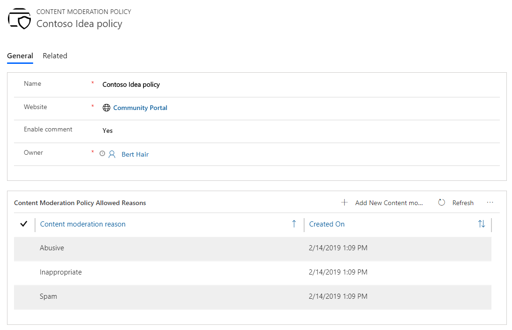
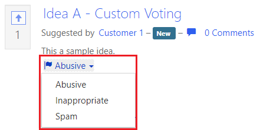

# Enable content moderation on ideas

A content moderation policy allows you to moderate the ideas that are submitted on your portal. After you create a moderation policy, you add it to an idea forum. The moderation policy will be applicable to all ideas in the idea forum. A portal user can flag an idea by selecting an appropriate reason and adding any additional details, if required. 

To enable content moderation on ideas:

1.	[Create a content moderation policy](#create-a-content-moderation-policy)
2.	[Add the moderation policy to an idea forum](#add-content-moderation-policy-to-an-idea-forum)
3.	[Moderate the flagged ideas](#moderate-an-idea)

## Create a content moderation policy

1.	Open the Dynamics 365 Dynamics 365 Portals app.

2.	Go to **Portals** > **Content moderation policies**.

3.	Select **New**.

4.	Enter the following details and save the record to add moderation reasons:

    - **Name**: Name of the policy.

    - **Website**: Website to which the content moderation policy applies.

    - **Enable comment**: Select **Yes** or **No** if a portal user needs to enter additional details after flagging an idea.

5.	Select **Add new content moderation policy allowed reason** to add reasons a portal user can select while flagging an idea. You can add **Abusive**, **Inappropriate**, and **Spam** as the reasons.

    > [!div class=mx-imgBorder]
    > 

6.	Save the record.

## Add content moderation policy to an idea forum

1.	Open the idea forum to which you need to add the content moderation policy.

2.	On the **Options** tab, browse and select the moderation policy from the **Idea content moderation policy** field.

    > [!div class=mx-imgBorder]
    > 

3.	Save the record.

## Moderate an idea

After you have created a moderation policy and assigned it to an idea forum, the associated ideas will be governed by the moderation policy. The selected moderation reasons are displayed with the idea on the portal. A portal user can flag the idea by selecting a reason. 

> [!div class=mx-imgBorder]
> 

When a portal user flags an idea on the portal by using a reason, the idea is hidden from the portal and moved to the **Flagged Ideas** view in the Dynamics 365 Portals. As an administrator, you can open the Dynamics 365 Dynamics 365 Portals app and decide whether to accept or reject the flagged idea. You can further decide whether to deactivate the idea or keep it active.

1.	Open the Dynamics 365 Dynamics 365 Portals app.

2.	Go to **Community** > **Ideas**.

3.	Change the view to **Flagged Ideas**. A list of flagged ideas is displayed.

4.	Open the idea you want to moderate.

5.	In the **Moderation status** list, choose **Accepted** or **Rejected** if you agree or disagree with the moderation status reason, respectively. The moderated idea is moved to the **Moderated Ideas** view.

### See also

[Manage idea forums](crowdsource-ideas.md#manage-idea-forums) 
[Manage ideas](crowdsource-ideas.md#manage-ideas-in-a-portal)
