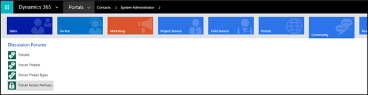
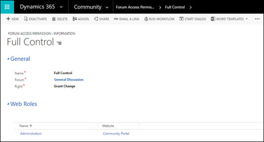

# Manage forum access permissions

Forum Access Permission is a security rule that can be assigned to a particular forum and web role that can restrict particular users from viewing the forum or granting particular users the ability to moderate a forum within the webpages. To create, edit, or delete forum access permissions:

1. Sign in to Dynamics 365 Portals.

2. Go to **Community** > **Forum Access Permissions**.

    

3. To create a new forum access permission, select **New**.

4. To edit an existing permission, select the permission name.

5. Enter appropriate values in the fields.

6. Select **Save & Close**.

      

> [!NOTE]
> A web role must be assigned for the rule to apply for users associated with the given role. See [Create web roles for portals](../configure/create-web-roles.md).

The table below explains many of the Forum Access Permission attributes used by portals.

| Name  |                                                                                                                                                           Description                                                                                                                                                           |
|-------|---------------------------------------------------------------------------------------------------------------------------------------------------------------------------------------------------------------------------------------------------------------------------------------------------------------------------------|
| Name  |                                                                                                                  A name used for reference within Microsoft Dataverse.                                                                                                                  |
| Forum |                                                                                                                       The [Manage forum threads](manage-forum-threads.md) associated with the permission.                                                                                                                       |
| Right | The permission setting can be one of the following:<ul><li>**Restrict Read**: Prevents viewing of the forum for users unless in a web role associated with the rule.</li><li>**Grant Change**: Allows a user in a web role associated with the rule to moderate the forum. Grant Change takes precedence over Restrict Read.</li></ul> |
|       |                                                                                                                                                                                                                                                                                                                                 |

### See also

[Setup and manage forums](setup-manage-forums.md)  
[Manage forum threads](manage-forum-threads.md)  
[Create forum posts on the portal](create-forum-posts.md)  
[Subscribe to alerts](subscribe-alerts.md)  
