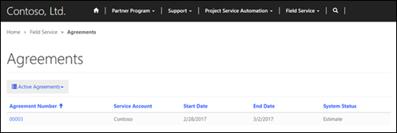
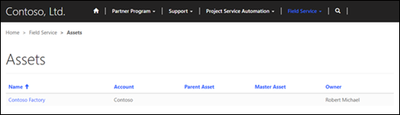
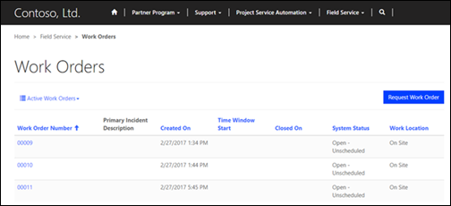
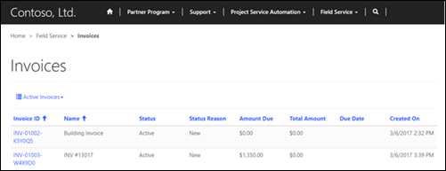

# Integrate Field Service

The Partner [!include] solution can now be installed on a Partner Portal ([!include] and Partner Portal solutions must be installed first). With this solution installed, customers and partners can view various parts of the [!include] section on the partner portal. Some of the available tables that can be viewed are assets, work orders, and invoices.

## View agreements on the partner portal

Customers can view active and expired agreements that are connected to their account on the partner portal if they have the correct web role and the agreement was created properly. They must have the FS Customer Approver or FS Customer Reviewer web role. 

### To create or edit an agreement to be visible on the portal

1. Go to **Dynamics 365 Field Service** &gt; **Service Delivery** &gt; **Agreements**. 
2. Select an agreement, or select **+ New** at the top of the page to create a new one. 
3. In the **Service Account** field on the **General** tab, enter the account the customer is connected to. 
4. Select the **Expose to Customer** check box. 

Now a customer can sign in to the portal, go to **Field Service** &gt; **Agreements**, and change the filter to **All Agreements** to view the created agreements. The page will show basic information, and the customer can select an agreement to view further details about it.

  

## View assets on the partner portal

Customers can view existing assets that are connected to their account on the partner portal if they have the correct web role and the asset was created properly. They must have the FS Customer Approver or FS Customer Reviewer web role. 

### To create or edit an asset to be visible on the portal

1. Go to **Dynamics 365 Field Service** &gt; **Service Delivery** &gt; **Customer Assets**. 
2. Select an asset, or select **+ New** at the top of the page to create a new one. 
3. Set **Account** to the account the customer is connected to, and then select the **Expose to Customer** check box. 

Now the customer can sign in to the portal and go to **Field Service** &gt; **Assets** to see the created assets. The customer will be able to see each asset connected to their account, along with the parent or master assets the asset is connected to.

## View work orders for Field Service on the partner portal

Customers can view active and inactive work orders that are connected to their account on the partner portal if they have the correct web role and the work order was created properly. They must have the FS Customer Approver or FS Customer Review web role. 

> [!Note]
> A work order must be defined as viewable before it can be viewed in a portal.

### To make a work order viewable in a portal

1. Go to **Dynamics 365 Field Service** &gt; **Work Order & Schedule** &gt; **Work Orders**. 
2. Select the work order you want to edit, or select **+ New** to create a new one. 
3. In **Service Account**, enter the account the customer is connected to, and then select the **Expose to Customer** check box to allow a customer to view it on the portal. 

After signing in to the portal, the customer can go to **Field Service** &gt; **Work Orders** and see the work orders that are connected to their account.

## View invoices for Field Service on the partner portal

Customers can view active and inactive invoices that are connected to their account on the partner portal if they have the correct web role and the work order was created properly. They must have the FS Customer Approver or FS Customer Review web role. 

> [!Note]
> An invoice must be defined as viewable before it can be viewed in a portal.

### To make an invoice viewable in a portal

1. Go to **Dynamics 365 Field Service** &gt; **Service Delivery** &gt; **Invoices**. 
2. Select the invoice to edit it, or select **+ New** to create a new one. Be sure that the invoice is on the **Invoice** section of the drop-down menu on the upper-left side of the page. 
3. Enter the necessary details for the invoice, and then select the **Expose to Customer** check box. 

After signing in to the portal, the customer can go to **Field Service** &gt; **Invoices** to view invoices.

## Automatically distribute opportunities to preferred partners

You can automatically distribute opportunities to partners based on a set of criteria that determines the best partner for the job. The built-in metrics for opportunity assignment first determine which partners are available to take the opportunity on. This table shows the factors that are used to decide whether a partner is available.

| Name | Description |
|-----------------------|--------------------------------------------------------------------------------------------------------------------------------------|
|Capacity     |  A partner's capacity is the maximum number of opportunities that partner can take on at a time. This value can be adjusted on the account details page for each partner. Capacity includes opportunities that are in progress, in addition to those that haven't yet been accepted by a partner. It doesn't include internal opportunities created by that partner.|
|Estimated revenue     | You can set a minimum and maximum range for estimated revenue on the account details page for each partner. If the estimated revenue for an opportunity falls within this range, the partner will be available for assignment.|
|Territory     | Territories are geographic regions that are assigned to a partner account. If the address of the customer associated with the opportunity is within a territory covered by a partner, the partner will be available for assignment. |
|Lead type     | The lead type table can be used to categorize opportunities. You can assign which lead types each partner is able to work on.       |
|Associated products| If the products associated with an opportunity are all covered by a partner, they will be available for assignment. If any of the products are not covered by a partner, they won't be available for assignment.|
 |  |               |

## Partner ranking metrics

After the available partners have been identified, the opportunity is distributed to a partner based on a ranking system. This system takes the following factors into account.

| Name | Description |
|-----------------------|--------------------------------------------------------------------------------------------------------------------------------------|
| Distance              | The distance between the address of the partner and the address of the customer account that is associated with the opportunity.     |
| Win rate              | The percentage of distributed opportunities historically won by the partner.                                                         |
| Return rate           | The percentage of distributed opportunities historically lost (returned) by the partner.                                             |
| Feedback rate         | The percentage of delivered opportunities that received feedback from customers.                                                     |
| Stall rate            | The percentage of distributed opportunities that have been accepted by the partner, but haven't progressed through workflow stages. |
| Touch rate            | The percentage of distributed opportunities that were promptly accepted or declined and weren't allowed to expire after delivery.   |
| Average time to close | The average length of time, in days, that the partner takes to close opportunities.|
|||

## Partner ranking weights

The metrics used to rank partners for opportunity distribution are weighted to determine how they affect partner ranking. These weights can be adjusted by using site settings, and affect how heavily a metric is used to rank partners. A setting of zero (0) will cause that metric to be disregarded when ranking partners for opportunity distribution.

>[!Note]
>A positive weight means that a higher number for this metric is more desirable, and a negative weight means that a lower number is more desirable. 

The range of accepted values for each metric's site setting is as follows.

| **Description**       | **Setting name**                    | **Value range**      |
|-----------------------|-------------------------------------|----------------------|
| Distance              | distribution/weights/distance       | Negative, 0 to &ndash;0.01 |
| Win rate              | distribution/weights/winrate        | Positive, 0 to 5     |
| Return rate           | distribution/weights/returnrate     | Negative, 0 to &ndash;5    |
| Feedback rate         | distribution/weights/feedbackrate   | Positive, 0 to 5     |
| Stall rate            | distribution/weights/stallrate      | Negative, 0 to &ndash;5    |
| Touch rate            | distribution/weights/touchrate      | Positive, 0 to 5     |
| Average time to close | distribution/weights/avgtimetoclose | Negative, 0 to &ndash;0.5  |

### See also
[Create a partner account on a PRM portal](configure-web-roles-partner-portal.md#create-a-partner-account-on-a-prm-portal)
