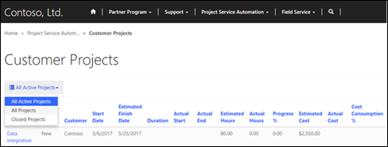
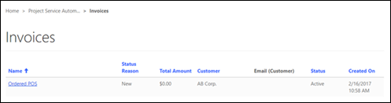
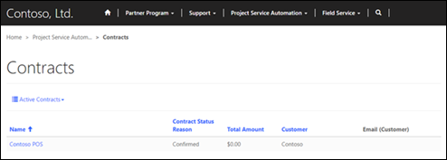
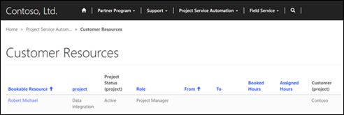

# Integrate Project Service Automation

The [!include] solution for Dynamics 365 can now be installed on a partner portal ([!include] for Dynamics 365 and Partner Portal solutions must be installed first). With this solution installed, customers and partners will be able to view projects and confirmed, bookable resources. Customers will also be able to approve quotes, view invoices, and view contract and order forms.

## View projects on the partner portal

Both customers and partners can view projects pertaining to them on the partner portal. Customers can view active and closed projects associated with their organization. Partners can view projects when a bookable resource from their organization is associated with the project. In either case, the user must have an appropriate [!include]&ndash;specific web role (PSA Customer Approver/Reviewer or PSA Partner Approver/Reviewer). After signing in to the portal, the customer or partner can view the project by going to **Customer Projects**. From here, they can see basic information for each project and choose to view by **Active Projects**, **Closed Projects**, or **All Projects**.

## View and approve project quotes on the partner portal

Customers can view and approve the created project quotes that are associated with their organization. After signing in to the portal, the customer navigates to **[!include]** &gt; **Quotes**, and then changes the filter to **Last 7 Days**. From here, the customer will be shown pending quotes along with basic information like **Status** and **Total Amount**. The customer can now select a quote for more details, and approve or reject the quote by selecting **Approve Quote** or **Reject Quote** near the bottom of the page.

## View project invoices on the partner portal

Customers can view final versions of project invoices on the partner portal after the invoice has been approved and the **Visible to customer** check box has been selected. To view an invoice, the customer must sign in to the partner portal and go to **[!include]** &gt; **Invoices.** Here, the customer can view basic information and select an invoice for more details.

## View project contracts and order forms on the partner portal

Customers can view final versions of project contracts or orders on the partner portal after a project contract has been opened with the **Visible to customer** check box selected on the contract. After signing in to the partner portal, the customer navigates to **[!include]** &gt; **Contracts**. Here, customers can see a sorted list of contracts with some basic information or select a contract for more details.

  

## View confirmed, bookable resources by project and role on the partner portal

Both customers and partners can view bookable resources on the partner portal by following the same process. After signing in to the partner portal, they must go to **[!include]** &gt; **Customer Resources**. Here, they can see a list of resources with their role, booked hours, and other basic information. By selecting a resource, they will be able to see what tasks that resource has been assigned to.

