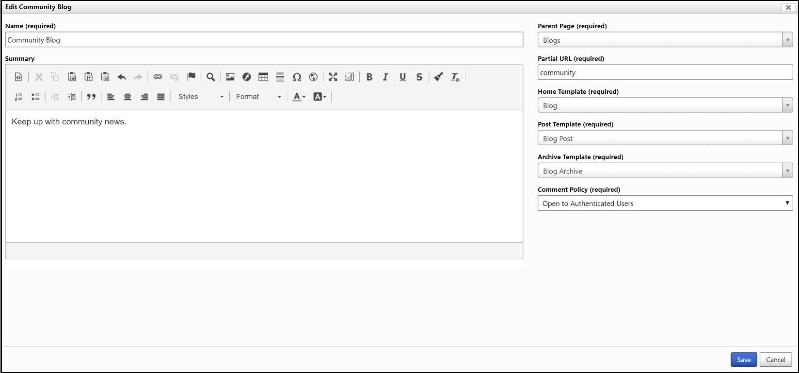
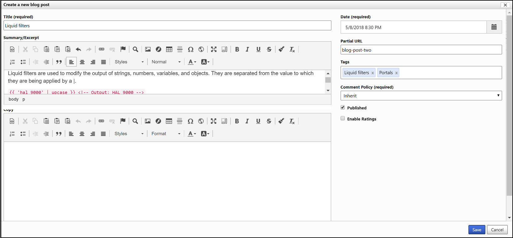
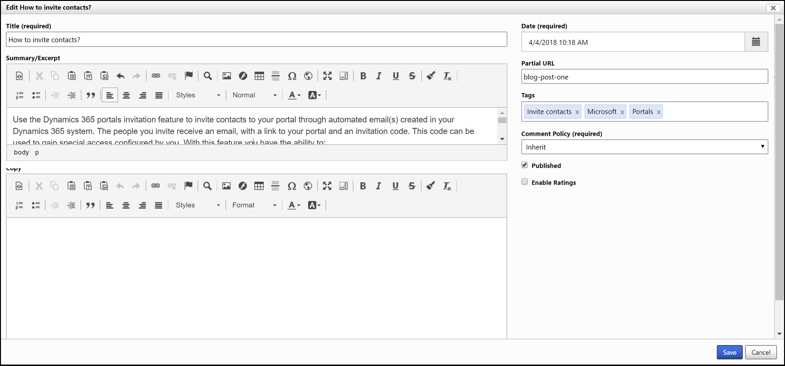

# Manage blogs

Learn how to manage blog comments and blog posts both within Portalsand from the portal content editor.

## Manage blogs in Dynamics 365 Portals

Users can manage Blog records under the **Portals** tab after your portal customizations have been imported into your Microsoft Dataverse environment.

## Manage blogs from the portal content editor

Portal users who have blog author permissions can edit or delete blogs by using the portal inline editing interface. If your portal contact has been assigned the necessary permissions, the inline editing interface will appear automatically when you sign in to the portal. Note that although a blog can be edited or deleted through the portal content editing interface, it must be created and initially configured in Dynamics 365 Portals.

To edit a blog, go to the blog's home page, and then select **Edit** on the edit toolbar.

  

To delete the blog, select **Delete**, and then select **Yes** in the confirmation dialog box.

> [!Note]
> Deleting a blog will also delete all its associated posts and comments.

### Security

**Read** access to a blog is inherited from read permissions on the blog's Parent Page. If a user can read the parent webpage, they can read the blog and all of its published posts. See [Control webpage access for portals](../configure/webpage-access-control.md).  

**Change/Write** access to a blog is controlled through the Author Roles relationship. This relationship specifies the web roles that grant authorship permission on the blog. Any portal users associated with any of these roles will be granted the permission to create new posts, edit and delete their own posts, and edit the attributes and settings of the blog itself. See [Create web roles for portals](../configure/create-web-roles.md).  

> [!Note]
> Only the specific author of a blog post can edit or delete that post, through the front-side portal editing interface. The author of a post can also see their own unpublished posts, but not those of other authors.

### Blog attributes and relationships

The table below explains the standard attributes and relationships of the Blog entity.

It is important to note that the way in which many of the content/display-oriented attributes are rendered is controlled by the page templates used.

|       Name       |                                                                                                                                                                                                                                                                    Description                                                                                                                                                                                                                                                                    |
|------------------|---------------------------------------------------------------------------------------------------------------------------------------------------------------------------------------------------------------------------------------------------------------------------------------------------------------------------------------------------------------------------------------------------------------------------------------------------------------------------------------------------------------------------------------------------|
|       Name       |                                                                                                                                                                                                                                                              The title of the blog.                                                                                                                                                                                                                                                               |
|     Website      |                                                                                                                                                                                                                                                      The website to which the blog belongs.                                                                                                                                                                                                                                                       |
|   Parent Page    |                                                                                                                                                                                                                                         The parent webpage of the blog, in the website content hierarchy.                                                                                                                                                                                                                                         |
|   Partial URL    | The URL path segment used to build the portal URL of the blog. **Note**: Partial URL values are used as URL path segments. As such, they should not contain illegal URL path characters, such as "?", "\#", "!", "%". Because portal URLs are generated by joining together Partial URL values with slashes ("/"), they should also not generally contain slashes. Recommended practice would be to restrict Partial URL values to letters, numbers, and hyphens or underscores. For example: "press-releases", "Users\_Guide", "product1". |
|  Home Template   |                                                                                                                                                                                               The page template to be used to render the home/main page of the blog. This template will typically be used to render the latest post(s) in the blog.                                                                                                                                                                                               |
|  Post Template   |                                                                                                                                                                      The page template to be used to render an individual post in the blog, when navigated to. This template will also typically have the responsibility of rendering any comments associated with the post.                                                                                                                                                                      |
| Archive Template |                                                                               The page template to be used to render archive views (i.e., views of posts that may no longer be visible on the blog home page). This template will generally have multiple responsibilities. To render a view of all posts in a given calendar month.<ul><li>To render a view of all posts related to a given tag.</li><li>To render a view of all posts by a given author.</li>                                                                                |
|     Summary      |                                                                                                                                                                                                                                                 HTML content providing a description of the blog.                                                                                                                                                                                                                                                 |
|  Comment Policy  |                                                                                                                                                                                                                                   An option that specifies how comments on posts should be handled on the blog.                                                                                                                                                                                                                                   |
|    Blog Posts    |                                                                                                                                                                                                                                            Relationship specifying all posts associated with the blog.                                                                                                                                                                                                                                            |
|   Author Roles   |                                                                                                                               Relationship specifying the Web Roles that grant authorship permission on the blog. Any portal users associated with any of these roles will be granted the permission to create new posts, edit and delete their own posts, and edit the attributes and settings of the blog itself.                                                                                                                               |
|                  |                                                                                                                                                                                                                                                                                                                                                                                                                                                                                                                                                   |

## Manage blog posts in Dynamics 365 Portals

For users, Blog Posts can be managed by launching the editor for the desired Blog and then navigating to its related Blog Posts.

## Manage blogs posts from the portal content editor

For portal users with blog author permissions, blog posts can be managed using the portal inline editing interface. If your user account has been assigned the necessary permissions, the inline editing interface will appear automatically when you sign in to the portal and go to the blog.

**To create a new blog post**

Go to the blog home page, and then select **New** &gt; **Blog post** on the edit toolbar. The blog post editor dialog will appear.

  

Make any edits that you want, and then select **Save**.

**To edit a blog post**

Go to the blog post's page, and select **Edit** on the edit toolbar. The blog post editor dialog box will appear. Make any edits you want, and then select **Save** to save your changes.

When creating or editing a blog post, if the **Partial URL** field is left blank, one will be generated automatically. The auto-generated Partial URL will have the format yyyy-mm-dd-post-title, where yyyy-mm-dd is the year, month, and day of the post's **Date**, and the remainder is the post **Title**, transformed into a URL-appropriate form.

The **Tags** field of the post editor provides auto-complete of tag names, to associated posts with existing tags. It is also possible to simply type the name of a new tag. To end a tag name and start a new one, type Tab, Enter, or ,. To remove a tag, select the x beside the tag name, or select the Backspace key.

 

**To delete the blog post**

Select **Delete**, and then select **Yes** in the confirmation dialog box.

> [!Note]
> - Deleting a blog post will also delete its associated comments.
> - Only the author of a blog post can edit or delete that post, through the front-side portal editing interface. The author of a post can also see their own unpublished posts, but not those of other authors.

### Blog post attributes and relationships

The table below explains the standard attributes and relationships of the Blog Post entity.

It is important to note that the way in which many of the content/display-oriented attributes are rendered is controlled by the page templates used.

|        Name         |                                                                                                                                                                                                                                                                      Description                                                                                                                                                                                                                                                                       |
|---------------------|--------------------------------------------------------------------------------------------------------------------------------------------------------------------------------------------------------------------------------------------------------------------------------------------------------------------------------------------------------------------------------------------------------------------------------------------------------------------------------------------------------------------------------------------------------|
|        Title        |                                                                                                                                                                                                                                                              The title of the blog post.                                                                                                                                                                                                                                                               |
|        Blog         |                                                                                                                                                                                                                                                          The blog to which the post belongs.                                                                                                                                                                                                                                                           |
|     Partial URL     | The URL path segment used to build the portal URL of the blog post. **Note**: Partial URL values are used as URL path segments. As such, they should not contain illegal URL path characters, such as "?", "\#", "!", "%". Because portal URLs are generated by joining together Partial URL values with slashes ("/"), they should also not generally contain slashes. Recommended practice would be to restrict Partial URL values to letters, numbers, and hyphens or underscores. For example: "press-releases", "Users\_Guide", "product1". |
|       Author        |                                                                                                                                                                                                                                                The author of the post, represented by a Contact record.                                                                                                                                                                                                                                                |
|        Date         |                                                                                                                                             The publishing date for the post, to be displayed on a portal. This value determines how posts are sorted for display in views that display posts from newest to oldest. This value does not control when or if the post is actually made visible on a portal.                                                                                                                                             |
|       Summary       |                                                                                                                                                           HTML content providing a short summary or excerpt of the post. If present, this should be used by the blog templates and syndication feeds as the content of the post, with the full content only being available at the post URL.                                                                                                                                                           |
|        Copy         |                                                                                                                                                                                                                                                           The full HTML content of the post.                                                                                                                                                                                                                                                           |
|      Published      |                                                                                                                                                            Determines whether a post will be visible on a portal. If checked, the post is visible to all users that have read access to the blog. If not checked, only the author of the post will be able to preview the post on a portal.                                                                                                                                                            |
|   Comment Policy    |                                                                                                                                                                                                                                          An option that specifies how comments on the post should be handled.                                                                                                                                                                                                                                          |
| Blog Posts Comments |                                                                                                                                                                                                                                                         All comments associated with the post.                                                                                                                                                                                                                                                         |
|      Web Files      |                                                                                                                                                                                                                                                          All files associated with the post.                                                                                                                                                                                                                                                           |
|        Tags         |                                                                                                                                                                                                                                                           All tags associated with the post.                                                                                                                                                                                                                                                           |
|                     |                                                                                                                                                                                                                                                                                                                                                                                                                                                                                                                                                        |

## Manage blog post comments on a portal

For portal users with blog author permissions, blog comments can be managed using the portal inline editing interface. If your user account has the necessary permissions, the inline editing interface will appear automatically when you sign in to the portal and go to a blog post.  

The exact appearance of the user interface used to edit or delete a blog post comment is determined by the page template being used to render the post, but it will generally involve links or buttons positioned inline, alongside each comment. Selecting **Edit** will launch the comment editor, which allows comment moderators to edit comment content or toggle its approval status.

### Blog post comment attributes and relationships

The table below explains the standard attributes and relationships of the Blog Post Comment entity.

It is important to note that the way in which many of the content/display-oriented attributes are rendered is controlled by the page template used.

| Name          | Description                                                                                                                                                                                                                                      |
|---------------|--------------------------------------------------------------------------------------------------------------------------------------------------------------------------------------------------------------------------------------------------|
| Name          | The descriptive name of the comment. This will typically be auto-generated by the portal application.                                                                                                                                            |
| Blog Post     | The blog post to which the comment belongs.                                                                                                                                                                                                      |
| Author        | The author of the comment, represented by a Contact record. This will be populated if the comment was submitted by an authenticated portal user.                                                                                                 |
| Author Name   | The display name of the author of the comment. This is typically used in the anonymous submission scenario, when there is no portal user Contact record to associate with the comment, and is generally submitted by the comment author themselves.                                              |
| Author E-mail | The email address of the author of the comment. This is typically used in the anonymous submission scenario, when there is no portal user Contact record to associate with the comment, and is generally submitted by the comment author themselves.                                              |
| Author URL    | A website URL for the author of the comment - perhaps to their own blog or personal website. This is typically used in the anonymous submission scenario, when there is no portal user Contact record to associate with the comment, and is generally submitted by the comment author themselves.                                              |
| Posted On     | The timestamp for when the comment was submitted, to be displayed on a portal. This value determines how comments are sorted for display. This value does not control when or whether the comment is made visible on a portal.                   |
| Content       | The full HTML content of the comment.                                                                                                                                                                                                            |
| Approved      | Determines whether a comment will be visible on a portal. If checked, the comment is visible to all users that have read access to the blog post. If not checked, only the author of the post will be able to preview the comment on the portal. |
||

### See also

[Get started with the portal content editor](../portal-content-editor.md) 

