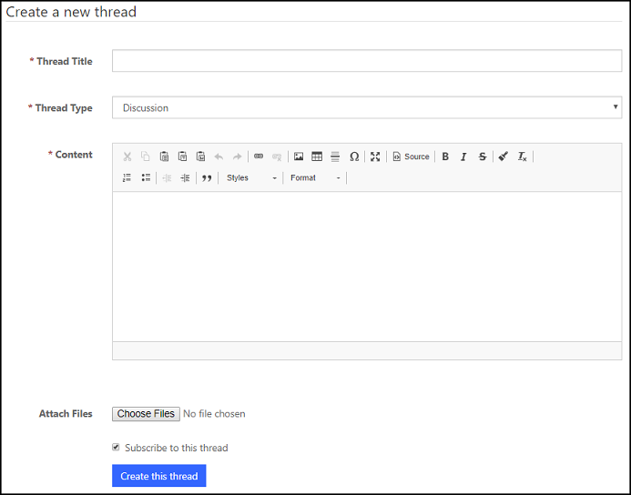

# Manage forum threads

A forum thread (sometimes called a topic) is a collection of posts, usually displayed from oldest to newest. A thread can contain any number of posts, including multiple posts from the same members, even if they were added to the thread one after the other. A thread is contained in a [forum](setup-manage-forums.md) and may have an associated date that is taken as the date of the last post. The content or purpose of the thread is identified by the first post, also known as the original post (OP). When a member posts in a thread, the thread jumps to the top because it is the latest updated thread. Similarly, other threads will jump to the top when they receive posts. Sometimes, a member posts in a thread for no reason but to “bump” that thread (cause it to be displayed as the top thread).. Threads that are important but rarely receive posts are made “sticky” (or, as it is sometimes called, pinned). A sticky thread will always appear in front of normal threads, often in its own section. A thread's popularity is measured on forums in reply (total posts minus one, the opening post, in most default forum settings) counts. Some forums also track page views.  

## Manage forum threads in Dynamics 365 Portals

You can create, edit, and delete forum threads in Dynamics 365 Portals.

> [!Note]
> Although you can create forum threads in Dynamics 365 Portals, we recommend you do this from the portal content editor, where the process is less involved and ensures the thread is correctly associated with the original forum post.

### Create or edit forum threads

1. Sign in to Dynamics 365 Portals.

2. Go to **Community** > **Forum Threads**.

3. To create a new thread, select **New**.

4. To edit an existing thread, select the name of the thread.

5. Enter appropriate values in the field.

    > [!Note]                                
    > You will need to create the original [forum posts](create-forum-posts.md) to be associated with this thread and assign the newly created forum post record to the **First Post** and **Last Post** lookup fields provided.  

6. Select **Save**.

## Create forum threads from the portal content editor

The forum thread editor will appear automatically when a user has successfully signed in to the portal and navigated to a forum page, provided the developer has implemented the functionality in the forum's page template.

1. Sign in to the portal.

2. Navigate to the forum page within the portal that you would like to post a new thread in.

2. In the **Thread Title** field, enter title of the thread.

3. From the **Thread Type** list, choose the appropriate type of the thread. 

4. Compose the content of the thread in the rich text editor.

5. Select **Create this thread**.

      

### Forum thread attributes used by portals

The table below explains many of the Forum Thread attributes used by portals. It is important to note that the way in which many of the content/display-oriented attributes are rendered is controlled by the page template used.

|Name           |Description                                                                                                                 |
|----------------|-----------------------------------------------------------------------------------------------------------------------------|
| Name           | The descriptive name of the record. This value will be used as the thread title in most templates. This field is required.  |
| Forum          | The [forums](setup-manage-forums.md) associated with the thread.                                                       |  
| Type           | The forum thread type associated with the thread.                                                                           |
| Sticky?        | Checked indicates the thread should always remain at the top of forum's listing of threads, even if new threads are posted. |
| Last Post Date | The date and time the last post was created.                                                                                |
| Answered?      | Checked indicates the thread has been answered.                                                                             |
| First Post     | The first [forum posts](create-forum-posts.md) created on the thread.                                           |  
| Last Post      | The last [forum posts](create-forum-posts.md) created on the thread.                                            |  
| Post Count     | The number of posts that have been created on the thread.                                                                   |
| View Count     | The number of times the thread has been viewed in the portal.                                                               |
||

## Manage forum thread types in Dynamics 365 Portals

### Create, edit, and delete forum thread types

1. Sign in to Dynamics 365 Portals.
2. Navigate to **Community**. 
3. Select **Forum Thread Types**.
4. To create a new thread type, select **New**.
5. To edit an existing thread type, double-click to select the **Forum Thread Type** listed in the grid, specify values for the fields provided, and then select **Save & Close**.

## Forum thread type attributes

The table below explains many of the Forum Thread Type attributes used by portals. It is important to note that the way in which many of the content/display-oriented attributes are rendered is controlled by the page template used.

|Name            |Description                                                                                                                             |
|-----------------|-----------------------------------------------------------------------------------------------------------------------------------------|
| Name            | The descriptive name of the record. This value will be used as the title of the type in the page templates. This field is required.     |
| Website         | The webpages associated with the type.                                                                                                  |
| Requires Answer | Checked indicates that a forum post within the thread of this type can be marked as an answer.                                          |
| Display Order   | An integer value indicating the order in which the forum thread type will be placed, relative to other forum thread types in a listing. |
| Is Default      | Checked indicates that type is to be used as the default. It is recommended that only one type per website have this field checked.     |
||

### See also

[Setup and manage forums](setup-manage-forums.md)  
[Create forum posts on the portal](create-forum-posts.md)  
[Moderate forums](moderate-forums.md)  
[Subscribe to alerts](subscribe-alerts.md)  
