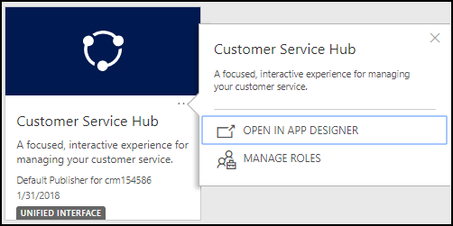
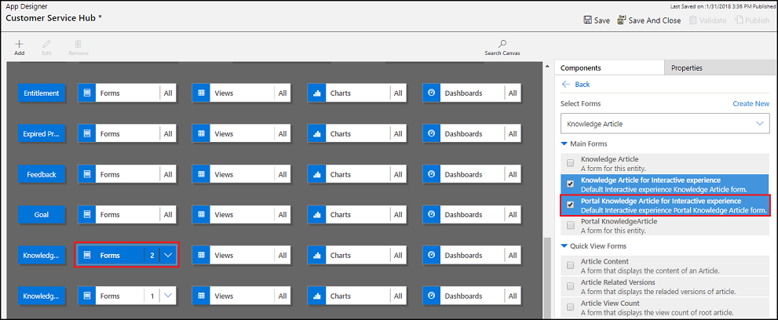
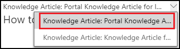
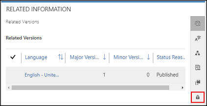

# Manage knowledge articles by using content access levels

Content access levels give another level of control separate from web roles to control access to knowledge articles in a portal. Content access levels make a well-designed knowledge base more capable of providing the right content to the right audience. This allows for more structured learning paths that keep irrelevant content from surfacing.

By default, three content access levels are available: Default, Registered Users, and Premium Users. The Default content access level is associated with the Anonymous Users and Authenticated Users web roles. You can create additional content access levels and associate each of them with account, contact, or web role.

When you create a new knowledge article, the Default content access level is applied to it by default. When you translate or version your knowledge articles, the associated products and content access levels are copied to the new version or translation, thereby simplifying the authoring experience. You can validate the content access levels and products associated with an article before publishing it.

Portal navigation and search results consider the content access level(s) associated to the logged-in user. If the user does not have the necessary content access level permission to view a knowledge article, or if the user attempts to open an article under [faceted search conditions](../configure/improve-portal-search-faceted-search.md), the Article Unavailable message is displayed.

To enable content access level based filtering of knowledge articles on your portal, set the value of the **KnowledgeManagement/ContentAccessLevel/Enabled** site setting to true. By default, the value of the site setting is set to false.

## Create content access levels

1. Sign in to Dynamics 365 Portals and go to **Portals** &gt; **Security** &gt; **Content Access Levels**.
2. In the ribbon, select **New**.
3. Fill in the **Name** and **Description**.
4. Change **Default Access Level** from **No** to **Yes** if it should be the default.
5. In the ribbon, select **Save**.

## Assign content access levels to knowledge articles

**Customer Service Hub app**

If you want to add content access level in a knowledge article from the Customer Service Hub app, you must add the **Portal Knowledge Article for Interactive experience** form to the Knowledge Article entity.

1. Open the Customer Service Hub app in App designer.

    

2. Under **Table View**, select the **Forms** tile for the **Knowledge Article** entity.

3. In the **Components** pane, select **Portal Knowledge Article for Interactive experience**.

    

4. Save and publish the changes.

5. Open Customer Service Hub.

6. Navigate to the knowledge article you want to assign content access level.

7. From the **Knowledge Article** box, select **Portal Knowledge Article for Interactive experience**.

    

8. On the **Summary** tab, under **Related information**, select **Content Access Levels** (lock icon) from the toolbar to add content access level.

    

9. From **More Commands**, select **Add Existing Content Access Level**.

    

10. In the **Lookup Records** pane, browse and select the content access level.

11. Select **Add**.

**Dynamics 365 Portals app**

In Dynamics 365 Portals app, you can access a knowledge article and add content access level to it by going to **Portals** > **Knowledge Article**.

1. Open the Dynamics 365 Portals app.

2. Go to **Portals** > **Knowledge Article** and open the knowledge article you want to assign content access level.

3. On the **Summary** tab, under **Related information**, select **Content Access Levels** (lock icon) from the toolbar to add content access level.

    

4. From **More Commands**, select **Add Existing Content Access Level**.

    

5. In the **Lookup Records** pane, browse and select the content access level.

6. Select **Add**.

**Interactive Service Hub**

1.  Open the Interactive Service Hub.

2.  Select the knowledge article you want to edit, or create a new article.

3.  Select **Summary** just above the progress bar.

4.  Under **Related Information** (third column), select the symbol that looks like a lock.

5.  Select **+** to add a new Content Access Level or the **Trash Can** symbol next to a Content Access Level to remove it.

## Assign content access levels to portal users

1. Sign in to Dynamics 365 Portals and go to **Portals** &gt; **Security** &gt; **Contacts**
2. Select the Contact you wish to edit.
3. Under the **Details** tab, find the **Content Access Levels** section.
4. Press **+** to add a new content access level or the **Trash Can** symbol next to a content access level to remove it.

> [!NOTE] 
> A user can also inherit a content access level if it is assigned to a Web Role, Parent Contact, or Account that the user is connected to. This inheritance avoids the need to reassign or update content access levels at an individual level. You can assign Web Roles to a content access level by navigating to **Portals** &gt; **Security** &gt; **Web Roles** and then following the same steps. You can assign accounts to a content access level by navigating to **Sales** &gt; **Accounts** and then selecting the account to edit. After the account is selected, find the **Content Access Levels** section on the rightmost side of the screen and use the **+** and **Trash Can** buttons to add or remove a content access level.
