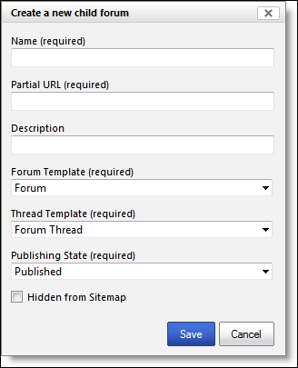

# Set up and manage forums

A forum is an online discussion that allows users to hold conversations in the form of posted messages. A discussion forum is hierarchical or tree-like in structure: a forum can contain a number of topics, also known as threads, and can be replied to by many users.

## Manage forums in Dynamics 365 Portals

Forums can be created, edited and deleted within Dynamics 365 Portals.

1. Sign in to Dynamics 365 Portals.

2. Go to **Community** > **Forums**.

3. To create a new forum, select **New**.

4. To edit an existing forum, select the name of the forum.

5. Enter appropriate values in the fields.

6. Select **Save & Close**.

## Manage forums from the portal content editor

For portal users with content management permissions, a limited set of properties of forums can be managed by using the [content editor](../use-content-editor.md). If your user account has been assigned the necessary permission set, the inline editing interface will appear automatically when you sign in to the portal.  

1. Navigate to the forums parent page within the portal.

2. On the portal inline editing toolbar, select **New**. 

3. Select **Child forum**. 

4. Specify values for the fields provided, and then select **Save**.

      

### Forum attributes used by portals

The table below explains many of the Forum attributes used by portals. It is important to note that the way many of the content and display-oriented attributes are rendered is controlled by the page template used, and thus by the portal developer.

|         Name         |                                                                                                                                                                                                                                                Description                                                                                                                                                                                                                                                |
|----------------------|-----------------------------------------------------------------------------------------------------------------------------------------------------------------------------------------------------------------------------------------------------------------------------------------------------------------------------------------------------------------------------------------------------------------------------------------------------------------------------------------------------------|
|         Name         |                                                                                                                                                                  The descriptive name of the table. This value will be used as the page title in most templates, particularly if a Title value is not provided. This field is required.                                                                                                                                                                  |
|       Website        |                                                                                                                                                                                                                     The website to which the table belongs. This field is required.                                                                                                                                                                                                                      |
|     Parent Page      |                                                                                                                                                                                                                    The parent webpage of the table in the website content hierarchy.                                                                                                                                                                                                                     |
|     Partial URL      | The URL path segment used to build the portal URL of this forum. Partial URL values are used as URL path segments. As such, they should not contain illegal URL path characters, such as ?, \#, !, %. Because portal URLs are generated by joining together partial URL values with slashes (/), they should also not contain slashes. We recommend you restrict Partial URL values to letters, numbers, and hyphens or underscores. For example: press-releases, Users\_Guide, product1. |
|    Display Order     |                                                                                                                                                                                              An integer value indicating the order in which the forum will be placed relative to other forums in a listing.                                                                                                                                                                                               |
|   Publishing State   |                                                              The current publishing workflow state of the forum, which may dictate whether the forum is visible on the site. The most common use of this feature is to control whether content is in a published or draft state. Users with content management permissions may be granted the ability to use Preview Mode, which allows these users to see (preview) unpublished content.                                                               |
| Hidden From Sitemap  |                                                                                                                       Controls whether the forum is visible as part of the portal site map. If this value is selected, the forum will still be available on the site at its URL, and can be linked to, but standard navigational elements such as menus will not include the forum.                                                                                                                       |
| Forum Page Template  |                                                         The page template to be used to render the page listing the forums on the portal. This field is required. The page template assigned should be a template that a developer has specifically created to provide the details of a forum. Selecting a template other than the one developed for the forum page may produce erroneous results when viewing the forum's webpage in the portal.                                                         |
| Thread Page Template |                                                   The page template to be used to render each forum thread page on the portal. This field is required. The page template assigned should be a template that a developer has specifically created to provide the forum thread details. Selecting a template other than the one developed for the forum thread page may produce erroneous results when viewing the forum thread's webpage in the portal.                                                    |
|     Description      |                                                                                                                                                                                                                                       Information about the forum.                                                                                                                                                                                                                                        |
|     Thread Count     |                                                                                                                                                                                                                   Number of [forum threads](manage-forum-threads.md) within the forum.                                                                                                                                                                                                                    |
|      Post Count      |                                                                                                                                                                                                       Number of [forum posts](create-forum-posts.md) created on the forum threads within the forum.                                                                                                                                                                                                       |
|      Last Post       |                                                                                                                                                                                                               The most recently created [forum posts on the portal](create-forum-posts.md).                                                                                                                                                                                                               |
|                      |                                                                                                                                                                                                                                                                                                                                                                                                                                                                                                           |

### See also

[Manage forum threads](manage-forum-threads.md)  
[Create forum posts on the portal](create-forum-posts.md)  
[Moderate forums](moderate-forums.md)  
[Subscribe to alerts](subscribe-alerts.md)
