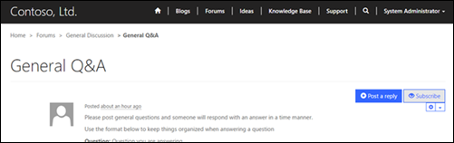
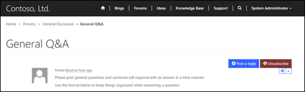

# Subscribe to alerts

Forum users can subscribe to threads and receive alerts when new posts are added keeping them up-to-date on conversations of importance. Alert settings are attached to the user's contact record providing further insight into the user's intent.

Depending on the page template implemented by your developer, the functionality providing users the ability to subscribe or unsubscribe to alerts may or may not be present and the images displayed within this document may be different that your actual portal.

## Subscribe to alerts in the portal

Users can indicate they wish to receive notification when new posts are created by navigating to a forum thread and selecting the **Alert Me** link.

1. Sign in to the **Portal**.
2. Navigate to a **Forum Thread**.
3. Select **Subscribe**.

  

## Unsubscribe from alerts in the portal

Users can indicate that they do not wish to receive notification when new posts are created for a given thread by navigating to the forum thread and selecting the **RemoveAlert** link.

1. Sign in to the **Portal**.
2. Navigate to a **Forum Thread**.
3. Select **Unsubscribe**.

  

## Manage forum alerts

Although the portal is the primary source for creating or removing alerts. Forum alerts can be created, edited or deleted within Dynamics 365 Portals.

1. Sign in to Dynamics 365 Portals.
2. Navigate to **Community**.
3. Select **Forum Threads**.
4. Select an existing **Forum Thread** listed in the grid. 
5. Select **Forum Alerts** in the leftmost navigation menu.

### Create a new alert subscription

1. Select **Add New Forum Alert**.

### Edit an existing alert

1. Select the **Forum Alert** listed in the grid.
2. Specify values for the fields provided.
3. Select **Save & Close**.

## Attributes relationships

The table below explains many of the Forum Alert attributes used by portals.

|      Name       |                                                                                     Description                                                                                      |
|-----------------|--------------------------------------------------------------------------------------------------------------------------------------------------------------------------------------|
|   Subscriber    | The Contact record of the portal user that is to receive a notification when posts are created in the associated thread. |
|     Thread      |                                                  The forum thread that is being subscribed to notification of newly created posts.                                                   |
| Expiration Date |                                                                  The date and time when notifications should stop.                                                                   |
|                 |                                                                                                                                                                                      |

### See also

[Setup and manage forums](setup-manage-forums.md)  
[Manage forum threads](manage-forum-threads.md)  
[Create forum posts on the portal](create-forum-posts.md)  
[Moderate forums](moderate-forums.md)  

