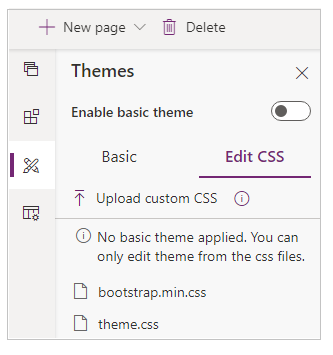
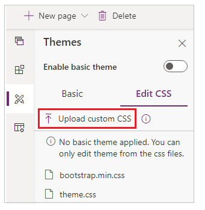

# Edit CSS for themes

Cascading Style Sheets (CSS) allows you to control the formatting of your website. By default, bootstrap.min.css and theme.css files are available. You can edit the existing CSS files and upload new CSS files. When you upload a new CSS file, it will be available as a web file in the Portal Management app.

> [!NOTE]
> Power Apps portals are based on Bootstrap 3.3.x with the exception of [Event portal](/dynamics365/marketing/developer/event-management-web-application). Portal developers should not replace Bootstrap 3 with other CSS libraries as some of the scenarios in Power Apps portals are dependent on Bootstrap 3.3.x. For more information, see [Understanding Bootstrap framework](#understanding-bootstrap-framework) and [Customize Bootstrap](#customize-bootstrap) sections in this article.

To open a CSS in code editor:

1.  [Edit the portal](manage-existing-portals.md#edit) to open it in Power Apps portals Studio.  

2.  Select **Theme**  from the left side of the screen. The available themes are displayed.  

    

3.  Select the desired CSS to open it in the code editor.

4.  Edit the code and save the changes.

To upload a new CSS file:

1.  [Edit the portal](manage-existing-portals.md#edit) to open it in Power Apps portals Studio.  

2.  Select **Theme**  from the left side of the screen. The available themes are displayed.  

3. Select **Upload custom CSS**.

     

4. Browse and select the CSS file to upload.

### Understanding Bootstrap framework

Bootstrap is a front-end framework that includes CSS and JavaScript components for common web application interface elements. It includes styles for [navigation elements](https://getbootstrap.com/components/#nav), [forms](https://getbootstrap.com/css/#forms), [buttons](https://getbootstrap.com/css/#buttons), and a [responsive grid layout system](https://getbootstrap.com/css/#grid) that allows site layouts to dynamically adjust to devices that have different screen sizes, such as phones and tablets. By using the Bootstrap layout system, you can develop a single site that presents an appropriate interface to all devices your customers might use.

The templates included with portals are implemented by using standard Bootstrap components with minimal additional custom styles. So when you implement the templates, you can take advantage of Bootstrap customization options. You can quickly customize the theme (fonts, colors, and so on) in a way that's applied consistently across the portal.

#### Customize Bootstrap

Bootstrap supports customization through a set of variables. You can set any or all of these variables to custom values and then download a custom version of Bootstrap that is compiled based on these values.

The power of Bootstrap variables is that they don't dictate the style of a single element. All styles in the framework are based on and derived from these values. For example, consider the variable `@font-size-base`. This specifies the size that Bootstrap assigns to normal body text. However, Bootstrap also uses this variable to indicate the font size for headings and other elements. The size for an H1 element might be defined as 300 percent of the size of `@font-size-base`. By setting this one variable, you control the entire typographic scale of your portal in a consistent way. Similarly, the `@link-color` variable controls the color of hyperlinks. For the color you assign to this value, Bootstrap will define the hover color for links as 15 percent darker than your custom value.

The standard way to create a custom version of Bootstrap is [through the official Bootstrap site](https://getbootstrap.com/customize/#less-variables). However, due to the popularity of Bootstrap, many third-party sites have also been created for this purpose. These sites might provide an easier-to-use interface for Bootstrap customization or predesigned versions of Bootstrap for you to download. [The official Bootstrap customizer](https://getbootstrap.com/customize/) site has more information about Bootstrap customization.  

When you download a customized version of Bootstrap, it contains the following directory structure.

```
css/
    |-- bootstrap.min.css 
img/
    |-- glyphicons-halflings-white.png 
    |-- glyphicons-halflings.png 
js/ 
    |-- bootstrap.min.js
```

Or, depending on the customizer application used, it might only contain bootstrap.min.css. Regardless, bootstrap.min.css is the file that contains your customizations. The other files are the same for all custom versions of Bootstrap and are already included in your portal.

### See also

- [Microsoft Learn: Advanced CSS in Power Apps portals](/learn/modules/extend-power-app-portals/4-portal-css)
- [Microsoft Learn: Advanced client-side development](/learn/modules/extend-power-app-portals/5-advanced-portal-development)


[!INCLUDE[footer-include](../../includes/footer-banner.md)]