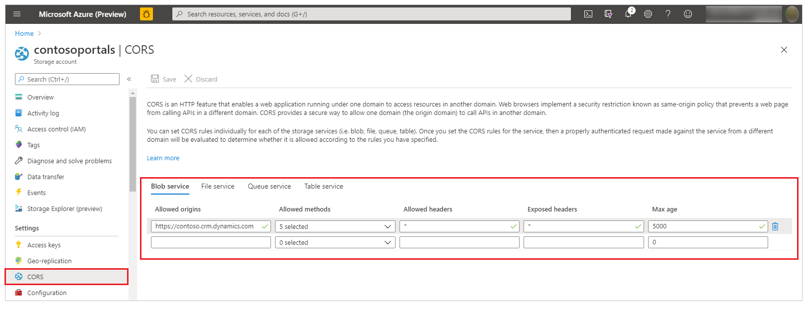

# Enable Azure Storage

Azure Storage integration for portals enables you to take advantage of the greater file storage capability of Azure, using the same interface and providing the same user experience as for default file attachments. This feature is supported for web files, basic forms, and advanced forms.

You must create a storage account with **Resource manager** as the deployment model. [!include[More information](../../includes/proc-more-information.md)] [Create an Azure storage account](/azure/storage/storage-create-storage-account#create-a-storage-account).

After the storage account is running, portals require certain global settings that tell the application how to locate your storage account. In the Portal Management app, go to **Settings** > **New**, and add a new setting named **FileStorage/CloudStorageAccount**.

Azure storage integration only works with **Notes** configured in Basic Form Metadata. Azure Blob as a storage is not used if you use **Portal Comments** that can be setup using **Timeline**. Though Portal Comments also provide capability for files to be uploaded as attachments, these files are only stored in Microsoft Dataverse.
 
> [!NOTE]
> - You must enable attachments for the table in Microsoft Dataverse first before using this feature. More information: [Create a table](../data-platform/data-platform-create-entity.md#create-a-table)
> - The maximum file upload size is 125 MB.

To locate the value for FileStorage/CloudStorageAccount, you must get a connection string from your [!include[Azure portal](../../includes/pn-azure-portal.md)].

1. Sign in to your [!include[Azure portal](../../includes/pn-azure-portal.md)].

2. Navigate to your storage account.

3. Select **Access Keys**.

    

4. In the resulting panel, locate the field labeled **Connection String**. Select the **Copy** icon next to the field for which you need to copy the value, and then paste that value into your new setting:

    

    

## Specify the storage container

If you do not already have an Azure Blob container in your storage account, you must add one by using your [!include[Azure portal](../../includes/pn-azure-portal.md)].

In the [Portal Management app](configure/configure-portal.md), go to **Settings** > **New**, and add a new setting named **FileStorage/CloudStorageContainerName**, using the name of your container as the value.

## Add CORS rule

You must add cross-origin resource sharing (CORS) rule on your Azure Storage account as follows, otherwise you will see the regular attachment icon rather than the cloud icon:

- **Allowed origins**: Specify your domain. For example, `https://contoso.crm.dynamics.com`   Ensure the allowed origin doesn't have trailing `/`. For example, `https://contoso.crm.dynamics.com/` is incorrect.
- **Allowed verbs**: GET, PUT, DELETE, HEAD, POST
- **Allowed headers**: Specify the request headers that the origin domain may specify on the CORS request. For example, x-ms-meta-data\*, x-ms-meta-target\*, or \* to allow all.
- **Exposed headers**: Specify the response headers that may be sent in the response to the CORS request and exposed by the browser to the request issuer. For example, x-ms-meta-\*, or \* to allow all.
- **Maximum age (seconds)**: Specify the maximum amount time that a browser should cache the preflight OPTIONS request. For example, 200.

CORS rule example:

[!include[More information:](../../includes/proc-more-information.md)] [CORS support for the Azure Storage Services](/rest/api/storageservices/cross-origin-resource-sharing--cors--support-for-the-azure-storage-services)

## Add site settings

Add the following site settings from **Portals** > **Site Settings**. [!include[More information:](../../includes/proc-more-information.md)] [Manage portal site settings](configure/configure-site-settings.md#manage-portal-site-settings).

|Name|Value|
|-----|-----|
|WebFiles/CloudStorageAccount|Provide the same connection string as provided for the FileStorage/CloudStorageAccount setting.|
|WebFiles/StorageLocation|AzureBlobStorage|
|||

With additional settings on portals [basic form](configure-notes.md#enable-file-attachment-on-form), your portal is ready to begin uploading and downloading files to and from Azure Storage. However, you cannot take full advantage of this feature until you [add a web resource to enable uploading attachments to Azure Storage](add-web-resource.md), and configure [basic forms](configure-notes.md#notes-configuration-for-basic-forms) or [advanced forms](configure-notes.md#notes-configuration-for-advanced-forms) to use it.

### See also

[Add web resource](add-web-resource.md)

[Configure notes](configure-notes.md)

[!INCLUDE[footer-include](../../includes/footer-banner.md)]