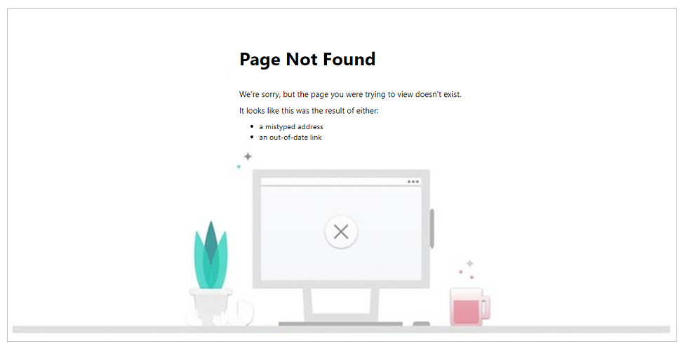

# Power Apps portals FAQs

We've compiled a list of frequently asked questions and provided brief answers to help you get to your information quickly.

> [!NOTE]
> Effective November 2020:
> - Common Data Service has been renamed to Microsoft Dataverse. [Learn more](https://aka.ms/PAuAppBlog)
> - Some terminology in Microsoft Dataverse has been updated. For example, *entity* is now *table* and *field* is now *column*. [Learn more](https://go.microsoft.com/fwlink/?linkid=2147247)
>
> Power Apps portals articles will be updated soon to reflect the latest terminology.

## General

### When I edit a page using the content editor, I don't see the expected content.

This can happen when you have the portal URL that exceeds **500 characters**. <br> For example, if you have a webpage with more than 500 characters in length, and you edit the page using the [content editor](https://docs.microsoft.com/dynamics365/portals/get-started-portal-content-editor), the *Language content* tab in the editor may appear blank. If you review the browser for script errors, you may notice an HTTP response with `400 Bad Request` error. When this happens, ensure you truncate the URL so that you don't exceed 500 characters maximum length.

### Does Power Apps portals support TLS 1.2?

Power Apps portals version 8.3 and later supports [TLS 1.2](https://support.microsoft.com/help/4041984/portal-capabilities-for-microsoft-dynamics-365-version-8-3-2-85-releas).

### How do I redirect a user to a default page after signing in?

You can configure a portal to redirect a user to a default page after signing in. To achieve this functionality, you can include a JavaScript code in the Home web template.

For example, if you want to redirect all users to the Forums page after signing in, you can include a JavaScript code in the Home web template as follows:

```xml

//if any user logs in
<script>
  window.location.href='./forums/'
</script>

//Home web page code, if you don't want to display the page when the user is being redirected

//Home web page code, if you want to display the page when the user is being redirected
```

For more information on working with Liquid templates, see [Work with Liquid templates](liquid/liquid-overview.md).

### I'm getting an error that I can't delete my portal.

If you don't have sufficient privileges to delete a portal, you'll see an error as follows:

> [!div class=mx-imgBorder]
> 

For information on deleting a portal and the required privileges, see [Delete a portal](manage-existing-portals.md#delete).

### I'm getting an error that I can't create a portal.

If you don't have sufficient privileges to create a portal in an environment, you'll see an error as follows:

> [!div class=mx-imgBorder]
> 

More information: [Create a portal](create-portal.md), [Admin roles required for portal administrative tasks](admin/portal-admin-roles.md)

### I'm getting the message: "Your data isn't quite ready".

Sometimes the database creation can take time and the correct status might not reflect on the home page. In this case, you'll see the following message:

> [!div class=mx-imgBorder]
> 

If you keep getting the "create database" prompt or "your data isn't quite ready" prompt, you can try refreshing the Power Apps home page before selecting the **Portal from blank** tile.

### I'm getting an error that I don't have required permissions to create Azure Active Directory applications.

When you create a portal, portal as a new application is registered in Azure Active Directory associated with the tenant. If you don't have sufficient permissions to register an application with your Azure Active Directory tenant, you'll see an error as follows:

> [!div class=mx-imgBorder]
> 

To create and register applications in Azure Active Directory, you must contact your tenant administrator to turn on the **App registrations** setting for your tenant. For information, see [Required permissions](https://docs.microsoft.com/azure/active-directory/develop/howto-create-service-principal-portal#required-permissions).

### I'm getting an error that portal creation is blocked in this tenant by global administrator

If portal creation is blocked in a tenant by your global administrator, you'll see an error as follows:

> [!div class=mx-imgBorder]
> 

Contact your global administrator to enable creation of portals by non-administrators also.

If you're a global administrator, you must disable the `disablePortalsCreationByNonAdminUsers` tenant level setting through PowerShell. Run the following command in a PowerShell window (run PowerShell as an administrator).

```
Set-TenantSettings -RequestBody @{ "disablePortalsCreationByNonAdminUsers" = $false }
```

More information: [Disable portal creation in a tenant](create-portal.md#disable-portal-creation-in-a-tenant)

### I'm getting "Page Not Found" error and the page content is different from the default Page Not Found site marker or web page.

You may see a *Page Not Found* error message that may appear different from the default error page content available by default on the **Page Not Found** site marker and web page.



This *Page Not Found* page is a system page and appears if: 

- The default **Page Not Found** site marker is configured incorrectly.
- The default **Page Not Found** site marker is deleted.
- The default **Page Not Found** web page is deleted.

To resolve this error, ensure that you have the default site marker named **Page Not Found** present and configured correctly. If the site marker is present and correctly configured, check if the **Page Not Found** web page is selected for the site marker or whether the **Page Not Found** web page is present or not.

For steps to create a site marker for **Page Not Found**, go to [An active Page Not Found site marker isn't available for this portal](#an-active-page-not-found-site-marker-isnt-available-for-this-portal).

For steps to check site marker configuration and ensure it points to the correct web page, go to [The Page Not Found site marker isn't pointing to any webpage](#the-page-not-found-site-marker-isnt-pointing-to-any-webpage).

For steps to change the site marker to point to the correct **Page Not Found** web page, go to [The Page Not Found site marker is pointing to a deactivated web page](#the-page-not-found-site-marker-is-pointing-to-a-deactivated-web-page).

## Licensing and provisioning

### How do I get a portal subscription?

[Power Apps portals](overview.md) are now available as standalone in Power Apps. You no longer need to acquire license to provision a portal. User access to the portal requires license depending on persona type. Read more details at [Power Apps portals licensing FAQ](https://docs.microsoft.com/power-platform/admin/powerapps-flow-licensing-faq#can-you-share-more-details-regarding-the-new-power-apps-portals-licensing).

### How do I change the base URL of a portal after it's provisioned?

You can change the base URL of a portal after it's provisioned by following the steps in [Change the base URL of a portal](admin/change-base-url.md).

### I'm getting an error that I don't have appropriate license to access this website.

Internal users with Azure Active Directory credentials trying to sign-in without a valid license assigned will see this message on the sign-in page: *You don't have a valid license to access this website. Please contact your system administrator*.


Depending on the purchased SKU type - such as different *Dynamics 365 SKUs*, *Power Apps per app plan* or *Power Apps per user plan*, an administrator will need to either provide an appropriate license to the users, or have appropriate number of app passes available to the environment. For more information about app passes, go to [Allocate or change capacity in an environment](https://docs.microsoft.com/power-platform/admin/capacity-add-on#allocate-or-change-capacity-in-an-environment). Once app passes are allocated to the environment, the portal will have to be restarted for changes to take effect.

For details about licensing of internal users, go to [Portal Licensing FAQ](https://docs.microsoft.com/power-platform/admin/powerapps-flow-licensing-faq#can-you-share-more-details-regarding-the-new-power-apps-portals-licensing). 

For details about use rights to portals for internal users, go to FAQ [use rights to portals for internal users](https://docs.microsoft.com/power-platform/admin/powerapps-flow-licensing-faq#can-you-clarify-the-use-rights-to-portals-for-internal-users) and [Licensing Guide](https://go.microsoft.com/fwlink/?linkid=2085130) section **Power Apps Portals – Use rights for Internal users**.

## Dataverse environment lifecycle

### We recently moved our Dataverse environment from one geolocation or tenant to another. How do we handle portals connected to our organization?

When you move your Dataverse environment from one geolocation or tenant to another, associated portals to that organization won't move automatically. Also, since your organization has moved, any portal associated with that organization won't work and will throw an error on startup.

To associate your portal again to relevant organizations:

1. Reset your existing portal host from the existing geolocation or tenant by following the steps in [Reset a portal](admin/reset-portal.md). This will delete your associated portal resources and the portal URL won't be accessible after the operation completes.

2. Once your existing portal is reset, go to the new tenant (or to the new geolocation of the existing tenant) and provision a portal available there.

### After restoring a Dataverse environment from an old backup, the portal connected to the organization isn't working. How do we fix it?

When a Dataverse environment is restored from a backup, various changes are done in your organization that can break your portal's connection with the organization. To fix this issue:

- If the organization ID is the same after the restore operation, and portal solutions are also available:

    1. Open [Power Apps Portals admin center](admin/admin-overview.md).
    2. Go to the **Portal Details** tab.
    3. In the **Portal State** drop-down list, choose **Off**.
    4. Select **Update**. 
    5. Once the update operation is complete, set the **Portal State** drop-down list to **On** and then select **Update**.

  Your portal will be restarted and a connection will be created with the organization again.

- If the organization ID is different after the restore operation, or portal solutions are deleted from your organization:

  - In this case, it's better to reset the portal by following the steps in [Reset a portal](admin/reset-portal.md) and then reprovision it.

### We recently changed the URL of our Dataverse environment and our portal stopped working. How do we fix it?

When you change the URL of your Dataverse environment, your portal will stop working because it can't identify the Dataverse environment URL anymore. To fix this issue:

1. Open [Power Apps Portals admin center](admin/admin-overview.md).
2. Go to **Portal Actions** > **Update Dynamics 365 URL**.
3. Follow the instructions in the wizard.

Your portal will be restarted and start working again.

## Debugging and fixing problems

### Performance of entity forms: Actions such as create/update/delete on entity forms take a lot of time to complete or timeout.

This can happen because of multiple reasons - such as depending on your data and customizations done on that entity in Dataverse. When troubleshooting such performance related issue on record actions from portals, ensure that there are no synchronous plugins registered on those events that may possibly cause these delays. Wherever possible, try to implement them asynchronously so that they don't hold or delay the transaction.

### When accessing my portal, I see a generic error page. How can I see the actual error?

Whenever a server error occurs while trying to render a portal, a generic error page is displayed to end users along with the timestamp and activity ID of the error. Portal administrators can configure their portal to get the actual error details, which are helpful in debugging and fixing issues. To see the actual error:

- **Disable the custom error page on the portal**: This will turn off the custom error page and will allow you to see the complete stack trace of any error when browsing to that page. You can disable the custom error by following the steps in [Disable custom error](admin/view-portal-error-log.md#disable-custom-error).

It's advisable to use this only when you're developing a portal. Once your portal is live for your users, you should enable custom errors again. More information: [View portal error logs](admin/view-portal-error-log.md)

- **Enable diagnostic logging**: This will allow you to get all the portal errors in an Azure Blob storage account. You can enable diagnostic logging by following the steps in [Access portal error logs](admin/view-portal-error-log.md#access-portal-error-logs).

When you enable diagnostic logging, you can search for particular errors that users report by using the Activity ID shown on the generic error page. The Activity ID is logged along with the error details and is useful to find the actual issue.

## Portal administration and management

### Do portals use any static content from CDNs (Content Delivery Network) that I need to allow-list?

Yes. Power Apps portals uses out of the box portal's static assets from Azure CDN that includes default JavaScript and CSS files for presentation that earlier rendered as part of the portal app. You must allow-list the following CDN URL to render portals successfully:

`https://content.powerapps.com/resource/powerappsportal`

> [!NOTE]
> Power Apps portals hosted in Microsoft Government Cloud don't use CDN.

### How do I use a custom login provider on my portal?

Portals supports any custom login provider that provides support for standard authentication protocols. We support OpenIdConnect, SAML2, and WS-Federation protocols for any custom IDP. OAuth 2 is supported only for a fixed set of known IDPs. For more information on how to set up an IDP configuration, see [Configure portal authentication](configure/configure-portal-authentication.md).

### How do I get new portal releases in my sandbox portal first before it gets applied to production?

Any portal release is done in two phases: early upgrade and general availability (GA). During the early upgrade phase, we only upgrade portals that are marked for early upgrade. To get a new portal release in your sandbox (development or test) environment, you can enable your portal for early upgrade. For information on how to enable a portal for early upgrade, see [Upgrade a portal](https://docs.microsoft.com/dynamics365/customer-engagement/portals/upgrade-portal).

### How do I use a custom domain name for my portal?

You can enable your portal to use a custom domain name in place of the standard `microsoftcrmportals.com` domain name. More information: [Link your portal to a custom domain](admin/add-custom-domain.md)

### See also

[Microsoft Learn: Power App portal maintenance and troubleshooting](https://docs.microsoft.com/learn/modules/portals-maintenance-troubleshooting/)
