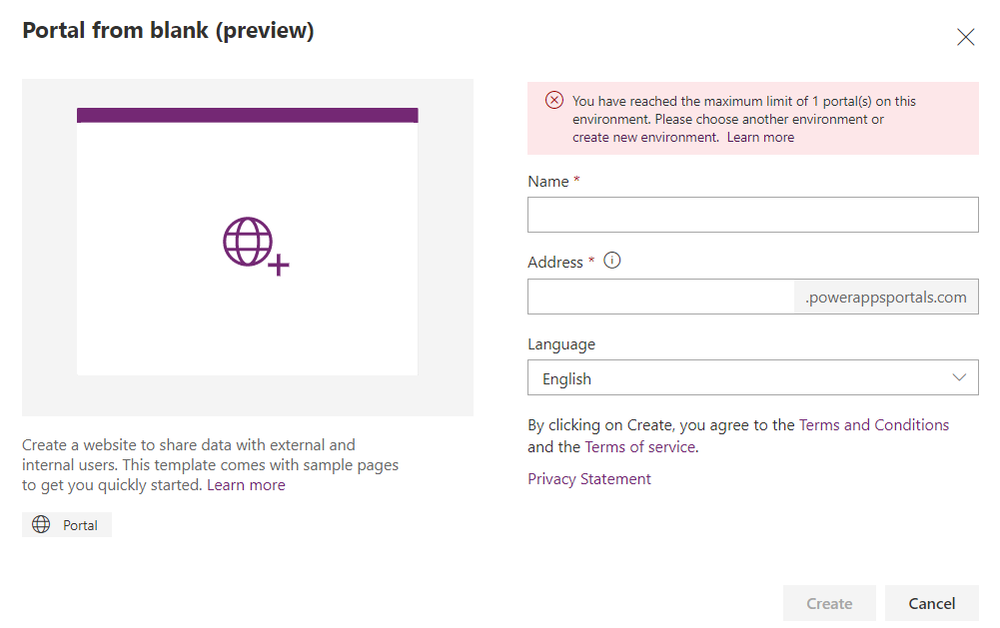
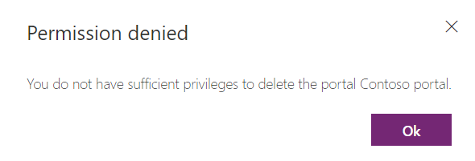
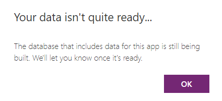
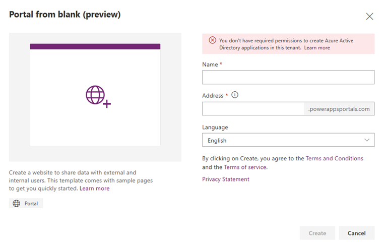
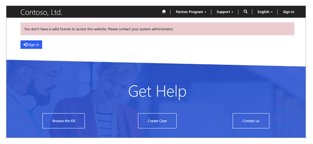

# Power Apps portals FAQ

We have compiled a list of frequently asked questions and provided brief answers to help you get to your information quickly.

## General

### When is an add-on portal in suspended state?

Portal [provisioned using portal add-on plan](provision-portal-add-on.md) purchased earlier is suspended at the end of expiration. This expiration period is 30 days for trial portals while it may vary for an add-on portal in production with a purchased license. Suspended trial portal is deleted after 7 days while suspension period may vary for production portal. For more details, read the [portal lifecycle](./admin/portal-lifecycle.md#considerations-for-add-on-portals) for add-on portals.

### How do I redirect a user to a default page after signing in?

You can configure a portal to redirect a user to a default page after signing in. To achieve this functionality, you can include a JavaScript code in the Home web template.

For example, if you want to redirect all users to the Forums page after signing in, you can include a JavaScript code in the Home web template as follows:

```xml

//if any user logs in
<script>
  window.location.href='./forums/'
</script>

//Home web page code, if you don't want to display the page when the user is being redirected

//Home web page code, if you want to display the page when the user is being redirected
```

For more information on working with Liquid templates, see [Work with Liquid templates](liquid/liquid-overview.md).

### I'm getting an error that only one portal can be created.

Currently, you can create only one portal of each type in an environment per language. If you try to create more than one portal, you'll see an error message as follows:

> [!div class=mx-imgBorder]
> 

To create more portals, you must create a new environment using the **create new environment** link in the error message. For more information on creating a portal, see [Create a portal](create-portal.md).

### I'm getting an error that I can't delete my portal.

If you don't have sufficient privileges to delete a portal, you'll see an error as follows:

> [!div class=mx-imgBorder]
> 

For information on deleting a portal and the required privileges, see [Delete a portal](manage-existing-portals.md#delete).

### I'm getting an error that I can't create a portal.

If you don't have sufficient privileges to create a portal in an environment, you'll see an error as follows:

> [!div class=mx-imgBorder]
> 

For information on creating a portal and the required privileges, see [Create a portal](create-portal.md).

### I'm getting the message: “Your data isn’t quite ready”.

Sometimes the database creation can take time and the correct status might not reflect on the home page. In this case you'll see the following message:

> [!div class=mx-imgBorder]
> 

If you keep getting the create database prompt or your data isn't quite ready prompt, you can try refreshing the Power Apps home page before selecting the **Portal from blank** tile.

### I'm getting an error that I don't have required permissions to create Azure Active Directory applications.

When you create a portal, portal as a new application is registered in Azure Active Directory associated with the tenant. If you don't have sufficient permissions to register an application with your Azure Active Directory tenant, you'll see an error as follows:

> [!div class=mx-imgBorder]
> 

To create and register applications in Azure Active Directory, you must contact your tenant administrator to turn on the **App registrations** setting for your tenant. For information, see [Required permissions](https://docs.microsoft.com/azure/active-directory/develop/howto-create-service-principal-portal#required-permissions).

### I'm getting an error that portal creation is blocked in this tenant by global administrator

If portal creation is blocked in a tenant by your global administrator, you'll see an error as follows:

> [!div class=mx-imgBorder]
> 

You must contact your global administrator to enable creation of portals by non-administrators also.

If you are a global administrator, you must disable the `disablePortalsCreationByNonAdminUsers` tenant level setting through PowerShell. Run the following command in a PowerShell window (run PowerShell as an administrator).

```
Set-TenantSettings -RequestBody @{ "disablePortalsCreationByNonAdminUsers" = $false }
```

More information: [Disable portal creation in a tenant](create-portal.md#disable-portal-creation-in-a-tenant)

### I'm getting an error that I don't have appropriate license to access this website.

Internal users of an organization that use portals for accessing authenticated pages require that licenses be assigned to the environment that a portal is connected to. You  can read more about the user rights for portals for internal users [here](https://docs.microsoft.com/power-platform/admin/powerapps-flow-licensing-faq#can-you-clarify-the-use-rights-to-portals-for-internal-users). When an environment does not have licenses assigned, internal users will get an error such as follows:

> [!div class=mx-imgBorder]
> 

## Licensing and provisioning

### How do I get a portal subscription?

[Power Apps portals](overview.md) are now available completely standalone inside of Power Apps. You no longer need to acquire license to provision a portal. User access to the portal requires license depending on persona type. Read more details at [Power Apps portals licensing FAQ](https://docs.microsoft.com/power-platform/admin/powerapps-flow-licensing-faq#can-you-share-more-details-regarding-the-new-power-apps-portals-licensing).

### How do I change the audience and type of a portal after it is provisioned?

After you have provisioned a portal, the option to change the portal audience is disabled.

However, you can change the audience and type of portal after it is provisioned by following the steps in [Change the Dynamics 365 instance, audience, or type of portal](admin/change-dynamics-instance.md).

> [!NOTE]
> - It is recommended to reset and provision your portal again to change the audience, type of portal, organization, and so on. More information: [Reset a portal](admin/reset-portal.md)
> - The changing of Dynamics 365 instance is applicable only to the portals provisioned using the older portal add-ons.

### How do I change the base URL of a portal after it is provisioned?

You can change the base URL of a portal after it is provisioned by following the steps in [Change the base URL of a portal](admin/change-base-url.md).

### How do I delete a portal completely after it is provisioned?

Portals consists of the following components:

- **Portal website host**: Portal website host is the Portal code that forms the actual website.

- **Portal solutions**: Solutions that are installed in the Common Data Service environment and contain the metadata entities for any portal.

To delete a portal completely requires deleting the Portal website host as well as uninstalling Portal solutions from your Common Data Service environment.

To reset the portal host, follow the steps in [Reset a portal](admin/reset-portal.md). It is important to note that resetting a portal host doesn't affect the configuration done in your Common Data Service environment.

To delete portal solutions, you will have to delete solutions from the Dynamics 365 solution explorer UI. The order in which Portal solutions should be uninstalled is provided in [Uninstalling Portal Solutions](https://community.dynamics.com/365/b/dynamics365portalssupport/archive/2017/02/27/portal-troubleshooting-part-three-uninstalling-portal-solutions).

## Common Data Service environment lifecycle

### We recently moved our Common Data Service environment from one geolocation or tenant to another. How do we handle portals connected to our organization?

When you move your Common Data Service environment from one geolocation or tenant to another, associated portals to that organization will not move automatically. Also, since your organization has moved, any portal associated with that organization will not work and will throw an error on startup.

To associate your portal again to relevant organizations:

1. Reset your existing portal host from the existing geolocation or tenant by following the steps in [Reset a portal](admin/reset-portal.md). This will delete your associated portal resources and the portal URL will not be accessible after the operation completes.

2. Once your existing portal is reset, go to the new tenant (or to the new geolocation of the existing tenant) and provision a portal available there.

### After restoring a Common Data Service environment from an old backup, the portal connected to the organization is not working. How do we fix it?

When a Common Data Service environment is restored from a backup, various changes are done in your organization that can break your portal's connection with the organization. To fix this issue:

- If the organization ID is the same after the restore operation and portal solutions are also available:

1. Open [Power Apps Portals admin center](admin/admin-overview.md).
2. Go to the **Portal Details** tab.
3. In the **Portal State** drop-down list, choose **Off**.
4. Select **Update**. 
5. Once the update operation is complete, set the **Portal State** drop-down list to **On** and then select **Update**.

  Your portal will be restarted and a connection will be created with the organization again.

- If the organization ID is different after the restore operation or portal solutions are deleted from your organization:

  - In this case, it is better to reset the portal by following the steps in [Reset a portal](admin/reset-portal.md) and then reprovision it.

### We recently changed the URL of our Common Data Service environment and our portal stopped working. How do we fix it?

When you change the URL of your Common Data Service environment, your portal will stop working because it cannot identify the Common Data Service environment URL anymore. To fix this issue:

1. Open [Power Apps Portals admin center](admin/admin-overview.md).
2. Go to **Portal Actions** > **Update Dynamics 365 URL**.
3. Follow the instructions in the wizard.

Your portal will be restarted and start working again.

## Debugging and fixing problems

### When accessing my portal, I see a generic error page. How can I see the actual error?

Whenever a server error occurs while trying to render a portal, a generic error page is displayed to end users along with the timestamp and activity ID of the error. Portal administrators can configure their portal to get the actual error details, which are helpful in debugging and fixing issues. To see the actual error:

- **Disable the custom error page on the portal**: This will turn off the custom error page and will allow you to see the complete stack trace of any error when navigating to that page. You can disable the custom error by following the steps in [Disable custom error](admin/view-portal-error-log.md#disable-custom-error).

It is advisable to use this only when you are developing a portal. Once your portal is live for your users, you should enable custom errors again. More information: [View portal error logs](admin/view-portal-error-log.md)

- **Enable diagnostic logging**: This will allow you to get all the portal errors in an Azure Blob storage account. You can enable diagnostic logging by following the steps in [Access portal error logs](admin/view-portal-error-log.md#access-portal-error-logs).

When you enable diagnostic logging, you can search for particular errors that users report by using the Activity ID shown on the generic error page. The Activity ID is logged along with the error details and is useful to find the actual issue.

## Portal administration and management

### How do I use a custom login provider on my portal?

Portals supports any custom login provider that provides support for standard authentication protocols. We support OpenIdConnect, SAML2, and WS-Federation protocols for any custom IDP. OAuth 2 is supported only for a fixed set of known IDPs. For more information on how to set up an IDP configuration, see [Configure portal authentication](configure/configure-portal-authentication.md).

### How do I get new portal releases in my sandbox portal first before it gets applied to production?

Any portal release is done in two phases: early upgrade and general availability (GA). During the early upgrade phase, we only upgrade portals that are marked for early upgrade. To get a new portal release in your sandbox (development or test) environment, you can enable your portal for early upgrade. For information on how to enable a portal for early upgrade, see [Upgrade a portal](https://docs.microsoft.com/dynamics365/customer-engagement/portals/upgrade-portal).

### How do I use a custom domain name for my portal?

You can enable your portal to use a custom domain name in place of the standard `microsoftcrmportals.com` domain name. More information: [Link your portal to a custom domain](admin/add-custom-domain.md)

## Portal checker

### Portal does not load and displays a generic error page (Server Error in "/" application) 

This issue can be caused by a variety of reasons like when a portal is not able to connect to the underlying Common Data Service environment, Common Data Service environment doesn't exist or its URL has changed, when request to Common Data Service environment is timed out, and so on. When you run the portal checker tool, it will try to determine the exact reason and will point you to the correct mitigation. 

Below is a list of most common causes and their corresponding mitigation steps:

#### URL of the connected Common Data Service environment has changed 

This happens when the URL of Common Data Service environment is changed by a user after portal is provisioned against the organization. To fix this issue, update the Dynamics 365 URL:

1. Open [Power Apps Portals admin center](admin/admin-overview.md).
2. Go to **Portal Actions** > **Update Dynamics 365 URL**. Once this action is successfully executed, your Common Data Service environment URL will be updated and portal will start working.

#### Common Data Service environment connected to your portal is in administration mode

This issue occurs when the Common Data Service environment is put in administration mode either when changing organization from production to sandbox mode or manually by an organization administrator.

If this is the cause, you can disable administration mode by performing actions listed [here](https://docs.microsoft.com/dynamics365/admin/manage-sandbox-instances#administration-mode). Once administration mode is disabled, portal will work fine.

#### Authentication connection between Common Data Service environment and portal is broken

This issue occurs when the authentication connection between Dynamic 365 organization and portal is broken because either Common Data Service environment was restored from a backup or was deleted and recreated from a backup. To fix this issue:

1. Open [Power Apps Portals admin center](admin/admin-overview.md).
2. In the **Portal Details** tab, select **Off** from the **Portal State** list.
3. Select **Update**.
4. Select **On** from the **Portal State** list.
5. Select **Update**. The portal restarts and will be able to make authentication connection.

However, in certain situations especially if the organization ID has changed after the restore operation (or if you reprovisioned the organization), these mitigation steps will not work. In those situations, you can reset and reprovision the portal against the same instance. For information on how to reset a portal, see [Reset a portal](admin/reset-portal.md).

#### Request to Common Data Service environment has timed out

This issue is typically a transient issue which can occur if the API requests to your Common Data Service environment has timed out. This issue will automatically mitigate itself once the API requests starts working. To mitigate this issue, you can also try restarting the portal:

1. Open [Power Apps Portals admin center](admin/admin-overview.md).
2. Go to **Portal Actions** > **Restart**.

If restarting the portal doesn't work and this issue is occurring for a long period of time, please contact Microsoft support for help.

#### Website binding not found

This issue occurs when the website binding records for portal are deleted from the underlying Common Data Service environment and portal is not able to create binding automatically. To fix this issue:

1. Open the [Portal Management app](configure/configure-portal.md).
2. Go to **Portals** > **Website Bindings**.
3. Delete all the website binding records which are pointing to your portal. The **Sitename** field helps you to identify website binding records of your portal.
4. After you delete all website binding records, restart the portal.

Once you complete the above steps, your portal will restart and will recreate website binding record automatically.

However, there are situations in which portal will not be able to recreate website binding record automatically when the GUID of the website record available in your instance is different than the one created during default installation of portal. In this situation, perform the following steps:

1. Delete all website binding records pertaining to your portal.
2. Create a website binding record manually with following values:
  - **Name**: Can be any string
  - **Website**: Select the website record which you want to be rendered on portal
  - **Sitename**: Type in the hostname of your portal i.e Portal URL without https:// in the beginning. If your Portal is using custom domain name, then use custom domain name here.
  - Leave all other fields blank.
3. Once website binding record is recreated, restart your portal from Power Apps Portals admin center.

#### An unexpected error has occurred while trying to connect to your Common Data Service environment

This situation can arise due to some unexpected issue. To mitigate in this situation, you can either try resetting or reprovisioning the portal. For information on how to reset a portal, see [Reset a portal](admin/reset-portal.md).

If portal reset and reprovision doesn't solve this issue, please reach out to Microsoft support for help.

### Portal is not displaying updated data from Common Data Service environment

Any data displayed on portal is rendered from the portal cache. This cache gets updated whenever data in Common Data Service environment is updated. However, this process is asynchronous and can take upto 15 minutes. If the changes are made in the metadata entity of portal, for example, web pages, web files, content snippet, site setting, and so on, it is advised to clear cache manually or restart the portal from Power Apps Portals admin center. For information on how to clear cache, see [Clear the server-side cache for a portal](admin/clear-server-side-cache.md). 

However, if you are seeing stale data for a long time in non-portal metadata entities, it can be because of variety of issues listed below:

#### Entities not enabled for cache invalidation

If you are seeing stale data only for certain entities and not for everything, this can be because the Change Tracking metadata is not enabled on that specific entity.

If you run the Portal checker (self-service diagnostic) tool, it will list down Object Type code of all the entities which are referenced on portal in entity list or entity forms and web forms and are not enabled for change tracking. Browse your metadata by using the steps mentioned at [Browse the metadata for your organization](https://docs.microsoft.com/dynamics365/customerengagement/on-premises/developer/browse-your-metadata)

If you are experiencing stale data issue in any of these entities, you can enable change tracking by using Power Apps Portals admin center. UI or Dynamics 365 API. More information:  [Enable change tracking for an entity](https://docs.microsoft.com/dynamics365/customerengagement/on-premises/developer/use-change-tracking-synchronize-data-external-systems#enable-change-tracking-for-an-entity)

#### Organization not enabled for change tracking

Apart from each entity being enabled for change tracking, organizations on a whole has to be enabled for change tracking as well. An organization is enabled for change tracking when a portal provisioning request is submitted. However, this can break if an organization is restored from an old database or reset. To fix this issue:

1. Open [Power Apps Portals admin center](admin/admin-overview.md).
2. In the **Portal Details** tab, select **Off** from the **Portal State** list.
3. Select **Update**.
4. Select **On** from the **Portal State** list.
5. Select **Update**. The portal restarts and will be able to make authentication connection.

### Performance best practices

Performance issues in portals can be caused by a variety of configuration issues. All the out-of-the-box portal templates are tested for a variety of load conditions and configurations which can affect portal performance and below is the list of common portal configurations which can lead to performance issues in your portal.

Portal checker (self-service diagnostic) tool will also point out these issues by looking at your portal configuration.

#### Web page tracking enabled

Enabling a portal web page for page tracking can lead to performance issues in your portal. This functionality is deprecated since January 2018 release of Dynamics 365 Portals. More information: [Dynamics 365 Portals: Deprecated Features](https://blogs.msdn.microsoft.com/crm/2018/03/20/portal-capabilities-for-dynamics-365-deprecated-features/)

The portal checker tool will list all the web pages (both root and content page) which are enabled for page tracking. These pages should be disabled by following these steps:

1. Open the [Portal Management app](configure/configure-portal.md).
2. Go to Advanced find.
3. Search for all the web pages where **Enable Tracking (Deprecated)** field is enabled (value is set to Yes).
4. Bulk edit all the pages and set this field to **No**.

Alternatively, you can also go to each page listed in portal checker result and set the value of **Enable Tracking (Deprecated)** field to **No**. It is important to understand that if you are on Dynamics 365 Portals solution version 9.x, this field will not be displayed on the form and you might need to add it to the form first. 

#### Web file tracking enabled

Enabling a portal web file for page tracking can lead to performance issues in your portal. This functionality is deprecated since January 2018 release of Dynamics 365 Portals. More information: [Dynamics 365 Portals: Deprecated Features](https://blogs.msdn.microsoft.com/crm/2018/03/20/portal-capabilities-for-dynamics-365-deprecated-features/)

The portal checker tool will list all the web files which are enabled for page tracking. These files should be disabled by following these steps:

1. Open the [Portal Management app](configure/configure-portal.md).
2. Go to Advanced find.
3. Search for all the web files where **Enable Tracking (Deprecated)** field is enabled (value is set to Yes).
4. Bulk edit all the records and set this field to **No**.

Alternatively, you can also go to each file listed in portal checker result and set the value of **Enable Tracking (Deprecated)** field to **No**. It is important to understand that if you are on Portal solution version 9.x, this field will not be displayed on the form and you might need to add it to the form first. 

#### Login tracking enabled

Enabling a portal login tracking can lead to performance issues in your portal. This functionality is deprecated since January 2018 release of Dynamics 365 Portals. More information: [Dynamics 365 Portals: Deprecated Features](https://blogs.msdn.microsoft.com/crm/2018/03/20/portal-capabilities-for-dynamics-365-deprecated-features/)

The portal checker tool will check if login tracking is enabled for your portal and will show a failed check if it is enabled. Login tracking should be disabled by following these steps:

1.	Open the [Portal Management app](configure/configure-portal.md).
2.	Go to **Portals** > **Site Settings**.
3.	Search for site setting named `Authentication/LoginTrackingEnabled`.
4.	Change the value of this site setting to **False** or delete the site setting.
5.	Restart the portal. 

#### Header output cache is disabled

Disabling header output cache on your portal can lead to performance issues in your portal during high load. More details around this functionality can be found at: [Enable header and footer output caching on a portal](configure/enable-header-footer-output-caching.md)

The portal checker tool will check if header output cache is disabled on your portal and will show a failed check if it is disabled. To enable it:

1.	Open the [Portal Management app](configure/configure-portal.md).
2.	Go to **Portals** > **Site Settings**.
3.	Search for site setting named `Header/OutputCache/Enabled`.
4.	If the site setting is available, change the value of Site setting to **True**. If the site setting is not available, create a new site setting with this name and set its value to **True**.
5.	Restart the portal. 

#### Footer output cache is disabled

Disabling footer output cache on your portal can lead to performance issues in your portal during high load. More details around this functionality can be found at: [Enable header and footer output caching on a portal](configure/enable-header-footer-output-caching.md)

The portal checker tool will check if footer output cache is disabled on your portal and will show a failed check if it is disabled. To enable it:

1.	Open the [Portal Management app](configure/configure-portal.md).
2.	Go to **Portals** > **Site Settings**.
3.	Search for site setting named `Footer/OutputCache/Enabled`.
4.	If the site setting is available, change the value of Site setting to **True**. If the site setting is not available, create a new site setting with this name and set its value to **True**.
5.	Restart the portal. 

#### Large number of web file records

The web file entity is used by a portal to store any static files you want to use on your portal. Main use case of this entity is to store static content of your website like CSS, JavaScript, image files, and so on. However, having many such files can cause slowness during the startup of your portal.

The portal checker tool will check for this scenario and will provide you an indication if you have more than 500 active web files in your portal. If all of these files represent static content like CSS, JavaScript, image files, and so on, you can take following actions to mitigate this issue.

- Use an external file server like Azure blob storage or CDN to store these files and then reference these files on the appropriate pages either within the page or in underlying template.

- If you cannot move files outside, the ensure that all the files are not loaded along with home page. A web file is loaded along with home page if the parent page of that file is set to home. To avoid this scenario, you can perform the following steps:

  1. Create a dummy web page with no content and a blank template. This page would be used to create a direct path to your web files. 
  2. For all the web files which are not needed on home page, change the parent page to this dummy webpage. Once done, full path to your web file would be `Portal URL/{dummy_webpage}/{web file}`
  3. Reference your web file directly in the HTML of the page template or web template of the page where you want to use it. This will load your file on demand on that page. 

#### Loading static resources (css/js) asynchronously

When working on portal implementation, it is important to understand that you completely manage the HTML of the page which means standard web development practices should be followed to ensure that your webpage's client side performance is not impacted. 

One of the most common cause of performance issues on webpages is loading a lot of static resources (css/js) synchronously on the load of the page. Synchronous loading of large no of css/js files can lead to long client-side processing time for your webpages. 

In case of portals, whenever you are associating a web file directly to the home page, it creates a dependency in the generated HTML which means that web file always loaded along with the home page. If this web file is a css/js file, this would be loaded synchronously and can slow down your client-side processing time. 

To avoid this, you can perform the following steps: 

1. If a web file is not needed on the home page, make sure its parent page is not set as home page and reuse the mechanism described above to load it on demand.
2. While loading a JavaScript file on demand on any page, use `<async>` or `<defer>` HTML attribute to load the file asynchronously.
3. While loading a CSS file on demand, you can use `<preload>` HTML attribute (https://www.w3.org/TR/preload/) or JavaScript based approach since preload is not supported on all the browsers yet.

#### Entity form lookup configuration 

Enabling a lookup to render as a drop-down mode in entity forms or web forms can be performance intensive if the amount of records shown in the drop-down exceed 200 and are changed frequently. This option should only be used for static lookups, such as country list and state list, having a limited number of records.

If this option is enabled for lookups which can have large number of records, it will slow down the load time of the webpage on which entity form is available. If this page is used by a lot of users and is loaded a lot of times, it can slow down the whole website and the website resources would be used to render this page. For these situations, full lookup experience should be used or a custom HTML control which calls an AJAX endpoint (created using web templates) should be built for the desired look and feel.

#### Number of web roles

Web roles are used in portals to enable role-based access control. Typically, the number of web roles in a portal are limited as the number of different combinations of permissions would be limited as well. If the number of web roles exceed 100 in your portal, it can cause performance issues which can affect all pages of your portal.

### An active Home site marker is not available for this portal

This issue occurs when the **Home** site marker is not available in your portal configuration. To fix this issue:

1.	Open the [Portal Management app](configure/configure-portal.md).
2.	In the left pane, select **Site Markers**.
3.	Create a new site marker with following values: 
  - **Name**: Home
  - **Website**: Select the website of your portal host.
  - **Page**: Select the webpage record that is set as the home page of your portal.

### The Home site marker is not pointing to any webpage

This issue occurs when the **Home** site marker is available but is not pointing to any webpage. To fix this issue:

1.	Open the [Portal Management app](configure/configure-portal.md).
2.	In the left pane, select **Site Markers**.
3.	Find the **Home** site marker record.
4.	Update the **Page** field to point to an active home page of your portal.

### The Home site marker is pointing to a deactivated web page

This issue occurs when the **Home** site marker is available, but is pointing to a deactivated webpage. To fix this issue:

1.	Open the [Portal Management app](configure/configure-portal.md).
2.	In the left pane, select **Site Markers**.
3.	Find the **Home** site marker record.
4.	Update the **Page** field to point to an active home page of your portal.

### The Home site marker is not pointing to home page of the portal

This issue occurs when the **Home** site marker is available, but is pointing to a webpage that is not a home page of your portal. To fix this issue:

1.	Open the [Portal Management app](configure/configure-portal.md).
2.	In the left pane, select **Site Markers**.
3.	Find the **Home** site marker record.
4.	Update the **Page** field to point to an active home page of your portal.

### An active Profile site marker is not available for this portal

This issue occurs when the **Profile** site marker is not available in your portal configuration. To fix this issue:

1.	Open the [Portal Management app](configure/configure-portal.md).
2.	In the left pane, select **Site Markers**.
3.	Create a new site marker with following values: 
  - **Name**: Profile
  - **Website**: Select the website of your portal host.
  - **Page**: Select the webpage record that is set as the profile page of your portal.

### The Profile site marker is not pointing to any webpage

This issue occurs when the **Profile** site marker is available but is not pointing to any webpage. To fix this issue:

1.	Open the [Portal Management app](configure/configure-portal.md).
2.	In the left pane, select **Site Markers**.
3.	Find the **Profile** site marker record.
4.	Update the **Page** field to point to an active profile page of your portal.

### The Profile site marker is pointing to a deactivated web page

This issue occurs when the **Profile** site marker is available, but is pointing to a deactivated webpage. To fix this issue:

1.	Open the [Portal Management app](configure/configure-portal.md).
2.	In the left pane, select **Site Markers**.
3.	Find the **Profile** site marker record.
4.	Update the **Page** field to point to an active profile page of your portal.

### An active Page Not Found site marker is not available for this portal

This issue occurs when the **Page Not Found** site marker is not available in your portal configuration. To fix this issue:

1.	Open the [Portal Management app](configure/configure-portal.md).
2.	In the left pane, select **Site Markers**.
3.	Create a new site marker with following values: 
  - **Name**: Page Not Found
  - **Website**: Select the website of your portal host.
  - **Page**: Select the webpage record that is set as the Page Not Found page of your portal.

### The Page Not Found site marker is not pointing to any webpage

This issue occurs when the **Page Not Found** site marker is available but is not pointing to any webpage. To fix this issue:

1.	Open the [Portal Management app](configure/configure-portal.md).
2.	In the left pane, select **Site Markers**.
3.	Find the **Page Not Found** site marker record.
4.	Update the **Page** field to point to an active Page Not Found page of your portal.

### The Page Not Found site marker is pointing to a deactivated web page

This issue occurs when the **Page Not Found** site marker is available, but is pointing to a deactivated webpage. To fix this issue:

1.	Open the [Portal Management app](configure/configure-portal.md).
2.	In the left pane, select **Site Markers**.
3.	Find the **Page Not Found** site marker record.
4.	Update the **Page** field to point to an active Page Not Found page of your portal.

### An active Access Denied site marker is not available for this portal

This issue occurs when the **Access Denied** site marker is not available in your portal configuration. To fix this issue:

1.	Open the [Portal Management app](configure/configure-portal.md).
2.	In the left pane, select **Site Markers**.
3.	Create a new site marker with following values: 
  - **Name**: Access Denied
  - **Website**: Select the website of your portal host.
  - **Page**: Select the webpage record that is set as the Access Denied page of your portal.

### The Access Denied site marker is not pointing to any webpage

This issue occurs when the **Access Denied** site marker is available but is not pointing to any webpage. To fix this issue:

1.	Open the [Portal Management app](configure/configure-portal.md).
2.	In the left pane, select **Site Markers**.
3.	Find the **Access Denied** site marker record.
4.	Update the **Page** field to point to an active Access Denied page of your portal.

### The Access Denied site marker is pointing to a deactivated web page

This issue occurs when the **Access Denied** site marker is available, but is pointing to a deactivated webpage (root or content page can be deactivated). To fix this issue:

1.	Open the [Portal Management app](configure/configure-portal.md).
2.	In the left pane, select **Site Markers**.
3.	Find the **Access Denied** site marker record.
4.	Update the **Page** field to point to an active Access Denied page of your portal.

### Profile web form is not available for contact entity

Profile page is one of the common pages used in your portal for all profile related issues. This page shows a form that can be used by users to update their profile. Form used on this page comes from the **Profile Web Page** main form available in the Contact entity. This form is created in your Common Data Service environment when portal is provisioned. This error is displayed when the **Profile** web form is either deleted or disabled in your portal. This form is mandatory and deleting or disabling this form can break the whole website displaying runtime error on portal. This is an irreparable state and requires portal to be reinstalled in the environment.

### Published state is not available for this website

To fix this issue, ensure that the publishing state entity **Published** is available and active.

### Published state is not visible

To fix this issue, ensure that the publishing state entity **Published** has the **isVisible** check box is selected.

### List of entities with search result having invalid URL

To fix this issue, ensure that your entity has appropriate security permission.

### List of entities with CMS security check failed

To fix this issue, ensure that your entity has proper search page.

### Web file is not active

To fix this issue, ensure that the web file is in active state.

### The partial URL of web file is misconfigured

To fix this issue, ensure that the partial URL is the file name with Home as the root page.

### Web file doesn't have a file attachment

To fix this issue, add the corresponding CSS file in the notes section of the web file.

### File attachment doesn't have content

To fix this issue, add the CSS file with entire content in the notes section of the web file.

### MIME type of file is not text/css

To fix this issue, ensure that there are no plugins or flows which overrides the MIME type of the CSS file(s).